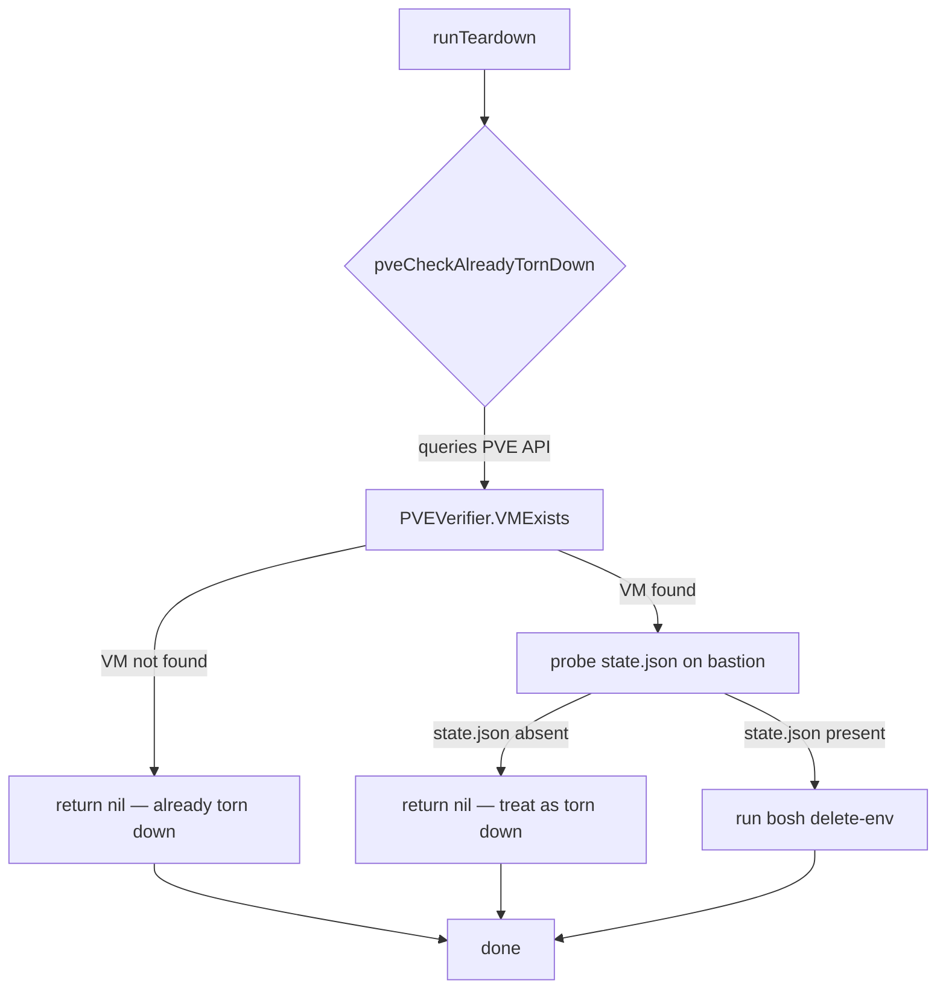

# PVE Robustness Architecture

## Why these changes

The [`bosh-pve-cpi-release`](../../../proxmox/bosh-pve-cpi-release/) lab repo is
a working Go BOSH CPI for Proxmox VE. Operating it against a real cluster produced
14 learnings — specific failure modes, missing checks, and missing defaults that
caused deploy or teardown problems in practice.

This document describes how those 14 learnings are now represented in the ocfp
codebase, what each new package does, and how the key flows connect.

---

## Package layout

### New packages

| Package | Purpose |
|---------|---------|
| `internal/pve/opsfiles` | Embeds four PVE-specific BOSH ops files and writes them to the bastion's deployments directory |
| `internal/pve/verify` | Six OOB predicates for querying PVE API state independent of BOSH (VM exists, VM running, task complete, etc.) |
| `internal/pve/stemcell` | Idempotent stemcell upload — checks `bosh stemcells` output before uploading; fetches sha1 from bosh.io |
| `internal/pve/probes` | Pre-deploy health probes: UAA Flyway DB migration check and TCP-dial liveness probe |
| `internal/pve/capacity` | Resolves BOSH `cf_max_in_flight` from pvesh query → bloc config → hardcoded default |
| `internal/pve/netvalidate` | Validates that the bloc network CIDR and the CF cloud-config CIDR match, preventing a silent routing failure |
| `internal/exec` | `RunWithEnv` helper — runs a subprocess with an augmented environment, keeping secrets out of argv |
| `tests/integration/cfgloader` | Go port of the Python integration config loader; reads `config.yml` and resolves env-var substitutions |
| `tests/integration/cpirpc` | JSON-RPC client for the BOSH CPI binary; drives the 16-step lifecycle test |
| `tests/integration/cleanup` | `ResourceTracker` — registers VMs and disks created during tests and deletes them on failure |

### Modified packages

| Package | Change summary |
|---------|---------------|
| `internal/config` | Added `Tailscale.Enabled *bool`, `VMStorage`, `DiskStorage`, `VmidRangeStart`, `VmidRangeEnd`, `CfMaxInFlight`, `CFCloudConfigCIDR`; added `validatePVEAuth` and `validatePVEVMIDRange` |
| `internal/bootstrap` | `bastionTailscaleSpec` returns nil when `TailscaleEnabled(cfg)` is false |
| `internal/cpi/pve` | Director `bosh` flavor preset updated to 8 vCPU / 16 GiB / 128 GiB |
| `internal/vault/pve_provider.go` | `configureCPI` extended with `vmid_range_end`, `disk_storage`, `vm_storage`, `storage_backend`, `cf_max_in_flight`; VMID range default corrected to 100 |
| `internal/commands` | Added `NewPVECmd` with `unstick` subcommand; added `WithResurrectionGate` helper |

---

## Acceptance gates

Every change in this update passes three acceptance gates before merge.

**Deliverable scanner**
All operator-facing documentation files (`docs/migrations/`, `docs/commands/`,
`docs/architecture/`) are scanned for metadata artifacts. Exit code 0 required.

**Integration harness**
`make integration-pve` runs the 16-step BOSH lifecycle against a live PVE cluster.
`make integration-pve-dry-run` runs without a live cluster (config-load and client
construction only). See [PVE commands](../commands/pve-commands.md) for the full
env-var reference.

**`validatePVEAuth`**
`Config.Validate()` rejects any PVE bloc config that supplies neither API-token
nor username/password credentials. The error is `ErrPVEAuthRequired`. This gate
fires at config load, before any API call is attempted.

---

## Teardown probe flow (PVE branch)

When `ocfp teardown` runs against a PVE bloc, it calls an idempotency probe
before invoking `bosh delete-env`. This prevents the BOSH CPI from failing on a
VM that was already destroyed by a prior incomplete teardown.

`PVEVerifier` lives in `internal/pve/verify`. It contacts the PVE REST API
directly — independent of BOSH — and returns a typed result. If the VMID is not
found on the cluster, the teardown is considered a no-op and returns cleanly
rather than propagating a CPI error.

The state.json probe provides a second gate: if the VMID is absent from the PVE
API but the bastion still holds a `state.json` for the deployment, the file is
treated as stale and teardown returns cleanly without running `bosh delete-env`.

---

## Config struct additions

The following fields were added to the PVE bloc config struct in `internal/config/config.go`:

| Field | YAML key | Default | Purpose |
|-------|----------|---------|---------|
| `Tailscale.Enabled *bool` | `tailscale.enabled` | nil (disabled) | Opt-in gate for Tailscale provisioning |
| `VMStorage string` | `vm_storage` | `""` | PVE storage pool for VM disks |
| `DiskStorage string` | `disk_storage` | `""` | PVE storage pool for persistent disks |
| `VmidRangeStart int` | `vmid_range_start` | 100 | Lower bound of the VMID range BOSH may allocate from |
| `VmidRangeEnd int` | `vmid_range_end` | 5999 | Upper bound of the VMID range |
| `CfMaxInFlight int` | `cf_max_in_flight` | 12 | Max parallel CF compilation workers |
| `CFCloudConfigCIDR string` | `cf_cloud_config_cidr` | `""` | Expected CIDR in the CF cloud config; validated against `network.network_cidr` |

All fields are `omitempty` in YAML. Existing configs with none of these keys are
valid and continue to work with the stated defaults.

---

## See also

- [PVE provider configuration](../pve.md) — bloc config reference, auth setup, and troubleshooting
- [PVE robustness changes](../migrations/pve-robustness-changes.md) — breaking changes and migration steps
- [PVE commands](../commands/pve-commands.md) — `ocfp pve unstick` and the integration harness
- [`bosh-pve-cpi-release`](../../../proxmox/bosh-pve-cpi-release/) — upstream lab repo, source of the 14 learnings
