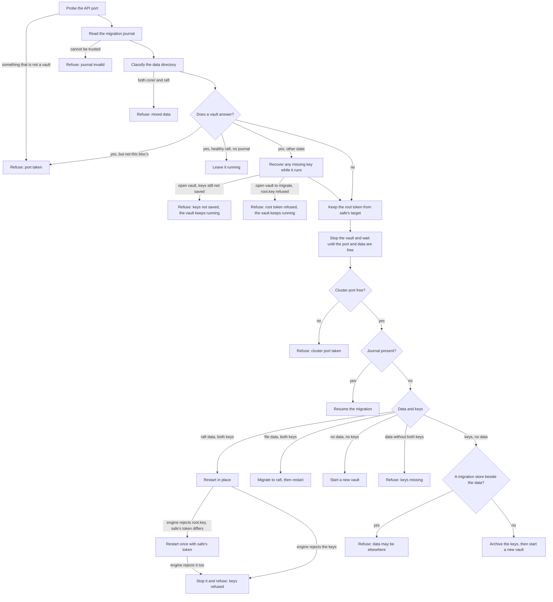

# The Inception Vault

The inception vault is the small vault that holds a bloc's secrets while the bloc is being bootstrapped, before the bloc has a production vault of its own. ocfp runs it with `safe local` inside a tmux session, first on the operator's workstation during `ocfp bootstrap` and then on the bastion during `ocfp init bastion`. Since ocfp v0.3.9 the vault keeps its data in integrated raft storage, so a stopped vault can be reopened with its saved keys instead of being replaced.

This page explains where the vault keeps its files, what `ocfp vault inception` does with each state it finds on disk, which directories a migration or an archive leaves behind, how the bastion brings the vault back after a reboot, and how we recover from each error the commands can return.

## Requirements

ocfp v0.3.9 needs safe v1.25.0 or later, because that is the first safe release that can reopen a raft vault with a saved root token. An older safe fails the prerequisite check with an upgrade message before anything is stopped or moved. The engine is OpenBao or HashiCorp Vault, and ocfp finds it the same way safe does, honouring `SAFE_ENGINE` when it is set.

A development build of safe, or a pre-release of v1.25.0 such as `v1.25.0-rc.1`, has a version number that cannot show whether it can run a raft vault, so ocfp asks the build itself. It accepts such a build only when `safe help local` lists both `--cluster-port` and `--root-token-file`, and otherwise it fails the same prerequisite check.

ocfp also needs `tmux`, `lsof`, and `ps`, because it finds the processes that hold the vault's port and data with them, and it refuses to stop or archive a vault when it cannot. `ocfp init bastion` installs `lsof` on the bastion with the other system packages. macOS ships it, and on a Linux workstation we install it from the distribution's `lsof` package.

Migrating a file-backed vault from an older ocfp also needs an engine that can still read file storage and that has the `operator migrate` command. OpenBao 2.7 and earlier and HashiCorp Vault both qualify. When the engine on `PATH` cannot do it, the command says so and leaves the file-backed data where it is.

## Ports

The API port is derived from the bloc name and lands somewhere between 18234 and 19233, so several blocs can run an inception vault on one machine. Raft also needs a cluster port, and ocfp always uses the API port plus 1000, which puts it between 19234 and 20233. Both ports must be free when the vault starts. Port 8234 is the legacy API port, and ocfp uses it only when no bloc is named.

To move a bloc's vault, we set `OCFP_VAULT_INCEPTION_PORT`, or `vault_inception_port` in the bloc's entry in `~/.config/ocfp/config.yml`, and the cluster port moves with it. ocfp reads the legacy `~/.ocfp/config.yml` instead when that is the only config file there is. An API port above 64535 leaves no room for its cluster port, so ocfp rejects it before doing any work.

On a bastion, we move the port in the config file and not in the environment. The boot unit runs `ocfp vault start` with only the environment that the unit sets, so it never sees `OCFP_VAULT_INCEPTION_PORT`, and it uses the port from the config file or the derived port. A vault that we started on a port set only in our shell would come back on a different port after a reboot.

## Files on disk

In the bloc layout, which every current bloc uses, the vault's files live under the data home, which is `~/.local/share/ocfp` unless `XDG_DATA_HOME` or `OCFP_HOME` says otherwise.

A bloc created before ocfp moved to that layout may still keep its files in the legacy `~/.ocfp/<bloc>` directory, and some blocs have files in both places. ocfp uses one of the two directories for each bloc, and it prefers the one that holds the bloc's vault, so that a directory without a vault never hides one that has a vault. A directory holds a vault when its `vault/` directory has a `root.key` or an `unseal.keys` file, or a `data/` directory with anything in it. An empty `data/` directory doesn't count, because there's nothing in it to lose. The rest of the choice works like this:

- When only one of the two directories holds a vault, ocfp uses that one. It does so even when the other directory holds bloc files of its own, such as ssh keys or deployments, and in that case it prints a warning that the bloc's files are split between the two directories. Stopping the vault and running `ocfp config migrate` brings them together.

- When one directory is a link to the other, or its `vault/` directory is a link to the other's, both paths lead to one vault, and ocfp uses it through the XDG path.

- When neither directory holds a vault, ocfp uses the XDG directory if it holds anything at all, then the legacy directory if that holds anything, and otherwise the XDG directory, which is where a new bloc's files go.

- When both directories hold a vault, ocfp refuses to use either one. Every vault command fails with an error that names both directories, and both vaults are left exactly as they are. The boot unit's `ocfp vault start` refuses too, so after a reboot the vault stays down until we set one copy aside.

To settle a bloc with two vaults, we first make sure they are two vaults, because a link deeper inside either `vault/` directory can make one vault show up in both places. `ls -l` on both `vault/` directories shows any data directory or key file that is a link, and `realpath` on both shows where they lead. If anything in one points into the other, there may be only one vault behind both paths, so we move nothing and sort out the link by hand, because moving a directory that a link points into strands the vault behind it. When there are no links, we find out which vault is in use. `lsof -nP -iTCP:<port> -sTCP:LISTEN` shows what serves the bloc's API port, `tmux ls` shows whether the bloc's session is running, and the files and their dates under each `vault/` directory, including `root.key` and `unseal.keys`, show which copy is newer and which holds more. If the copy we set aside is the running one, we stop it first with `tmux kill-session -t <bloc>-inception-vault`. Then we rename that copy's `vault` directory, for example to `vault.set-aside`, rather than deleting it, so that both vaults stay on disk. The next ocfp command uses the vault that remains.

| Path | What it holds |
|------|---------------|
| `<bloc>/vault/data/` | The vault's storage. A raft vault has `vault.db` and a `raft/` directory here, and a file-backed vault from an older ocfp has a `core/` directory instead. |
| `<bloc>/vault/root.key` | The root token, with mode 0600. |
| `<bloc>/vault/unseal.keys` | The unseal key, with mode 0600. |
| `<bloc>/vault/root.key.saferc-<timestamp>` | A copy of the root token that safe held for the bloc's target, kept with mode 0600 when it differed from `root.key` at the moment ocfp stopped the vault. |
| `<bloc>/vault/root.key.rejected-<timestamp>` | A root token that the engine refused, moved aside after the token from safe's target opened the vault instead. |

ocfp writes every key file through a temporary file in the same directory. It flushes that file to disk before the file takes the key file's name, and it flushes the directory afterwards, so neither a crash nor a power loss can leave a key file empty or half-written.

Two more files live under the state home, which is `~/.local/state/ocfp` unless `XDG_STATE_HOME` or `OCFP_HOME` says otherwise.

| Path | What it holds |
|------|---------------|
| `<bloc>/logs/vault/vault-inception.log` | Everything `safe local` printed on its last start. The previous start's log is kept beside it with a `.previous` suffix, and each older log is kept as `.previous-<timestamp>`. ocfp never replaces or deletes any of them, because a log may hold the only copy of a new vault's unseal key. We treat every one of them like a key file. |
| `<bloc>/inception-vault.lock` | The lock that lets only one ocfp run work on the bloc's vault at a time. |

The log directory has mode 0700, and the vault starts under `umask 077`, so each new log has mode 0600. Older releases left the directory and its logs readable by other users. Every run removes group and other access from the directory and from each log in it, changing only their modes and never reading them. When a mode cannot be changed, for example because a `sudo` run left a log owned by root, the run logs a warning that names the file and carries on, and we fix the owner and mode by hand.

When no bloc is named, the vault keeps its data in `~/.vault`, the root token in `~/vault.root.key`, and the unseal key in `~/vault.unseal.keys`, each key file with mode 0600. Older releases wrote both keys to a single `~/vault.key`, where the second write replaced the first. ocfp no longer reads, writes, moves, or deletes that file. If it exists, it stays where it is, and we keep it until we know the vault it belonged to is no longer needed, because it may hold that vault's only copy of a key.

## What a run does

Each run of `ocfp vault inception` brings the bloc to a running raft vault and changes as little on disk as it can. Every check that can refuse runs before anything is stopped or moved, so a refusal always leaves the disk exactly as it was.

One of those checks reads both key files. A key file that exists but cannot be read, such as one that a `sudo ocfp` run left owned by root, says nothing about whether the key is good, so ocfp stops with an error that names the file. It never treats such a file as missing, and it never archives the vault or writes a recovered key over it. An empty file counts as missing whatever its mode.



A vault counts as this bloc's own when the process listening on the API port also holds this bloc's `vault.db`. Without raft data there is no lock to compare, and the bloc's tmux session alone proves nothing, because its shell outlives safe. So ocfp follows the listening process up through its parents, at most eight levels, and counts the vault as the bloc's own only when it reaches a pane of the bloc's tmux session. An engine that outlived its safe has been adopted by init and fails this check, so ocfp leaves it running and reports the port as taken. We stop such an engine by hand once we have confirmed it is the bloc's. Derived ports can collide between blocs, and this check is what keeps one bloc from stopping a sibling's vault.

A vault is healthy when it is initialized and unsealed, it reports raft storage or no storage type at all, the data directory holds raft data, and the bloc's tmux session exists. ocfp leaves a healthy vault running. If safe has lost the bloc's target, ocfp registers it again and authenticates it with the token in `root.key`.

An open vault, meaning one that is initialized and unsealed, also needs both of its keys saved, whether or not it is healthy, because without them it cannot be reopened once it stops. When `root.key` or `unseal.keys` is missing, blank, or not the shape of a key, ocfp tries to recover the key from the running vault. If both keys are still not saved after that, the command exits non-zero with the error that the keys were not saved. It keeps no token, and it stops, archives, migrates, and starts nothing, so the vault keeps running and its secrets can still be read through it. Running the command again gives the same error until the keys are in place, so a vault in this state is never reported as healthy and is never replaced. `ocfp init bastion` runs `ocfp vault inception` on the bastion every time, even when a vault there already answers, so the bastion gets the same check. When the command fails, the bastion init fails with its exit code.

An open vault that the run would migrate, because its data is file storage or a migration journal exists, must also take the token in `root.key`. The restart after a migration opens the vault with that token alone, so before it stops the vault, ocfp asks the running vault to look the token up. When the vault refuses the token, or cannot say whether it takes it, the command exits non-zero with the error that the running vault refuses the token in `root.key`. It keeps no token and stops nothing, so the vault keeps running. The error says whether safe's target holds a different token and names every `root.key.saferc-<timestamp>` copy that ocfp kept, because one of them may be the token the vault takes, and we put that token in `root.key` at mode 0600 and run the command again. An open raft vault that the run restarts is not asked, because its restart retries the token from safe's target when the engine refuses the one in `root.key`.

A sealed or never-initialized vault holds nothing in memory that its data and key files do not, so stopping it loses nothing. Before ocfp stops such a vault, it tries to recover a missing key while the vault still runs. When a key is still missing after the stop, ocfp refuses as described in the section on the archive, and the vault stays stopped with its data and its remaining key in place.

Key recovery works the same way for every running vault. The unseal key comes from the current start's log, then from the tmux pane's history, and then from the logs of earlier starts, newest first. A vault prints its key once, on the start that created it, so after a few restarts the key sits in an older log. A log that exists but cannot be read stops the run with an error. The root token comes from the bloc's own target in `~/.saferc`, and only when that target points at the bloc's port. ocfp writes only the key files that are missing or blank, and it never replaces a key file that holds a value or one that it cannot read.

Stopping a vault deletes the bloc's safe target, and that target may hold the only copy of the root token. So before every stop, whether the vault is running or not, ocfp reads the token that `~/.saferc` holds for the bloc's own target, and only when that target points at the bloc's port. When `root.key` is missing or blank and the token has the shape of a token, ocfp writes it to `root.key`. When `root.key` holds a different value, ocfp keeps both, and writes the token to `root.key.saferc-<timestamp>` beside `root.key` with mode 0600. That copy sits inside the bloc's `vault` directory, so an archive carries it along. A later run that finds the same token in an existing copy reuses that copy rather than writing another one. The same goes for a new vault that fails to start, because safe may already have initialized it and saved its token in the target before the failure. ocfp keeps that token in `root.key` before it stops the new vault, and when the token cannot be kept, it leaves the new vault running and says why.

Starting the bloc's vault, or registering its target again, makes the bloc's target safe's current one, which is the target that a bare `safe` command uses. When `ocfp vault inception` brings back the bloc's existing vault, it reads safe's current target before it changes anything and puts that target back when the run ends, even when the run fails. That covers a restart in place, a migration or a resumed one, and a healthy vault whose target the run only registers again. When no target was current before, or the bloc's own target was, the bloc's target stays current, and when none was, ocfp logs a line that says so. A new vault that the run creates stays current, as it always has, but a new vault that fails to start leaves the earlier target current. When safe can't say which target was current, ocfp logs a warning and the bloc's target stays current. When the earlier target can't be put back, ocfp logs a warning that names the `safe target` command to run, and that warning alone never fails the run. ocfp reads and sets the current target with `SAFE_TARGET` unset, because that variable overrides the current target for a single safe command, and the target that matters here is the one in `~/.saferc`.

A stopped vault has no running process to recover a key from, but its logs may still hold one. When the data directory holds raft or file data and `unseal.keys` is missing or blank, ocfp looks for a whole unseal key in `vault-inception.log`, then in `vault-inception.log.previous`, and then in each `vault-inception.log.previous-<timestamp>`, newest first, and it writes the key from the newest log that has one to `unseal.keys` with mode 0600. Only then does it decide whether the vault can be restarted. A log that exists but cannot be read stops the run with an error, and nothing is started or archived.

## The archive

`ocfp vault inception` archives on its own only when key files exist without any data, because then there is no data to lose. Even then it first looks beside the data directory for a store that a migration to raft kept or moved aside, meaning `data.file-backup-<timestamp>`, `data.raft-failed-<timestamp>`, `data.raft-partial-<timestamp>`, or `data.raft-migrating`. When one of them holds file or raft storage, the keys may open it, so ocfp changes nothing and exits non-zero with the error that the data directory is gone but a store beside it may hold its data. It refuses the same way when no key file is left either, rather than start a new vault beside a store whose keys may still be restored from a backup. The error names each such store. We look at them, and to bring one back we rename it to `data`, make sure both key files hold its keys, and run `ocfp vault inception` again. Network trouble, a busy port, or an engine that fails to start never leads to an archive. In those cases ocfp stops whatever it started and returns an error.

Data without both keys is never archived either. When the data directory holds raft or file storage and `root.key` or `unseal.keys` is still missing or blank after ocfp has looked in the vault logs, or both keys point at one file, ocfp leaves the data and whichever key it has in place and exits non-zero with the error that it will not replace a vault whose keys are missing. It never stops an open vault whose keys are not saved, so a vault refused this way was already stopped, sealed, or never initialized, and it stays stopped. We restore the missing key from a backup or from the vault logs the error names, and run `ocfp vault inception` again. A file vault in this state is not migrated, because it could not be reopened after the migration.

The engine rejecting the saved root token or unseal key never leads to an archive either. The vault still holds its data, and the keys, not the data, may be what is wrong, as they are after a migration whose restart failed. So ocfp stops what it started, leaves the data and both key files as they were, and exits non-zero with the error that it will not replace a vault whose saved key the engine refused. The error names the key file the engine refused. When that file is `root.key` and ocfp kept a different token from safe's target beside it, in `root.key.saferc-<timestamp>`, the error names each such copy, and when the vault takes one of them, we copy it over `root.key` at mode 0600 and run the command again. When a migration to raft kept a file store beside the data in `data.file-backup-<timestamp>`, the error names every such directory and says how to roll back to the newest one. We move `data` aside, rename the backup to `data`, and run `ocfp vault inception`, which migrates it to raft again. When we do want a new, empty vault in place of the refused one, or in place of one whose keys are lost, we run `ocfp vault teardown` and then `ocfp vault inception`. Teardown archives the old vault as described below, and the second command starts a new one.

When the engine refuses the token in `root.key` and ocfp kept a different token from safe's target before the stop, ocfp restarts the vault once more with that token before it refuses. If the engine takes it, `root.key` is updated to hold it, the refused token moves to `root.key.rejected-<timestamp>`, and the vault keeps its data. If the engine refuses that token too, ocfp stops the vault and refuses, and both tokens stay where they were. A retry that fails for any other reason returns an error and changes nothing.

An archive renames the bloc's whole `vault` directory, with its data and both key files, to `vault.superseded-<timestamp>` beside it. Nothing is deleted. A new vault then starts in an empty `vault` directory, and the command ends with an error-level log line that names the archive, so the change is hard to miss. In the layout without a bloc and in the test layout, where the key files sit in the home directory, the data directory and each key file are renamed aside under the same suffix. Each copy of a root token kept beside the root key file moves with them, so `~/vault.root.key.saferc-<timestamp>` becomes `~/vault.root.key.superseded-<suffix>.saferc-<timestamp>`, and a `.rejected-<timestamp>` copy moves the same way. The next vault never takes those tokens for its own. An old `~/vault.key` is never part of an archive and is left in place.

To read the old secrets, we start a throwaway vault from the archive with safe by hand, using the archived `root.key` and `unseal.keys`, on a scratch port.

## Migration from file storage

An inception vault created by ocfp v0.3.7 or earlier stores its data in file storage. When ocfp finds such a vault with both keys, it stops the vault and migrates it to raft with the engine's `operator migrate` command. Before it stops anything, it checks that the engine has `operator migrate` and that the version the engine reports is not OpenBao 2.8 or later, which cannot read file storage. When either check fails, the command refuses, and a running file vault keeps running on its unchanged file store. An engine whose version cannot be read is not refused, so the copy is the step that finds out. The steps run in this order.

1. ocfp checks that the engine has `operator migrate`, and refuses before it writes anything if the engine does not.

2. It writes a journal, `data.raft-migration.json`, with the phase `migrating`, and creates an empty staging directory, `data.raft-migrating`, with mode 0700.

3. It renders a migrate config and runs `operator migrate` with a ten-minute limit. The config and the engine's output are kept in the log directory as `raft-migration-<timestamp>.hcl` and `raft-migration-<timestamp>.log`.

4. It sets the journal's phase to `swapping`, renames `data` to `data.file-backup-<timestamp>`, renames the staging directory to `data`, and removes the journal.

5. It restarts the vault on the raft data with the saved keys.

The file store stays in `data.file-backup-<timestamp>` after a successful migration, and ocfp never removes it. Once we are satisfied that the raft vault holds everything, we can delete the backup ourselves.

When the copy fails, ocfp moves the staging directory aside to `data.raft-failed-<timestamp>`, removes the journal, and leaves `data` exactly as it was. Because the data is still file-backed, the next run tries the migration again instead of starting an empty vault over unmigrated secrets. When the restart right after a migration fails, ocfp never archives, even if the engine rejects the keys. Those keys opened the file store moments earlier, so the error names both the raft data and the backup, and we can look at them ourselves. A later run finds raft data with both keys and restarts it, and if the engine still refuses a key, that run refuses too and names the backup to roll back to.

### Resuming an interrupted migration

When ocfp finds a journal, it reads it before it classifies the data directory, because a swap cut short can leave `data` missing, and a missing `data` would otherwise look like an empty bloc.

A `migrating` journal means the copy never finished and never touched `data`. ocfp moves any staging directory aside to `data.raft-partial-<timestamp>`, removes the journal, and runs the migration again.

A `swapping` journal means the copy finished. ocfp recognises the three points at which a swap can stop, which are before either rename, after `data` became the backup, and after both renames. It completes whichever rename is missing, removes the journal, and restarts the vault. Any other arrangement of the directories is refused with every path named, and nothing is moved.

A journal that cannot be parsed, names an unknown phase, or points its backup anywhere other than a `data.file-backup-*` directory beside `data` is refused rather than ignored.

### ocfp vault migrate-storage

`ocfp vault migrate-storage --bloc <bloc>` runs the same migration on its own, without anything else that `ocfp vault inception` may decide to do. It takes the bloc's lock, stops the bloc's vault, migrates it with node_id `safe-local`, and restarts it with the restart that `ocfp vault start` uses. The data directory, both key files, the ports, and the tmux session stay where they were, so the result is the same as the migration by hand described below followed by `ocfp vault start`. Because it uses that restart, it also puts back whichever safe target was current before the run, the way the section on `ocfp vault start` describes.

Every check that can refuse runs before anything is stopped. The command refuses when the bloc has no vault data, when the data holds both file and raft storage, when `root.key` or `unseal.keys` is missing or blank or both keys point at one file, when the engine has no `operator migrate` or reports a version that cannot read file storage, and when the cluster port is in use. It never recovers or replaces a key, and `ocfp vault inception` is the command that can recover a key from the vault logs.

The command stops a running vault only when it can prove that the vault is this bloc's own. For a vault on file storage, that means the listener runs under a pane of the bloc's tmux session. A vault that was started by hand outside that session cannot be proven to be the bloc's, so the command refuses and stops nothing, and we stop that vault ourselves before we run the command again. An open vault is stopped only when both of its keys are saved in a valid shape and the vault takes the token in `root.key`, which the command checks by asking the running vault to look the token up. The restart after the migration opens the vault with that token, so when the vault refuses it, or cannot say whether it takes it, the command refuses and stops nothing. Its message names `root.key`, says whether safe's target holds a different token, and names every `root.key.saferc-<timestamp>` copy that ocfp kept, because one of them may be the token the vault takes. We put that token in `root.key` at mode 0600 and run the command again. The root token in safe's target is kept beside `root.key` before the stop, the way `ocfp vault start` keeps it.

A vault that is already on raft storage is left as it is, and the command says so and exits 0. A journal that an earlier run left behind is handled the way the section above describes, so an unfinished copy is set aside and made again, and an unfinished swap is finished.

When the engine refuses a saved key after the migration, the command stops what it started and refuses. It never archives the vault or starts a new one. Its message names the raft data and the file store it came from, so we can roll back by moving `data` aside, renaming the newest `data.file-backup-<timestamp>` to `data`, and restoring the right keys. To replace the vault with a new, empty one instead, we run `ocfp vault teardown` and then `ocfp vault inception`.

With `--dry-run`, the command stops, starts, and writes nothing, and it takes no lock. It reports the kind of storage, the data and key paths, whether both keys are present, whether the bloc's own open vault takes the token in `root.key` (a vault that is not proven to be the bloc's is never asked), the engine with its version and whether it can migrate, who answers on the API port, whether the tmux session exists, the cluster port, and the name the file backup would get. It then says what a real run would do, or why a real run would refuse, and it exits non-zero in that case. It never prints a key. The engine check looks for `operator migrate` and reads the version the engine reports, because OpenBao 2.8 and later have `operator migrate` but cannot read file storage. When the engine reports such a version, the dry run and a real run both refuse, and a real run refuses before it stops anything, so the vault keeps running on its file store. We then point `SAFE_ENGINE` and `PATH` at HashiCorp Vault or at OpenBao 2.7 or earlier and run the command again, or we migrate by hand. The check goes by what the engine says it is, so a `vault` binary that is in fact OpenBao 2.8 is refused too. When the engine's version can't be read, the command goes ahead, and the copy is then the step that finds out, which leaves the vault stopped on its unchanged file store.

### Migrating by hand

When the automatic migration refuses because the engine cannot read file storage, and no older engine can be put on `PATH` for `ocfp vault migrate-storage`, we can migrate with an older engine by hand and let ocfp take over afterwards. We stop the vault first, with `tmux kill-session -t <bloc>-inception-vault`, and confirm that nothing listens on the API port any more.

Then we write a config like this one, with the bloc's own paths and its cluster port, and save it with mode 0600.

```hcl
storage_source "file" {
  path = "/home/me/.local/share/ocfp/<bloc>/vault/data"
}

storage_destination "raft" {
  path    = "/home/me/.local/share/ocfp/<bloc>/vault/data.raft-manual"
  node_id = "safe-local"
}

cluster_addr = "https://127.0.0.1:<cluster port>"
```

The node ID must be `safe-local`, because that is the ID safe gives its raft node, and a store migrated under any other ID will not open. We create the destination directory with mode 0700, run `<engine> operator migrate -config=<file>` with the older engine, and wait for it to report that all the keys were migrated. Then we rename `data` to `data.file-backup-manual` and `data.raft-manual` to `data`. The next `ocfp vault inception` finds raft data with both keys and restarts the vault in place.

## Bringing the vault back after a reboot

The vault runs inside a tmux session, so a reboot stops it, and nothing in the vault starts it again. `ocfp vault start` restarts it, and on the bastion a systemd unit runs that command at boot.

### ocfp vault start

`ocfp vault start --bloc <bloc>` reopens the bloc's existing raft vault with its saved keys, and it does nothing else. It takes the same per-bloc lock as `ocfp vault inception`, so the two commands never work on the vault at the same time. It never archives a vault, never migrates one, never recovers a missing key or replaces a key with a different one, and never starts a new vault. When the vault is not one it can simply reopen, it refuses before it writes anything, and it exits non-zero. A test in the ocfp source walks every function the command can reach and fails if any of them can archive a vault, start a new one, or save or recover a key.

Before it restarts a vault, the command may repair a key file, and every repair keeps the key the file already holds. When `unseal.keys` holds only the start of its key, the command restores the whole key, as the section on a cut-short unseal key describes. When `root.key` or `unseal.keys` holds its key with stray whitespace around it, the command rewrites the file to hold just the key and a newline. It also keeps the token from safe's target before it stops the vault, the way the section on stopping and teardown describes. It writes nothing else.

Restarting a vault moves safe's current target, because the stop deletes the bloc's target and the restart registers it again and makes it current. So the command reads safe's current target right before the stop, and it puts that target back once the restart ends, whether the restart succeeds or fails. When no target was current before, or the bloc's own target was, the bloc's target stays current, and when none was, the command logs a line that says so. When safe can't say which target was current, the command logs a warning and the bloc's target stays current. When the earlier target can't be put back, the command logs a warning that names the `safe target` command to run, and it still exits 0, because the vault itself is up. A vault that the command leaves running is never targeted again, so safe's current target stays as it was.

The command handles each state it can find in one of these ways:

- An open vault, which means one that is initialized, unsealed, and serving, is left running, and the command exits 0. The command only starts a vault that is stopped or sealed, so it leaves an open vault alone even when the vault is not healthy, for example because its tmux session is gone. It also leaves the key files alone in that case, even when one of them is missing or needs a repair. When the vault is not healthy, or its keys are not both saved, the command logs a warning that points at `ocfp vault inception`.

- A stopped or sealed vault with raft data and both key files is restarted in place with the saved keys, the same way `ocfp vault inception` restarts it, after the key repairs described above.

- The command refuses when the data directory holds no raft data, when `root.key` or `unseal.keys` is missing or blank, when the data is file storage or a migration journal exists, or when the data holds both raft and file storage. It also refuses when something other than this bloc's vault holds the API port, or when the cluster port is taken.

- Right before each stop, including the stop that follows a failed start, the command probes the API port again. When the vault there is no longer this bloc's own, for example because another bloc whose port collides with this one took the port while this vault was down, the command stops nothing and leaves that vault running.

- When the engine rejects the saved root token or unseal key, the command stops what it started and refuses. Unlike `ocfp vault inception`, it does not try the token from safe's target, and it never archives.

- Any other failure, such as an engine that never comes up, also stops what the command started, and the command returns the error.

Every refusal carries the error `ocfp vault start refused to restart the inception vault`, followed by the check that failed. In each case we look at the vault by hand, and once we are sure of what we want, we run `ocfp vault inception`, which is the command that can migrate a vault or recover a key.

### The boot unit

`ocfp init bastion` installs the boot unit in its `vault_boot_unit` phase, which runs right before `vault_inception`. The phase first runs `/usr/local/bin/ocfp vault start --check-support`, which uses a hidden flag that exits 0 and touches no vault. An ocfp that predates `vault start` rejects the flag, and the phase then fails and asks for a newer ocfp, because a unit that runs a missing command would fail at every boot.

The unit comes in two files. The template at `/etc/systemd/system/ocfp-vault@.service` is the same for every bloc and names no user. The bloc's drop-in at `/etc/systemd/system/ocfp-vault@<bloc>.service.d/operator.conf` names the operator that the bloc's instance runs as and the key files it waits for. The phase decodes both files into a temporary directory and checks them with `systemd-analyze verify` when that command is installed. Only then does it install them with mode 0644, so a unit that fails the check leaves the installed files as they were. The phase enables the bloc's instance, `ocfp-vault@<bloc>.service`, but it does not start it, because `vault_inception` is what starts the vault during init. On every boot after that, the unit runs `ocfp vault start --bloc <bloc>` once. The phase uses passwordless sudo, which bastion init already relies on, and a later run of bastion init writes both files again and enables the instance again. On a bastion that init provisioned before this phase existed, `ocfp init bastion --vault-boot-unit` runs the phase and nothing else, even though the bastion already has its provisioned marker.

The unit is a system unit that runs as the operator, the user that bastion init connects as. We chose a system unit because a user unit could not wait for `ocfp-dataset.service`, which is the system unit that mounts the operator's home from the data disk on a PVE bastion, and because a user unit would also need lingering turned on for that user. The unit behaves in these ways:

- It starts after `ocfp-dataset.service` and `network-online.target`. On a bastion that has no `ocfp-dataset.service`, such as one on AWS, that ordering has no effect.

- It starts only when the bloc's drop-in exists and the bloc's `unseal.keys` exists, either in `~/.local/share/ocfp/<bloc>/vault/` or in the legacy `~/.ocfp/<bloc>/vault/`. On a bastion where the vault was never created, or was archived, systemd skips the unit without an error. An instance without its drop-in never starts, so the template never runs the vault as root. When both of those directories hold a vault, `ocfp vault start` refuses, and the unit fails until we set one of them aside, as the section on files on disk describes.

- It is a oneshot that stays active after the command exits, and it never restarts on its own. A failed start stays failed until we look at it.

- Its drop-in sets `HOME` to the operator's home and puts `/home/linuxbrew/.linuxbrew/bin` on `PATH` ahead of the system directories, so ocfp finds safe, tmux, and the engine. ocfp needs nothing else from the environment, because the unit passes the bloc with `--bloc`.

- It finds the bloc's files in ocfp's default directories under the operator's home, such as `~/.local/share/ocfp` and `~/.config/ocfp`, because it sets neither `OCFP_HOME` nor any `XDG_*` variable. On a bastion we therefore set neither of them for ocfp, since the unit would not find a vault that ocfp created under some other directory.

- It gives the command ten minutes, which covers a wait for the lock and the vault's readiness check.

- It leaves safe's current target in `~/.saferc` as the operator last set it, because `ocfp vault start` puts back whichever target was current before the restart.

- Stopping or restarting the unit leaves the vault running. The unit sets `KillMode=process`, so systemd kills only the unit's own process, which has already exited, and the vault's tmux server lives on. We stop the vault with `ocfp vault teardown`, never through the unit. When the bastion shuts down, the vault is stopped along with every other process on the system.

### Checking the unit

We check the unit and read what the last boot's run logged with these two commands.

```bash
systemctl status ocfp-vault@<bloc>.service
journalctl -b -u ocfp-vault@<bloc>.service
```

After a successful start, `systemctl status` shows the unit as `active (exited)`. After a refusal or a failed start it shows `failed`, and the journal holds the command's log with the reason. When systemd skipped the unit because no `unseal.keys` exists, the status says that its start condition was not met. ocfp never writes a key to the journal.

To run the same start again, we run `ocfp vault start --bloc <bloc>` as the operator, which does exactly what the unit does. Because the unit stays active after it exits, `sudo systemctl start` does nothing once it has run, so we use `sudo systemctl restart ocfp-vault@<bloc>.service` when we want the run to go through systemd and land in the journal.

## Stopping and teardown

ocfp stops a vault by killing the bloc's tmux session, the listener on the bloc's API port, and any `safe local` process for that port. It then waits up to fifteen seconds for the port to close and for no process to hold `vault.db`, and it sends SIGKILL to anything still holding the data after a grace period. If the data stays locked, ocfp returns an error and moves nothing, because archiving or migrating under a live engine is how a store gets corrupted.

`ocfp vault teardown` stops the bloc's vault the same way, deletes its safe target, and archives it as described above. Before it stops anything, it keeps the token from the bloc's safe target in `root.key`, or beside it when `root.key` holds something else, so the token goes into the archive with the data. It first checks that the vault on the port is the bloc's own, and it stops nothing when it cannot prove that. When the vault is open, which means it is initialized and unsealed, teardown also checks that `root.key` and `unseal.keys` both hold a valid key, because the archive can never be unsealed without them. When a key is missing, or `unseal.keys` holds only the start of the key, teardown tries to recover the whole key from what the running vault left behind, the same way `ocfp vault inception` does. If either key is still missing, teardown stops nothing, moves nothing, and leaves the vault running, and its error names the vault logs where the keys may still be found. We can then save the keys by hand and run teardown again, or run `ocfp vault teardown --force` to archive the vault anyway, knowing that the archive cannot be unsealed without the keys. When teardown cannot read a key file, it also stops nothing and leaves the vault running, and the fix is to make the file readable by our user, not to use `--force`. A sealed or stopped vault holds nothing in memory that its files do not, so teardown archives it without this check. When `ocfp init bastion` hands the vault over to the bastion, it stops the workstation's vault, and before it stops anything or deletes the safe target, it keeps the token from that target the same way, in the workstation bloc's `root.key` or beside it. When the token cannot be kept, the handover stops nothing and deletes nothing, and says why. The stop includes an engine that outlived its safe but still holds the bloc's raft data. The workstation's data stays on disk as a snapshot of the bootstrap-era secrets.

Teardown also disables the bloc's boot unit, `ocfp-vault@<bloc>.service`, when systemctl reports it enabled. It does this only after it has stopped and archived the vault. A refused teardown leaves the unit enabled along with the running vault, and so does a teardown whose stop or archive fails, because the vault may still be in place. Teardown disables the unit with `sudo -n` and never stops it, and it leaves the bloc's drop-in where it is. When sudo wants a password, or the disable fails for any other reason, teardown logs a warning and still succeeds, because the vault is archived by then. A unit left enabled does no harm, because once `unseal.keys` has moved into the archive, systemd skips the unit, and `ocfp vault start` would refuse a bloc with no data in any case. On a workstation without systemctl, there is nothing to disable. A teardown in test mode leaves the unit alone, because the unit serves the bloc's real vault and not the test one. After a later `ocfp vault inception` creates a new vault on the bastion, we run `ocfp init bastion` again, or run `sudo systemctl enable ocfp-vault@<bloc>.service`, so that the new vault comes back after a reboot too.

## A cut-short unseal key

A bloc created by ocfp v0.3.7 may have an `unseal.keys` file that holds only part of the key. That release read the key from a tmux pane, and a pane cuts a long line at its edge, so the saved key came out short. An engine fed a short key refuses it, and the vault cannot be reopened.

Before it starts a stopped vault, ocfp now checks that `unseal.keys` holds a whole key, which is 64 hexadecimal characters. When it does not, ocfp looks for the whole key in the vault log, in the logs of earlier starts, and in the pane's history. If any of them still has the key, ocfp restores it to `unseal.keys` and carries on. If none does, ocfp stops with `ErrUnsealKeyFileMalformed` and leaves the disk exactly as it found it.

To recover by hand, we find the line in the vault log that reads `Your Vault Seal Key is` or `Your OpenBao Seal Key is`, and copy the 64 hexadecimal characters that follow. We write them to `unseal.keys` with mode 0600, and then we run the command again.

safe passes the engine only the first line of `unseal.keys`, with nothing but its line ending removed, so a whole key behind a blank line or next to a stray space would reach the engine as a key it refuses. When a key file holds a whole key with extra whitespace around it, ocfp rewrites the file to hold just the key and a newline, at mode 0600, before it starts anything. It does the same for `root.key` when that file holds a token-shaped value, because re-targeting a running vault feeds `root.key` to safe in the same way. A file that is already in that form is left untouched.

A new vault is held to the same standard. When ocfp starts one, it takes the new vault's unseal key only from that start's own log or pane, and never from the log of an earlier start, which may hold the key of a vault this one replaced. When it cannot save both the root token and the unseal key in a valid shape, the command exits non-zero. The error says that the vault is still running and names every vault log that exists, newest first, so we know where to look for the full keys. It never prints a key. The vault keeps running, and once it has started ocfp stops, archives, and deletes nothing, so we can save the keys from the log by hand as described above. When the new vault took the place of an archived one, the error also gives the archive's path.

## Errors and how to recover

| Error | What it means | What to do |
|-------|---------------|------------|
| `safe is too old for raft-backed inception vaults` | The safe on `PATH` cannot run a raft vault. | Install safe v1.25.0 or later and run the command again. Nothing on disk changed. |
| `the inception vault port is taken` | Something that is not this bloc's vault answers on the API port, such as another program or another bloc's vault on a colliding port. It can also be this bloc's own engine on file storage after its safe exited, because ocfp can no longer prove that engine is the bloc's. `ocfp vault migrate-storage` returns it, and stops nothing, for a vault that was started by hand outside the bloc's tmux session. | Stop whatever holds the port, or set `OCFP_VAULT_INCEPTION_PORT` to move this bloc's ports. |
| `the inception vault cluster port is taken` | The cluster port, the API port plus 1000, is in use, so the engine could not bind it. | Free the cluster port, or set `OCFP_VAULT_INCEPTION_PORT` to move both ports. |
| `cannot tell whose vault holds the inception vault port` | `lsof`, `tmux`, or `ps` is missing or failed, so ocfp cannot tell whose vault answers on the port. | Make sure `lsof`, `tmux`, and `ps` are installed and on `PATH`, then run the command again. |
| `cannot tell whether the inception vault data is still in use` | `lsof` is missing or failed, so ocfp cannot tell whether an engine still holds `vault.db`. | Make sure `lsof` is installed and on `PATH`, then run the command again. |
| `the inception vault data holds both raft and file storage` | The data directory has both `core/` and raft data, which ocfp never creates on its own. | Inspect the directory by hand and decide which store to keep. ocfp will not touch it. |
| `inception vault did not stop` | A process still holds `vault.db` or the port after the stop. | Find the process with `lsof -t <data>/vault.db` and stop it, then run the command again. |
| `the inception vault is running but cannot be re-targeted` | A healthy vault runs, but safe has no target for it and `root.key` is empty. | Recover the root token, write it to `root.key`, and run the command again. |
| `the vault engine cannot migrate storage` | The engine has no `operator migrate` command. | Point `SAFE_ENGINE` and `PATH` at HashiCorp Vault or OpenBao 2.7 or earlier, or migrate by hand. |
| `the vault engine cannot read file storage` | The engine no longer supports file storage. The data was left file-backed. `ocfp vault inception` and `ocfp vault migrate-storage` both refuse before they stop anything when the engine reports OpenBao 2.8 or later. | Point `SAFE_ENGINE` and `PATH` at an engine that can read it, or migrate by hand. |
| `the file-to-raft migration failed` | `operator migrate` failed. The staging directory moved to `data.raft-failed-<timestamp>`, and `data` is unchanged. | Read `raft-migration-<timestamp>.log` in the log directory, fix the cause, and run the command again. |
| `the inception vault did not restart after its migration to raft` | The raft data is in place, but the vault did not open on it. Nothing was archived. | Read the vault log. The error names both the raft data and the file backup, so we can move the backup back to `data` to return to the old vault. |
| `the raft migration journal cannot be trusted` | The journal is unreadable or describes a migration ocfp could not have left. | Inspect the journal and the directories beside `data`, put them right by hand, and remove the journal. |
| `the interrupted raft migration cannot be finished safely` | A `swapping` journal exists, but the directories match none of the points at which a swap can stop. | Inspect the named paths by hand. ocfp moved nothing. |
| `an inception vault key file cannot be read` | `root.key` or `unseal.keys` exists but this user cannot read it, often because a `sudo` run left it owned by root. Nothing was started, stopped, or changed. | Give the file back to this user with mode 0600, for example with `sudo chown "$USER" <file>` and `chmod 600 <file>`, and run the command again. |
| `the inception vault unseal key file does not hold a whole key` | `unseal.keys` is cut short and no log or pane history still holds the whole key. | Follow the steps in the section on a cut-short unseal key, then run the command again. Nothing on disk changed. |
| `the inception vault's keys were not saved` | A vault is running, but its root token or unseal key is not saved in a valid shape. Either a new vault's keys could not be captured, or a running vault's keys were never saved and could not be recovered. `ocfp vault teardown` returns it too when it refuses to archive an open vault whose keys are not saved, and `ocfp vault migrate-storage` returns it, and stops nothing, when it finds such a vault. | Find the full keys in the vault logs that the error names, write them to `root.key` and `unseal.keys` at mode 0600, and run the command again. The vault was left running. For teardown, `--force` archives the vault anyway, but that archive cannot be unsealed without the keys. |
| `no free name left to keep an inception vault file` | ocfp tried to keep a copy of a root token beside `root.key`, or to keep an older vault log, but every name it tried was already taken. | Move old `root.key.saferc-*`, `root.key.rejected-*`, or `vault-inception.log.previous-*` files somewhere safe, and run the command again. |
| `ocfp vault start refused to restart the inception vault` | `ocfp vault start` found a vault it cannot simply reopen. Every refusal from that command starts with this message and goes on to name the check that failed. Nothing was archived, and no new vault was started. | Read the rest of the error. Once we have looked at the vault, `ocfp vault inception` can migrate it or recover a key. |
| `the inception vault has no raft data to restart` | `ocfp vault start` found no raft data in the bloc's data directory. | Run `ocfp vault inception` if we mean to create a vault for the bloc. |
| `an inception vault key file is missing or empty` | `ocfp vault start` or `ocfp vault migrate-storage` found `root.key` or `unseal.keys` missing or blank, or both keys pointed at one file. | Restore the key from a backup or from the vault logs and run the command again. `ocfp vault inception` can recover the key from the logs, and when it cannot, it refuses as well. |
| `the inception vault needs 'ocfp vault inception' run by hand` | `ocfp vault start` found file storage or an unfinished migration to raft, and only `ocfp vault inception` handles either one. | Run `ocfp vault inception`. |
| `the engine refused a saved inception vault key` | During `ocfp vault start`, the engine refused the saved root token or unseal key. The command stopped what it started, unless another bloc's vault had taken the port by then, and it archived nothing. The error names the refused key file and any file store a migration kept beside the data. | Compare the key files with the vault logs. `ocfp vault inception` tries the token from safe's target once, and it refuses as well when the keys are still refused. To roll back to a file store, or to replace the vault with a new, empty one, follow the section on the archive. |
| `ocfp will not replace an inception vault whose keys are missing` | During `ocfp vault inception`, the data directory held raft or file storage, but `root.key` or `unseal.keys` was missing or blank even after ocfp looked in the vault logs, or both keys pointed at one file. ocfp left the data and the remaining key in place, archived nothing, migrated nothing, and started no new vault. A vault that was running sealed was stopped first. | Restore the missing key from a backup or from the vault logs the error names, write it at mode 0600, and run `ocfp vault inception` again. To replace the vault with a new, empty one, run `ocfp vault teardown` and then `ocfp vault inception`. |
| `the inception vault's data directory is gone, but a store beside it may hold its data` | During `ocfp vault inception`, the data directory held no storage, and a store that a migration to raft kept or moved aside still sits beside it, whether or not the key files were in place. ocfp changed nothing and started no new vault. | Look at the stores the error names. To bring one back, rename it to `data`, make sure both key files hold its keys, and run `ocfp vault inception`. To replace the vault with a new, empty one, run `ocfp vault teardown` and then `ocfp vault inception`. |
| `ocfp will not replace an inception vault whose saved key the engine refused` | During `ocfp vault inception`, the engine refused the saved root token or unseal key, and the token from safe's target too when there was one. ocfp stopped the vault, archived nothing, and started no new vault. The error names the refused key file and any file store a migration kept beside the data. | Compare the key files with the vault logs and fix the one the error names. A `root.key.saferc-<timestamp>` copy that the error names may hold the token the vault takes. To go back to the file store, move `data` aside, rename the newest `data.file-backup-<timestamp>` to `data`, and run `ocfp vault inception`. To replace the vault with a new, empty one, run `ocfp vault teardown` and then `ocfp vault inception`. |
| `ocfp vault start refused to restart the inception vault: the inception vault port is taken` | `ocfp vault start` found something other than this bloc's vault on the API port, either at its first look or when it probed the port again right before a stop. It stopped nothing and left whatever holds the port running. | Find what holds the port with `lsof -i :<port>`, and stop it if it does not belong there. To move this bloc's ports for the boot unit, set `vault_inception_port` in the bloc's entry in `~/.config/ocfp/config.yml`, because the unit never sees `OCFP_VAULT_INCEPTION_PORT`. |
| `ocfp vault start refused to restart the inception vault: the inception vault cluster port is taken` | `ocfp vault start` found the cluster port, which is the API port plus 1000, in use. When the vault was running, the command found this only after it had stopped the vault, so the vault stays stopped. | Free the cluster port and run `ocfp vault start --bloc <bloc>` again, or move both ports with `vault_inception_port` in the config file. |
| `the inception vault has no vault data to migrate` | `ocfp vault migrate-storage` found no file or raft storage in the bloc's data directory, and the command never creates a vault. Nothing was stopped or changed. | Run `ocfp vault inception` if we mean to create a vault for the bloc. If the data was moved aside, put it back as `data` first. |
| `the running inception vault refuses the token in root.key` | `ocfp vault inception` was about to migrate an open vault's file storage, or `ocfp vault migrate-storage` was about to stop an open vault, and the running vault refused the token in `root.key` or could not say whether it takes it. The restart after the migration opens the vault with that token alone, so the command stopped nothing, and the vault is still running. | Find the token the vault takes. The message says whether safe's target holds a different token and names every `root.key.saferc-<timestamp>` copy that ocfp kept. Put that token in `root.key` at mode 0600 and run the command again. |
| `the installed ocfp binary has no 'vault start' command` | The `vault_boot_unit` phase of `ocfp init bastion` ran `/usr/local/bin/ocfp vault start --check-support` on the bastion, and it failed, usually because that ocfp predates `vault start`. Nothing was installed or enabled. | Install an ocfp release that has `ocfp vault start` on the bastion, and run `ocfp init bastion` again. |
| `the bloc has an inception vault in two directories` | Both `~/.local/share/ocfp/<bloc>` and `~/.ocfp/<bloc>` hold a vault, and ocfp will not guess which one holds the secrets the bloc needs. Every command that uses the bloc's directory refuses, including `ocfp vault start` from the boot unit, and nothing in either directory changed. | Check both `vault/` directories for links first, and move nothing while a link joins them. Otherwise find the copy in use, stop it only if it's the one we set aside, and rename the other copy's `vault` directory rather than deleting it, as the section on files on disk describes. Then run the command again. |
| `refusing to migrate while a bloc's inception vault is running; stop it first` | `ocfp config migrate` found something answering on a bloc's vault API port, or found the bloc's tmux session, for a bloc whose directory it would move. Moving that directory would pull the vault's data and keys out from under the running engine, so the command moved nothing. A dry run refuses the same way. | Stop each bloc's vault that the message names with `tmux kill-session -t <bloc>-inception-vault`, or stop the process that `lsof -nP -iTCP:<port> -sTCP:LISTEN` names when there is no session. Run `ocfp config migrate` again, and then bring each vault back with `ocfp vault start --bloc <bloc>`. |
| `timed out waiting for another ocfp run to release its lock` | Another ocfp run has worked on this bloc's vault for more than five minutes. | Wait for that run to finish, or stop it, and run the command again. A killed run releases the lock on its own. |

## Testing on a workstation

`scripts/smoke/inception-vault-raft.sh` exercises every path on this page against throwaway blocs on scratch ports, with a scratch `HOME`, scratch ocfp homes, and its own tmux server. It never touches a real bloc, the real `~/.saferc`, or a lab. CI does not run it, because it needs safe v1.25.0, an OpenBao engine, and an OpenBao 2.6.4 binary to create file-backed vaults with.

We run it from the ocfp repository with the safe repository checked out beside it.

```bash
SAFE_REPO=../safe scripts/smoke/inception-vault-raft.sh
```

The script prints PASS or FAIL for each case and keeps its scratch directory for inspection, printing its path at the end. It never prints a token, an unseal key, or a secret value, and it compares hashes instead. The header of the script lists the variables that point it at other binaries or ports.
