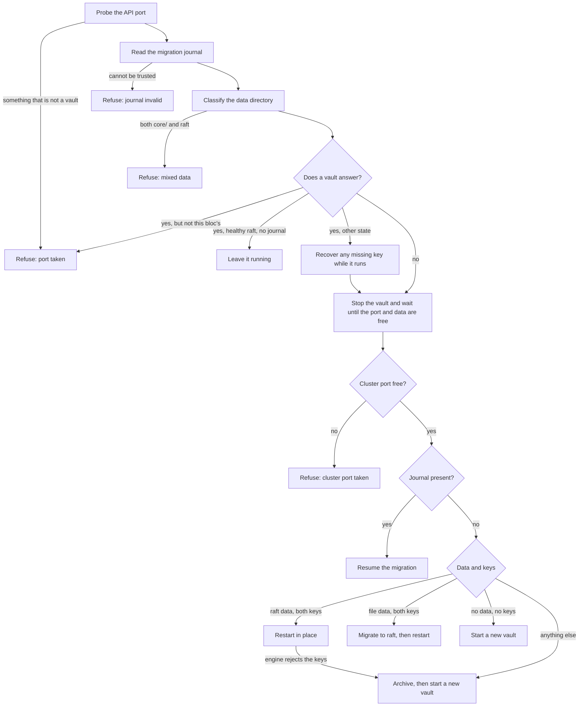

# The Inception Vault

The inception vault is the small vault that holds a bloc's secrets while the bloc is being bootstrapped, before the bloc has a production vault of its own. ocfp runs it with `safe local` inside a tmux session, first on the operator's workstation during `ocfp bootstrap` and then on the bastion during `ocfp init bastion`. Since ocfp v0.3.8 the vault keeps its data in integrated raft storage, so a stopped vault can be reopened with its saved keys instead of being replaced.

This page explains where the vault keeps its files, what `ocfp vault inception` does with each state it finds on disk, which directories a migration or an archive leaves behind, and how we recover from each error the command can return.

## Requirements

ocfp v0.3.8 needs safe v1.25.0 or later, because that is the first safe release that can reopen a raft vault with a saved root token. An older safe fails the prerequisite check with an upgrade message before anything is stopped or moved. The engine is OpenBao or HashiCorp Vault, and ocfp finds it the same way safe does, honouring `SAFE_ENGINE` when it is set.

Migrating a file-backed vault from an older ocfp also needs an engine that can still read file storage and that has the `operator migrate` command. OpenBao 2.7 and earlier and HashiCorp Vault both qualify. When the engine on `PATH` cannot do it, the command says so and leaves the file-backed data where it is.

## Ports

The API port is derived from the bloc name and lands somewhere between 18234 and 19233, so several blocs can run an inception vault on one machine. Raft also needs a cluster port, and ocfp always uses the API port plus 1000, which puts it between 19234 and 20233. Both ports must be free when the vault starts. Port 8234 is the legacy API port, and ocfp uses it only when no bloc is named.

To move a bloc's vault, we set `OCFP_VAULT_INCEPTION_PORT`, or the port in the bloc's config, and the cluster port moves with it. An API port above 64535 leaves no room for its cluster port, so ocfp rejects it before doing any work.

## Files on disk

In the bloc layout, which every current bloc uses, the vault's files live under the data home, which is `~/.local/share/ocfp` unless `XDG_DATA_HOME` or `OCFP_HOME` says otherwise.

| Path | What it holds |
|------|---------------|
| `<bloc>/vault/data/` | The vault's storage. A raft vault has `vault.db` and a `raft/` directory here, and a file-backed vault from an older ocfp has a `core/` directory instead. |
| `<bloc>/vault/root.key` | The root token, with mode 0600. |
| `<bloc>/vault/unseal.keys` | The unseal key, with mode 0600. |

Two more files live under the state home, which is `~/.local/state/ocfp` unless `XDG_STATE_HOME` or `OCFP_HOME` says otherwise.

| Path | What it holds |
|------|---------------|
| `<bloc>/logs/vault/vault-inception.log` | Everything `safe local` printed on its last start. The previous start's log is kept beside it with a `.previous` suffix. The log holds the unseal key of a new vault, so we treat it like a key file. |
| `<bloc>/inception-vault.lock` | The lock that lets only one ocfp run work on the bloc's vault at a time. |

## What a run does

Each run of `ocfp vault inception` brings the bloc to a running raft vault and changes as little on disk as it can. Every check that can refuse runs before anything is stopped or moved, so a refusal always leaves the disk exactly as it was.



A vault counts as this bloc's own when the process listening on the API port also holds this bloc's `vault.db`. Without raft data there is no lock to compare, so the bloc's own tmux session is the evidence instead. Derived ports can collide between blocs, and this check is what keeps one bloc from stopping a sibling's vault.

A vault is healthy when it is initialized and unsealed, it reports raft storage or no storage type at all, the data directory holds raft data, and the bloc's tmux session exists. ocfp leaves a healthy vault running. If safe has lost the bloc's target, ocfp registers it again and authenticates it with the token in `root.key`.

Before ocfp stops a running vault that is missing a key, it tries to recover the key while the vault still runs. The unseal key comes from the vault's log, or failing that from the tmux pane's history. The root token comes from the bloc's own target in `~/.saferc`, and only when that target points at the bloc's port. ocfp writes only the key files that are missing or blank, and it never replaces a key file that holds a value.

## The archive

ocfp archives a vault only when one of its keys is missing, when key files exist without any data, or when the engine itself rejects the saved root token or unseal key. Network trouble, a busy port, or an engine that fails to start never leads to an archive. In those cases ocfp stops whatever it started and returns an error.

An archive renames the bloc's whole `vault` directory, with its data and both key files, to `vault.superseded-<timestamp>` beside it. Nothing is deleted. A new vault then starts in an empty `vault` directory, and the command ends with an error-level log line that names the archive, so the change is hard to miss. In the legacy and test layouts, where the key file sits in the home directory, the data directory and the key file are each renamed aside under the same suffix.

To read the old secrets, we start a throwaway vault from the archive with safe by hand, using the archived `root.key` and `unseal.keys`, on a scratch port.

## Migration from file storage

An inception vault created by ocfp v0.3.7 or earlier stores its data in file storage. When ocfp finds such a vault with both keys, it stops the vault and migrates it to raft with the engine's `operator migrate` command. The steps run in this order.

1. ocfp checks that the engine has `operator migrate`, and refuses before it writes anything if the engine does not.

2. It writes a journal, `data.raft-migration.json`, with the phase `migrating`, and creates an empty staging directory, `data.raft-migrating`, with mode 0700.

3. It renders a migrate config and runs `operator migrate` with a ten-minute limit. The config and the engine's output are kept in the log directory as `raft-migration-<timestamp>.hcl` and `raft-migration-<timestamp>.log`.

4. It sets the journal's phase to `swapping`, renames `data` to `data.file-backup-<timestamp>`, renames the staging directory to `data`, and removes the journal.

5. It restarts the vault on the raft data with the saved keys.

The file store stays in `data.file-backup-<timestamp>` after a successful migration, and ocfp never removes it. Once we are satisfied that the raft vault holds everything, we can delete the backup ourselves.

When the copy fails, ocfp moves the staging directory aside to `data.raft-failed-<timestamp>`, removes the journal, and leaves `data` exactly as it was. Because the data is still file-backed, the next run tries the migration again instead of starting an empty vault over unmigrated secrets. When the restart right after a migration fails, ocfp never archives, even if the engine rejects the keys. Those keys opened the file store moments earlier, so the error names both the raft data and the backup, and we can look at them ourselves.

### Resuming an interrupted migration

When ocfp finds a journal, it reads it before it classifies the data directory, because a swap cut short can leave `data` missing, and a missing `data` would otherwise look like an empty bloc.

A `migrating` journal means the copy never finished and never touched `data`. ocfp moves any staging directory aside to `data.raft-partial-<timestamp>`, removes the journal, and runs the migration again.

A `swapping` journal means the copy finished. ocfp recognises the three points at which a swap can stop, which are before either rename, after `data` became the backup, and after both renames. It completes whichever rename is missing, removes the journal, and restarts the vault. Any other arrangement of the directories is refused with every path named, and nothing is moved.

A journal that cannot be parsed, names an unknown phase, or points its backup anywhere other than a `data.file-backup-*` directory beside `data` is refused rather than ignored.

### Migrating by hand

When the automatic migration refuses because the engine cannot read file storage, we can migrate with an older engine by hand and let ocfp take over afterwards. We stop the vault first, with `tmux kill-session -t <bloc>-inception-vault`, and confirm that nothing listens on the API port any more.

Then we write a config like this one, with the bloc's own paths and its cluster port, and save it with mode 0600.

```hcl
storage_source "file" {
  path = "/home/me/.local/share/ocfp/<bloc>/vault/data"
}

storage_destination "raft" {
  path    = "/home/me/.local/share/ocfp/<bloc>/vault/data.raft-manual"
  node_id = "safe-local"
}

cluster_addr = "https://127.0.0.1:<cluster port>"
```

The node ID must be `safe-local`, because that is the ID safe gives its raft node, and a store migrated under any other ID will not open. We create the destination directory with mode 0700, run `<engine> operator migrate -config=<file>` with the older engine, and wait for it to report that all the keys were migrated. Then we rename `data` to `data.file-backup-manual` and `data.raft-manual` to `data`. The next `ocfp vault inception` finds raft data with both keys and restarts the vault in place.

## Stopping and teardown

ocfp stops a vault by killing the bloc's tmux session, the listener on the bloc's API port, and any `safe local` process for that port. It then waits up to fifteen seconds for the port to close and for no process to hold `vault.db`, and it sends SIGKILL to anything still holding the data after a grace period. If the data stays locked, ocfp returns an error and moves nothing, because archiving or migrating under a live engine is how a store gets corrupted.

`ocfp vault teardown` stops the bloc's vault the same way, deletes its safe target, and archives it as described above. It first checks that the vault on the port is the bloc's own, and it stops nothing when it cannot prove that. When `ocfp init bastion` hands the vault over to the bastion, it stops the workstation's vault. That includes an engine that outlived its safe but still holds the bloc's raft data. The workstation's data stays on disk as a snapshot of the bootstrap-era secrets.

## Errors and how to recover

| Error | What it means | What to do |
|-------|---------------|------------|
| `safe is too old for raft-backed inception vaults` | The safe on `PATH` cannot run a raft vault. | Install safe v1.25.0 or later and run the command again. Nothing on disk changed. |
| `the inception vault port is taken` | Something that is not this bloc's vault answers on the API port, such as another program or another bloc's vault on a colliding port. | Stop whatever holds the port, or set `OCFP_VAULT_INCEPTION_PORT` to move this bloc's ports. |
| `the inception vault cluster port is taken` | The cluster port, the API port plus 1000, is in use, so the engine could not bind it. | Free the cluster port, or set `OCFP_VAULT_INCEPTION_PORT` to move both ports. |
| `cannot tell whose vault holds the inception vault port` | `lsof` is missing or failed, so ocfp cannot tell whose vault answers on the port. | Make sure `lsof` is installed and on `PATH`, then run the command again. |
| `cannot tell whether the inception vault data is still in use` | `lsof` is missing or failed, so ocfp cannot tell whether an engine still holds `vault.db`. | Make sure `lsof` is installed and on `PATH`, then run the command again. |
| `the inception vault data holds both raft and file storage` | The data directory has both `core/` and raft data, which ocfp never creates on its own. | Inspect the directory by hand and decide which store to keep. ocfp will not touch it. |
| `inception vault did not stop` | A process still holds `vault.db` or the port after the stop. | Find the process with `lsof -t <data>/vault.db` and stop it, then run the command again. |
| `the inception vault is running but cannot be re-targeted` | A healthy vault runs, but safe has no target for it and `root.key` is empty. | Recover the root token, write it to `root.key`, and run the command again. |
| `the vault engine cannot migrate storage` | The engine has no `operator migrate` command. | Point `SAFE_ENGINE` and `PATH` at HashiCorp Vault or OpenBao 2.7 or earlier, or migrate by hand. |
| `the vault engine cannot read file storage` | The engine no longer supports file storage. The data was left file-backed. | Point `SAFE_ENGINE` and `PATH` at an engine that can read it, or migrate by hand. |
| `the file-to-raft migration failed` | `operator migrate` failed. The staging directory moved to `data.raft-failed-<timestamp>`, and `data` is unchanged. | Read `raft-migration-<timestamp>.log` in the log directory, fix the cause, and run the command again. |
| `the inception vault did not restart after its migration to raft` | The raft data is in place, but the vault did not open on it. Nothing was archived. | Read the vault log. The error names both the raft data and the file backup, so we can move the backup back to `data` to return to the old vault. |
| `the raft migration journal cannot be trusted` | The journal is unreadable or describes a migration ocfp could not have left. | Inspect the journal and the directories beside `data`, put them right by hand, and remove the journal. |
| `the interrupted raft migration cannot be finished safely` | A `swapping` journal exists, but the directories match none of the points at which a swap can stop. | Inspect the named paths by hand. ocfp moved nothing. |
| `timed out waiting for another ocfp run to release its lock` | Another ocfp run has worked on this bloc's vault for more than five minutes. | Wait for that run to finish, or stop it, and run the command again. A killed run releases the lock on its own. |

## Testing on a workstation

`scripts/smoke/inception-vault-raft.sh` exercises every path on this page against throwaway blocs on scratch ports, with a scratch `HOME`, scratch ocfp homes, and its own tmux server. It never touches a real bloc, the real `~/.saferc`, or a lab. CI does not run it, because it needs safe v1.25.0, an OpenBao engine, and an OpenBao 2.6.4 binary to create file-backed vaults with.

We run it from the ocfp repository with the safe repository checked out beside it.

```bash
SAFE_REPO=../safe scripts/smoke/inception-vault-raft.sh
```

The script prints PASS or FAIL for each case and keeps its scratch directory for inspection, printing its path at the end. It never prints a token, an unseal key, or a secret value, and it compares hashes instead. The header of the script lists the variables that point it at other binaries or ports.
