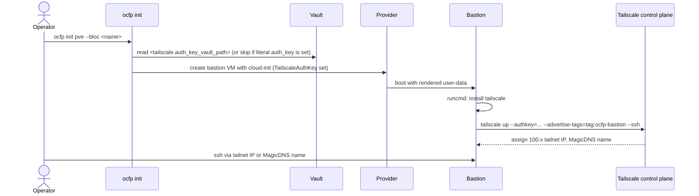

# Bastion Tailscale

This document covers joining a freshly provisioned bastion to a Tailscale tailnet at first boot. The workflow targets providers without native public IPs (Proxmox today, similar on-prem providers tomorrow), where the operator needs reliable inbound reachability without depending on the host network.

## Why Tailscale

Bastions on providers without native public IPs traditionally relied on per-user route hacks: VPN profiles, jumphost SSH chains, or hand-maintained routing tables on each operator's laptop. Tailscale replaces those with a single tailnet identity per bastion:

- The bastion gets a stable `100.x.y.z` tailnet IP and a MagicDNS name (`{hostname}.{tailnet}.ts.net`).

- Operators on the same tailnet reach the bastion by name with no extra routing config.

- Tailscale SSH means the bastion does not need to expose port 22 to anything outside the tailnet.

- DNS sync (see [Cloudflare DNS Sync](../networking/dns-cloudflare-sync.md)) can point public records at the tailnet IP, so internal services resolve without changing operator tooling.

## How it is wired

The bastion cloud-init `runcmd` block conditionally installs Tailscale and runs `tailscale up` when the instance request carries a non-empty `TailscaleAuthKey`. See `internal/cpi/types.go:444` for the field and `internal/cpi/pve/cloudinit_snippets.go:261` for the rendered runcmd.

The emitted commands are exactly:

```yaml
runcmd:
  - curl -fsSL https://tailscale.com/install.sh | sh
  - tailscale up --authkey="<key>" --hostname="<bastion-host>" --advertise-tags=tag:ocfp-bastion --ssh --accept-dns=false --accept-routes=false --advertise-routes=<vnet-cidr>
```

`--accept-dns=false` keeps `tailscaled` from rewriting `/etc/resolv.conf` to point at MagicDNS (`100.100.100.100`). If the bastion ever loses its tailnet connection (DERP flap, brief NAT outage), MagicDNS becomes unreachable; if it owned `/etc/resolv.conf`, the bastion would lose DNS entirely and could never recover its tailnet join. Leaving DNS to cloud-init keeps a reachable fallback.

`--accept-routes=false` keeps `tailscaled` from pulling other machines' advertised routes (including the bloc's own `/18`) into the bastion's policy routing table 52. If the bastion accepted its own advertised `/18`, return packets for local VMs would be looped back through `tailscale0` instead of the local SDN bridge, breaking egress. Advertisement is one-way: the bastion offers the route to peers but does not import it.

The auth key is shell-sanitized before rendering (`sanitizeTailscaleAuthKey` in the same file) so dangerous characters cannot escape the quoted argument.

### Advertised routes

The `--advertise-routes=<vnet-cidr>` flag makes the bastion act as a subnet router for its bloc's private network. Tailnet peers can then reach bloc-internal VMs (director, workload VMs) by IP without sitting on the bloc's network themselves.

The CIDR is derived in `deriveAdvertiseRoutes` (same file) by masking `req.StaticPrivateIP` to `req.StaticPrivateIPPrefix`. For a bastion at `10.64.64.3/18`, the advertised route is `10.64.64.0/18`. When either field is absent the flag is omitted and `tailscale up` runs without route advertisement.

Routes do not auto-activate. After the bastion joins the tailnet, the tailnet admin must approve each advertised route once in the Tailscale admin (Machines → bastion → Edit route settings). Subsequent boots reuse the approval.

When `TailscaleAuthKey` is empty, the runcmd block is omitted entirely and the bastion boots without Tailscale.

## Operator prerequisites

Complete these once per tailnet, before any bastion is provisioned.

### 1. ACL tag

Add `tag:ocfp-bastion` to your tailnet's ACL `tagOwners` so the bastion can advertise the tag at join time. Example (Tailscale admin → Access Controls):

```jsonc
{
  "tagOwners": {
    "tag:ocfp-bastion": ["group:ops"]
  }
}
```

Any group that owns the tag can mint auth keys that grant it. Tighten ACL rules as desired so only `tag:ocfp-bastion` machines can reach (or be reached by) the workloads behind the bastion.

### 2. SSH ACL rule

The bastion runs `tailscale up --ssh`, which starts the tailscaled SSH server. The server only honors connections the tailnet ACL allows, so without an `ssh` block in the ACL, every `tailscale ssh` attempt is rejected. Add (or extend) the `ssh` array:

```jsonc
{
  "ssh": [
    {
      "action": "accept",
      "src":    ["autogroup:member"],
      "dst":    ["tag:ocfp-bastion"],
      "users":  ["ubuntu", "root", "autogroup:nonroot"]
    }
  ]
}
```

- `action`
  `"accept"` skips the per-session Tailscale identity check. Use `"check"` if you want operators to re-auth in a browser on a configurable cadence (default 12h cache).

- `src`
  `autogroup:member` covers every signed-in tailnet member. Narrow to `["group:ops"]` (or any other group you define) if you want to restrict bastion SSH to a subset of users.

- `dst`
  `tag:ocfp-bastion` matches the tag the bastion self-assigns at join via `--advertise-tags=tag:ocfp-bastion`. Keeps the rule scoped to OCFP bastions instead of every machine in the tailnet.

- `users`
  Local usernames on the bastion that a tailnet user is allowed to land as. `ubuntu` matches the default user from `~/.ocfp/config.pve.yml`; `autogroup:nonroot` catches any future non-root account; `root` is optional and only useful when an operator needs raw root rather than `sudo`.

Verify after saving with `tailscale ssh ubuntu@<bastion-host>` from a workstation in the tailnet. The session should land directly without a password or key prompt.

### 3. Reusable, pre-approved auth key

Create the auth key under Tailscale admin → Settings → Keys → Generate auth key:

- Reusable
  yes (so the same key works for every bloc's bastion)

- Pre-approved
  yes (so the bastion joins without an admin tap)

- Tags
  `tag:ocfp-bastion`

- Expiration
  pick whatever fits your rotation policy; the bastion's machine key remains valid after the auth key expires

Copy the `tskey-...` value.

### 4. Tailscale config in `~/.ocfp/config.yml`

OCFP reads tailscale settings from the config file at two scopes:

- A top-level `tailscale:` block supplies global defaults for every bloc.

- A per-bloc `tailscale:` block under `blocs.<name>.tailscale` overrides global on a field-by-field basis.

Per-bloc fields take precedence. There is no fallback to a hard-coded vault path — operators who relied on the legacy `secret/ocfp/tailscale/auth_key` location must move the value into the config.

The auth key may be supplied as a literal value or as a vault-path indirection. The two are mutually exclusive within a single scope:

```yaml
tailscale:
  # Pick one of the next two. Setting both is a config error.
  auth_key: "tskey-..."                          # literal
  auth_key_vault_path: "secret/ocfp/tailscale:auth_key"  # "path:key" -> vault read at runtime

  tags:
    - "tag:ocfp-bastion"
  accept_dns: false
  accept_routes: false
  ssh: true
  # exit_node: ""           # optional tailnet exit node
  # advertise_routes: ""    # optional CIDR; auto-derived from bastion static IP+prefix when empty
  # hostname: ""            # optional override; defaults to the bastion VM name

blocs:
  example-bloc:
    provider: pve
    # ... usual bloc fields ...
    tailscale:
      # Per-bloc overrides; any field omitted here inherits from the
      # top-level tailscale: block above.
      auth_key: "tskey-bloc-specific-..."
      hostname: "example-bastion"
```

Storing the key in vault stays a supported option — point `auth_key_vault_path` at any `path:key` location:

```bash
safe write secret/team/tailscale auth_key="tskey-..."
```

```yaml
tailscale:
  auth_key_vault_path: "secret/team/tailscale:auth_key"
```

Rotate by overwriting the literal in the config or the value at the vault path; re-running `ocfp init pve` re-renders the cloud-init snippet but does not re-create existing bastion VMs (see the rotation section below).

## Boot-time flow



## Verification

After `ocfp init pve` reports success and the bastion finishes cloud-init (give it a couple of minutes after the VM transitions to running), confirm the join from the operator side.

- Tailscale admin
  The bastion appears in the machine list with its hostname and the `tag:ocfp-bastion` tag.

- From your laptop
  `tailscale status` shows the bastion. `tailscale ping <bastion-host>` returns a direct or DERP-relayed RTT.

- SSH
  `ssh <user>@<bastion-host>` (MagicDNS) or `ssh <user>@100.x.y.z` (raw tailnet IP) succeeds without any extra routing.

If the bastion does not appear within five minutes of VM boot, SSH in via the provider's console and check cloud-init logs:

```bash
sudo cat /var/log/cloud-init-output.log | grep -i tailscale
sudo tailscale status
```

Common causes:

- Empty `TailscaleAuthKey`
  Bootstrap could not resolve a key from `tailscale.auth_key` or `tailscale.auth_key_vault_path` (per-bloc or global). Verify the config block and re-run `ocfp init pve`.

- Auth key expired or revoked
  `tailscale up` returned a 401. Mint a new key, update the literal or the vault entry referenced by `tailscale.auth_key_vault_path`, and re-run.

- Tag not in `tagOwners`
  Tailscale rejects `--advertise-tags`. Add the tag to ACL `tagOwners` and re-run.

## Re-running and rotation

`ocfp init pve` is idempotent. Re-running on an already-joined bastion re-renders the cloud-init snippet but the VM is not re-created, so `tailscale up` does not re-run. To rotate the auth key for already-joined bastions, rotate at the Tailscale layer (Settings → Keys), then update the literal in the config or the value at the configured vault path. Existing machines keep working on their machine keys.

To force a fresh join (e.g., recovering a bastion that was removed from the tailnet), SSH to the bastion and run `tailscale up --authkey=...` manually, or destroy and re-create the VM.

## See Also

- [Bastion Initialization](bastion.md) for the rest of the bastion provisioning workflow
- [Proxmox Networking](../networking/providers/pve.md) for the PVE-specific context
- [SDN Subnet Model](../networking/sdn-subnet-model.md) for why PVE bastions need this
- [Cloudflare DNS Sync](../networking/dns-cloudflare-sync.md) for pointing wildcard DNS at the tailnet IP
- [Tailscale ACL reference](https://tailscale.com/kb/1018/acls)
- [Tailscale auth keys](https://tailscale.com/kb/1085/auth-keys)
