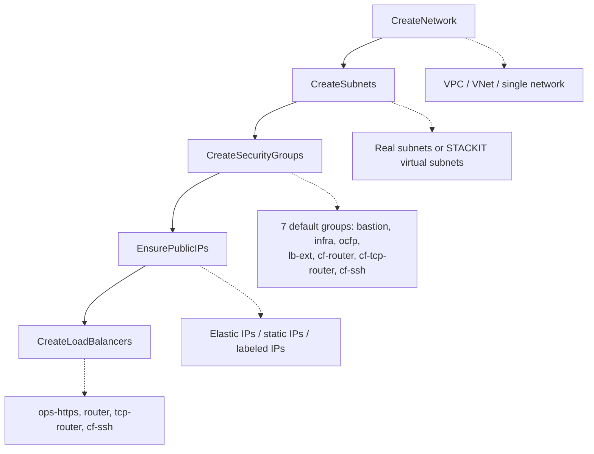

# Networking Overview

OCFP abstracts cloud networking across five providers through a unified CPI (Cloud Provider Interface) `NetworkManager`. Each provider implements the same interface, but the underlying resources and behaviors differ.

This document provides a high-level overview of OCFP networking, the provider support matrix, and the bootstrap networking flow.

## Provider Support Matrix

| Feature | AWS | Azure | GCP | STACKIT | Proxmox |
|---------|-----|-------|-----|---------|---------|
| Network type | VPC | VNet | VPC (custom mode) | Single network | Bridge or SDN VNet |
| Real subnets | Yes (AZ-aware) | Yes | Yes (regional) | No | SDN mode only |
| Virtual subnets | No | No | No | Yes | No |
| Subnet strategy | Default split (3 from /20) | Default split | Default split | single or ocfp-triple | Flat (bridge) or SDN |
| Security groups | EC2 Security Groups | NSGs | Firewall rules + tags | SDK-backed SGs | PVE firewall |
| Public IPs | Elastic IPs | Static public IPs | Static external addresses | Labeled public IPs | Not supported |
| Routers/routing | Route tables + IGW | Route tables | Cloud Router | Mock/pending | Not supported |
| Load balancers | ALB (ELBv2) | Azure LB (Standard) | Forwarding rules + backends | STACKIT LB SDK | Not supported |
| DNS config | DHCP options | DHCP options | API-level | Nameservers on IPv4 | Not managed |

## Bootstrap Networking Flow

During `ocfp bootstrap`, networking resources are created in a fixed order. Each step depends on the previous step completing successfully.

## CPI NetworkManager Interface

All providers implement the `NetworkManager` interface defined in `internal/cpi/provider.go`. The interface covers:

- **Network operations**
  Create, Get, List, Delete

- **Subnet operations**
  Create, Get, List, Delete

- **Security group operations**
  Create, Get, List, Delete

- **Public IP operations**
  Create, Get, List, Delete

- **Floating IP operations**
  Allocate, Get, List, Associate, Disassociate, Release

- **Router operations**
  Create, Get, List, AttachInterface, DetachInterface, Delete

- **Load balancer operations**
  Create, Get, List, Update, Delete

- **Backend pool operations**
  GetBackendPools, AddBackendMember, RemoveBackendMember

- **Health check operations**
  ConfigureHealthCheck, GetLoadBalancerHealth

Providers that do not support a capability return a typed error (e.g., `ErrSubnetsNotSupported`, `ErrRoutersNotSupported`).

## Default Network Configuration

When no network CIDR is specified, OCFP uses `10.4.0.0/20`. The parent CIDR is split into 4 equal parts; the first is reserved for infrastructure, and the remaining 3 become `ocfp-0`, `ocfp-1`, and `ocfp-2`.

## Document Index

- [Subnets](subnets.md)
  Subnet strategies, CIDR splitting, virtual subnets, reserved IPs

- [Security Groups](security-groups.md)
  7 default groups, port definitions, per-provider implementations

- [Public IPs](public-ips.md)
  IP allocation, labeling, tokens, per-provider behavior

- [Routing](routing.md)
  Routers, gateways, route tables per provider

- [Load Balancers](load-balancers.md)
  Provider LB architecture, health checks, backend management

- [DNS](dns.md)
  DNS configuration per provider

### Per-Provider Guides

- [AWS](providers/aws.md)
  VPC, subnets, EC2 security groups, Elastic IPs, ALB, route tables

- [Azure](providers/azure.md)
  VNet, subnets, NSGs, static IPs, Azure LB, route tables

- [GCP](providers/gcp.md)
  Custom-mode VPC, regional subnetworks, firewall rules, Cloud Router

- [STACKIT](providers/stackit.md)
  Single network, virtual subnets, labeled public IPs, SDK LB

- [Proxmox](providers/proxmox.md)
  Bridge mode, SDN mode, PVE firewall

## See Also

- [LB Commands](../cmds/lb.md) for CLI load balancer operations
- [Bastion Initialization](../init/bastion.md) for bastion host setup
