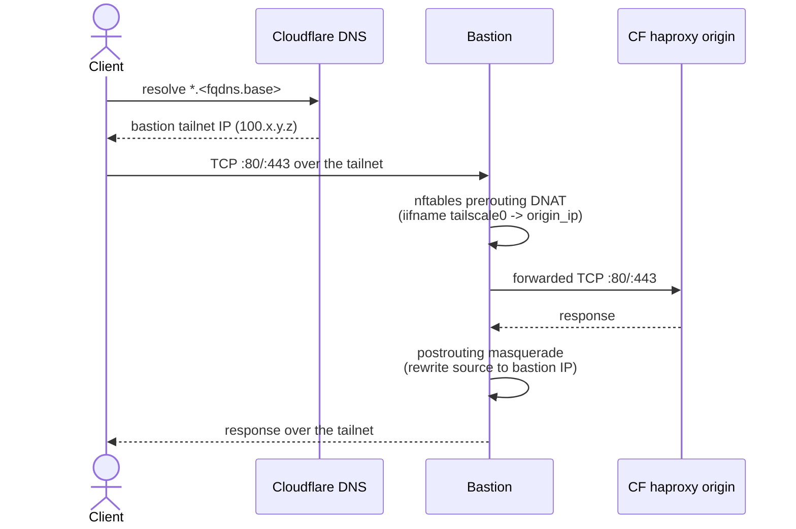

# Ingress Providers

OCFP fronts a bloc with one of two ingress providers: the Cloudflare tunnel
(the original path) or Tailscale-plus-DNS (for operators who already run a
tailnet and want public DNS to resolve straight to the bastion, without a
tunnel connector in the loop). This document covers the `ingress.provider`
config, the tailscale data path end to end, routing extra service UIs
through the CF kit's haproxy, and the operational caveats that come with
each provider.

## Choosing a provider

`ingress.provider` accepts `cloudflared` or `tailscale`. It can be set at
the top level (a default for every bloc) or per bloc under `blocs.<name>`,
where the per-bloc value always wins. Leave it unset and OCFP resolves it
for you:

- `cloudflare.enabled: true` and no explicit provider -> `cloudflared`
  (existing behavior, unchanged).
- Neither `ingress.provider` nor `cloudflare.enabled` set -> no ingress;
  the platform is reachable only from operators on the bastion's networks.

The resolution and validation logic lives in
`internal/config/ingress.go` (`ResolveIngressProvider`, `ValidateIngress`).
Validation is a load-time hard error, not a soft skip — an explicit
provider that cannot work is a config contradiction:

- `provider: cloudflared` requires `cloudflare.enabled: true`.
- `provider: tailscale` requires `tailscale.enabled: true`, a
  `cloudflare.zone`, and exactly one Cloudflare API token source
  (`cloudflare.api_token` or `cloudflare.api_token_vault_path` — the token
  is still needed to manage the DNS records described below, even though
  no tunnel is created).

### Full example: cloudflared

```yaml
blocs:
  ocfp-lab-wayne:
    provider: pve
    cloudflare:
      enabled: true
      api_token_vault_path: "secret/ocfp/cloudflare:api_token"
      zone: fivetwenty.io
      origin: 10.108.20.13
      apps_domain: apps.ocf.wayne.lab.fivetwenty.io
      system_domain: system.ocf.wayne.lab.fivetwenty.io
    ingress:
      provider: cloudflared
```

### Full example: tailscale

```yaml
blocs:
  ocfp-lab-wayne:
    provider: pve
    fqdns:
      base: ocf.wayneeseguin.lab.fivetwenty.io
    cloudflare:
      enabled: true
      api_token_vault_path: "secret/ocfp/cloudflare:api_token"
      zone: fivetwenty.io
      origin: 10.108.20.13
    tailscale:
      auth_key_vault_path: "secret/ocfp/tailscale:auth_key"
    ingress:
      provider: tailscale
```

Note that `cloudflare.enabled: true` is still required even for the
tailscale provider — the Cloudflare account supplies DNS management, not a
tunnel, and `ValidateIngress` checks `tailscale.enabled` and the zone/token
independently of which provider actually gets resolved to. `cloudflare.origin`
is the same haproxy origin IP used by the cloudflared path; the tailscale
provider reuses it as the DNAT target described below.

## The tailscale data path

With `provider: tailscale`, no cloudflared connector is installed on the
bastion — `internal/bootstrap/cloudflare.go::CreateCloudflareTunnel` checks
the resolved provider first and no-ops when it isn't `cloudflared`. Instead,
four pieces cooperate to get a public hostname all the way to the CF
haproxy:



1. **DNS.** A late bootstrap step, `ConfigureIngressDNS` in
   `internal/bootstrap/ingress.go`, runs after the bastion has joined the
   tailnet. It polls `tailscale status --json` for the bastion's hostname
   (10s interval, 5 minute cap) to learn its `100.x` tailnet IP, then
   upserts two Cloudflare A records in `cloudflare.zone`: `<fqdns.base>`
   and `*.<fqdns.base>`, both pointing at that IP with TTL 60 and proxying
   off (a proxied/orange-cloud record would try to route through
   Cloudflare's edge, which cannot reach a tailnet address). This step is
   `required: false` in the bootstrap chain and soft-fails on any missing
   prerequisite — cloudflare zone unset, no token, tailscale CLI absent,
   bastion not yet visible on the tailnet — logging a warning and letting
   bootstrap continue rather than failing the whole run. On success it
   also persists `provider`, `bastion_tailnet_ip`, and `base` to
   `secret/config/<bloc>/ingress` in vault.

2. **DNAT.** The bastion's SMBIOS `sku` payload gains an `ingress` field
   (`{origin_ip, ports}`, default ports `[80, 443]`) whenever the resolved
   provider is tailscale — see `internal/cpi/pve/smbios.go` and
   `bastionIngressSpec` in `internal/bootstrap/compute.go`, which derives
   `origin_ip` from `cloudflare.origin`. Firstboot v2 and the watchdog v3
   script (`internal/cpi/pve/templates_firstboot.go`) both read that field
   and install an nftables table:

   ```
   table ip ocfp_ingress {
     chain prerouting {
       type nat hook prerouting priority dstnat; policy accept;
       iifname "tailscale0" tcp dport { 80, 443 } dnat to <origin_ip>
     }
     chain postrouting {
       type nat hook postrouting priority srcnat; policy accept;
       ip daddr <origin_ip> tcp dport { 80, 443 } masquerade
     }
   }
   ```

   **Why the masquerade rule is required:** the haproxy origin's default
   route points at the SDN gateway, not at the bastion. Without
   masquerade, the origin sends its reply straight to the SDN gateway
   using the real client's tailnet source address, which the SDN has no
   route back to — the reply blackholes. Masquerading the prerouting
   DNAT rewrites the source to the bastion's own address, so the origin's
   reply naturally routes back through the bastion, which then reverses
   the rewrite on the way out.

   nftables rules are not persisted across reboot. The watchdog timer
   (every 5 minutes) checks `nft list table ip ocfp_ingress` and
   reinstalls the table only when it's missing, so a reboot is self-healing
   within one watchdog cycle without needlessly recreating a table that's
   already there.

3. **haproxy.** The CF kit's haproxy is the actual TLS terminator and
   router; nothing about its cf-deployment configuration changes for the
   tailscale provider. See "Routing extra service UIs" below for the one
   thing that does interact with haproxy: SAN entries for non-CF services.

4. **Teardown.** `teardownIngressDNS` in `internal/commands/teardown.go`
   deletes the same two A records during `ocfp teardown`, before the
   resource deletion pass. Like bootstrap, it's best-effort: any failure
   (zone resolve, missing token, API error) is logged as a warning and
   teardown proceeds — a stale DNS record must never block tearing down a
   lab.

## Routing extra service UIs

Independent of which ingress provider fronts the CF apps/system domains,
non-CF service UIs (SHIELD, Grafana, Doomsday, Concourse, and similar) can
share the same public haproxy IP and TLS termination via
`params.ocfp_haproxy_service_routes` in the CF kit. Each entry adds a
host-ACL frontend rule, a dedicated backend, and a SAN entry on the
haproxy cert:

```yaml
params:
  ocfp_haproxy_service_routes:
  - hostname: shield.system.ocf.wayneeseguin.lab.fivetwenty.io
    backend: 10.0.0.20
    port: 443
    ssl: noverify
  - hostname: grafana.system.ocf.wayneeseguin.lab.fivetwenty.io
    backend: 10.0.0.21
    port: 8080
    ssl: none
```

`hostname` and `backend` are required; `port` defaults to `443`; `ssl`
defaults to `noverify` (re-encrypt without verifying the backend's
certificate) or can be set to `none` (plain HTTP to the backend). See the
cf kit's `MANUAL.md` for the full parameter reference. Because each
hostname lands in the haproxy cert's SAN list, both DNS providers need a
record for it — the tailscale provider's wildcard `*.<fqdns.base>` A
record already covers any hostname under the base domain, so no
per-service DNS work is needed there; the cloudflared provider needs a
CNAME per service hostname, which `CreateCloudflareTunnel` already
manages from `cloudflare.services`.

## Existing bastions

`ingress.provider: tailscale` on a bloc whose bastion was already
provisioned before this feature does nothing on its own — the DNAT table
is installed by firstboot, which only runs once per VM lifecycle, and the
SMBIOS `ingress` field is only read by a template built with the current
firstboot/watchdog scripts. To bring an existing bastion under tailscale
ingress, either:

- Rebuild the bastion template (delete `ubuntu-noble-bastion-template` in
  PVE and let the next `ocfp bootstrap --bastion` re-provision it) and
  destroy/recreate the bastion VM, or
- Patch `/usr/local/sbin/ocfp-tailscale-watchdog` on the running bastion by
  hand and update its SMBIOS `sku` field to include the `ingress` object,
  then restart the VM (`qm reboot <vmid>`) so the watchdog's next cycle —
  or the reboot itself, since the watchdog runs 2 minutes after boot —
  installs the nftables table.

Either way, the change takes effect at the bastion's next restart, not
immediately.

## See Also

- [Bastion Tailscale](../init/bastion-tailscale.md) for the tailnet join
  workflow and the "Ingress forwarding" subsection covering the nftables
  rules in more operational detail
- [Cloudflare DNS Sync](dns-cloudflare-sync.md) for the manual/scripted
  alternative to the automated bootstrap DNS step
- [PVE Runbook: Stratos — The Front Door](../runbooks/pve/12-stratos.md)
  for both providers walked through end to end in a worked lab example
