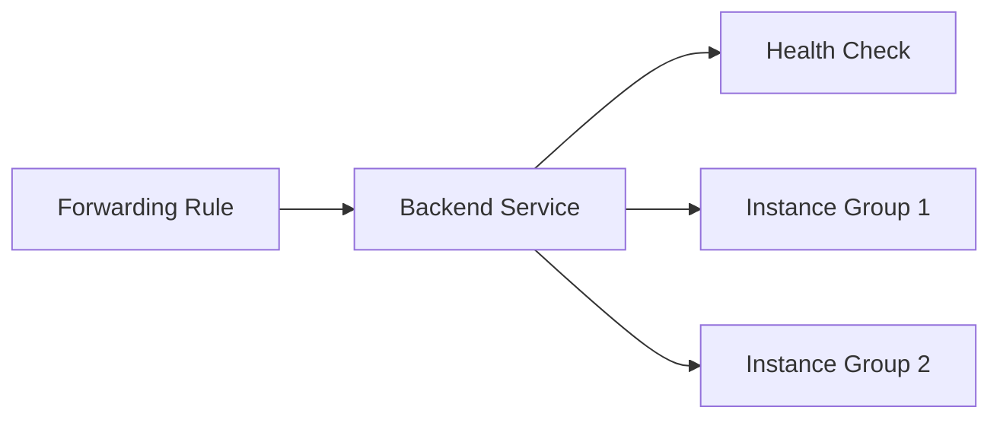

# Load Balancers

OCFP manages load balancers for operational services and Cloud Foundry traffic. During bootstrap and via `ocfp lb` commands, load balancers are created for ops (HTTPS), CF routers (HTTP/HTTPS), TCP routers, and CF SSH.

## Provider Implementation

| Feature | AWS | Azure | GCP | STACKIT | Proxmox |
|---------|-----|-------|-----|---------|---------|
| LB type | ALB (ELBv2) | Azure LB (Standard) | Forwarding rules + backends | STACKIT LB SDK | Not supported |
| Scheme | internet-facing / internal | public / private | regional | external | N/A |
| Health checks | Target group health | Probe-based | Health check resource | SDK health checks | N/A |
| Backend management | Target groups | Backend pools | Backend services | SDK backends | N/A |
| Multi-AZ | Required (min 2 subnets) | Single region | Regional | Single region | N/A |
| Internal LB | Yes | Yes (private frontend IP) | Yes | Yes | N/A |

## AWS

AWS load balancers use Elastic Load Balancing v2 (ALB).

### Architecture

- Load balancers require at least 2 subnets across different availability zones
- Target groups manage backend instances
- Health checks are configured per target group
- A 5-minute active connection timeout applies during deregistration

### Operations

The AWS CPI delegates LB operations to the `LoadBalancerManager`:

- `CreateLoadBalancer` — creates an ALB with subnets and security groups
- `GetLoadBalancer` — retrieves LB details by ID
- `ListLoadBalancers` — lists LBs with optional filters
- `UpdateLoadBalancer` — modifies LB settings
- `DeleteLoadBalancer` — removes the ALB

Backend operations:

- `AddBackendMember` — registers a target in a target group
- `RemoveBackendMember` — deregisters a target
- `ConfigureHealthCheck` — sets health check parameters
- `GetLoadBalancerHealth` — retrieves health status

Source: `internal/cpi/aws/network.go`

## Azure

Azure uses Standard SKU load balancers.

### Architecture

- Frontend IP configurations (public or private)
- Backend address pools for target management
- Health probes for monitoring
- Load balancing rules map frontend to backend

### Operations

The Azure CPI provides full LB management:

- `CreateLoadBalancer` — creates a Standard SKU LB with frontend IP
- Backend pool management through the Azure SDK
- Health probe configuration
- Support for both public and internal load balancers

Source: `internal/cpi/azure/network.go`

## GCP

GCP uses a chain of resources for load balancing: health checks, backend services, and forwarding rules.

### Architecture



- **Forwarding rules** define the frontend (IP, port, protocol)
- **Backend services** manage instance groups and health
- **Health checks** monitor backend health
- All resources are regional in scope

### Operations

GCP LB operations are delegated to the `LoadBalancerManager`. The `NetworkManager` contains stub methods that forward to the dedicated LB manager.

Source: `internal/cpi/gcp/network.go`

## STACKIT

STACKIT uses a fully SDK-backed load balancer implementation.

### Architecture

- LBs are created through the STACKIT LB SDK
- Integrated with public IP labels for target resolution
- Full lifecycle management (create, get, list, update, delete)
- Backend member management through the SDK
- Health check configuration through the SDK

### Operations

All LB operations delegate to `m.client.loadBalancer`:

- `CreateLoadBalancer` — creates via STACKIT LB SDK
- `GetLoadBalancer`, `ListLoadBalancers` — query operations
- `UpdateLoadBalancer` — modify LB configuration
- `DeleteLoadBalancer` — remove LB
- `GetBackendPools`, `AddBackendMember`, `RemoveBackendMember` — backend management
- `ConfigureHealthCheck`, `GetLoadBalancerHealth` — health monitoring

Source: `internal/cpi/stackit/network.go`

## Proxmox

Load balancers are not supported for Proxmox. All LB operations return `ErrLoadBalancersNotSupported`.

Source: `internal/cpi/proxmox/network.go`

## CPI Types

The `LoadBalancer` type in `internal/cpi/types.go`:

```
LoadBalancer
  ID              string
  Name            string
  Type            string     (external / internal)
  Algorithm       string     (round-robin / least-connections / ip-hash)
  IPAddress       string
  Port            int
  TargetPort      int
  Protocol        string     (tcp / http / https)
  Status          string
  State           string
  Backends        []Backend
  HealthCheck     *HealthCheck
  SecurityGroups  []string
  Tags            map[string]string
  CreatedAt       time.Time
  UpdatedAt       time.Time
```

The `Backend` type:

```
Backend
  ID        string
  Name      string
  Address   string
  Port      int
  Weight    int
  Enabled   bool
  Health    string
```

The `HealthCheck` type:

```
HealthCheck
  Protocol            string
  Port                int
  Path                string
  Interval            int
  Timeout             int
  HealthyThreshold    int
  UnhealthyThreshold  int
```

## Default Load Balancers

OCFP creates these LBs during bootstrap and via `ocfp lb` commands:

| Name | Protocol | Port | Backends |
|------|----------|------|----------|
| `<bloc>-ops-https` | TCP | 443 | Reserved IPs: vault, prometheus, shield |
| `<bloc>-router-80` | HTTP | 80 | Public IPs: job=router |
| `<bloc>-router-443` | HTTPS | 443 | Public IPs: job=router |
| `<bloc>-tcp-router` | TCP | configurable | Public IPs: job=tcp-router |
| `<bloc>-cf-ssh` | TCP | 2222 | Public IPs: job=cf-ssh |

## See Also

- [LB Commands](../cmds/lb.md) for CLI operations, target tokens, and bloc configuration
- [Public IPs](public-ips.md) for public IP allocation used as LB backends
- [Networking Overview](README.md) for the provider support matrix
