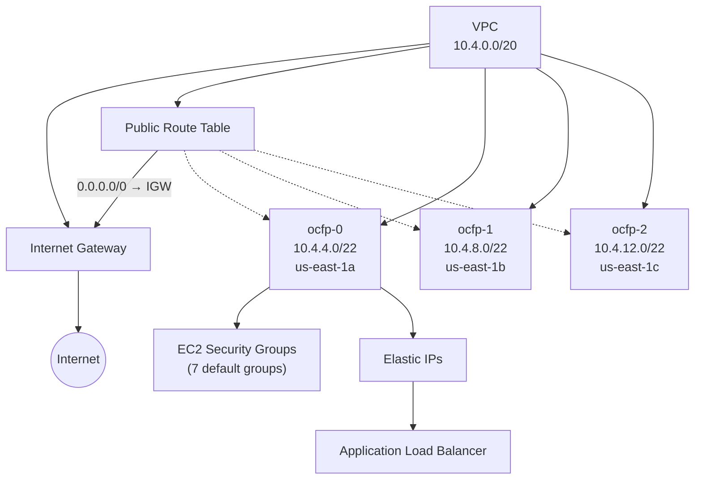

# AWS Networking

This guide covers AWS-specific networking in OCFP, including VPC architecture, subnets, security groups, Elastic IPs, route tables, and ALB load balancers.

## Network Architecture



## Network Creation

OCFP creates an AWS VPC with the configured CIDR block.

During creation:

- VPC is created with `CreateVpc`
- `EnableDnsHostnames` is set to `true`
- `EnableDnsSupport` is set to `true`
- Custom DNS servers are passed via DHCP options if configured
- VPC is tagged with `managed-by=ocfp`, `bloc`, and `Name`

To use an existing VPC, specify `vpc_id` in the network config:

```yaml
network:
  id: vpc-0abc123def456
  network_cidr: 10.4.0.0/20
```

Source: `internal/cpi/aws/network.go`

## Subnets

AWS subnets are real VPC subnets distributed across availability zones.

### Default Behavior

When subnets are not configured, OCFP:

1. Splits the parent CIDR into 4 equal parts
2. Skips the first part (reserved for infrastructure)
3. Creates 3 subnets, one per AZ

For `10.4.0.0/20` in `us-east-1`:

| Subnet | CIDR | AZ |
|--------|------|----|
| `<bloc>-ocfp-0` | `10.4.4.0/22` | `us-east-1a` |
| `<bloc>-ocfp-1` | `10.4.8.0/22` | `us-east-1b` |
| `<bloc>-ocfp-2` | `10.4.12.0/22` | `us-east-1c` |

### Public vs. Private

Default subnets are type `public`:

- Auto-assign public IP is enabled
- Associated with a route table that has a route to the Internet Gateway

### Custom Configuration

```yaml
network:
  network_cidr: 10.4.0.0/20
  subnets:
    - name: my-public
      cidr: 10.4.0.0/24
      type: public
      az: us-east-1a
    - name: my-private
      cidr: 10.4.1.0/24
      type: private
      az: us-east-1b
```

## Reserved IPs

AWS always resolves an empty `network.strategy` to `spanning` (`netlayout.DefaultNameFor("aws", ...)` returns `spanning` unconditionally, regardless of `subnetStrategy`): the three VPC subnets `ocfp-0`/`ocfp-1`/`ocfp-2` are genuinely separate address spaces, the same shape `spanning` was built for, so there is no "wide"-style single-subnet layout to colocate onto. Set `network.strategy: wide` or `compact` explicitly only if you have hand-configured AWS to run a single workload subnet — those two strategies fail `ValidateSubnet`/`ValidateSubnetSet` against a subnet too small (`wide` needs `/25`, `compact` needs `/26`), and `spanning` itself fails `ValidateSubnetSet` (`netlayout.ErrTooFewSubnets`) if fewer than three workload subnets are configured.

Under `spanning`, each of the three `ocfp-N` subnets' `reserved-ips` vault record carries only the roles pinned to that index (plus every unpinned, "every subnet" role) — see [Reserved-IP Strategies §6](../reserved-ip-strategies.md#6-the-spanning-strategy) for the full per-index static table and the worked `10.4.4.0/22`/`10.4.8.0/22`/`10.4.12.0/22` example, which uses this exact three-subnet split.

`cf_router_*`/`diego_cell_*` keys are NOT written to a subnet's `reserved-ips` record. AWS previously derived a hand-rolled offset table (`calculateSystemIPs`) that included per-instance `cf_router_N_ip`/`diego_cell_N_ip` keys alongside the mgmt/ocf statics; that table is gone. CF router and Diego Cell addressing on AWS lives entirely in the public-ips and load-balancer paths instead — Elastic IPs allocated per `router_public_ips`/`tcp_router_public_ips`/`cf_ssh_public_ips` (see [Public IPs](../public-ips.md)) and ALB target-group membership (see [Load Balancers](../load-balancers.md)), not a subnet-scoped reserved address.

## Security Groups

AWS security groups are EC2 Security Groups attached to the VPC.

OCFP creates 7 default groups (see [Security Groups](../security-groups.md) for full details):

| Group | Key Ports |
|-------|-----------|
| `<bloc>-bastion` | SSH/22 (restricted to `allowed_ingress_ips`) |
| `<bloc>-infra` | SSH/22, HTTP/80, HTTPS/443, 8080, 8443 |
| `<bloc>-ocfp` | SSH/22, HTTP/80, HTTPS/443, 8443, 8844, 25555, 8484, 6868 |
| `<bloc>-lb-ext` | HTTPS/443 (from `0.0.0.0/0`) |
| `<bloc>-ocf-cf-router-ingress` | HTTP/80, HTTPS/443, CF SSH/2222 |
| `<bloc>-ocf-cf-tcp-router-ingress` | TCP/1024-65535 |
| `<bloc>-ocf-cf-ssh-ingress` | TCP/2222 |

AWS-specific behaviors:

- Groups get a `Name` tag for AWS Console display
- IPv4 and IPv6 CIDR support for rules
- Security group self-references via `RemoteGroup`
- Rule deduplication prevents duplicate entries
- Idempotent: existing rules are not recreated

Source: `internal/cpi/aws/security.go`

## Public IPs

AWS uses Elastic IPs allocated in the VPC domain.

- Allocated via `AllocateAddress` with `Domain: vpc`
- Tagged with `managed-by=ocfp`, `bloc`, `job`, `index`
- Associated with instances or ENIs
- Released via `ReleaseAddress`

See [Public IPs](../public-ips.md) for configuration and token reference.

## Routing

AWS routing uses Internet Gateways and route tables.

### Bootstrap Routing

1. Internet Gateway is created and attached to the VPC
2. A public route table is created with `0.0.0.0/0 → IGW`
3. Public subnets are associated with the route table

### Route Table Operations

- `CreateRouter` — creates route table + optional IGW
- `AttachRouterInterface` — associates a subnet
- `DetachRouterInterface` — disassociates a subnet
- `DeleteRouter` — removes route table and optionally IGW

Source: `internal/cpi/aws/network.go`

## Load Balancers

AWS uses Application Load Balancers (ALB) via Elastic Load Balancing v2.

### Requirements

- Minimum 2 subnets across different availability zones
- Target groups manage backend registration
- 5-minute active connection timeout during deregistration

### Operations

All LB operations are delegated to the `LoadBalancerManager`:

- Create, Get, List, Update, Delete
- Backend member add/remove
- Health check configuration
- Health status retrieval

See [Load Balancers](../load-balancers.md) for details.

## DNS

- `EnableDnsHostnames` gives instances public DNS names
- `EnableDnsSupport` activates the VPC's DNS resolver
- Custom DNS servers are configured via DHCP options sets

See [DNS](../dns.md) for details.

## Complete Configuration Example

```yaml
blocs:
  - name: production
    provider: aws
    region: us-east-1

    network:
      network_cidr: 10.4.0.0/20
      dns_servers:
        - 8.8.8.8
        - 8.8.4.4

    # Optional: use existing VPC
    # network:
    #   id: vpc-0abc123def456
    #   network_cidr: 10.4.0.0/20

    allowed_ingress_ips:
      - 203.0.113.10/32
      - 198.51.100.0/24

    jumpbox_public_ips: 2
    router_public_ips: 4
    cf_ssh_public_ips: 1
    tcp_router_public_ips: 2

    lbs:
      ops-https:
        protocol: tcp
        port: 443
        targets:
          - reserved:vault_ip
          - reserved:prometheus_ip
          - reserved:shield_ip
```

## Provider-Specific Notes

- **Multi-AZ requirement**: ALBs require subnets in at least 2 AZs. The default 3-subnet split satisfies this.

- **VPC import**: When using `network.id`, OCFP imports the existing VPC without modifying it. DNS settings and CIDR must match the existing VPC.

- **Elastic IP limits**: AWS accounts have a default limit of 5 Elastic IPs per region. Request a quota increase if deploying with many public IPs.

- **Security group limits**: AWS has a default limit of 60 inbound + outbound rules per security group. OCFP's default groups are well within this limit.

## See Also

- [Networking Overview](../README.md) for the provider support matrix
- [Reserved-IP Strategies](../reserved-ip-strategies.md) for the `spanning` offset table and per-index static assignment
- [Security Groups](../security-groups.md) for detailed rule definitions
- [Public IPs](../public-ips.md) for IP allocation and tokens
- [Subnets](../subnets.md) for CIDR splitting logic
