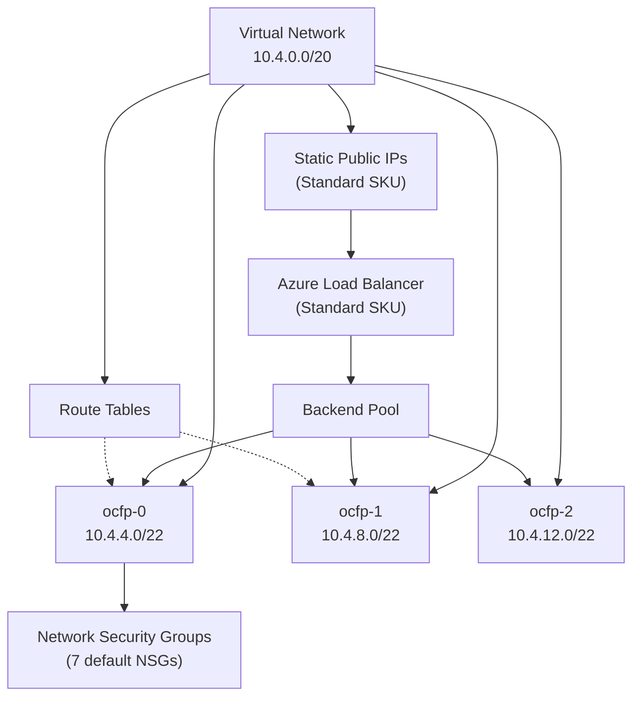

# Azure Networking

This guide covers Azure-specific networking in OCFP, including Virtual Networks, subnets, Network Security Groups, static public IPs, and Standard load balancers.

## Network Architecture



## Network Creation

OCFP creates an Azure Virtual Network (VNet) in the configured resource group.

During creation:

- VNet is created with the configured CIDR as an address prefix
- DHCP options are set with DNS servers if configured
- The VNet is created in the configured location (region)
- Tags include `managed-by=ocfp` and `bloc`

Source: `internal/cpi/azure/network.go`

## Subnets

Azure subnets are VNet subnets created within the Virtual Network.

### Default Behavior

When subnets are not configured, OCFP splits the parent CIDR into 4 parts, skips the first, and creates 3 subnets:

| Subnet | CIDR |
|--------|------|
| `<bloc>-ocfp-0` | `10.4.4.0/22` |
| `<bloc>-ocfp-1` | `10.4.8.0/22` |
| `<bloc>-ocfp-2` | `10.4.12.0/22` |

### Azure-Specific Behavior

- Subnets are created within the resource group
- NSGs can be associated with subnets at creation time or after
- Azure does not use availability zones for subnet placement in the same way as AWS
- Subnet delegation is not managed by OCFP

## Security Groups

Azure security groups are Network Security Groups (NSGs).

OCFP creates 7 default NSGs (see [Security Groups](../security-groups.md) for full details).

Azure-specific behaviors:

- NSGs are created in the configured resource group
- Rules use priority-based ordering (range 100-4096)
- Direction mapping: `ingress` maps to `Inbound`, `egress` maps to `Outbound`
- Protocol handling: TCP, UDP, ICMP, and wildcard (`*` for all)
- Port ranges are parsed and validated against Azure format requirements

Source: `internal/cpi/azure/security.go`

## Public IPs

Azure uses Standard SKU static public IPs.

- Allocated as `PublicIPAddress` resources with Standard SKU
- Regional tier allocation
- Tagged with `managed-by=ocfp`, `bloc`, `job`, `index`
- Can be associated with NICs or LB frontend configurations

See [Public IPs](../public-ips.md) for configuration and token reference.

## Routing

Azure uses route tables for custom routing.

### Implementation

- Route tables are created as `RouteTable` resources in the resource group
- Location-aware: route tables are created in the configured region
- Routes define next-hop types and addresses
- Subnets can be associated with route tables

### Current Status

Route table CPI operations are implemented. Automatic bootstrap integration is pending.

Source: `internal/cpi/azure/network.go`

## Load Balancers

Azure uses Standard SKU load balancers.

### Architecture

- **Frontend IP configuration**: public (for internet-facing) or private (for internal)
- **Backend address pools**: groups of backend instances
- **Health probes**: monitor backend availability
- **Load balancing rules**: map frontend to backend with port and protocol

### Operations

- `CreateLoadBalancer` — creates a Standard SKU LB
- Backend pool management via Azure SDK
- Health probe configuration
- Support for both public and internal LBs

See [Load Balancers](../load-balancers.md) for details.

## DNS

Azure DNS is configured through VNet DHCP options.

- `DhcpOptions.DNSServers` is set during VNet creation
- Defaults to Azure-provided DNS when no custom servers are specified

See [DNS](../dns.md) for details.

## Complete Configuration Example

```yaml
blocs:
  - name: production
    provider: azure
    region: westeurope

    network:
      network_cidr: 10.4.0.0/20
      dns_servers:
        - 8.8.8.8
        - 8.8.4.4

    allowed_ingress_ips:
      - 203.0.113.10/32

    jumpbox_public_ips: 2
    router_public_ips: 4
    cf_ssh_public_ips: 1
    tcp_router_public_ips: 2

    lbs:
      ops-https:
        protocol: tcp
        port: 443
        targets:
          - reserved:vault_ip
          - reserved:prometheus_ip
```

## Provider-Specific Notes

- **Resource groups**: All Azure networking resources are created within the configured resource group. Ensure the resource group exists before bootstrap.

- **Standard SKU**: OCFP uses Standard SKU for both public IPs and load balancers. Standard SKU requires explicit NSG association for inbound traffic.

- **Region placement**: Unlike AWS, Azure subnets are not tied to specific availability zones. Azure handles AZ distribution at the VM level.

- **NSG priority**: Rule priorities start at 100 and increment. Ensure custom rules do not conflict with OCFP-managed priorities.

## See Also

- [Networking Overview](../README.md) for the provider support matrix
- [Security Groups](../security-groups.md) for detailed rule definitions
- [Public IPs](../public-ips.md) for IP allocation and tokens
- [Subnets](../subnets.md) for CIDR splitting logic
