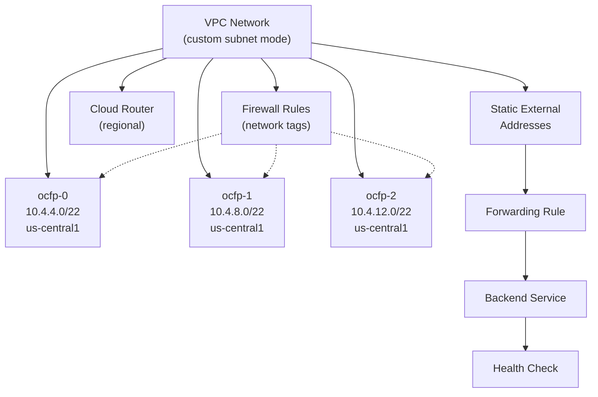
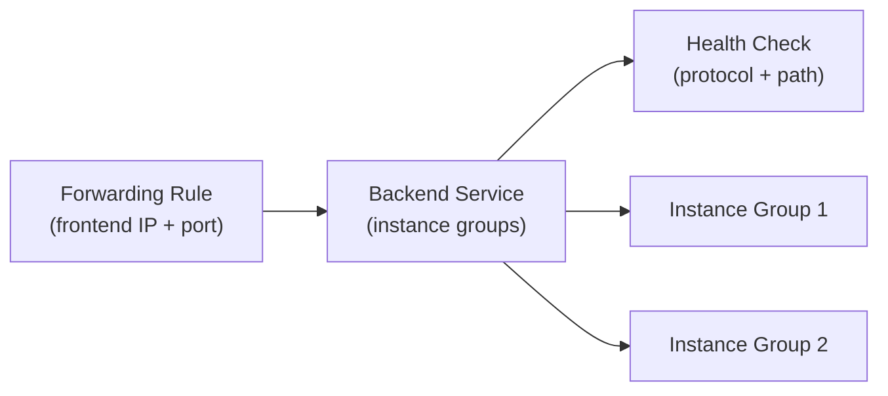

# GCP Networking

This guide covers GCP-specific networking in OCFP, including custom-mode VPCs, regional subnetworks, firewall rules, static external addresses, and forwarding-rule-based load balancing.

## Network Architecture



## Network Creation

OCFP creates a GCP VPC Network in custom subnet mode.

During creation:

- Network is created with `AutoCreateSubnetworks: false` (custom mode)
- Custom-mode VPCs require explicit subnet creation
- Network-level firewall rules control access
- Tags include `managed-by=ocfp` and `bloc`

GCP VPCs are global resources (not regional), but subnets and other resources are regional.

Source: `internal/cpi/gcp/network.go`

## Subnets

GCP subnets are regional subnetworks within the VPC.

### Default Behavior

When subnets are not configured, OCFP splits the parent CIDR into 4 parts, skips the first, and creates 3 subnetworks:

| Subnet | CIDR | Region |
|--------|------|--------|
| `<bloc>-ocfp-0` | `10.4.4.0/22` | configured region |
| `<bloc>-ocfp-1` | `10.4.8.0/22` | configured region |
| `<bloc>-ocfp-2` | `10.4.12.0/22` | configured region |

### GCP-Specific Behavior

- Subnetworks are region-scoped (not zone-scoped like AWS)
- Private Google Access can be configured per subnetwork
- All subnets within a VPC can communicate with each other by default (implicit routes)
- Subnets are created via the Compute API `subnetworks.insert`

Source: `internal/cpi/gcp/network.go`

## Security Groups

GCP implements security groups as VPC firewall rules with network tags.

OCFP creates 7 default firewall rules (see [Security Groups](../security-groups.md) for full details).

GCP-specific behaviors:

- Each security group maps to a VPC firewall rule
- Firewall rules use **network tags** as targets, not instance-level group attachment
- Ingress and egress are separate firewall rule directions
- Source ranges (CIDRs) control access
- Port ranges use GCP's `Allowed` format with protocol and ports
- Rules are identified by name and can be listed/filtered by network

### Tag-Based Model

Unlike AWS and Azure where security groups are attached to instances or subnets, GCP firewall rules apply to instances that carry matching network tags. OCFP assigns appropriate tags during instance creation.

Source: `internal/cpi/gcp/security.go`

## Public IPs

GCP uses static external addresses (regional).

- Allocated as regional static external IPs via the Compute API
- Labeled with `job` and `index` for identification
- Can be associated with instances or forwarding rules
- Managed through the `addresses` resource

See [Public IPs](../public-ips.md) for configuration and token reference.

## Routing

GCP uses Cloud Routers for advanced routing.

### Implementation

- Cloud Routers are regional resources
- GCP VPCs have implicit routing between all subnets within the same network
- External access is controlled by firewall rules, not route tables
- Cloud Router is primarily used for dynamic routing (BGP)

### Operations

- `CreateRouter` — creates a regional Cloud Router
- `GetRouter` — retrieves by name
- `ListRouters` — lists routers filtered by network
- `DeleteRouter` — removes the Cloud Router

Interface attachment operations are pending implementation.

Source: `internal/cpi/gcp/network.go`

## Load Balancers

GCP uses a chain of resources for load balancing.

### Architecture



- **Forwarding rules** define the frontend (IP address, port, protocol)
- **Backend services** manage instance groups and load distribution
- **Health checks** monitor backend availability
- All resources are regional in scope

### Operations

LB operations are delegated to the `LoadBalancerManager`. The `NetworkManager` contains stub methods that forward to the dedicated manager.

See [Load Balancers](../load-balancers.md) for details.

## DNS

GCP DNS is configured at the API level through network address family settings.

- Nameservers are set during network creation
- GCP uses Google Public DNS by default
- Custom DNS can be specified via bloc config

See [DNS](../dns.md) for details.

## Complete Configuration Example

```yaml
blocs:
  - name: production
    provider: gcp
    region: us-central1

    network:
      network_cidr: 10.4.0.0/20
      dns_servers:
        - 8.8.8.8
        - 8.8.4.4

    allowed_ingress_ips:
      - 203.0.113.10/32

    jumpbox_public_ips: 2
    router_public_ips: 4
    cf_ssh_public_ips: 1
    tcp_router_public_ips: 2

    lbs:
      ops-https:
        protocol: tcp
        port: 443
        targets:
          - reserved:vault_ip
          - reserved:prometheus_ip
```

## Provider-Specific Notes

- **Global VPC, regional subnets**: The VPC is a global resource, but subnets and most other resources are regional. All subnets within a VPC can communicate regardless of region.

- **Firewall rule model**: GCP's tag-based firewall model differs from AWS/Azure group-based models. Rules apply to all instances with matching tags across the VPC.

- **Implicit inter-subnet routing**: GCP VPCs automatically route between all subnets. No explicit route table entries are needed for internal communication.

- **Load balancer chain**: GCP's LB model is more granular than AWS/Azure. A single logical LB requires creating health checks, backend services, and forwarding rules as separate resources.

- **Shared VPC**: OCFP creates standalone VPCs. Shared VPC (XPN) configurations require manual setup.

## See Also

- [Networking Overview](../README.md) for the provider support matrix
- [Security Groups](../security-groups.md) for detailed rule definitions
- [Public IPs](../public-ips.md) for IP allocation and tokens
- [Subnets](../subnets.md) for CIDR splitting logic
