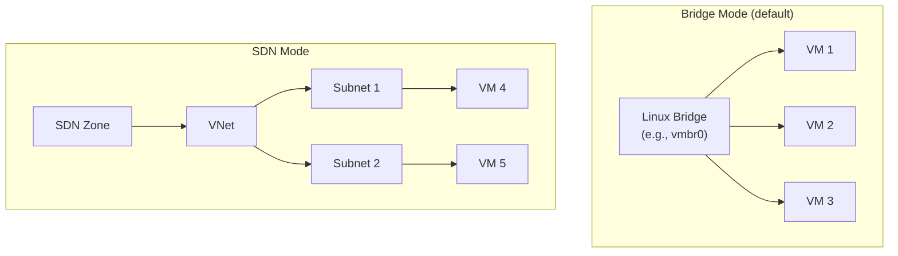

# Proxmox Networking

This guide covers Proxmox-specific networking in OCFP, including the dual-mode network architecture (bridge and SDN), PVE firewall, and feature limitations.

## Network Architecture

Proxmox supports two network modes, selected via configuration:



## Network Mode Selection

The network mode is configured via `network_mode` in the bloc config:

```yaml
provider: pve
network_mode: bridge  # or "sdn"
```

All network operations check `m.client.config.NetworkMode` to dispatch to the correct implementation.

Source: `internal/cpi/pve/network.go`

## Bridge Mode

Bridge mode uses standard Linux bridges managed through the Proxmox network API.

### Network Creation

- Bridges are created via `EnsureBridge` with autostart enabled
- Optional CIDR can be set on the bridge interface
- Bridge name defaults to `<bloc>-net` (or a custom name)
- Operations use `/nodes/{node}/network/{id}` API endpoints

### Subnets

Bridge mode does not support subnets. The network is flat — all instances share the bridge.

For compatibility, the bridge network is returned as a single "subnet" when subnet listing is requested.

### Operations

- `createBridgeNetwork` — ensures bridge exists with autostart
- `getBridgeNetwork` — checks bridge via node network API
- `listBridgeNetworks` — filters by `type=bridge`
- `deleteBridgeNetwork` — calls `DeleteBridge` with reload

## SDN Mode

SDN mode uses Proxmox Software Defined Networking with VNets and zones.

### Network Creation

- VNets are created within an SDN zone
- Zone must be configured via `sdn_zone` in config
- Optional alias for the VNet
- Operations use `/cluster/sdn/vnets/{id}` API endpoints
- Changes are applied cluster-wide after creation

### Subnets

PVE SDN simple zones expose **one L3 subnet per vnet**. The Proxmox API will reject a second subnet on the same vnet, and even if it accepted one, only the first registered gateway is honored at the host. OCFP works around this by treating the single SDN subnet as the parent and recording AZ-named child regions as **logical subnets** in state plus Vault. The Proxmox cluster sees one subnet; downstream Genesis kits see the four regions they expect.

The bootstrap carve splits the bloc's parent CIDR into one infra `/22` plus three AZ `/22`s. See [SDN Subnet Model](../sdn-subnet-model.md) for the generalized pattern.

For a parent vnet `10.64.64.0/18`, bootstrap emits:

| Logical subnet | CIDR | AZ | Role |
|----------------|------|----|----|
| `{bloc}-infra` | `10.64.64.0/22` | none | Shared infra: bastion, director, shield, blacksmith |
| `{bloc}-ocfp-0` | `10.64.68.0/22` | `pvea` | OCFP workload AZ 0 |
| `{bloc}-ocfp-1` | `10.64.72.0/22` | `pveb` | OCFP workload AZ 1 |
| `{bloc}-ocfp-2` | `10.64.76.0/22` | `pvec` | OCFP workload AZ 2 |

Reserved IPs inside the infra subnet:

- bastion
  offset 3 (e.g. `10.64.64.3`)

- director
  offset 4

- vault
  offset 5

- shield
  offset 9

- blacksmith
  offset 10

Carve constants and offsets live in `internal/bootstrap/network.go:43` (target prefix, count) and `internal/bootstrap/network.go:61` (reserved-IP slots). The PVE-specific carve runs from `createPVEVirtualSubnets` at `internal/bootstrap/network.go:658`.

#### Mask vs. CIDR (on-link gateway invariant)

The bastion's IP is allocated out of the **infra `/22`**, but its cloud-init `ipconfig0` carries the **parent vnet `/18` mask**. Without this, the host would compute the SDN gateway as off-link and silently drop egress. The `StaticPrivateIPPrefix` field on `cpi.InstanceRequest` (`internal/cpi/types.go:443`) lets bootstrap pass the parent prefix length explicitly when the logical subnet is narrower than the underlying L3 subnet.

The same constraint applies to any VM placed in one of the logical AZ `/22`s: the host needs the parent mask to reach the SDN gateway. Genesis kits that consume the per-subnet metadata are expected to honor it.

#### CreateSubnet short-circuit

If a caller ever invokes `CreateSubnet` against the PVE provider with a CIDR fully contained inside an existing parent SDN subnet, the provider returns the parent without calling the SDN API. See `internal/cpi/pve/network.go:88`. Bootstrap routes PVE subnets through the virtual-subnet path (state + Vault only) and so does not hit this branch under normal operation; it remains the cold-start fallback when the parent SDN subnet does not yet exist.

#### State and Vault outputs

The carve emits per-subnet entries that downstream Genesis kits read. For each `{env}` in `{mgmt, ocf}` and each logical subnet `{name}`:

- `secret/config/{bloc}/{env}/net/subnets/{name}`
  Keys: `cidr`, `az`, `gateway`

- `secret/config/{bloc}/{env}/net/subnets/{name}/reserved-ips/{role}`
  One entry per reserved role (`bastion`, `director`, `vault`, `shield`, `blacksmith`) on the infra subnet.

Vault path helpers are defined in `internal/vault/paths.go:93` and `internal/vault/paths.go:101`.

### Configuration

```yaml
provider: pve
network_mode: sdn
sdn_zone: myzone
```

### Operations

- `createSDNNetwork` — creates VNet in the configured zone
- `getSDNNetwork` — fetches VNet details
- `listSDNNetworks` — lists VNets with name filtering
- `deleteSDNNetwork` — removes VNet and applies SDN changes

## Security Groups

Proxmox security groups use the PVE firewall.

- Security group operations are delegated to `m.client.security`
- Available in both bridge and SDN modes
- The PVE firewall manages rules at the datacenter, node, and VM levels

See [Security Groups](../security-groups.md) for the 7 default groups.

## Unsupported Features

The following networking features are not supported for Proxmox:

| Feature | Status | Error |
|---------|--------|-------|
| Public IPs | Not supported | `ErrFloatingIPsNotSupported` |
| Floating IPs | Not supported | `ErrFloatingIPsNotSupported` |
| Routers | Not supported | `ErrRoutersNotSupported` |
| Load Balancers | Not supported | `ErrLoadBalancersNotSupported` |

These operations return typed errors when called.

## Complete Configuration Example

### Bridge Mode

```yaml
blocs:
  - name: homelab
    provider: pve
    region: local

    network_mode: bridge
    network:
      name: vmbr1
      network_cidr: 10.4.0.0/20

    allowed_ingress_ips:
      - 192.168.1.0/24
```

### SDN Mode

```yaml
blocs:
  - name: homelab
    provider: pve
    region: local

    network_mode: sdn
    sdn_zone: myzone
    network:
      network_cidr: 10.4.0.0/20

    allowed_ingress_ips:
      - 192.168.1.0/24
```

## Provider-Specific Notes

- **Bridge vs SDN**: Bridge mode is simpler and works out of the box. SDN mode requires Proxmox SDN to be configured at the datacenter level first.

- **No public IPs**: Proxmox does not have a native public IP concept. External access must be managed through the host network or external routers.

- **No load balancers**: Load balancing is not managed by OCFP for Proxmox. Use external LB solutions (HAProxy, etc.) if needed.

- **No routing management**: Bridge mode relies on host-level Linux routing. SDN mode uses zone-level routing configured in Proxmox.

- **Flat networking in bridge mode**: All instances on the same bridge share a single broadcast domain. Network segmentation requires multiple bridges or SDN mode.

- **SDN zone prerequisite**: SDN mode requires `sdn_zone` to be configured. The zone must already exist in Proxmox before OCFP can create VNets.

## Bastion Tailscale and DNS

PVE blocs do not expose public IPs, so OCFP joins the bastion to a Tailscale tailnet at first boot and points wildcard DNS at the bastion's `100.x` address. Both pieces are operator-driven and run outside the BOSH lifecycle.

- Tailscale install
  The bastion cloud-init optionally installs Tailscale and runs `tailscale up` if a non-empty `TailscaleAuthKey` is provided on the instance request. Full workflow: [Bastion Tailscale](../../init/bastion-tailscale.md).

- DNS sync
  `scripts/cloudflare-dns-sync.sh` upserts `<base>` and `*.<base>` A records per bloc pointing at the bastion's tailnet IP. Generalized writeup: [Cloudflare DNS Sync](../dns-cloudflare-sync.md).

- Multi-bloc init
  `scripts/init-all-pve-blocs.sh` iterates every `ocfp-pve-*` bloc found in `~/.ocfp/config.pve.yml` and runs `ocfp init pve --bloc <name>` against each. Override the config path with `OCFP_CONFIG`.

## See Also

- [Networking Overview](../README.md) for the provider support matrix
- [Security Groups](../security-groups.md) for PVE firewall rule definitions
- [Subnets](../subnets.md) for subnet behavior across providers
- [SDN Subnet Model](../sdn-subnet-model.md) for the generalized single-L3-subnet pattern
- [Bastion Tailscale](../../init/bastion-tailscale.md) for the bastion tailnet workflow
- [Cloudflare DNS Sync](../dns-cloudflare-sync.md) for wildcard DNS sync per bloc
