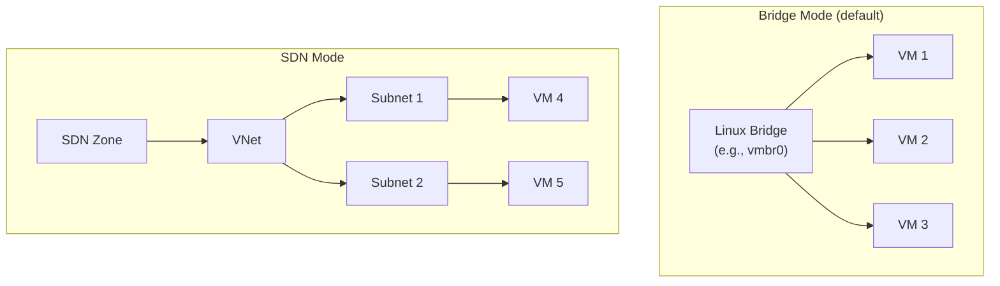

# Proxmox Networking

This guide covers Proxmox-specific networking in OCFP, including the dual-mode network architecture (bridge and SDN), PVE firewall, and feature limitations.

## Network Architecture

Proxmox supports two network modes, selected via configuration:



## Network Mode Selection

The network mode is configured via `network_mode` in the bloc config:

```yaml
provider: pve
network_mode: bridge  # or "sdn"
```

All network operations check `m.client.config.NetworkMode` to dispatch to the correct implementation.

Source: `internal/cpi/pve/network.go`

## Bridge Mode

Bridge mode uses standard Linux bridges managed through the Proxmox network API.

### Network Creation

- Bridges are created via `EnsureBridge` with autostart enabled
- Optional CIDR can be set on the bridge interface
- Bridge name defaults to `<bloc>-net` (or a custom name)
- Operations use `/nodes/{node}/network/{id}` API endpoints

### Subnets

Bridge mode does not support subnets. The network is flat — all instances share the bridge.

For compatibility, the bridge network is returned as a single "subnet" when subnet listing is requested.

### Operations

- `createBridgeNetwork` — ensures bridge exists with autostart
- `getBridgeNetwork` — checks bridge via node network API
- `listBridgeNetworks` — filters by `type=bridge`
- `deleteBridgeNetwork` — calls `DeleteBridge` with reload

## SDN Mode

SDN mode uses Proxmox Software Defined Networking with VNets and zones.

### Network Creation

- VNets are created within an SDN zone
- Zone must be configured via `sdn_zone` in config
- Optional alias for the VNet
- Operations use `/cluster/sdn/vnets/{id}` API endpoints
- Changes are applied cluster-wide after creation

### Subnets

SDN mode supports subnets via the SDN API:

- Subnets are created under `/cluster/sdn/vnets/{vnet}/subnets`
- Full CRUD operations: create, get, list, delete
- Subnet CIDR and gateway configuration

### Configuration

```yaml
provider: pve
network_mode: sdn
sdn_zone: myzone
```

### Operations

- `createSDNNetwork` — creates VNet in the configured zone
- `getSDNNetwork` — fetches VNet details
- `listSDNNetworks` — lists VNets with name filtering
- `deleteSDNNetwork` — removes VNet and applies SDN changes

## Security Groups

Proxmox security groups use the PVE firewall.

- Security group operations are delegated to `m.client.security`
- Available in both bridge and SDN modes
- The PVE firewall manages rules at the datacenter, node, and VM levels

See [Security Groups](../security-groups.md) for the 7 default groups.

## Unsupported Features

The following networking features are not supported for Proxmox:

| Feature | Status | Error |
|---------|--------|-------|
| Public IPs | Not supported | `ErrFloatingIPsNotSupported` |
| Floating IPs | Not supported | `ErrFloatingIPsNotSupported` |
| Routers | Not supported | `ErrRoutersNotSupported` |
| Load Balancers | Not supported | `ErrLoadBalancersNotSupported` |

These operations return typed errors when called.

## Complete Configuration Example

### Bridge Mode

```yaml
blocs:
  - name: homelab
    provider: pve
    region: local

    network_mode: bridge
    network:
      name: vmbr1
      network_cidr: 10.4.0.0/20

    allowed_ingress_ips:
      - 192.168.1.0/24
```

### SDN Mode

```yaml
blocs:
  - name: homelab
    provider: pve
    region: local

    network_mode: sdn
    sdn_zone: myzone
    network:
      network_cidr: 10.4.0.0/20

    allowed_ingress_ips:
      - 192.168.1.0/24
```

## Provider-Specific Notes

- **Bridge vs SDN**: Bridge mode is simpler and works out of the box. SDN mode requires Proxmox SDN to be configured at the datacenter level first.

- **No public IPs**: Proxmox does not have a native public IP concept. External access must be managed through the host network or external routers.

- **No load balancers**: Load balancing is not managed by OCFP for Proxmox. Use external LB solutions (HAProxy, etc.) if needed.

- **No routing management**: Bridge mode relies on host-level Linux routing. SDN mode uses zone-level routing configured in Proxmox.

- **Flat networking in bridge mode**: All instances on the same bridge share a single broadcast domain. Network segmentation requires multiple bridges or SDN mode.

- **SDN zone prerequisite**: SDN mode requires `sdn_zone` to be configured. The zone must already exist in Proxmox before OCFP can create VNets.

## See Also

- [Networking Overview](../README.md) for the provider support matrix
- [Security Groups](../security-groups.md) for PVE firewall rule definitions
- [Subnets](../subnets.md) for subnet behavior across providers
