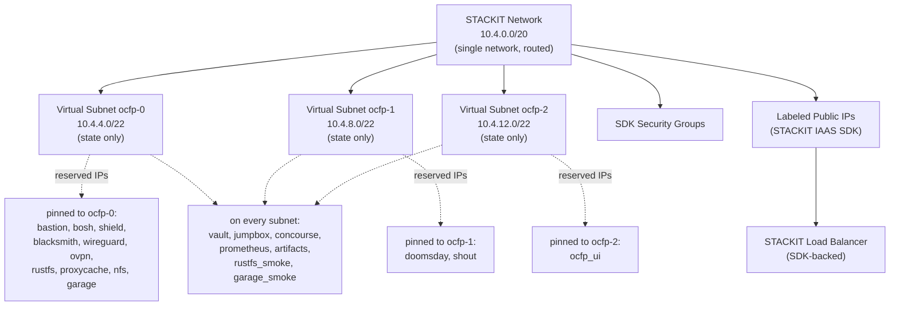

# STACKIT Networking

This guide covers STACKIT-specific networking in OCFP, including single-network architecture, virtual subnets, labeled public IPs, and SDK-backed load balancers.

## Network Architecture



## Network Creation

STACKIT creates a single network resource via the SDK.

During creation:

- Network is created with `routed=true`
- IPv4 nameservers are configured if DNS servers are specified
- Labels are sanitized to match STACKIT's regex: `^(-|_|[a-z0-9]){0,63}$`
- Network name defaults to `<bloc>-net`

STACKIT does not support traditional subnets. The CPI returns `ErrSubnetsNotSupported` for subnet operations.

Source: `internal/cpi/stackit/network.go`

## Virtual Subnets

Since STACKIT only supports a single network, OCFP uses virtual subnets — logical divisions recorded in state and Vault only. No provider subnet resources are created.

### Strategies

- **`ocfp-triple`** (default)
  Splits the bloc CIDR into 4 equal parts, skips the first, uses the remaining 3.

- **`single`**
  A single virtual subnet equal to the entire bloc CIDR.

### Configuration

```yaml
provider: stackit
network:
  network_cidr: 10.4.0.0/20
subnet_strategy: ocfp-triple
```

### Reserved IP Assignments

STACKIT no longer carries a provider-specific offset table. Both the bootstrap layer and the vault layer resolve every offset from the shared strategy engine, exactly as PVE and AWS do, so a STACKIT bloc's reserved addresses are its selected strategy's addresses:

| Subnet strategy | Default reserved-IP strategy | Workload subnets |
|-----------------|------------------------------|------------------|
| `ocfp-triple` | `spanning` | 3 |
| `single` | `wide` | 1 |

Set `network.strategy` explicitly to override either default. `spanning` requires at least three workload subnets and rejects the `single` layout with `netlayout.ErrTooFewSubnets`; both `wide` and `spanning` require a workload subnet of at least `/25`.

#### Triple Subnets (`spanning`)

A role pinned to one subnet index has no key at all in the other subnets' records — the key is absent, not reserved-but-blank. The mgmt tier:

| Slot | Key | Service | Written on |
|------|-----|---------|------------|
| .3 | `bastion_ip` | Bastion | ocfp-0 |
| .4 | `bosh_ip` | BOSH Director | ocfp-0 |
| .5 | `vault_ip` | Vault | every subnet |
| .6 | `jumpbox_ip` | Jumpbox | every subnet |
| .7 | `concourse_ip` | Concourse | every subnet |
| .8 | `prometheus_ip` | Prometheus | every subnet |
| .9 | `shield_ip` | SHIELD | ocfp-0 |
| .10 | `blacksmith_ip` | Blacksmith | ocfp-0 |
| .11 | `artifacts_ip` | Artifacts | every subnet |
| .12 | `wireguard_ip` | WireGuard | ocfp-0 |
| .13 | `ovpn_ip` | OpenVPN | ocfp-0 |
| .14 | `rustfs_ip` | RustFS blobstore | ocfp-0 |
| .15 | `proxycache_ip` | Proxy cache | ocfp-0 |
| .16 | `nfs_ip` | NFS | ocfp-0 |
| .17 | `ocfp_ui_ip` | OCFP UI | ocfp-2 |
| .18 | `doomsday_ip` | Doomsday | ocfp-1 |
| .19 | `shout_ip` | Shout | ocfp-1 |
| .20 | `garage_ip` | Garage blobstore | ocfp-0 |
| .21 | `rustfs_ip_smoke` | RustFS smoke errand | every subnet |
| .22 | `garage_ip_smoke` | Garage smoke errand | every subnet |

The ocf tier (vault `reserved-ips` records only — the bootstrap layer writes no ocf-tier state outputs):

| Slot | Key | Service | Written on |
|------|-----|---------|------------|
| .64 | `bosh_ip` | CF BOSH Director | ocfp-0 |
| .65 | `vault_ip` | CF Vault | every subnet |
| .66 | `jumpbox_ip` | CF Jumpbox | every subnet |
| .67 | `blacksmith_ip` | CF Blacksmith | ocfp-1 |
| .97 | `haproxy_ip` | CF HAProxy | ocfp-0 |

#### Single Subnet (`wide`)

`wide` is colocated, so the one virtual subnet carries every mgmt static at the offsets above (all twenty, including the roles `spanning` pins elsewhere) and every ocf static, with no per-index distinction. Its state outputs are named `reserved_<bloc>-subnet_<key>` rather than `reserved_<bloc>-ocfp-<n>_<key>`.

#### IP Ranges

Identical under both strategies:

| Tier | Available band | Reserved complement |
|------|----------------|---------------------|
| mgmt | 32-63 | 0-31, and 64 to the end of the subnet |
| ocf | 96 to the end of the subnet | 0-95 |

These IPs enable LB tokens: `reserved:<key>[:index]` (e.g., `reserved:vault_ip`, `reserved:doomsday_ip:1`). Under `spanning`, a token for a pinned role must name that role's index — `reserved:doomsday_ip` alone resolves against `ocfp-0`, where the key does not exist, and fails.

See [Subnets](../subnets.md) for full details, and [Reserved-IP Strategies](../reserved-ip-strategies.md) for the per-index tables, band overrides, and the scheme-drift guard.

## Security Groups

STACKIT security groups are managed through the SDK security API.

- Groups are delegated to `m.client.security`
- Standard CRUD operations
- Rule management follows the CPI abstraction

See [Security Groups](../security-groups.md) for the 7 default groups.

## Public IPs

STACKIT has the most mature public IP implementation in OCFP.

### IP Types and Defaults

| Job | Config Parameter | Default |
|-----|-----------------|---------|
| Router | `router_public_ips` | 4 |
| CF SSH | `cf_ssh_public_ips` | 1 |
| Jumpbox | `jumpbox_public_ips` | 2 |
| TCP Router | `tcp_router_public_ips` | 2 |
| Ops | Not configurable | 1 |

### Labels

Every public IP is labeled with:

- `managed-by=ocfp`
- `bloc=<bloc-name>`
- `env=mgmt`
- `job=<job-type>`
- `index=<0-based-index>`

Labels are sanitized to match STACKIT's regex requirements.

### Ensure Helpers

Specialized functions for each job type:

- `EnsureJumpboxPublicIPs`
- `EnsureOpsPublicIPs`
- `EnsureRouterPublicIPs`
- `EnsureCFSSHPublicIPs`
- `EnsureTCPRouterPublicIPs`

### Viewing IPs

```bash
stackit public-ip list
```

### Preservation

`ocfp teardown` preserves public IPs by default. Use `--public-ips` to include them:

```bash
ocfp teardown --bloc production --region eu01 --public-ips --force
```

See [Public IPs](../public-ips.md) for full details.

## Routing

STACKIT networks are created with a "routed" flag by default. Router operations are mock/pending implementations that return placeholders. No explicit routing configuration is needed.

## Load Balancers

STACKIT uses a fully SDK-backed load balancer implementation.

### Operations

All LB operations delegate to `m.client.loadBalancer`:

- `CreateLoadBalancer` — creates via STACKIT LB SDK
- `GetLoadBalancer`, `ListLoadBalancers` — query operations
- `UpdateLoadBalancer` — modify LB configuration
- `DeleteLoadBalancer` — remove LB
- `GetBackendPools`, `AddBackendMember`, `RemoveBackendMember` — backend management
- `ConfigureHealthCheck`, `GetLoadBalancerHealth` — health monitoring

### Default LBs

| Name | Protocol | Port | Backends |
|------|----------|------|----------|
| `<bloc>-ops-https` | TCP | 443 | Reserved IPs |
| `<bloc>-router-80` | HTTP | 80 | Public IPs (job=router) |
| `<bloc>-router-443` | HTTPS | 443 | Public IPs (job=router) |
| `<bloc>-tcp-router` | TCP | configurable | Public IPs (job=tcp-router) |
| `<bloc>-cf-ssh` | TCP | 2222 | Public IPs (job=cf-ssh) |

See [Load Balancers](../load-balancers.md) for details.

## DNS

DNS nameservers are set via `CreateNetworkIPv4Body.Nameservers` during network creation.

```yaml
network:
  network_cidr: 10.4.0.0/20
  dns_servers:
    - 8.8.8.8
    - 8.8.4.4
```

See [DNS](../dns.md) for details.

## Network Interface Management

STACKIT network interfaces have special handling:

- `ListNetworkInterfaces` filters out provider-managed types (metadata, gateway NICs)
- `DeleteNetworkInterface` skips provider-managed NICs
- Label-based filtering supports matching by job, bloc, and other criteria

## Complete Configuration Example

```yaml
blocs:
  - name: production
    provider: stackit
    region: eu01

    network:
      network_cidr: 10.4.0.0/20
      dns_servers:
        - 8.8.8.8

    subnet_strategy: ocfp-triple

    allowed_ingress_ips:
      - 203.0.113.10/32

    jumpbox_public_ips: 2
    router_public_ips: 4
    cf_ssh_public_ips: 1
    tcp_router_public_ips: 2

    lbs:
      ops-https:
        protocol: tcp
        port: 443
        targets:
          - reserved:vault_ip
          - reserved:prometheus_ip
          - reserved:shield_ip
          - reserved:doomsday_ip:1

      router-80:
        protocol: http
        port: 80
        targets:
          - public-ip:router:0
          - public-ip:router:1
          - public-ip:router:2
          - public-ip:router:3

      router-443:
        protocol: https
        port: 443
        targets:
          - public-ip:router:0
          - public-ip:router:1
          - public-ip:router:2
          - public-ip:router:3

      cf-ssh:
        protocol: tcp
        port: 2222
        targets:
          - public-ip:cf-ssh:0
```

## Provider-Specific Notes

- **No real subnets**: STACKIT's single-network model means all instances share one network. Virtual subnets are a state-level abstraction only.

- **Label sanitization**: All labels must match `^(-|_|[a-z0-9]){0,63}$`. OCFP sanitizes labels automatically.

- **NIC filtering**: The NIC listing filters out provider-managed interfaces (metadata, gateway) to prevent accidental deletion.

- **Routed networks**: Networks are created with the routed flag. No explicit router configuration is needed or supported.

- **Public IP preservation**: Public IPs are preserved during teardown by default to avoid DNS disruption. Use `--public-ips` explicitly to delete them.

## See Also

- [Networking Overview](../README.md) for the provider support matrix
- [Subnets](../subnets.md) for virtual subnet details and reserved IPs
- [Public IPs](../public-ips.md) for IP allocation and tokens
- [LB Commands](../../cmds/lb.md) for CLI operations
