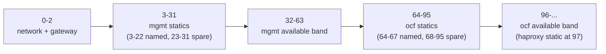
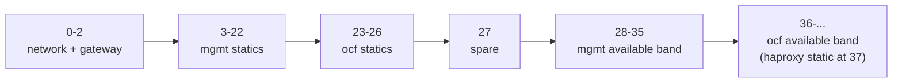

# Reserved-IP Strategies

This document describes how OCFP assigns reserved IP addresses inside each bloc's workload subnets, and how to pick and configure a strategy. It is the reference for redrawing the OCFP networking diagram: every offset below is verified against the shipped source, not derived from a plan or a memory of the old scheme.

## What changed

Before this change, the bootstrap layer (subnet carving, infra-role slots, state outputs) and the vault layer (per-workload-subnet mgmt/ocf reserved-IP tables) derived their reserved-IP bands independently, and could disagree. The historical PVE `ocfp` role widened its available band from a `total/2 - 3` computation tied to each subnet's own size, while vault's mgmt tier kept a fixed window; the two could land on different numbers for the same subnet. That mismatch is what caused the historical PVE band-widening bug.

Both layers now resolve every offset from one shared table (`internal/netlayout`), selected by a strategy name, so the two layers cannot disagree again. Two strategies ship today: `wide` (the default, and the strategy every currently provisioned bloc already runs) and `compact` (for narrower subnets). Provisioned blocs see no change to the addresses their VMs actually hold, but their bootstrap-state `available_a`/`available_b`/`reserved_c` outputs change value at the next bootstrap apply — see "Layer A (bootstrap) slots" below for exactly which values and which blocs.

## 1. Overview

OCFP carves each workload subnet into two independent tiers that share one physical subnet: `mgmt` (bastion, vault, concourse, monitoring, and shared services) and `ocf` (the Cloud Foundry director's own BOSH/vault/jumpbox/blacksmith/haproxy). Each tier's Genesis director runs its own cloud-config IPAM allocator against that shared subnet, so the two tiers must own disjoint address ranges or the two directors will eventually claim the same physical IP.

Two layers of the CLI place addresses on that subnet:

Layer A is the bootstrap layer: it carves the parent CIDR into subnets, assigns the infra-role's named slots (bastion, director, shield, blacksmith, and so on) for the fixed infra subnet, and assigns the `ocfp` role's slots for each AZ workload subnet, writing the results as bootstrap state outputs.

Layer B is the vault layer: it populates each workload subnet's `reserved-ips` secret with the full per-role assignment table (both `mgmt` and `ocf` tier entries) that Genesis' cloud-config reads.

Both layers now resolve every offset from the same `internal/netlayout` registry, so they cannot disagree about where a role or a band sits.

## 2. Strategy selection

A bloc's config selects a strategy with the `strategy` key nested under `network:` (camelCase), or the snake_case alias `network_strategy`. Both are accepted; an empty value resolves to the default strategy, `wide`. An unrecognized strategy name fails at config load, and the error lists every known strategy name so the operator does not have to guess.

The selected strategy applies to both layers: Layer A's `ocfp`-role band and Layer B's per-tier assignment table both come from the same resolved strategy.

## 3. The `wide` strategy

`wide` is the default strategy (scheme identity `"2"`), the strategy every currently provisioned PVE bloc already runs, and the strategy carried over unchanged from the pre-`netlayout` implementation. It requires a workload subnet of at least `/25`; its highest fixed offset is `97` (the `ocf` tier's haproxy static).

**mgmt tier named statics:**

| Role | Offset |
| --- | --- |
| bastion | 3 |
| bosh | 4 |
| vault | 5 |
| jumpbox | 6 |
| concourse | 7 |
| prometheus | 8 |
| shield | 9 |
| blacksmith | 10 |
| artifacts | 11 |
| wireguard | 12 |
| ovpn | 13 |
| rustfs | 14 |
| proxycache | 15 |
| nfs | 16 |
| ocfp_ui | 17 |
| doomsday | 18 |
| shout | 19 |
| garage | 20 |
| rustfs_smoke | 21 |
| garage_smoke | 22 |

Offsets 3–22 are fully used; 23–31 are spare for future growth within the mgmt static zone.

**ocf tier named statics:**

| Role | Offset |
| --- | --- |
| bosh | 64 |
| vault | 65 |
| jumpbox | 66 |
| blacksmith | 67 |
| haproxy | 97 |

**Available bands:**

| Tier | Band |
| --- | --- |
| mgmt | 32–63 |
| ocf | 96 and every offset above it, up to the subnet's last usable address |

**Reserved complements** (the range each tier's director is told to treat as off-limits, so its cloud-config allocator never claims an address the other tier owns):

| Tier | Reserved complement |
| --- | --- |
| mgmt | 0–31, 64 and above |
| ocf | 0–95 |

mgmt's complement wraps around its own available band on both sides — it excludes offsets 0–31 below the band and everything at 64 and above — so the mgmt director never claims an address inside ocf's 64–95 statics or ocf's 96+ available territory. ocf's complement is simpler: everything below its own band (0–95) is off-limits, which happens to be the entirety of mgmt's territory.

**Why haproxy sits at offset 97, not a named slot below 32:** the Cloud Foundry kit's cloud-config hook does not read a `haproxy_ip` key directly. It claims a window from the `ocf` tier's own available band and marks the first three claimed addresses as the subnet's static range; only the environment manifest reads `haproxy_ip` (as `static_ips`). The seed address therefore has to land inside that claim-derived static window, or BOSH rejects it as belonging to no subnet. That forces haproxy's offset to sit one past the `ocf` band's start — band start 96, haproxy 97. The pre-`netlayout` layout encoded the same coupling at a smaller scale (band start 12, haproxy 13).

**Why RustFS and Garage get separate offsets despite being alternatives:** RustFS and Garage are alternative blobstore kit implementations — only one is ever deployed per bloc — but the reserved-IP engine deduplicates by computed address value, so two roles cannot share one offset (the second one processed would be silently dropped). RustFS and Garage therefore get distinct offsets (14 and 20) even though at most one is ever live at a time. The same reasoning applies to their smoke-test errands: `rustfs_smoke` (21) and `garage_smoke` (22) each read their own dedicated key (`rustfs_ip_smoke`, `garage_ip_smoke`), distinct from the role's own IP key.

**Worked example.** Take a `/22` workload subnet with base address `10.64.64.0` (its last usable host address is `10.64.67.254`). Every offset above maps to an address by adding it to the base:

| Item | Offset | Address |
| --- | --- | --- |
| gateway | 1 | 10.64.64.1 |
| bastion | 3 | 10.64.64.3 |
| mgmt vault | 5 | 10.64.64.5 |
| mgmt available band | 32–63 | 10.64.64.32 – 10.64.64.63 |
| ocf bosh | 64 | 10.64.64.64 |
| ocf available band start | 96 | 10.64.64.96 |
| ocf haproxy | 97 | 10.64.64.97 |
| last usable address | — | 10.64.67.254 |

## 4. The `compact` strategy

`compact` (scheme identity `"3-compact"`) is a `/26`-capable layout derived from `wide` by compressing the `ocf` tier's statics and both tiers' available bands. It requires a workload subnet of at least `/26`; its highest fixed offset is `37` (the `ocf` tier's haproxy static).

The mgmt tier's statics are numerically identical to `wide`'s (offsets 3–22, same role table above) — compact only compresses the `ocf` tier and the available bands.

**ocf tier named statics:**

| Role | Offset |
| --- | --- |
| bosh | 23 |
| vault | 24 |
| jumpbox | 25 |
| blacksmith | 26 |
| haproxy | 37 |

Offset 27 is spare (a gap between the `ocf` statics and the mgmt available band).

**Available bands:**

| Tier | Band |
| --- | --- |
| mgmt | 28–35 |
| ocf | 36 and every offset above it, up to the subnet's last usable address |

**Reserved complements:**

| Tier | Reserved complement |
| --- | --- |
| mgmt | 0–27, 36 and above |
| ocf | 0–35 |

The same haproxy-offset coupling described for `wide` applies here: haproxy sits one past the `ocf` band's start (band start 36, haproxy 37), because the Cloud Foundry kit's cloud-config hook claims its static range from inside the available band itself.

**Worked example.** Take a `/26` workload subnet with base address `10.20.30.0` (its last usable host address is `10.20.30.62`):

| Item | Offset | Address |
| --- | --- | --- |
| gateway | 1 | 10.20.30.1 |
| bastion | 3 | 10.20.30.3 |
| ocf bosh | 23 | 10.20.30.23 |
| mgmt available band | 28–35 | 10.20.30.28 – 10.20.30.35 |
| ocf available band start | 36 | 10.20.30.36 |
| ocf haproxy | 37 | 10.20.30.37 |
| last usable address | — | 10.20.30.62 |

## 5. Layer A (bootstrap) slots

Layer A applies to two roles, both carved from the fixed infra subnet or a workload subnet at bootstrap time, independent of which strategy the bloc selected for band width:

**The `infra` role** (the fixed infra subnet — bastion, director, and shared infra services) has nine named statics at offsets 3–11, an available band of 12–29, and a reserved-continuation offset of 30:

| Role | Offset |
| --- | --- |
| bastion | 3 |
| bosh | 4 |
| vault | 5 |
| jumpbox | 6 |
| concourse | 7 |
| prometheus | 8 |
| shield | 9 |
| blacksmith | 10 |
| artifacts | 11 |

These same nine offsets are identical to `wide`'s mgmt-tier statics — both trace back to the same historical PVE layout — but they are declared as separate constants in the source specifically so a future retune of `wide`'s or `compact`'s mgmt-tier offsets never silently drags the infra role's numbers along with it.

The infra role's slot set also carries four additional named fields that reuse offsets 3, 9, and 10 for a different purpose: `BlacksmithOCFP` (3), `Doomsday` (9), `Shout` (10), and `OCFPUI` (9). These are not a collision in practice — they are written only when populating the legacy `ocfp` workload subnets (`ocfp-0`, `ocfp-1`, `ocfp-2`), and each one lands on a physically different subnet: `ocfp-0` writes bastion/bosh/shield/blacksmith at idx 0, `ocfp-1` writes doomsday/shout/blacksmith(ocfp) at idx 1, and `ocfp-2` writes `ocfp_ui` at idx 2. If you are redrawing a diagram that shows all three `ocfp-N` subnets side by side, offsets 3/9/10 will appear to repeat across them with different labels — that is expected, not an error.

**The `ocfp` role** (each AZ workload subnet) reuses the infra role's named statics unchanged, but its available band and reserved-continuation offset are the *selected strategy's own mgmt-tier band* — not a separately computed value:

| Strategy | Available band | Reserved-continuation offset |
| --- | --- | --- |
| wide | 32–63 | 64 |
| compact | 28–35 | 36 |

This is identical across every provider subnet-carving strategy — PVE, the STACKIT triple-subnet layout, and the STACKIT single-subnet layout all resolve the `ocfp` role's band through the same code path, so none of them can drift from the others or from Layer B's own mgmt band.

**Migration note.** The `ocfp`-role bootstrap state outputs — `reserved_<bloc>-ocfp-N_available_a`, `reserved_<bloc>-ocfp-N_available_b`, and `reserved_<bloc>-ocfp-N_reserved_c` — change value on every existing PVE bloc at its next bootstrap apply. Historically, PVE widened these three outputs to offsets 12, 509, and 510 on a `/22` subnet (derived from that subnet's own size); STACKIT used the fixed infra-role band, 12, 29, and 30, unchanged. Both providers now emit the selected strategy's own band instead: 32/63/64 under `wide`, or 28/35/36 under `compact`. No STACKIT bloc is deployed today, so the STACKIT-side change is latent — there is nothing to migrate until one exists. For PVE, `bastion_ip` and `bosh_ip` (offsets 3 and 4) are unaffected, because the `ocfp` role's override only replaces the available band and reserved-continuation offset, never the named statics. The vault-layer reserved-IP keys are likewise unaffected under `wide` — its Layer B table is unchanged from the pre-`netlayout` implementation — so provisioned blocs see zero drift on the addresses their VMs actually hold. Only the three bootstrap-state outputs above move.

## 6. Subnet-size validation

Each strategy rejects a workload subnet narrower than its minimum prefix at populate time, before deriving any address: `wide` requires at least `/25`, `compact` requires at least `/26`. The error names the strategy, the offending CIDR, its actual prefix, the required minimum prefix, and the strategy's highest fixed offset, so the message alone explains the rejection without cross-referencing source. This replaced the previous behavior of silently emitting an address outside the subnet's own range when the subnet was too small.

For example, configuring `wide` on a `10.20.30.0/26` subnet — the same subnet compact's worked example above uses — fails with an error equivalent to: `subnet too small for strategy: strategy "wide" cidr "10.20.30.0/26" is /26, requires minimum /25 (highest fixed offset 97)`. The subnet is not too small in absolute terms; it is too small for `wide` specifically, because `wide`'s highest offset (97) does not fit inside a 64-address block. The same subnet is valid for `compact`, whose highest offset (37) fits comfortably.

## 7. Band overrides

Two config keys override a strategy's computed available band, each scoped to a different layer:

`network.bands.infra` overrides Layer A's available band and reserved-continuation offset, uniformly for both the `infra` role and the `ocfp` role — it replaces whatever the strategy computed, it does not add to it. It is validated before being applied: both `start` and `end` must be set together (or neither); `start` may not fall below offset 12 (the floor below which the infra role's fixed named slots live); `end` must fall strictly after `start`; and `end` may not exceed the subnet's last usable host address. A validation failure is returned as an error naming the specific rule that failed.

`network.bands.mgmt` overrides Layer B's mgmt-tier available band, for PVE only, and only for the `wide` strategy — an explicit `mgmt` override configured for any other strategy hard-errors, because the override's bounds (32–63) are `wide`-specific and would silently mis-validate a differently shaped strategy's mgmt zone (`compact`'s is 28–35). Both `start` and `end` must be set together; the pair must satisfy `32 <= start < end <= 63`.

`network.bands.ocf` is not shipped by either layer's config today — no per-strategy `ocf`-tier override exists yet.

The removed legacy key, `network.availableBandStart`/`network.availableBandEnd` (and its snake_case alias, `available_band_start`/`available_band_end`), now hard-errors at config load. The error names both replacement keys — `network.bands.infra` for the bootstrap subnet layout, and `network.bands.mgmt` for the PVE reserved-IP mgmt tier — so a config still carrying the old key fails loudly instead of silently losing its override.

## 8. Scheme stamping and drift guard

Every bloc's vault `reserved-ips` record carries a `scheme_version` key recording which strategy's table its addresses were derived from. `wide`-strategy blocs stamp `"2"` — the same value the pre-`netlayout` implementation already used, so no new vault key semantics were introduced for existing `wide` blocs. `compact`-strategy blocs stamp `"3-compact"`.

A populate drift guard sits in front of every write to a `reserved-ips` path (both the keyed form and the per-role sub-path form). For a key vault does not yet hold, the guard forwards the write. For a key vault already holds with a value that disagrees with what this build derives, the guard withholds the write, records the disagreement (path, key, the value vault holds, and the value this build derived), and reports it — the recorded address is never silently moved. Records that predate scheme stamping, or that carry an older stamp than the running binary derives, get a separate report entry describing the mismatch, without being rewritten.

Moving a live reserved address recreates the VM that holds it, so the guard's withheld writes are surfaced for deliberate review rather than applied automatically. An operator reviews the report with `ocfp vault reserved-ips status`, then applies a chosen migration with `ocfp vault reserved-ips migrate`, or forces the derivation over the recorded addresses with `ocfp vault populate --force-reallocate`.

## 9. Choosing a strategy

Use `wide` (the default) when the workload subnet is `/25` or wider — it is the strategy every currently provisioned bloc already runs, and it needs no explicit config.

Use `compact` when the workload subnet is `/26` — `wide` will not fit it, and `compact` is validated down to exactly that size.

Strategy selection is per-bloc config, not a fleet-wide setting: different blocs can run different strategies without conflict, as long as each bloc's own workload subnets meet its selected strategy's minimum size.

Changing a provisioned bloc's strategy is not supported by redeploy. The two strategies place live services — `bosh`, `vault`, `jumpbox`, and `blacksmith` on the `ocf` tier, plus `haproxy` — at different offsets, so switching strategies would move addresses out from under running VMs. A strategy change on a provisioned bloc requires tearing down and rebuilding its workload subnets, not a rolling reconfigure.

## 10. Diagram-update checklist

When redrawing the OCFP networking diagram, verify each of the following against this document for the strategy the bloc runs:

For `wide`:

- mgmt static range: 3–31 (named 3–22, spare 23–31)

- mgmt available band: 32–63

- ocf static range: 64–95 (named 64–67, spare 68–95)

- ocf available band: 96 and above

- haproxy offset: 97 (one past the ocf band's start)

For `compact`:

- mgmt static range: 3–22 (identical to wide)

- mgmt available band: 28–35

- ocf static range: 23–27 (named 23–26, spare 27)

- ocf available band: 36 and above

- haproxy offset: 37 (one past the ocf band's start)

For both strategies, also verify:

- the bastion sits at offset 3, not offset 0 — the network and gateway addresses occupy offsets 0–2 on every subnet, so bastion is the first named static after them

- Layer A's `infra`-role available band is 12–29 on the fixed infra subnet, regardless of which strategy the bloc selected

- Layer A's `ocfp`-role available band equals the selected strategy's own mgmt band (32–63 for wide, 28–35 for compact), not a separately computed value

- the bootstrap state-output changes described in section 5 (the `available_a`/`available_b`/`reserved_c` outputs for each `ocfp-N` subnet) if the diagram annotates raw state-output values rather than the offset table
