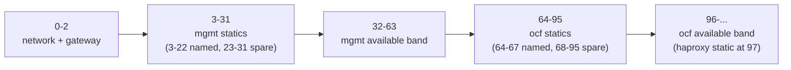
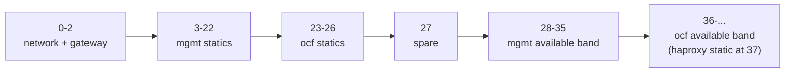

# Reserved-IP Strategies

This document describes how OCFP assigns reserved IP addresses inside each bloc's workload subnets, and how to pick and configure a strategy. It is the reference for redrawing the OCFP networking diagram: every offset below is verified against the shipped source, not derived from a plan or a memory of the old scheme.

## What changed

Before this change, the bootstrap layer (subnet carving, infra-role slots, state outputs) and the vault layer (per-workload-subnet mgmt/ocf reserved-IP tables) derived their reserved-IP bands independently, and could disagree. The historical PVE `ocfp` role widened its available band from a `total/2 - 3` computation tied to each subnet's own size, while vault's mgmt tier kept a fixed window; the two could land on different numbers for the same subnet. That mismatch is what caused the historical PVE band-widening bug.

Both layers now resolve every offset from one shared table (`internal/netlayout`), selected by a strategy name, so the two layers cannot disagree again. Three strategies ship today: `wide` (the default, and the strategy every currently provisioned PVE bloc already runs), `compact` (for narrower subnets), and `spanning` (for providers whose workload subnets are physically separate address spaces — AWS's VPC subnets, STACKIT's `ocfp-triple` layout). Operators can also register their own strategy definitions via `network.strategyPaths`; see [Authoring Reserved-IP Strategies](authoring-strategies.md) for the schema and validation rules a BYO definition must satisfy. Provisioned `wide`/`compact` blocs see no change to the addresses their VMs actually hold, but their bootstrap-state outputs do change at the next bootstrap apply — new keys on every index, plus five existing keys whose values move to match what the vault layer already held. See "Layer A (bootstrap) slots" below for exactly which outputs and which blocs. STACKIT and AWS blocs are a different case: their reserved-IP tables were provider-specific before this change and now come from `spanning`, so their addresses do move — see [STACKIT Networking](providers/stackit.md) and [AWS Networking](providers/aws.md).

## 1. Overview

OCFP carves each workload subnet into two independent tiers that share one physical subnet: `mgmt` (bastion, vault, concourse, monitoring, and shared services) and `ocf` (the Cloud Foundry director's own BOSH/vault/jumpbox/blacksmith/haproxy). Each tier's Genesis director runs its own cloud-config IPAM allocator against that shared subnet, so the two tiers must own disjoint address ranges or the two directors will eventually claim the same physical IP.

Two layers of the CLI place addresses on that subnet:

Layer A is the bootstrap layer: it carves the parent CIDR into subnets, assigns the infra-role's named slots (bastion, director, shield, blacksmith, and so on) for the fixed infra subnet, and assigns the `ocfp` role's slots for each AZ workload subnet, writing the results as bootstrap state outputs.

Layer B is the vault layer: it populates each workload subnet's `reserved-ips` secret with the full per-role assignment table (both `mgmt` and `ocf` tier entries) that Genesis' cloud-config reads.

Both layers now resolve every offset from the same `internal/netlayout` registry, so they cannot disagree about where a role or a band sits.

## 2. Strategy selection

A bloc's config selects a strategy with the `strategy` key nested under `network:` (camelCase), or the snake_case alias `network_strategy`. Both are accepted; an empty value resolves to the provider's own default strategy (see `netlayout.DefaultNameFor`, table below) rather than always falling back to `wide`. An unrecognized strategy name fails at config load, and the error lists every strategy name known to the bloc's own catalog, so the operator does not have to guess.

A bloc's catalog is not always just the three built-ins: `network.strategyPaths` (or its snake_case alias `strategy_paths`) names files or directories of operator-supplied strategy definitions, loaded alongside the built-ins into a per-bloc catalog before `network.strategy` is resolved. `strategyPaths` (camelCase) wins over `strategy_paths` when both are set. See [Authoring Reserved-IP Strategies](authoring-strategies.md) for the file/directory discovery rules and the no-shadowing, unique-`scheme_version` guarantees that catalog build enforces.

The empty-strategy provider default:

| Provider | Subnet strategy | Default |
| --- | --- | --- |
| aws | (any) | spanning |
| stackit | `ocfp-triple` | spanning |
| stackit | anything else (including empty) | wide |
| pve, or provider unset | (any) | wide |

The selected strategy applies to both layers: Layer A's `ocfp`-role band and Layer B's per-tier assignment table both come from the same resolved strategy.

## 3. Placement: colocated vs. spanning

Every strategy declares one `placement` mode, which controls whether a role's reserved address appears once per bloc or once per workload-subnet index:

`colocated` (`wide`, `compact`) replicates the strategy's full statics-and-bands table on every workload subnet, unchanged from subnet to subnet other than the base address. No static may be pinned to a specific subnet index under colocated placement — the definition loader rejects one that tries (`ErrBadPinning`, see [Authoring Reserved-IP Strategies](authoring-strategies.md#2-validation-rule-catalog)). A colocated strategy needs only one workload subnet to be valid (`min_subnets` defaults to 1 and may not be set explicitly).

`spanning` (`spanning`) distributes roles across a fixed number of workload subnets (`min_subnets`, at least 2): each static either names the specific subnet index (or indices) it is pinned to via `subnets: [...]`, or is left unpinned, in which case it still appears on every index — exactly like a colocated static. Available bands follow the same rule: a band may be pinned to specific indices or left open to every index. `spanning` requires at least 3 workload subnets (`min_subnets: 3`); asking it to lay out fewer fails with `netlayout.ErrTooFewSubnets` (see section 8).

Spanning's per-index pinning generalizes a pattern this document's earlier revisions described as a PVE-specific special case: the historical `ocfp-0`/`ocfp-1`/`ocfp-2` subnets each hosted a different slice of shared infra (bastion/bosh/shield/blacksmith on `ocfp-0`, doomsday/shout on `ocfp-1`, `ocfp_ui` on `ocfp-2`), hand-coded as extra fields on the `infra` role. That hand-coding is gone; the same distribution is now declared once, in `spanning`'s own YAML definition, and is available to any provider whose workload subnets are genuinely separate address spaces — not just PVE.

## 4. The `wide` strategy

`wide` is the default strategy for PVE and STACKIT's single-subnet layout (scheme identity `"2"`), the strategy every currently provisioned PVE bloc already runs, and the strategy carried over unchanged from the pre-`netlayout` implementation. It is `colocated` and requires a workload subnet of at least `/25`; its highest fixed offset is `97` (the `ocf` tier's haproxy static).

**mgmt tier named statics:**

| Role | Offset |
| --- | --- |
| bastion | 3 |
| bosh | 4 |
| vault | 5 |
| jumpbox | 6 |
| concourse | 7 |
| prometheus | 8 |
| shield | 9 |
| blacksmith | 10 |
| artifacts | 11 |
| wireguard | 12 |
| ovpn | 13 |
| rustfs | 14 |
| proxycache | 15 |
| nfs | 16 |
| ocfp_ui | 17 |
| doomsday | 18 |
| shout | 19 |
| garage | 20 |
| rustfs_smoke | 21 |
| garage_smoke | 22 |

Offsets 3–22 are fully used; 23–31 are spare for future growth within the mgmt static zone.

**ocf tier named statics:**

| Role | Offset |
| --- | --- |
| bosh | 64 |
| vault | 65 |
| jumpbox | 66 |
| blacksmith | 67 |
| haproxy | 97 |

**Available bands:**

| Tier | Band |
| --- | --- |
| mgmt | 32–63 |
| ocf | 96 and every offset above it, up to the subnet's last usable address |

**Reserved complements** (the range each tier's director is told to treat as off-limits, so its cloud-config allocator never claims an address the other tier owns):

| Tier | Reserved complement |
| --- | --- |
| mgmt | 0–31, 64 and above |
| ocf | 0–95 |

mgmt's complement wraps around its own available band on both sides — it excludes offsets 0–31 below the band and everything at 64 and above — so the mgmt director never claims an address inside ocf's 64–95 statics or ocf's 96+ available territory. ocf's complement is simpler: everything below its own band (0–95) is off-limits, which happens to be the entirety of mgmt's territory.

**Why haproxy sits at offset 97, not a named slot below 32:** the Cloud Foundry kit's cloud-config hook does not read a `haproxy_ip` key directly. It claims a window from the `ocf` tier's own available band and marks the first three claimed addresses as the subnet's static range; only the environment manifest reads `haproxy_ip` (as `static_ips`). The seed address therefore has to land inside that claim-derived static window, or BOSH rejects it as belonging to no subnet. That forces haproxy's offset to sit one past the `ocf` band's start — band start 96, haproxy 97. The pre-`netlayout` layout encoded the same coupling at a smaller scale (band start 12, haproxy 13). `netlayout`'s validator enforces this coupling on every strategy, built-in or BYO — see `ErrHaproxyCoupling` in [Authoring Reserved-IP Strategies](authoring-strategies.md#2-validation-rule-catalog).

**Why RustFS and Garage get separate offsets despite being alternatives:** RustFS and Garage are alternative blobstore kit implementations — only one is ever deployed per bloc — but the reserved-IP engine deduplicates by computed address value, so two roles cannot share one offset (the second one processed would be silently dropped). RustFS and Garage therefore get distinct offsets (14 and 20) even though at most one is ever live at a time. The same reasoning applies to their smoke-test errands: `rustfs_smoke` (21) and `garage_smoke` (22) each read their own dedicated key (`rustfs_ip_smoke`, `garage_ip_smoke`), distinct from the role's own IP key.



**Worked example.** Take a `/22` workload subnet with base address `10.64.64.0` (its last usable host address is `10.64.67.254`). Every offset above maps to an address by adding it to the base:

| Item | Offset | Address |
| --- | --- | --- |
| gateway | 1 | 10.64.64.1 |
| bastion | 3 | 10.64.64.3 |
| mgmt vault | 5 | 10.64.64.5 |
| mgmt available band | 32–63 | 10.64.64.32 – 10.64.64.63 |
| ocf bosh | 64 | 10.64.64.64 |
| ocf available band start | 96 | 10.64.64.96 |
| ocf haproxy | 97 | 10.64.64.97 |
| last usable address | — | 10.64.67.254 |

## 5. The `compact` strategy

`compact` (scheme identity `"3-compact"`) is a `/26`-capable, `colocated` layout derived from `wide` by compressing the `ocf` tier's statics and both tiers' available bands. It requires a workload subnet of at least `/26`; its highest fixed offset is `37` (the `ocf` tier's haproxy static).

The mgmt tier's statics are numerically identical to `wide`'s (offsets 3–22, same role table above) — compact only compresses the `ocf` tier and the available bands.

**ocf tier named statics:**

| Role | Offset |
| --- | --- |
| bosh | 23 |
| vault | 24 |
| jumpbox | 25 |
| blacksmith | 26 |
| haproxy | 37 |

Offset 27 is spare (a gap between the `ocf` statics and the mgmt available band).

**Available bands:**

| Tier | Band |
| --- | --- |
| mgmt | 28–35 |
| ocf | 36 and every offset above it, up to the subnet's last usable address |

**Reserved complements:**

| Tier | Reserved complement |
| --- | --- |
| mgmt | 0–27, 36 and above |
| ocf | 0–35 |

The same haproxy-offset coupling described for `wide` applies here: haproxy sits one past the `ocf` band's start (band start 36, haproxy 37), because the Cloud Foundry kit's cloud-config hook claims its static range from inside the available band itself.



**Worked example.** Take a `/26` workload subnet with base address `10.20.30.0` (its last usable host address is `10.20.30.62`):

| Item | Offset | Address |
| --- | --- | --- |
| gateway | 1 | 10.20.30.1 |
| bastion | 3 | 10.20.30.3 |
| ocf bosh | 23 | 10.20.30.23 |
| mgmt available band | 28–35 | 10.20.30.28 – 10.20.30.35 |
| ocf available band start | 36 | 10.20.30.36 |
| ocf haproxy | 37 | 10.20.30.37 |
| last usable address | — | 10.20.30.62 |

## 6. The `spanning` strategy

`spanning` (scheme identity `"4-spanning"`) reuses `wide`'s exact offset catalog — every role sits at the same offset it would under `wide` — but distributes the mgmt tier's singleton services across a bloc's three workload subnets instead of writing every role on every subnet. It is `spanning` placement, requires `min_subnets: 3`, and needs at least a `/25` workload subnet (`wide`'s own minimum, since the per-subnet offset ceiling is unchanged).

This is the default strategy for AWS (whose three VPC subnets are always separate address spaces) and for STACKIT's `ocfp-triple` subnet strategy (see section 2's default table).

**mgmt tier statics** — offsets identical to `wide`'s; the "Pinned to" column is the only thing spanning changes:

| Role | Offset | Pinned to |
| --- | --- | --- |
| bastion | 3 | subnet 0 |
| bosh | 4 | subnet 0 |
| vault | 5 | every subnet |
| jumpbox | 6 | every subnet |
| concourse | 7 | every subnet |
| prometheus | 8 | every subnet |
| shield | 9 | subnet 0 |
| blacksmith | 10 | subnet 0 |
| artifacts | 11 | every subnet |
| wireguard | 12 | subnet 0 |
| ovpn | 13 | subnet 0 |
| rustfs | 14 | subnet 0 |
| proxycache | 15 | subnet 0 |
| nfs | 16 | subnet 0 |
| ocfp_ui | 17 | subnet 2 |
| doomsday | 18 | subnet 1 |
| shout | 19 | subnet 1 |
| garage | 20 | subnet 0 |
| rustfs_smoke | 21 | every subnet |
| garage_smoke | 22 | every subnet |

**ocf tier statics:**

| Role | Offset | Pinned to |
| --- | --- | --- |
| bosh | 64 | subnet 0 |
| vault | 65 | every subnet |
| jumpbox | 66 | every subnet |
| blacksmith | 67 | subnet 1 |
| haproxy | 97 | subnet 0 |

**Available bands and reserved complements** are unpinned (open to every subnet index) and numerically identical to `wide`'s: mgmt 32–63 (complement 0–31, 64 and above), ocf 96 and above (complement 0–95).

A "pinned to subnet N" static's `<role>_ip` key is written ONLY into that one subnet's `reserved-ips` record; the other subnets' records simply have no such key at all (not a reserved-but-unassigned offset — the key is absent). An "every subnet" static's key is written identically into all three subnets' records, at that subnet's own base address, the same as any `wide`/`compact` static.

**Per-index static tables** (which roles a given `ocfp-N` subnet's `reserved-ips` record actually carries):

| Index 0 (`ocfp-0`) mgmt | Index 1 (`ocfp-1`) mgmt | Index 2 (`ocfp-2`) mgmt |
| --- | --- | --- |
| bastion 3, bosh 4, vault 5, jumpbox 6, concourse 7, prometheus 8, shield 9, blacksmith 10, artifacts 11, wireguard 12, ovpn 13, rustfs 14, proxycache 15, nfs 16, garage 20, rustfs_smoke 21, garage_smoke 22 | vault 5, jumpbox 6, concourse 7, prometheus 8, artifacts 11, doomsday 18, shout 19, rustfs_smoke 21, garage_smoke 22 | vault 5, jumpbox 6, concourse 7, prometheus 8, artifacts 11, ocfp_ui 17, rustfs_smoke 21, garage_smoke 22 |

| Index 0 (`ocfp-0`) ocf | Index 1 (`ocfp-1`) ocf | Index 2 (`ocfp-2`) ocf |
| --- | --- | --- |
| bosh 64, vault 65, jumpbox 66, haproxy 97 | vault 65, jumpbox 66, blacksmith 67 | vault 65, jumpbox 66 |

```mermaid
flowchart TD
    subgraph IDX0["ocfp-0 (index 0)"]
        direction LR
        A0["0-2\nnetwork+gw"] --> B0["3-31 mgmt statics\nbastion,bosh,shield,blacksmith,\nwireguard,ovpn,rustfs,proxycache,\nnfs,garage + every-subnet roles"]
        B0 --> C0["32-63\nmgmt available"]
        C0 --> D0["64-95 ocf statics\nbosh + every-subnet roles"]
        D0 --> E0["96-...\nocf available\n(haproxy at 97)"]
    end
    subgraph IDX1["ocfp-1 (index 1)"]
        direction LR
        A1["0-2\nnetwork+gw"] --> B1["3-31 mgmt statics\ndoomsday 18, shout 19\n+ every-subnet roles"]
        B1 --> C1["32-63\nmgmt available"]
        C1 --> D1["64-95 ocf statics\nblacksmith 67\n+ every-subnet roles"]
        D1 --> E1["96-...\nocf available"]
    end
    subgraph IDX2["ocfp-2 (index 2)"]
        direction LR
        A2["0-2\nnetwork+gw"] --> B2["3-31 mgmt statics\nocfp_ui 17\n+ every-subnet roles"]
        B2 --> C2["32-63\nmgmt available"]
        C2 --> D2["64-95 ocf statics\nevery-subnet roles only"]
        D2 --> E2["96-...\nocf available"]
    end
```



**Worked `/22` triple example.** Take the standard three-subnet AWS/PVE split of a `/20` parent (`10.4.0.0/20` → `ocfp-0` = `10.4.4.0/22`, `ocfp-1` = `10.4.8.0/22`, `ocfp-2` = `10.4.12.0/22`):

| Item | Index | Offset | Address |
| --- | --- | --- | --- |
| bastion | 0 | 3 | 10.4.4.3 |
| mgmt vault (every subnet) | 0 / 1 / 2 | 5 | 10.4.4.5 / 10.4.8.5 / 10.4.12.5 |
| mgmt available band | 0 / 1 / 2 | 32–63 | 10.4.4.32–63 / 10.4.8.32–63 / 10.4.12.32–63 |
| doomsday | 1 | 18 | 10.4.8.18 |
| shout | 1 | 19 | 10.4.8.19 |
| ocfp_ui | 2 | 17 | 10.4.12.17 |
| ocf bosh | 0 | 64 | 10.4.4.64 |
| ocf haproxy | 0 | 97 | 10.4.4.97 |
| ocf blacksmith | 1 | 67 | 10.4.8.67 |
| ocf available band start | 0 / 1 / 2 | 96 | 10.4.4.96 / 10.4.8.96 / 10.4.12.96 |

`doomsday_ip` is absent from `ocfp-0`'s and `ocfp-2`'s reserved-ips records; `bastion_ip` is absent from `ocfp-1`'s and `ocfp-2`'s; `blacksmith_ip` under the `ocf` tier is absent from `ocfp-0`'s and `ocfp-2`'s. `vault_ip` under either tier is present, at its own subnet's base address, on all three.

**Subnet-count enforcement.** `spanning` needs `min_subnets: 3`; a bloc whose provider/subnet-strategy combination produces fewer than three workload subnets (for example, STACKIT's single-subnet layout, or an AWS VPC hand-configured with only one or two subnets) fails at bootstrap-subnet-creation time and at vault-provider populate time with `netlayout.ErrTooFewSubnets`, before any address is derived — see section 8.

## 7. Layer A (bootstrap) slots

Layer A applies to two roles, both carved from the fixed infra subnet or a workload subnet at bootstrap time:

**The `infra` role** (the fixed infra subnet — bastion, director, and shared infra services) is fixed for every strategy, subnet size, and index: it has four named statics, an available band of 12–29, and a reserved-continuation offset of 30. Its layout does not come from a strategy's mgmt tier at all — it is a package-level constant, `internal/netlayout`'s `infraLayerASlots()` — because the infra subnet is carved once per bloc and is not a workload subnet whose layout varies by strategy:

| Role | Offset |
| --- | --- |
| bastion | 3 |
| bosh | 4 |
| shield | 9 |
| blacksmith | 10 |

**The `ocfp` role** (each AZ workload subnet) now derives its named-slot set directly from the resolved strategy's own mgmt tier — `Layout.LayerASlots("ocfp", cidr, idx)` returns exactly the mgmt-tier statics whose `subnets:` pinning includes `idx` (every static, for a `colocated` strategy), keyed the same way Layer B keys them (`ip_key` when set, else `"<role>_ip"`), plus that strategy's own mgmt available band:

| Strategy | Available band | Reserved-continuation offset |
| --- | --- | --- |
| wide | 32–63 | 64 |
| compact | 28–35 | 36 |
| spanning | 32–63 | 64 |

For the `ocfp` role, `ReservedB` is always `AvailableA - 1` and `ReservedC` is always `AvailableB + 1` — the reserved complement is derived from the band, never carried as an independent value, so a band override (section 9) can never leave the reserved complement pointing at the old band. The `infra` role is the one exception, and only for `ReservedB`: its fixed layout pairs an available band starting at 12 with a `ReservedB` of 10, a gap the infra subnet has always carried.

This is identical across every provider subnet-carving strategy — PVE, the STACKIT triple-subnet layout, the STACKIT single-subnet layout, and AWS's VPC subnet split all resolve the `ocfp` role's slots through the same code path, so none of them can drift from the others or from Layer B's own per-tier table.

A negative `idx` (the bootstrap call this package uses for the infra subnet and for single-subnet contexts that have no workload-subnet position) returns only the placements that apply to every index — for a `spanning`-style definition, that means only its unpinned statics and bands; every pinned static and band is omitted, since a negative index can never satisfy a pinned-index membership test.

**Colocated strategies now write every mgmt static on every index, not a fixed subset.** Before this change, Layer A's `ocfp`-role writer emitted a hand-coded subset, branching on the subnet's index: `vault_ip`, `jumpbox_ip`, `concourse_ip`, `prometheus_ip`, and `artifacts_ip` on every index; `bastion_ip`, `bosh_ip`, `shield_ip`, and `blacksmith_ip` on index 0 only; `doomsday_ip`, `shout_ip`, and a second `blacksmith_ip` at its own separate offset on index 1 only; and `ocfp_ui_ip` on index 2 only. That hand-coded special case is gone. Now, for `wide` and `compact` (both `colocated`, so every static is unpinned), `LayerASlots("ocfp", ...)` returns the strategy's FULL mgmt-tier static set — all twenty roles, including `wireguard`, `ovpn`, `rustfs`, `proxycache`, `nfs`, `ocfp_ui`, `doomsday`, `shout`, `garage`, `rustfs_smoke`, and `garage_smoke` — on EVERY `ocfp-N` workload subnet, as `reserved_<bloc>-ocfp-N_<role>_ip` bootstrap-state outputs. For `spanning`, the same writer emits only the roles pinned to that particular index (section 6's per-index tables), plus the unpinned "every subnet" roles.

**Migration note.** Three changes affect a bloc's bootstrap-state outputs at its next apply. Layer B — the vault `reserved-ips` records Genesis' cloud-config actually reads — is byte-unchanged for `wide` and `compact`, so none of the three moves an address a running VM holds; `wide`'s scheme stamp stays `"2"` and `compact`'s stays `"3-compact"` (section 10).

**The `ocfp`-role band outputs, unchanged by this release.** `reserved_<bloc>-ocfp-N_available_a`, `available_b`, and `reserved_c` already changed value when the netlayout registry was introduced: historically, PVE widened these to offsets 12, 509, and 510 on a `/22` subnet (derived from that subnet's own size), while STACKIT used the fixed infra-role band, 12/29/30, unchanged. Both providers emit the selected strategy's own band instead — 32/63/64 for `wide` and `spanning`, or 28/35/36 for `compact`. `bastion_ip` and `bosh_ip` (offsets 3 and 4) are unaffected either way, because the `ocfp` role's band override only replaces the available band and reserved-continuation offset, never the named statics.

**`reserved_b`, which does change in this release.** The `ocfp` role's `reserved_b` was left behind at the `infra` role's own value, offset 10, because the band override replaced only `available_a`, `available_b`, and `reserved_c`. It is now derived from the band like every other complement bound (`reserved_b = available_a - 1`), so `reserved_<bloc>-ocfp-N_reserved_b` moves from offset 10 to offset 31 under `wide` and `spanning`, and to offset 27 under `compact`. This closes a real gap — offsets 11–31 were previously described as neither reserved nor available — but it tightens a reserved range an operator's tooling may read, so it is a value change, not an addition. The `infra` role's own `reserved_b` is unaffected and stays at offset 10.

**The `ocfp`-role named-slot outputs on `wide`/`compact` blocs.** These blocs gain the additional `reserved_<bloc>-ocfp-N_<role>_ip` keys listed above, on every index. That part is additive. Four keys that already existed also change value:

| Output key | Was | Now |
| --- | --- | --- |
| `reserved_<bloc>-ocfp-1_blacksmith_ip` | base+3 | base+10 |
| `reserved_<bloc>-ocfp-1_doomsday_ip` | base+9 | base+18 |
| `reserved_<bloc>-ocfp-1_shout_ip` | base+10 | base+19 |
| `reserved_<bloc>-ocfp-2_ocfp_ui_ip` | base+9 | base+17 |

The new values are the correct ones. Layer B has placed those four roles at offsets 10, 18, 19, and 17 all along, and its tables are byte-unchanged by this branch; the old Layer A writer hand-coded a separate set of offsets for the `ocfp-1`/`ocfp-2` special case and emitted stale values that disagreed with the records the kits read. No VM moves and no address is at risk — a state output that was wrong is now right — but an operator diffing state outputs across the apply will see these four values move, so this is not a purely additive change.

**Two downstream lookups change behavior.** Neither becomes reliably correct on `wide`/`compact`:

- `ocfp endpoints`' `findReservedIP` helper (`internal/commands/endpoints_collect.go`) collects every `reserved_*_<role>_ip` output, sorts the keys, and returns the first. No `infra` subnet carries `doomsday_ip`, `shout_ip`, or `ocfp_ui_ip`, so for those three the winner is always `ocfp-0`'s key. Under `wide`/`compact` every mgmt static is now written on every index, so all three resolve where they previously could miss — but they resolve to `ocfp-0`'s address, and the kits read a fixed index's vault record (`kits/doomsday` and `kits/shout` both read `/net/subnets/ocfp-1/reserved-ips` unconditionally). The command therefore reports an address the deployment does not use. Making the lookup prefer the pinned index is follow-up work, not something this change did.

- `ocfp lb add-service`'s `reserved:<key>[:index]` token (`ResolveReservedIP`, `internal/commands/lb.go`) defaults to index 0. `reserved:doomsday_ip`, `reserved:shout_ip`, and `reserved:ocfp_ui_ip` previously failed with `ErrOutputNotFound` because none of those keys existed on `ocfp-0`; under `wide`/`compact` they now return `ocfp-0`'s address instead of erroring. No working configuration regresses — the bare token errored before, so nothing could depend on it — but the silent wrong answer replaces a loud failure, and an operator who wants the address the kits use must name the index explicitly (`reserved:doomsday_ip:1`, `reserved:ocfp_ui_ip:2`).

Under `spanning` both lookups are correct, because each pinned role's key exists at exactly one index: `findReservedIP` has only one candidate to sort, and the bare `reserved:<key>` token still fails loudly for a role that is not pinned to `ocfp-0`, which is the right answer rather than a wrong address.

## 8. Subnet-size and subnet-count validation

Each strategy rejects a workload subnet narrower than its minimum prefix at populate time, before deriving any address: `wide` and `spanning` require at least `/25`, `compact` requires at least `/26`. The error names the strategy, the offending CIDR, its actual prefix, the required minimum prefix, and the strategy's highest fixed offset, so the message alone explains the rejection without cross-referencing source:

```
subnet too small for strategy: strategy "wide" cidr "10.20.30.0/26" is /26, requires minimum /25 (highest fixed offset 97)
```

The subnet is not too small in absolute terms; it is too small for `wide` specifically, because `wide`'s highest offset (97) does not fit inside a 64-address block. The same subnet is valid for `compact`, whose highest offset (37) fits comfortably.

`spanning` additionally rejects a workload-subnet SET with fewer than three entries, wrapping `netlayout.ErrTooFewSubnets`, before checking any individual subnet's size:

```
netlayout: too few workload subnets for strategy: strategy "spanning" requires at least 3 workload subnets, got 1
```

Both bootstrap's subnet-creation path and every vault provider's populate path call `Layout.ValidateSubnetSet(cidrs)` against the same resolved strategy, so a provider/subnet-strategy combination that produces too few workload subnets for the selected strategy — STACKIT's single-subnet layout under `spanning`, for example — is rejected at the same point regardless of which layer runs first.

## 9. Band overrides

Two config keys override a strategy's computed available band, each scoped to a different layer:

`network.bands.infra` overrides Layer A's available band and reserved-continuation offset, uniformly for both the `infra` role and the `ocfp` role — it replaces whatever the strategy computed, it does not add to it. It is validated before being applied: both `start` and `end` must be set together (or neither); `start` may not fall below offset 12 (the floor below which the infra role's fixed named slots live); `end` must fall strictly after `start`; and `end` may not exceed the subnet's last usable host address. A validation failure is returned as an error naming the specific rule that failed.

`network.bands.mgmt` overrides Layer B's mgmt-tier available band. Unlike the historical restriction, this is no longer `wide`-only: validation is now derived from the resolved strategy's own definition, not a hard-coded `32 <= start < end <= 63` range. `ValidateBand` (for any of `wide`, `compact`, `spanning`, or a BYO strategy) checks, in order: both `start`/`end` set together; `end` strictly after `start`; `end` within the subnet's usable range; `[start,end]` collides with no named static of EITHER tier, on any subnet index (`ErrBandOverrideCollidesStatic`); and `[start,end]` does not intersect the OTHER tier's own available band, on any subnet index (`ErrBandOverrideCrossTier`, an open band closed at the subnet's last usable offset). The full message catalog, with example error text, is in [Authoring Reserved-IP Strategies](authoring-strategies.md#2-validation-rule-catalog).

Applying either override recomputes the reserved complement from the new band — `reserved_b = start - 1` and `reserved_c = end + 1` — so the band and its complement can never point at different generations of the same override.

`network.bands.ocf` is not shipped by either layer's config today — no per-strategy `ocf`-tier override exists yet.

The removed legacy key, `network.availableBandStart`/`network.availableBandEnd` (and its snake_case alias, `available_band_start`/`available_band_end`), now hard-errors at config load. The error names both replacement keys — `network.bands.infra` for the bootstrap subnet layout, and `network.bands.mgmt` for the reserved-IP mgmt tier — so a config still carrying the old key fails loudly instead of silently losing its override.

## 10. Scheme stamping and drift guard

Every bloc's vault `reserved-ips` record carries a `scheme_version` key recording which strategy's table its addresses were derived from. `wide`-strategy blocs stamp `"2"` — the same value the pre-`netlayout` implementation already used, so no new vault key semantics were introduced for existing `wide` blocs. `compact`-strategy blocs stamp `"3-compact"`, and `spanning`-strategy blocs stamp `"4-spanning"`. A BYO strategy stamps whatever `scheme_version` its own YAML declares; the catalog that loads it rejects a value already claimed by a built-in or another BYO definition (`ErrSchemeCollision`), so a stamped value always identifies exactly one strategy's table.

A populate drift guard sits in front of every write to a `reserved-ips` path (both the keyed form and the per-role sub-path form), for every strategy alike — built-in or BYO. For a key vault does not yet hold, the guard forwards the write. For a key vault already holds with a value that disagrees with what this build derives, the guard withholds the write, records the disagreement (path, key, the value vault holds, and the value this build derived), and reports it — the recorded address is never silently moved. Records that predate scheme stamping, or that carry an older stamp than the running binary derives, get a separate report entry describing the mismatch, without being rewritten.

Moving a live reserved address recreates the VM that holds it, so the guard's withheld writes are surfaced for deliberate review rather than applied automatically. An operator reviews the report with `ocfp vault reserved-ips status`, then applies a chosen migration with `ocfp vault reserved-ips migrate`, or forces the derivation over the recorded addresses with `ocfp vault populate --force-reallocate`.

## 11. Choosing a strategy

Use `wide` (the default for PVE and STACKIT single-subnet) when the workload subnet is `/25` or wider — it is the strategy every currently provisioned bloc already runs, and it needs no explicit config.

Use `compact` when the workload subnet is `/26` — `wide` will not fit it, and `compact` is validated down to exactly that size.

Use `spanning` when the bloc's workload subnets are physically separate address spaces spread across at least three subnets — this is AWS's and STACKIT's `ocfp-triple`'s default, and needs no explicit config on either provider; select it explicitly for a PVE bloc that wants the same distributed layout across three SDN-mode workload subnets.

Strategy selection is per-bloc config, not a fleet-wide setting: different blocs can run different strategies without conflict, as long as each bloc's own workload subnets meet its selected strategy's minimum size (and, for `spanning`, minimum subnet count).

Changing a provisioned bloc's strategy is not supported by redeploy. Every built-in strategy places live services — `bosh`, `vault`, `jumpbox`, and `blacksmith` on the `ocf` tier, plus `haproxy` — at different offsets or different subnet indices, so switching strategies would move addresses out from under running VMs. A strategy change on a provisioned bloc requires tearing down and rebuilding its workload subnets, not a rolling reconfigure.

## 12. Diagram-update checklist

When redrawing the OCFP networking diagram, verify each of the following against this document for the strategy the bloc runs:

For `wide`:

- mgmt static range: 3–31 (named 3–22, spare 23–31)

- mgmt available band: 32–63

- ocf static range: 64–95 (named 64–67, spare 68–95)

- ocf available band: 96 and above

- haproxy offset: 97 (one past the ocf band's start)

For `compact`:

- mgmt static range: 3–22 (identical to wide)

- mgmt available band: 28–35

- ocf static range: 23–27 (named 23–26, spare 27)

- ocf available band: 36 and above

- haproxy offset: 37 (one past the ocf band's start)

For `spanning`:

- offsets are numerically identical to `wide`'s (3–22 mgmt, 64–67/97 ocf, 32–63 mgmt available, 96+ ocf available) — only WHICH subnet index carries each role differs

- verify each subnet's own per-index table (section 6) before drawing it: `ocfp-0` carries every singleton mgmt/ocf role plus the unpinned roles; `ocfp-1` carries only doomsday, shout, ocf-tier blacksmith, plus the unpinned roles; `ocfp-2` carries only ocfp_ui plus the unpinned roles

- a role's `<role>_ip` key is ABSENT (not reserved-but-blank) from a subnet's record at any index it is not pinned to

For every strategy, also verify:

- the bastion sits at offset 3, not offset 0 — the network and gateway addresses occupy offsets 0–2 on every subnet, so bastion is the first named static after them

- Layer A's `infra`-role available band is 12–29 on the fixed infra subnet, regardless of which strategy the bloc selected

- Layer A's `ocfp`-role available band equals the selected strategy's own mgmt band (32–63 for wide/spanning, 28–35 for compact), not a separately computed value

- Layer A's `ocfp`-role named-slot set equals the selected strategy's own mgmt-tier statics pinned to that index (section 7) — for `wide`/`compact` that is the FULL mgmt static list on every index, not the historical nine-role subset

- the bootstrap state-output changes described in section 7 (the `available_a`/`available_b`/`reserved_b`/`reserved_c` outputs for each `ocfp-N` subnet, and the now-complete per-index named-slot set) if the diagram annotates raw state-output values rather than the offset table

## See Also

- [Authoring Reserved-IP Strategies](authoring-strategies.md) for the BYO strategy YAML schema, the full validation-rule catalog, `network.strategyPaths` discovery, and a complete worked custom-strategy example
