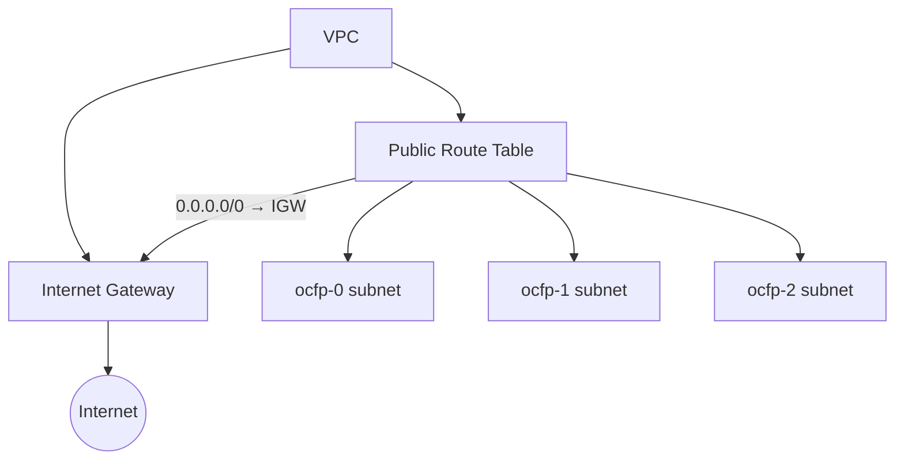

# Routing

Routing controls traffic flow between subnets, to the internet, and between networks. OCFP manages routing resources through the CPI `NetworkManager` router operations, though implementation depth varies by provider.

## Provider Routing Support

| Feature | AWS | Azure | GCP | STACKIT | Proxmox |
|---------|-----|-------|-----|---------|---------|
| Router type | Route tables + IGW | Route tables | Cloud Router | Mock (pending) | Not supported |
| Internet gateway | Yes (auto-created) | Implicit | Implicit | N/A | N/A |
| Custom routes | Yes | Yes (pending) | Yes (pending) | No | No |
| Subnet association | Yes | Yes | Yes | N/A | N/A |
| NAT gateway | Config option | Not managed | Not managed | N/A | N/A |

## AWS

AWS routing uses Internet Gateways (IGW) and route tables.

### Bootstrap Flow

During bootstrap, OCFP creates routing resources for public subnets:

1. **Create Internet Gateway** and attach it to the VPC
2. **Create a public route table** with a default route (`0.0.0.0/0`) pointing to the IGW
3. **Associate public subnets** with the public route table



### VPC DNS Configuration

When creating a VPC, OCFP enables:

- `EnableDnsHostnames` — instances get public DNS hostnames
- `EnableDnsSupport` — VPC DNS resolution is active

### Route Table Operations

The AWS CPI supports:

- `CreateRouter` — creates a route table and optionally an IGW
- `GetRouter` — retrieves a route table by ID
- `ListRouters` — lists route tables, filterable by VPC
- `AttachRouterInterface` — associates a subnet with the route table
- `DetachRouterInterface` — disassociates a subnet
- `DeleteRouter` — removes the route table (and optionally the IGW)

Source: `internal/cpi/aws/network.go`

## Azure

Azure uses route tables with location-aware creation.

### Implementation

- Route tables are created as `RouteTable` resources in the configured resource group
- Each route table is associated with a location (region)
- Routes can be added with next-hop types
- Subnet association links route tables to subnets

### Current Status

Route table creation and management are implemented in the CPI layer. Automatic bootstrap integration for route tables is pending.

Source: `internal/cpi/azure/network.go`

## GCP

GCP uses Cloud Routers for advanced routing.

### Implementation

- Cloud Routers are regional resources within a network
- Interface attachment (pending): connects routers to subnets
- GCP VPCs have implicit routing between subnets within the same network
- External access requires explicit firewall rules rather than route table manipulation

### Cloud Router Operations

The GCP CPI supports:

- `CreateRouter` — creates a regional Cloud Router
- `GetRouter` — retrieves a router by name
- `ListRouters` — lists routers, filterable by network
- `DeleteRouter` — removes a Cloud Router

Interface attachment operations (`AttachRouterInterface`, `DetachRouterInterface`) return "not supported" in the current implementation.

Source: `internal/cpi/gcp/network.go`

## STACKIT

STACKIT networks are created with a "routed" flag by default. Router operations are mock/pending implementations that return basic placeholders.

Source: `internal/cpi/stackit/network.go`

## Proxmox

Routing is not supported by OCFP for Proxmox. Router operations return `ErrRoutersNotSupported`.

- **Bridge mode** relies on host-level Linux routing
- **SDN mode** relies on zone-level routing configured in Proxmox

Source: `internal/cpi/proxmox/network.go`

## CPI Router Types

The `Router` type in `internal/cpi/types.go`:

```
Router
  ID              string
  Name            string
  NetworkID       string
  ExternalGateway string
  Routes          []Route
  Interfaces      []string   (subnet IDs)
  State           string
  Tags            map[string]string
  CreatedAt       time.Time
  UpdatedAt       time.Time
```

Each `Route` has:

```
Route
  Destination     string
  NextHop         string
```

## See Also

- [Networking Overview](README.md) for the provider support matrix
- [Subnets](subnets.md) for subnet topology that routing connects
- [Per-provider guides](providers/) for provider-specific details
