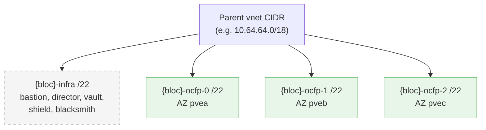

# SDN Subnet Model

This document describes the OCFP "single L3 subnet plus logical AZ carve" pattern. The pattern is used today by the Proxmox SDN provider and is intended to apply to any future provider whose SDN exposes one L3 subnet per virtual network.

## Audience

Operators standing up an SDN-based OCFP deployment, and contributors adding a new SDN-style provider.

## Problem

Some SDN implementations (PVE simple zones today; similar shapes in other lightweight SDNs) only allow **one L3 subnet per virtual network**. The provider holds the gateway, DHCP, and routing on that single subnet. Attempting to register a second subnet on the same vnet either fails outright or is silently ignored at the host level.

OCFP, on the other hand, models workloads across multiple availability-zone-named subnets so that Genesis kits, BOSH AZs, and per-AZ placement work the same way they do on AWS, Azure, GCP, and STACKIT. The pattern below reconciles those two views.

## Pattern

The bloc's parent CIDR is carved into one infra subnet plus N AZ workload subnets. The provider sees a single SDN subnet (the parent); OCFP records the children as **logical subnets** in state and Vault.

### Invariants

- Parent prefix wins on the host
  Every VM's cloud-init network config carries the **parent vnet mask**, not the child `/22` mask. Without this, the host considers the SDN gateway off-link and silently drops egress.

- Infra subnet is index 0
  The first carve is always the infra subnet. It holds shared infrastructure (bastion, director, vault, shield, blacksmith) at fixed offsets so vault and downstream kits can predict addresses without round-tripping the provider.

- AZ subnets map 1:1 to BOSH AZs
  Subnets `{bloc}-ocfp-0..N-1` correspond to AZs in deterministic order. For PVE today: `pvea`, `pveb`, `pvec`.

- Provider sees one subnet
  The provider's `CreateSubnet` short-circuits when the requested child CIDR is fully contained inside the existing parent SDN subnet. No second registration is attempted.

### Default carve (PVE today)

| Index | Logical name | Prefix | AZ | Role |
|-------|--------------|--------|----|----|
| 0 | `{bloc}-infra` | `/22` | none | Shared infra |
| 1 | `{bloc}-ocfp-0` | `/22` | `pvea` | Workload AZ 0 |
| 2 | `{bloc}-ocfp-1` | `/22` | `pveb` | Workload AZ 1 |
| 3 | `{bloc}-ocfp-2` | `/22` | `pvec` | Workload AZ 2 |

Carve constants live in `internal/bootstrap/network.go:43`. The PVE carve runs from `createPVEVirtualSubnets` at `internal/bootstrap/network.go:658`.

### Reserved IP slots

The infra subnet hosts well-known service IPs at fixed offsets from the subnet base:

| Role | Offset | Example (`10.64.64.0/22` infra) |
|------|--------|---------------------------------|
| bastion | 3 | `10.64.64.3` |
| director | 4 | `10.64.64.4` |
| vault | 5 | `10.64.64.5` |
| shield | 9 | `10.64.64.9` |
| blacksmith | 10 | `10.64.64.10` |

Offsets are defined in `internal/netlayout` (the shared registry both the bootstrap and vault layers resolve from). Reserved-IP emission is handled by `addReservedIPOutputs` in `internal/bootstrap/network.go`. The full per-strategy offset tables, available bands, and override keys are documented in [Reserved-IP Strategies](reserved-ip-strategies.md).

## State and Vault outputs

The carve produces per-subnet metadata in both ocfp state and Vault. Downstream Genesis kits consume these paths directly.

For each `{env}` in `{mgmt, ocf}`:

- `secret/config/{bloc}/{env}/net/subnets/{name}`
  Keys: `cidr`, `az`, `gateway`. One entry per logical subnet.

- `secret/config/{bloc}/{env}/net/subnets/{name}/reserved-ips/{role}`
  One entry per reserved role on the infra subnet.

Vault path helpers: `internal/vault/paths.go:93` and `internal/vault/paths.go:101`.

## On-link gateway: the mask trap

The most common SDN deployment failure is a bastion that boots, gets its static IP, and then cannot reach anything off-subnet. The cause is almost always a mask mismatch between the logical subnet OCFP assigns from and the L3 subnet the SDN actually serves.

Example failure mode for `10.64.64.0/18` parent with bastion at `10.64.64.3`:

- Wrong: cloud-init writes `10.64.64.3/22` and gateway `10.64.0.1`. The kernel computes `10.64.0.1` as off-link (outside `10.64.64.0/22`) and refuses to ARP for it.

- Right: cloud-init writes `10.64.64.3/18` and gateway `10.64.0.1`. The kernel computes `10.64.0.1` as on-link (inside `10.64.0.0/18`) and reaches the SDN router.

The `StaticPrivateIPPrefix` field on `cpi.InstanceRequest` (`internal/cpi/types.go:443`) carries the parent prefix length explicitly so the provider can render the correct mask in `ipconfig0`.

## Adding a new SDN provider

To plug a new provider into this pattern:

- Implement `CreateSubnet` so it short-circuits to the existing parent SDN subnet when the requested CIDR is fully contained. The PVE implementation at `internal/cpi/pve/network.go:88` is the reference.

- Route bootstrap subnet creation through the virtual-subnet code path. The PVE branch in `useVirtualSubnetsForPVE` at `internal/bootstrap/network.go:164` shows the predicate.

- Honor `StaticPrivateIPPrefix` in your cloud-init / metadata rendering so the VM gets the parent prefix on its interface.

- Document the AZ naming convention for your provider. Genesis kits use the AZ string verbatim.

## See Also

- [Proxmox Networking](providers/pve.md) for the concrete PVE implementation
- [Subnets](subnets.md) for the standard real-subnet model used by AWS, Azure, GCP
- [Reserved-IP Strategies](reserved-ip-strategies.md) for the selectable `wide` and `compact` reserved-IP layouts
- [Bastion Tailscale](../init/bastion-tailscale.md) for tailnet-based bastion reachability
- [Cloudflare DNS Sync](dns-cloudflare-sync.md) for wildcard DNS pointing at the bastion
