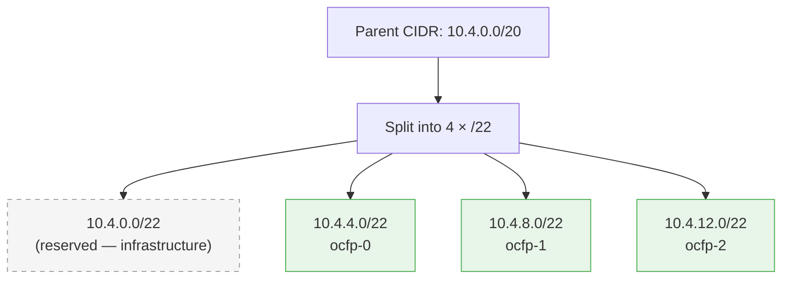

# Subnets

This document explains how OCFP handles subnets across all providers, including CIDR splitting strategies, virtual subnets, and reserved IP assignments.

## Overview

OCFP supports two subnet modes depending on the provider:

- **Real subnets** (AWS, Azure, GCP, Proxmox SDN)
  OCFP creates actual provider subnets via the CPI. If `subnets:` are omitted from config, OCFP derives 3 subnets from the bloc CIDR by splitting into 4 parts and skipping the first (reserved for infrastructure).

- **Virtual subnets** (STACKIT)
  STACKIT does not support traditional subnets. OCFP records virtual subnets in state and Vault only. No provider subnet resources are created.

## CIDR Splitting Strategy

When subnets are not explicitly configured, OCFP splits the parent network CIDR into 4 equal parts. The first part is reserved for infrastructure; the remaining 3 become the OCFP subnets.



The splitting logic uses `SplitIntoN(parentCIDR, 4)` from `internal/bootstrap/network.go`. For the default `10.4.0.0/20`:

| Part | CIDR | Purpose |
|------|------|---------|
| 0 | `10.4.0.0/22` | Reserved (infrastructure) |
| 1 | `10.4.4.0/22` | `ocfp-0` |
| 2 | `10.4.8.0/22` | `ocfp-1` |
| 3 | `10.4.12.0/22` | `ocfp-2` |

Fallback: if `SplitIntoN` cannot split the CIDR, OCFP uses consecutive `/24` blocks starting from the parent's base address.

## AWS

AWS subnets are real VPC subnets created via the EC2 API.

- Subnets are AZ-aware: each of the 3 subnets is placed in a different availability zone
- Subnet type is `public` by default (auto-assign public IP + IGW route)
- Public subnets are associated with a public route table that routes `0.0.0.0/0` through the Internet Gateway
- AZ names are formatted as `<region><letter>` (e.g., `us-east-1a`, `us-east-1b`, `us-east-1c`)

### Default Layout

```yaml
subnets:
  - name: <bloc>-ocfp-0
    cidr: 10.4.4.0/22
    type: public
    az: us-east-1a
  - name: <bloc>-ocfp-1
    cidr: 10.4.8.0/22
    type: public
    az: us-east-1b
  - name: <bloc>-ocfp-2
    cidr: 10.4.12.0/22
    type: public
    az: us-east-1c
```

Source: `internal/cpi/aws/network.go`

## Azure

Azure subnets are VNet subnets created within the Virtual Network.

- Subnets are created in the configured resource group
- NSGs can be associated with subnets for security
- Default split creates 3 subnets from the parent CIDR
- No AZ-specific placement (Azure uses availability zones differently)

Source: `internal/cpi/azure/network.go`

## GCP

GCP subnets are regional subnetworks within a custom-mode VPC.

- Subnetworks are region-scoped (not zone-scoped)
- Private Google Access can be configured per subnetwork
- Custom-mode VPCs do not auto-create subnets; OCFP manages them explicitly
- Each subnetwork is created via the Compute API

Source: `internal/cpi/gcp/network.go`

## STACKIT

STACKIT uses virtual subnets — no provider subnet resources are created.

### Subnet Strategies

OCFP supports two virtual subnet strategies for STACKIT:

- **`ocfp-triple`** (default)
  Splits the bloc CIDR into 4 equal parts, skips the first, uses the remaining 3 as `ocfp-0`, `ocfp-1`, `ocfp-2`.

- **`single`**
  A single virtual subnet equal to the entire bloc CIDR.

### Configuration

```yaml
provider: stackit
network:
  network_cidr: 10.4.0.0/20

# STACKIT virtual subnet strategy
subnet_strategy: ocfp-triple  # or omit for default triple behavior
```

### Virtual Subnet State Properties

Each virtual subnet resource in state includes:

- `cidr` — the subnet CIDR
- `virtual=true` — marks this as a virtual subnet
- `type=public`
- `parent_cidr` — the original network CIDR
- `ip_0` — network address (first IP)
- `ip_n` — last usable IP
- `gateway` — parent base address + 1

State outputs:

- `subnet_<bloc>-ocfp-<n>_id`
- `subnet_<bloc>-ocfp-<n>_cidr`
- `subnet_<bloc>-ocfp-<n>_ip_0`
- `subnet_<bloc>-ocfp-<n>_ip_n`
- `subnet_<bloc>-ocfp-<n>_gateway`

### Reserved IPs

For virtual subnets, OCFP computes reserved IPs used by operational services and load balancers. These are persisted to state as `reserved_<bloc>-ocfp-<n>_<key>` under `ocfp-triple`, and as `reserved_<bloc>-subnet_<key>` under `single`, whose one virtual subnet carries no per-AZ index.

The offsets are not STACKIT-specific. They come from the bloc's resolved reserved-IP strategy, the same engine PVE and AWS resolve theirs from: `ocfp-triple` defaults to `spanning`, `single` defaults to `wide`, and `network.strategy` overrides either default.

#### Triple Subnets (`spanning`)

The static offset table and each role's pinned subnet index are `spanning`'s own — see [Reserved-IP Strategies §6](reserved-ip-strategies.md#6-the-spanning-strategy) for the canonical tables. A role pinned to one subnet index gets no key at all in the other subnets' outputs — the key is absent, not reserved-but-blank.

#### Single Subnet (`wide`)

`wide` is colocated: the one virtual subnet carries all twenty mgmt statics, at the same offsets, with no per-index distinction.

#### Band Outputs

Written for every workload subnet under both strategies:

| Output | Slot | Purpose |
|--------|------|---------|
| `reserved_a` | .0 | Subnet base — floor of the reserved complement |
| `reserved_b` | .31 | Last offset below the available band |
| `available_a` | .32 | First allocatable offset |
| `available_b` | .63 | Last allocatable offset |
| `reserved_c` | .64 | First offset above the available band |
| `reserved_d` | last usable | Ceiling of the reserved complement |

These outputs enable LB tokens: `reserved:<key>[:index]` (e.g., `reserved:vault_ip`, `reserved:doomsday_ip:1`). A token that omits the index resolves against `ocfp-0`, so a pinned role must name its own index.

See [Reserved-IP Strategies](reserved-ip-strategies.md) for the full offset catalog, the `ocf` tier's own table, band overrides, and the scheme-drift guard.

## Proxmox

Proxmox subnet support depends on the network mode:

- **Bridge mode**
  No subnets. The network is flat; all instances share the bridge network.

- **SDN mode**
  Subnets are supported via Proxmox SDN VNets. Subnets are created under `/cluster/sdn/vnets/{vnet}/subnets`.

Subnet operations in bridge mode return the bridge network as a single "subnet" for compatibility.

Source: `internal/cpi/pve/network.go`

## Bastion Placement

- **Non-STACKIT** providers
  Bastion prefers the `<bloc>-mgmt` subnet; falls back to any bloc subnet (prefers `type=public`).

- **STACKIT**
  Bastion is created on the network only (no `subnet_id`), with a dependency on the virtual `subnet.<bloc>-ocfp-0`.

## Custom Subnet Configuration

Override the default split by specifying subnets explicitly:

```yaml
network:
  network_cidr: 10.4.0.0/20
  subnets:
    - name: my-subnet-a
      cidr: 10.4.0.0/24
      type: public
      az: us-east-1a
    - name: my-subnet-b
      cidr: 10.4.1.0/24
      type: private
      az: us-east-1b
```

When `subnets:` is provided, OCFP creates exactly the specified subnets without applying any splitting logic.

## Examples

Single virtual subnet (STACKIT):

```yaml
provider: stackit
network:
  network_cidr: 10.4.0.0/20
# subnet_strategy omitted → defaults to ocfp-triple
```

Triple virtual subnets (STACKIT, explicit):

```yaml
provider: stackit
network:
  network_cidr: 10.4.0.0/20
subnet_strategy: ocfp-triple
# yields ocfp-0/1/2: 10.4.4.0/22, 10.4.8.0/22, 10.4.12.0/22
```

AWS with default split:

```yaml
provider: aws
region: us-east-1
network:
  network_cidr: 10.4.0.0/20
# OCFP creates 3 subnets across AZs: ocfp-0, ocfp-1, ocfp-2
```

## See Also

- [Networking Overview](README.md) for the provider support matrix
- [LB Commands](../cmds/lb.md) for LB commands and target tokens
- [Public IPs](public-ips.md) for public IP provisioning and labels
- [Routing](routing.md) for route table and IGW management
