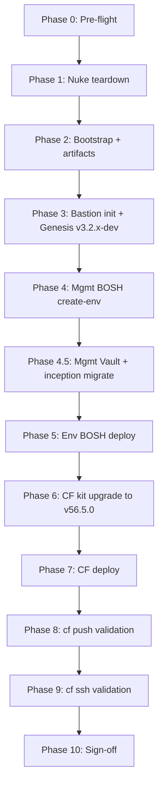

# PVE E2E Lab Testing Plan — `ocfp-lab-wayne`

End-to-end validation of the OCFP stack on the Proxmox VE lab: full nuke, bootstrap (with RustFS artifacts), management BOSH, environment BOSH, Cloud Foundry v56.5.0 (noble stemcell, compiled releases), then `cf push` and `cf ssh` validation. Local dev sources throughout; nothing pushed to origin.

- **Status**: Draft — awaiting execution approval (plan document only)
- **Target bloc**: `ocfp-lab-wayne`
- **Date**: 2026-05-31
- **Authority**: This file is the single source of truth for the run. Update progress and decisions here.

---

## 1. Objectives & Success Criteria

| # | Objective | Pass Condition |
|---|-----------|----------------|
| 1 | Clean slate | Nuke removes all PVE resources for the lab; teardown probe reports nothing left |
| 2 | Bootstrap | Network, security, bastion, keypairs, buckets provisioned and tagged `managed-by=ocfp,bloc=ocfp-lab-wayne` |
| 3 | Artifacts (RustFS) | `ocfp-lab-wayne-artifacts` VM up; buckets created; S3 endpoint + creds in Vault |
| 4 | Bastion init | OCFP CLI, Genesis (v3.2.x-dev), kits, and deployment configs present on bastion |
| 5 | Management BOSH | `bosh create-env` succeeds with latest PVE CPI dev build; mgmt director reachable |
| 6 | Environment BOSH | Mgmt director deploys env BOSH (`ocfp-lab-wayne-ocf`); env director reachable |
| 7 | Cloud Foundry | CF v56.5.0 noble + compiled releases deploys green on env BOSH via RustFS blobstore |
| 8 | App push | `cf push` of a test app succeeds; route reachable; app responds |
| 9 | App SSH | `cf ssh` into the app container works; interactive debug confirmed |

**Definition of done**: objectives 1–9 all pass, with evidence (command output) captured in the run log section at the end of this document.

---

## 2. Constraints & Ground Rules

- **Local dev sources only.** CF kit, BOSH kit, and Genesis use working-tree changes. **Never push to origin** for any of them (genesis, cf kit, bosh kit, CPI release).
- **Genesis branch**: `v3.2.x-dev` (canonical remote `RubidiumStudios/genesis`). Set `config.Genesis.Branch` accordingly. Never push to genesis.
- **CF kit** (`~/w/fivetwenty/studios/ocfp/src/kits/cf`): fix in place, including local source changes, do not push.
- **BOSH kit** (`~/w/fivetwenty/studios/ocfp/src/kits/bosh`): fix in place, do not push.
- **PVE CPI**: the published `bosh-proxmox-cpi/0.5.0` release is the default; build a dev release from `~/w/proxmox/bosh-proxmox-cpi-release/` only when testing an unreleased fix.
- **Deployments repo**: local `src/deployments/fivetwenty-ocfp/`. Sync to the bastion; **do not push**.
- **Genesis invocation**: use the `g` symlink (`/usr/local/bin/g` → `genesis`) with v3 environment addressing `g @<env>:<deployment-type> <verb>` (e.g. `g @ocfp-lab-wayne-mgmt:bosh deploy -F -y`). The `@<env>:<type>` notation, the `b` BOSH passthrough (`b deps`), and `do <addon>` are genesis v3 features — verified in the v3 lineage this project tracks (`RubidiumStudios/genesis v3.2.x-dev`). There is **no** `genesis list` command; discover env names with `ls ocfp/deployments/<type>/` (each env file's `genesis.env:` key is the canonical name, and matches the filename stem here).
- **Teardown mode**: `--nuke --force` (operator confirmed the PVE project is exclusively `ocfp-lab-wayne`).
- **No reverts** of unexpected working-tree edits; fix forward or ask.
- **Commits**: atomic, 48/72, imperative, no process references. Only when explicitly requested.

---

## 2.1 PVE Provider Specifics

The deploy/validation flow — bastion → mgmt BOSH → mgmt Vault → inception migrate → env BOSH → CF, all via the Genesis `g @env:type` pattern — is provider-agnostic. The provider plumbing and local-source restrictions unique to this run:

| Concern | PVE lab setting |
|---------|-----------------|
| Provider auth | PVE API token in Vault under the deployment's ocfp config base — `secret/config/ocfp-lab-wayne/<scope>/cpi/pve:*` (kit verified `…/ocf/cpi/pve`; verify the mgmt scope); host 10.64.64.1 |
| Object storage | Self-hosted **RustFS** artifacts VM; creds in Vault `secret/config/ocfp-lab-wayne/rustfs` |
| Deployments repo | local `src/deployments/fivetwenty-ocfp/` (sync to bastion, **do not push**) |
| FQDNs | `*.ocf.wayne.lab.fivetwenty.io` |
| CLI install | local build from `src/clis/ocfp` |
| CPI | local PVE CPI dev tarball, sha1-pinned (see §3) |
| Operator access | Tailscale (100.119.134.76) |
| Stemcell / CF | noble + CF v56.5.0 compiled (see §6) |

---

## 3. Current vs Desired State (the deltas to close)

| Component | Current | Desired | Action |
|-----------|---------|---------|--------|
| PVE CPI release (mgmt manifest) | per-env `file://` dev tarball pinned in three params | kit default `bosh-proxmox-cpi/0.5.0` from GitHub | Drop the three `pve_cpi_release_*` params from the env file |
| cf-deployment | v52.0.0 bundled (jammy-compiled ops) | **v56.5.0** noble-compiled | Enable feature `cf-deployment-version-56.5.0` (designed opt-in; not a manual submodule bump) — see §6 |
| CF stemcell | pve overlay forces `ubuntu-noble` | noble (native in v56.5.0) | Remove pve noble overlay once v56.5.0 provides it |
| CF compiled releases | conditional `kit_bug` bail at `blueprint.pm:366-384` (soft, fires only on pre-noble bundles via the `use-noble-stemcell.yml` gate) | compiled releases enabled on noble | Enable v56.5.0 feature so noble is default and the bail no longer fires; edit the hook only if it still trips |
| CF blobstore | `pve-blobstore` → RustFS via Vault | unchanged (keep RustFS) | Verify `secret/config/ocfp-lab-wayne/ocf/cf/blobstores/main` |
| Genesis branch | (unset / default) | `v3.2.x-dev` | Set in config; re-init bastion genesis |

> The CF kit upgrade (§6) is the highest-risk phase. v56.5.0 is expected to ship noble-compiled releases natively, collapsing the PVE-specific noble + source-compile hacks. Validate that assumption early via `genesis manifest` before deploying.

---

## 4. Reference Data (verified during research)

### Deployment environment files (`src/deployments/fivetwenty-ocfp/`)

| Role | File | Key facts |
|------|------|-----------|
| Shared bloc params | `bosh/ops/ocfp-lab-wayne.yml` | net `lvnet001` 10.64.64.0/18, gw .1, PVE host 10.64.64.1 (director) / 100.119.134.76 (operator), node `pve`, storage vm=`data` disk=`zfs-1` stemcell=`local` iso=`local`, `verify_ssl=false`; CF domains `apps.ocf.wayne.lab.fivetwenty.io`, `system.ocf.wayne.lab.fivetwenty.io` |
| Mgmt BOSH | `bosh/ocfp-lab-wayne-mgmt.yml` | kit dev/latest, iaas pve, features `ocfp,internal-db,pve-external-blobstore`, director 8cpu/16G/128G @ 10.64.64.10, stemcell openstack-kvm noble v1.364 |
| Env BOSH | `bosh/ocfp-lab-wayne-ocf.yml` | kit dev/latest, scale `dev`, `bosh_env: ocfp-lab-wayne-mgmt@/secret/exodus/`, @ 10.64.64.12 |
| CF | `cf/ocfp-lab-wayne-ocf.yml` | kit dev/latest, scale dev, features `ocfp,haproxy,self-signed,pve-blobstore`, `bosh_env: ocfp-lab-wayne-ocf@http://127.0.0.1:8234/secret/exodus/` |
| CF cloud-config | _kit-generated_ (`hooks/cloud-config.pm` → named config `ocfp-lab-wayne-ocf.cf`, uploaded by `genesis deploy`) | network `ocfp-lab-wayne-ocf.cf.net-ocf`, workload band .20–.50 from vault `net/subnets/*/reserved-ips`, 18 vm_types, 2 disk_types |

### Kits

- **CF kit** `kit.yml` v3.1.0; PVE is among its supported IaaS providers. PVE overlays in `ocfp/pve/` (`azs`, `external-blobstore`, `ocf`, `ssh-proxy`, `stemcell`). RustFS via `ocfp/pve/external-blobstore.yml` → `secret/config/<bloc>/ocf/cf/blobstores/main:*`. Bucket naming `<bloc>-ocf-cf[-packages|-buildpacks|-droplets|-resource-pool]`.
- **BOSH kit** `kit.yml` v4.1.0; supports pve (currently dirty — uncommitted PVE work). CPI release defaults to the published `bosh-proxmox-cpi/0.5.0` GitHub release (defaults in `overlay/cpis/pve.yml` and `ocfp/pve/base.yml`, rendered by `pve-base.yml` as `((pve_cpi_release_url))`); override `pve_cpi_release_url` / `_version` / `_sha1` together to pin another release or a `file://` dev tarball. PVE auth read via `meta.ocfp.vault.config "/cpi/pve"` → `secret/config/<bloc>/<scope>/cpi/pve:*` (keys host, user, api_token, node, vm_storage, disk_storage, stemcell_storage, iso_storage, network_bridge; `port`/`verify_ssl`/`vmid_range_start` are literals, not vault-sourced; api_token default).

### PVE CPI release (`~/w/proxmox/bosh-proxmox-cpi-release/`)

- Published default: `bosh-proxmox-cpi/0.5.0`, url `https://github.com/fivetwenty-io/bosh-proxmox-cpi-release/releases/download/v0.5.0/bosh-proxmox-cpi-0.5.0.tgz`, sha1 `bfc7a0655814ac07607618cc868f02eeff7d0ee2`, size `77449832`.
- Renamed at 0.5.0: repo `bosh-pve-cpi-release` → `bosh-proxmox-cpi-release`, release `bosh-pve-cpi` → `bosh-proxmox-cpi`, tarball to match. The colocated job is still `pve_cpi`, so cpi-config entries and property paths are untouched.
- Dev builds: `make dev-release` (emits `RELEASE_TGZ=…`) writes to `dev_releases/bosh-proxmox-cpi/`.

### OCFP CLI command surface

- `ocfp bootstrap [--bloc] [--all|--artifacts|--bastion|--network|…] [--dry-run --output json] [--yes|--force]`
- `ocfp init <bastion|pg|bosh|cf|all> [--bloc] [--genesis|--ocfp|--config] [--resume] [--dry-run]`
- `ocfp teardown [--bloc] [--all|--nuke] [--force] [--empty] [--dry-run --output json]`
- `ocfp test <smoke|c2c|acceptance|…> [--bloc] [--timeout]`
- Bloc resolution: `--bloc` → `OCFP_BLOC` → state `~/.local/state/ocfp/<bloc>/current.json` → single-bloc config.

---

## 5. Phase Flow



Each phase has: entry criteria, steps, verification, and a rollback/debug note. Stop and debug at the first failed verification before proceeding (systematic-debugging discipline).

---

## Phase 0 — Pre-flight

**Entry**: operator has Proxmox + Vault + Cloudflare access; on the operator host (Tailscale to 100.119.134.76).

**Steps**

1. Confirm tooling: `ocfp version`, `bosh --version`, `genesis --version`, `safe --version`, `cf version`, `yq --version`.
2. Confirm Genesis source on `v3.2.x-dev`: in the genesis checkout, `git branch --show-current` → `v3.2.x-dev` (do not push).
3. Confirm config: `~/.config/ocfp/config.yml` has bloc `ocfp-lab-wayne` with PVE provider, region/datacenter, `artifacts.enabled: true`, and `genesis.branch: v3.2.x-dev`.
4. Confirm Vault reachable and unsealed: `safe target` + `safe get secret/handshake` (or equivalent probe).
5. Confirm the CPI release the run will use. The default needs nothing local: the kit fetches `bosh-proxmox-cpi/0.5.0` from GitHub, so the env file carries no `pve_cpi_release_*` params.
   - Testing an unreleased fix instead: `cd ~/w/proxmox/bosh-proxmox-cpi-release && make dev-release`, then capture the new `RELEASE_TGZ`, version, and sha1 (and update §3/§4 and the mgmt env file in Phase 4).
6. Snapshot current state of dirty kits for reference: `git -C ~/w/fivetwenty/studios/ocfp/src/kits/bosh status`, same for cf kit. Record what is already modified (do not revert).

**Verify**: all tools report versions; genesis on `v3.2.x-dev`; CPI tarball sha1 matches; Vault reachable.

**Debug note**: if config bloc missing fields, fix `~/.config/ocfp/config.yml` before continuing — bootstrap and init read it directly.

---

## Phase 1 — Nuke Teardown

**Entry**: Phase 0 green. Operator has explicitly confirmed nuke scope (PVE project is exclusively `ocfp-lab-wayne`).

**Steps**

1. Dry-run first to see the deletion plan:

   ```bash
   ocfp teardown --bloc ocfp-lab-wayne --nuke --dry-run --output json
   ```

2. Review the resource list. Confirm only lab resources appear.
3. Execute nuke (empties non-empty buckets so RustFS/blobstore buckets delete):

   ```bash
   ocfp teardown --bloc ocfp-lab-wayne --nuke --force --empty
   ```

4. Clean any BOSH/Genesis state that survives infra teardown:
   - On bastion (if it still exists at this point): remove `~/deployments/ocfp-lab-wayne/*.state` / create-env state files for mgmt BOSH.
   - Genesis exodus/secrets for the bloc, if a fresh secret tree is desired (confirm with operator before wiping Vault paths).
5. Clear local OCFP state if a truly fresh bootstrap is wanted: inspect `~/.local/state/ocfp/ocfp-lab-wayne/` (teardown should clear cloud state; verify).

**Verify**

- Re-run `ocfp teardown --bloc ocfp-lab-wayne --dry-run` → reports nothing to delete.
- PVE UI / `qm list` on `pve` node shows no `ocfp-lab-wayne-*` VMs (bastion, artifacts, BOSH directors, CF VMs all gone).
- Cloudflare tunnel + DNS cleanup logged (soft-warn is acceptable; verify no stale `*.wayne.lab.fivetwenty.io` records for the lab if they block re-create).

**Debug note**: teardown retries 409 conflicts (3× backoff). If a resource is wedged, identify the dependency (volume attached to a VM, NIC on a subnet) and delete top-down per the priority order (LB → instances → NICs → buckets → snapshots → volumes → keypairs → IPs → sec groups → subnets → networks). The PVE idempotent probe means re-running teardown is safe.

---

## Phase 2 — Bootstrap + Artifacts (RustFS)

**Entry**: Phase 1 verified empty.

**Steps**

1. Bootstrap core infra (network, security groups, keypairs, bastion, buckets):

   ```bash
   ocfp bootstrap --bloc ocfp-lab-wayne --dry-run --output json   # preview
   ocfp bootstrap --bloc ocfp-lab-wayne --yes
   ```

2. Provision the artifacts (RustFS) VM and buckets:

   ```bash
   ocfp bootstrap --bloc ocfp-lab-wayne --artifacts --yes
   ```

   - Runs `/scripts/provision/artifacts` on `ocfp-lab-wayne-artifacts` over SSH (ProxyJump through bastion).
   - Creates buckets `ocfp-lab-wayne-{mgmt-bosh,ocf-bosh,artifacts-blobstore,shield}` plus CF buckets used later.
   - Writes S3 endpoint + creds to Vault `secret/config/ocfp-lab-wayne/rustfs` (best-effort).

3. **Known risk (PVE artifacts bootstrap gap)**: on PVE, RustFS user-data can be silently dropped — the artifacts VM may come up non-functional because there is no snippets storage configured for cloud-init user-data. Verify explicitly (next).

**Verify**

- `qm list` shows `ocfp-lab-wayne-bastion` and `ocfp-lab-wayne-artifacts` running.
- SSH to artifacts via bastion; confirm RustFS service is up and listening; `mc`/S3 probe lists the expected buckets.
- Vault has `secret/config/ocfp-lab-wayne/rustfs` populated. If not, run the documented fallback (`ocfp vault populate`) or write creds manually.
- Resources tagged `managed-by=ocfp,bloc=ocfp-lab-wayne`.

**Debug note**: if RustFS is dead due to dropped user-data, configure PVE snippets storage (e.g., enable `snippets` content on a storage pool) and re-provision the artifacts VM, or push the provision script manually over SSH. This is the documented PVE bootstrap gap — budget time here.

---

## Phase 3 — Bastion Init + Genesis v3.2.x-dev

**Entry**: bastion reachable; artifacts/RustFS healthy.

**Steps**

1. Full bastion init (OCFP CLI, Genesis, yq, kits, deployment configs):

   ```bash
   ocfp init bastion --bloc ocfp-lab-wayne
   ```

2. Ensure Genesis is on `v3.2.x-dev` (genesis-only fast path if re-running):

   ```bash
   ocfp init bastion --bloc ocfp-lab-wayne --genesis
   ```

3. Sync local deployment configs to the bastion:

   ```bash
   ocfp init bastion --bloc ocfp-lab-wayne --config
   ```

   - This syncs the deployment **config files** only. The manifests land under
     `~/ocfp/deployments/{bosh,cf}/` on the bastion (e.g.
     `~/ocfp/deployments/bosh/ocfp-lab-wayne-mgmt.yml`).

   **`--config` does NOT sync the local kit sources** — `ocfp init bastion`
   sources kits/Genesis/deployments from REMOTE git, so the bastion's CF kit is
   the packaged tarball (e.g. `cf-2.5.3.tar.gz`), not your local working tree.
   The env files use `kit: { name: dev }`, which resolves a `dev` symlink in
   each deployment dir pointing at `~/kits/<kit>-genesis-kit/`. To put the local
   working-tree kits (CF v56.5.0 + PVE fixes, BOSH PVE support) behind those
   symlinks, `rsync` them yourself:

   ```bash
   # Parent dir must exist (rsync won't mkpath the intermediate).
   ocfp --bloc ocfp-lab-wayne ssh -- mkdir -p '~/kits/cf-genesis-kit' '~/kits/bosh-genesis-kit'

   ocfp rsync --bloc ocfp-lab-wayne --compress --exclude .git \
     src/kits/cf/   bastion:kits/cf-genesis-kit/
   ocfp rsync --bloc ocfp-lab-wayne --compress --exclude .git \
     src/kits/bosh/ bastion:kits/bosh-genesis-kit/

   # The CF deployment ships a committed `dev` symlink; BOSH does not — create it.
   ocfp --bloc ocfp-lab-wayne ssh -- \
     ln -sfn '~/kits/bosh-genesis-kit' '~/ocfp/deployments/bosh/dev'

   # Overlay local working-tree env files, but NOT .genesis/ (the bastion's is
   # init-wired to the inception vault; the local one is stale) or dev/.
   ocfp rsync --bloc ocfp-lab-wayne --compress --exclude .genesis --exclude dev --exclude .git \
     src/deployments/fivetwenty-ocfp/bosh/ bastion:ocfp/deployments/bosh/
   ocfp rsync --bloc ocfp-lab-wayne --compress --exclude .genesis --exclude dev --exclude .git \
     src/deployments/fivetwenty-ocfp/cf/   bastion:ocfp/deployments/cf/
   ```

   - Confirm `~/ocfp/deployments/{bosh,cf}/` on the bastion contain the mgmt/ocf
     manifests plus ops/configs.
   - Confirm `~/ocfp/deployments/cf/dev/kit.yml` and
     `~/ocfp/deployments/bosh/dev/kit.yml` resolve (the dev symlinks point at the
     synced local kits; Genesis `dev/latest` reads from there, not origin).
   - Spot-check a known PVE change, e.g. `~/kits/bosh-genesis-kit/ocfp/pve/`.

4. (Conditional) Initialize PostgreSQL. **Caveat**: `pg` is accepted as an `ocfp init` component argument, but no `pg` implementation was found in `executeInitialization` — treat it as possibly a no-op/unimplemented and verify before relying on it. The mgmt and env BOSH directors here use the `internal-db` feature, so a separate external PG may not be required for this run. Confirm what DBs the deployments actually expect before running:

   ```bash
   ocfp init pg --bloc ocfp-lab-wayne   # verify it actually provisions; may be unimplemented
   ```

5. Enter the bastion and establish the working session (validated bastion checkpoints):

   ```bash
   ocfp --bloc ocfp-lab-wayne ssh            # SSH into the bastion
   ocfp -h                                   # OCFP CLI present
   g -v                                      # Genesis alias active (v3.2.x-dev)
   ls ocfp/deployments/                      # bosh cf vault [shield doomsday concourse ...]
   safe targets                              # inception: ocfp-lab-wayne-inception @ http://127.0.0.1:8234
   ```

6. (Optional) Start the per-deployment tmux session to track deploys in parallel windows:

   ```bash
   ocfp tmux
   tmux attach -t ocfp
   ```

**Verify**

- On bastion: `genesis --version` reports a `v3.2.x-dev` build; `ocfp version` matches local.
- `ls ocfp/deployments/` shows deployment-type dirs (`bosh`, `cf`, `vault`, optional `shield`/`doomsday`/`concourse`); the create-env mgmt/ocf/cf manifests are also synced under `~/deployments/ocfp-lab-wayne/`.
- `safe targets` lists `ocfp-lab-wayne-inception` (current `*` target) at `http://127.0.0.1:8234` — confirms the inception Vault before migration (Phase 4.5).
- Local kit changes present on bastion (spot-check a known-modified file in the bosh kit `ocfp/pve/`).
- PG reachable with expected databases.

**Debug note**: Genesis writes trace logs after every command (`~/.genesis/mylogs/last-trace`). Use it for hook failures during the BOSH/CF phases.

---

## Phase 4 — Management BOSH (`create-env`)

**Entry**: bastion + Genesis ready; PG up.

**Steps**

1. **Settle the CPI release.** On the default path there is nothing to ship: the mgmt env file names no CPI params and the director fetches `bosh-proxmox-cpi/0.5.0` from GitHub during `create-env`.

   Only when pinning a dev build, ship the tarball first:

   ```bash
   scp ~/w/proxmox/bosh-proxmox-cpi-release/dev_releases/bosh-proxmox-cpi/bosh-proxmox-cpi-dev-<build>.tgz \
       <bastion>:/home/ubuntu/
   ```

2. **Pin it in the mgmt env file** `bosh/ocfp-lab-wayne-mgmt.yml`, three params that must agree with each other (skip this step entirely on the default path):
   - `pve_cpi_release_url: file:///home/ubuntu/bosh-proxmox-cpi-dev-<build>.tgz`
   - `pve_cpi_release_version: 0+dev.<matching>` (use the version embedded in the tarball's `release.MF`)
   - `pve_cpi_release_sha1: <sha1 of that tarball>`
   - The tarball's own release name must be `bosh-proxmox-cpi`; a pre-0.5.0 tarball still names itself `bosh-pve-cpi` and fails `create-env` against the kit's release entry.
   - Re-sync config to bastion (`ocfp init bastion --config`) if edited locally.
3. Confirm PVE CPI creds in Vault under the mgmt deployment's ocfp config base — `secret/config/ocfp-lab-wayne/<scope>/cpi/pve:*` (host, api_token, node, storage pools, network_bridge). Resolve the exact `<scope>` with `safe tree secret/config/ocfp-lab-wayne` (kit reads via `meta.ocfp.vault.config`; `port`/`verify_ssl`/`vmid_range_start` are literal defaults, not vault-sourced).
4. Render and inspect the manifest before deploying:

   ```bash
   g @ocfp-lab-wayne-mgmt:bosh manifest      # sanity-check CPI release + stemcell refs
   ```

5. Deploy the mgmt director (proto-BOSH via create-env; the validated path drives Genesis directly):

   ```bash
   g @ocfp-lab-wayne-mgmt:bosh deploy -F -y  # primary, validated path
   # Alternative CLI wrapper:
   #   ocfp init bosh --bloc ocfp-lab-wayne   (runs bosh create-env for the mgmt manifest)
   ```

6. Capture deployment info and confirm BOSH responds:

   ```bash
   g @ocfp-lab-wayne-mgmt:bosh info          # director URL, creds location
   g @ocfp-lab-wayne-mgmt:bosh b deps        # bosh deployments passthrough
   ```

**Verify**

- `bosh create-env` completes; state file written; director VM `ocfp-lab-wayne-mgmt` @ 10.64.64.10 running on PVE.
- `g @ocfp-lab-wayne-mgmt:bosh b env` (the `b` BOSH passthrough) returns director info.
- Director creds in Vault/exodus.

**Debug note**: CPI release version mismatch between `pve_cpi_release_version` and the tarball's `release.MF` is the most likely failure — extract and read the MF (`tar -xzOf <tgz> release.MF`) to get the exact version string. Watch for QEMU guest agent / stemcell template dedup behavior (recent CPI commits touch these).

---

## Phase 4.5 — Management Vault + Inception Migration

**Entry**: mgmt director healthy. Required before env BOSH and CF, which resolve secrets from `/secret/exodus/` on the real Vault. Until this runs, secrets live in the in-memory inception Vault at `http://127.0.0.1:8234` (the address the CF env file references).

**Steps**

1. Deploy the management Vault on the mgmt director:

   ```bash
   g @ocfp-lab-wayne-mgmt:vault deploy -F -y
   ```

2. Initialize and unseal it:

   ```bash
   g @ocfp-lab-wayne-mgmt:vault do i         # init/unseal addon (requires input)
   g @ocfp-lab-wayne-mgmt:vault info
   ```

3. Migrate secrets from the inception (in-memory) Vault into the mgmt Vault:

   ```bash
   ocfp vault migrate                        # requires user input
   ```

4. Confirm the active Vault target switched off inception:

   ```bash
   safe targets                              # current (*) is now the mgmt vault, not -inception
   ```

**Verify**

- `g @ocfp-lab-wayne-mgmt:vault info` shows the deployment up and unsealed.
- `safe targets` current target is the mgmt Vault (no longer `ocfp-lab-wayne-inception` @ 127.0.0.1:8234).
- Config secrets readable from the migrated Vault: `safe get secret/config/ocfp-lab-wayne/rustfs`, `…/cpi/pve`, `…/ocf/cf/blobstores/main`.

**Debug note**: if env BOSH or CF later fail resolving `((...))` Vault refs, the migration did not complete or the target reverted to inception — re-check `safe targets` and re-run `ocfp vault migrate`.

> **Optional mgmt platform services** (out of scope for this CF-focused e2e; same validated pattern): SHIELD `g @ocfp-lab-wayne-mgmt:shield deploy -F -y` then `do rc`; Doomsday `g @ocfp-lab-wayne-mgmt:doomsday do setup-approle` then `deploy -F -y`; Concourse likewise. Deploy these only if extending to a full mgmt buildout.

---

## Phase 5 — Environment BOSH

**Entry**: mgmt director and mgmt Vault healthy (Phase 4.5 complete; secrets resolve from `/secret/exodus/`).

**Steps**

1. Confirm env manifest `bosh/ocfp-lab-wayne-ocf.yml` is `scale: dev` and `bosh_env: ocfp-lab-wayne-mgmt@/secret/exodus/` (prevents the recursion hook issue).
2. Upload the noble stemcell to the mgmt director if not already present. Pin **openstack-kvm ubuntu-noble `1.364`** (sha1 `d6cc58bda0120fe47787a46775ff5bafc5718257`) — this version is **not arbitrary**: the bosh kit's compiled releases (`bosh-deployment/{bosh,uaa,credhub}.yml`) are compiled against noble-`1.364`, so the director VM stemcell must match it or BOSH rejects the compiled packages (they ship no source to recompile). **Download from the stable GCS bucket, not bosh.io.** `bosh.io/d/stemcells/...?v=1.364` returns 404 because bosh.io delists old point-releases; the artifact lives permanently at GCS:

   ```bash
   # NOTE: name has NO -go_agent suffix; pull from GCS (bosh.io delists old versions)
   bosh -n upload-stemcell \
     https://storage.googleapis.com/bosh-core-stemcells/1.364/bosh-stemcell-1.364-openstack-kvm-ubuntu-noble.tgz \
     --sha1 d6cc58bda0120fe47787a46775ff5bafc5718257
   # If/when bumping noble: bump the kit's compiled-release URLs to the SAME new version in lockstep.
   ```
3. Deploy env BOSH via the mgmt director (now reading mgmt creds from the migrated Vault `@/secret/exodus/`):

   ```bash
   g @ocfp-lab-wayne-ocf:bosh deploy -F -y   # mgmt director deploys env BOSH
   g @ocfp-lab-wayne-ocf:bosh info
   g @ocfp-lab-wayne-ocf:bosh b deps
   ```

4. No manual cloud-config upload. Under Genesis 3.2 kit-populated cloud-config
   (OCFP-only), the CF kit's `hooks/cloud-config.pm` **generates** the named
   config `ocfp-lab-wayne-ocf.cf` and `genesis deploy` uploads it automatically
   (`bosh update-config --type cloud --name ocfp-lab-wayne-ocf.cf`), diffing
   against the director's current config and prompting on change. Operators do
   **not** hand-author a `bosh/configs/cloud/*.yml`; tune only via the env file's
   `bosh-configs.cloud.*` keys (e.g. `networks.ocf.allocation.size`). The network
   name and IPAM come from vault topology written by the ocfp CLI
   (`net/subnets/*`, including the `available_0/available_1` workload band).

**Verify**

- Env director VM `ocfp-lab-wayne-ocf` @ 10.64.64.12 running.
- `bosh -e ocf env` returns director info. The CF cloud-config appears only after the first `genesis deploy` of CF (`bosh -e ocf configs --type cloud` lists `ocfp-lab-wayne-ocf.cf`).
- noble stemcell present on the env director (`bosh -e ocf stemcells`).

**Debug note**: the generated network name is `ocfp-lab-wayne-ocf.cf.net-ocf` (`<env.name>.<env.type>.net-ocf`) and the manifest's `cf_*_network` must match it — never hardcode `cf_*_network` in the env file. CF VMs land in the vault-defined available band (.20–.50); if they collide with infra, fix the band via the bloc config `network.available_ip_start/end` and re-run vault populate, not by editing a cloud-config file.

---

## Phase 5.5 — Multi-AZ CPI / Cloud-Config (Two PVE Clusters as Two BOSH AZs)

**Applicability**: this phase applies only when a *second, independently managed* PVE cluster is available to a workload director as a second hardware failure domain (two BOSH AZs backed by two clusters, one director). It is optional and separate from the single-cluster `ocfp-lab-wayne` flow documented above. The commands below are the exact sequence validated live on 2026-07-21/22 against bloc `ocfp-lab-pve-cpi` (workload/env director `ocfp-lab-pve-cpi-ocf`, mgmt director `ocfp-lab-pve-cpi-mgmt`); substitute your own bloc/env/host values.

**Entry**: env BOSH director live and reachable (Phase 5 complete for the target bloc); a second PVE cluster reachable with its own SDN zone, an NFS export (its own, or — as validated 2026-07-22 in the `pve-cpi` lab, matching the client environment — one export tree shared by both clusters, each mounting it through its own gateway; see the lab repo's ADR-0014 Shared NFS Export Amendment), and (if the operator is off-tailnet-native) an approved Tailscale route to its management subnet. With a shared export, the CPI release must be ≥ `0+dev.1784736893` (storage-aware VMID allocation) on **both** AZs' entries — older allocators are cross-cluster-blind and can mint colliding disk files.

### 0. Prerequisites

- **Director version ≥ 261** (cpi-config feature floor):

  ```bash
  genesis <ocf-env> bosh --self -- env
  ```

  `--self` is required — the ocf director is itself a BOSH-managed deployment of the mgmt director; a plain `bosh env` without `--self` fails outright. Confirm the `Version` field.
- **CPI release floor**: `bosh-proxmox-cpi-release` must support per-request `context` property overrides (feature floor `0+dev.1784424172`; deploy `0+dev.1784424174` or later — `…173` adds effective-config validation and a stemcell-replication crash fix, `…174` adds REST-safe `pvd-` envelope disk CIDs plus `get_disks` CID fidelity, making `bosh attach-disk` usable for disks created at or above it). Below this floor the CPI silently ignores per-entry `context` and runs every cpi-config entry against the job-level (first) cluster — stemcell uploads and VM creates for the second AZ "succeed" while landing on the wrong cluster with no error. Confirm the CPI release version before proceeding past step 3. The published `0.5.0` release is above every floor named here.
- Both clusters have a live pmx context (`pmx -c <context> pve node list` returns 200).
- Both clusters' `nfs-images` storage carries content type `images,import,snippets,iso` — a storage entry created with `images` only rejects the CPI's stemcell/disk uploads (`storage 'nfs-images' does not support 'import' content'`):

  ```bash
  pmx -c <az2-context> pve storage set nfs-images --content images,import,snippets,iso
  ```
- If the operator host is off-tailnet-native for the second cluster's management subnet, its route is advertised and **approved** in the Tailscale admin console before any API-based `pmx` verb (SDN, NFS, context sync) against that cluster — ssh-based verbs work without it.

### 1. az2 CPI identity via pmx

Mirror az1's CPI service account on the second cluster: role, user, ACL, and API token.

```bash
pmx -c <az2-context> pve access role add OCFPCpi --privs "<az1's exact priv list>"
pmx -c <az2-context> pve access user add ocfp-cpi@pve
pmx -c <az2-context> pve access acl update / --roles OCFPCpi --users ocfp-cpi@pve --propagate 1
pmx -c <az2-context> pve access user token add ocfp-cpi@pve cpi --privsep 0
```

Seed the token into vault under the bloc's cpi config base, **stderr suppressed**:

```bash
safe set secret/config/<bloc>/ocf/cpi/pve-az2 \
  host=<az2-api-host> node=<az2-first-node> storages=nfs-images \
  api_token='<user>!<id>=<secret>' >/dev/null 2>&1
```

`safe set` echoes what it sets on stdout/stderr by design — without redirection the token appears in the terminal/session log. If a token is ever exposed this way, treat it as compromised: regenerate (`pmx -c <az2-context> pve access user token set ocfp-cpi@pve cpi --regenerate`) and reseed under suppression before continuing.

### 2. Extend AZ topology, in order

Four steps; each depends on the previous one landing first.

1. **Vault AZ keys**, both the `ocf` and `mgmt` scopes, following the existing per-node convention (`index`, `node_name`, `status=configured`):

   ```bash
   safe set secret/config/<bloc>/ocf/net/azs/<key1> index=<n1> node_name=<az2-node-0> status=configured
   safe set secret/config/<bloc>/ocf/net/azs/<key2> index=<n2> node_name=<az2-node-1> status=configured
   safe set secret/config/<bloc>/ocf/net/azs/<key3> index=<n3> node_name=<az2-node-2> status=configured
   # repeat the same three keys under secret/config/<bloc>/mgmt/net/azs/
   ```

   AZ names render as `<env>-z<index>`. The `az_map` the bosh kit's cloud-config hook (`cloud-config-director.pm`) consumes is keyed by these **vault key names**, not by the `-zN` names — check the hook before assuming otherwise.

2. **mgmt exodus network registry.** The director's cloud-config build validates AZs against the mgmt director's own exodus data (`secret/exodus/<mgmt-env>/bosh/network`, flattened `azs.<key>.{index,name,cloud_properties,for_cpi...}`) — this only carries whatever the mgmt env's director hook wrote at its own last deploy. Vault AZ keys alone do **not** propagate here; skip this step and the ocf deploy fails cloud-config build with `Availability zone <key> not found in the available AZs for the network`. Two ways to close the gap:
   - Clean path: seed the same three vault AZ keys under the `mgmt` scope (step 1 above already does this) and redeploy the mgmt director — its own hook regenerates the exodus registry with the new AZ entries.
   - Emergency in-place patch (used live when a mgmt redeploy was not desirable mid-window): back up the exodus JSON, hand-extend `azs.<key>.{...}` to match what the mgmt hook would have written, write it back. Reconcile with a real mgmt redeploy at the next opportunity so the two stay in sync.
3. **Outer SDN /22 subnets** on the az2 cluster via pmx, matching az1's set (gateway per subnet; carry `--snat` only if az1's corresponding subnet has it — check per subnet, it is not uniform):

   ```bash
   pmx -c <az2-context> pve sdn subnet add <zone> <az2-subnet-cidr> --gateway <gw> [--snat]
   pmx -c <az2-context> pve sdn apply
   ```
4. **Vault subnet records** for the new AZs (`net/subnets/<name>`, az key, bridge id) so BOSH network IPAM extends across the az2 bloc.

### 3. Workload-director env file — `director-cpi` block

One `bosh-configs.director-cpi.cpis[]` entry per cluster. Property names are the CPI **job-spec `pve_`-prefixed names** — genesis uploads `cpis[]` verbatim; unprefixed names upload without error and are silently ignored.

**Minimal-override rule**: set only the properties that genuinely differ per cluster (host, node, storages, api_token). Do **not** set `pve_agent_mbus` or `pve_password` in an entry unless it truly differs from the job-level value — an explicit empty string in an override **clears** the job-level value rather than inheriting it, and a cleared mbus breaks agent bootstrap (`registry-less agent requires non-empty mbus`) on every VM the entry touches. Also drop `pve_host_operator` from entries — it has no per-request override field, so the CPI logs a `Warn` on every request that carries it.

```yaml
bosh-configs:
  director-cpi:
    name: <bloc>-<env>.pve.bosh.director        # keep the live slot/cpi name for entry 1 — renaming orphans existing VMs' recorded cpi association
    cpis:
    - name: <bloc>-<env>.pve.bosh                # entry 1 — az1, mirrors the live payload's effective values
      type: pve
      properties:
        pve_host: <az1-host>
        pve_node: <az1-node>
        pve_storages: [ nfs-images ]
        pve_api_token: ((/cpi-config/properties/pve-api-token-az1))
    - name: <bloc>-<env>.pve-az2.bosh             # entry 2 — az2
      type: pve
      properties:
        pve_host: <az2-host>
        pve_node: <az2-node-0>
        pve_storages: [ nfs-images ]
        pve_api_token: ((/cpi-config/properties/pve-api-token-az2))
    az_map:
      <vault-az-key-1>: <bloc>-<env>.pve.bosh     # z1/z2/z3-style keys already on az1
      <vault-az-key-4>: <bloc>-<env>.pve-az2.bosh # new az2 keys from §2 step 1
      # az keys omitted from az_map fall back to the default (job-level) cpi
```

Credentials: pre-set the two token values directly at `/cpi-config/properties/pve-api-token-az{1,2}` in the director's own credhub (vault → credhub, output suppressed), then reference them by absolute credhub path in the env file as above. **Genesis's inline `director-cpi` upload path does not resolve `(( vault ... ))` inside `cpis[].properties`**, regardless of kit documentation claiming otherwise: a literal `(( vault ))` string uploads without error and only fails at first interpolation, which poisons every later cpi-config-consuming operation (stemcell upload, cloud-check, resurrection) until a corrective redeploy. Use credhub refs from the start; do not put `(( vault ))` in this block.

**Director rebuild note.** The two token values above live only in the director's own credhub — they are not part of the deployment manifest and are not restored by a normal redeploy. Rebuilding or recreating the workload director (new VM, `bosh create-env`, disaster recovery, etc.) wipes that credhub and leaves both refs unresolvable. Before the first deploy against a rebuilt director, re-set both values with the same command pattern used above:

```bash
genesis <ocf-env> credhub --self -- set -n /cpi-config/properties/pve-api-token-az1 -t value -v "$(safe get secret/config/<bloc>/ocf/cpi/pve:api_token)"
genesis <ocf-env> credhub --self -- set -n /cpi-config/properties/pve-api-token-az2 -t value -v "$(safe get secret/config/<bloc>/ocf/cpi/pve-az2:api_token)"
```

Skipping this step does not fail cleanly: the cpi-config upload succeeds (credhub refs are opaque strings to `bosh update-cpi-config`), and the failure only surfaces at first interpolation on the next cpi-config-consuming call — the same poisoned-ref failure mode step 3 describes for a literal `(( vault ))`, just re-triggered by the rebuild instead of a doc error.

### 4. Deploy + evidence

```bash
genesis <ocf-env> deploy -y
```

If the mgmt director cannot resolve an external host during this deploy (e.g. `s3.amazonaws.com` for a remote release fetch), check whether lab-zone DNS is down fleet-wide before assuming a director-specific fault — the bastion may be masking the same breakage via a secondary resolver. The lab-zone resolver is the outer host's `dnsmasq@labs` instance (PVE SDN `labs` zone with `dhcp: dnsmasq`; provisioned by the lab repo's `scripts/31-lab-dns`) — verify it is active and re-run before reaching for workarounds. Workaround without touching shared infra: download the release tarball on the bastion and `bosh upload-release <local-tarball>` it directly; the deploy's own upload step then no-ops. After any gateway-DNS outage, note that systemd-resolved clients (the bastion) stay pinned to their fallback resolver until `systemd-resolved` is restarted.

Verify:

```bash
genesis <ocf-env> bosh --self -- configs
bosh -e <ocf-env> configs --type cpi
bosh -e <ocf-env> configs --type cloud
```

Confirm the cpi config lists **both** entries (`<bloc>-<env>.pve.bosh` and `<bloc>-<env>.pve-az2.bosh`, each `type: pve`), and the cloud config's `azs` block maps the existing AZ keys to the az1 cpi name and the new AZ keys to the az2 cpi name. This is the load-bearing proof the `az_map` change is live, not just rendered.

### 5. Stemcell — both CPIs, verified with ground truth

```bash
genesis <ocf-env> bosh --self -- upload-stemcell --fix <local-stemcell-tarball>
```

Resolve the stemcell URL via the bosh.io **API**, not a `bosh.io/d/...` hyperlink — bosh.io delists old point releases (404 on direct links). If the director itself cannot resolve the storage host, download to the bastion first and point `upload-stemcell --fix` at the local file.

`bosh stemcells` listing both CPI rows is **not** sufficient proof of correct placement (see the CPI release floor warning in §0) — verify ground truth independently per cluster:

```bash
pmx -c <az1-context> pve node vm list   # template VM present, sha-tagged, own vmid, own storage
pmx -c <az2-context> pve node vm list   # template VM present, sha-tagged, a DIFFERENT vmid, on az2's own storage
```

Confirm the az2 template's base disk lives under az2's `nfs-images` storage with its own distinct vmid. When each cluster has its own export, that also means a different backing path from az1's; with a shared export, both clusters' `nfs-images` back onto the same tree, so the distinct-vmid check is the meaningful one (and the same `base-<vmid>-disk-N` files are visible from both clusters).

### 6. Multi-AZ smoke deployment + placement evidence

Deploy a manifest with (at minimum) two single-instance groups pinned to explicit AZs, one per cluster (e.g. `azs: [z1]` and `azs: [<az2-key>]`), each carrying a small persistent disk.

```bash
bosh -d <smoke-deployment> deploy <fixture>.yml
bosh -d <smoke-deployment> instances --details
```

Placement proof needs three independent checks — the director's own view is not enough on its own:

```bash
bosh -d <smoke-deployment> instances --details   # az + ip per instance
pmx -c <az1-context> pve node vm list             # az1 instance's vmid present here, running
pmx -c <az2-context> pve node vm list             # az2 instance's vmid present here, running — the actual cross-cluster proof
```

Confirm each instance's persistent disk lives on its own cluster's storage (check the qcow2 path per cluster, not just the director's disk list).

### 7. Failure modes — read before running any drill against a live workload

- **An AZ-scoped API outage takes `cloud-check` down for the whole deployment, not just that AZ.** Stopping one cluster's API (ssh to the node; `pmx pve node services stop` is refused by PVE as an essential service — ssh is the only mechanism for this drill) leaves running instances and `bosh instances` fully healthy (agents ride NATS, independent of the cluster API), but `cloud-check`'s persistent-disk scan hard-errors the entire task once the unreachable cluster's disk-status call exhausts CPI retries. Do not run `cloud-check --auto` fleet-wide while one cluster's API is down.
- **Moving an instance's AZ across clusters silently orphans its disk.** Changing an instance's `azs:` from one cluster's AZ to the other's and redeploying **succeeds without error**: BOSH recreates the instance in the new AZ with a fresh empty disk and orphans the old one on the original cluster (visible only via `bosh disks --orphaned`). Treat any cross-cluster AZ move as blue/green plus an explicit, out-of-band data migration step — never as an in-place `azs:` edit on a disk-bearing instance.
- **`bosh attach-disk` does not work against this CPI's disk CIDs**, cross-AZ or not. The CPI's CIDs embed `/` and `|` characters; the director's `/disks/<cid>/attachments` REST path 404s on them and the CLI's own argument passthrough mangles the pipe. Treat orphaned disks as director-GC candidates, not in-band recovery targets.

### 8. Live migration (intra-cluster continuity check)

```bash
pmx -c <az-context> pve qemu migrate --node <source-node> --target-node <target-node> --online
```

Confirms guest continuity when moving a VM between nodes **within one cluster**. This is not a way to move an instance between the two AZ clusters — that is the disk-orphaning scenario in §7; there is no supported live-migration path across clusters.

**Run log**

| Step | Started | Result | Notes |
|------|---------|--------|-------|
| 0 Prerequisites | 2026-07-21 | ✅ PASS | Director preflight required `--self`; version 283.1.1 cleared the ≥261 floor. Storage content-type gap on az2's `nfs-images` (`images` only) found and fixed before it blocked stemcell upload. |
| 1 az2 CPI identity | 2026-07-21 | ✅ PASS | Role/user/ACL/token mirrored az1. `safe set` echoed the freshly minted token once (stderr not yet suppressed) — token regenerated and reseeded under suppression as a precaution. |
| 2 AZ topology extension | 2026-07-21 | ✅ PASS (2nd attempt) | 1st ocf deploy attempt failed cloud-config build (`Availability zone <key> not found`) — vault AZ keys alone did not reach the mgmt exodus network registry; registry extended in place (backed up first), mgmt vault AZ keys seeded for future redeploy convergence. |
| 3 director-cpi env block | 2026-07-21 | ✅ PASS (after 1 fix) | First deploy attempt used literal `(( vault ))` inside `cpis[].properties` — uploaded silently, then poisoned every cpi-config-consuming call at first interpolation. Fixed by switching to credhub refs; redeploy succeeded. |
| 4 Deploy + evidence | 2026-07-21–22 | ✅ PASS (3rd attempt) | 2nd attempt blocked on lab-wide DNS outage (mgmt director could not resolve a remote release host); unblocked via bastion-local release download + local upload. 3rd attempt succeeded; cpi-config and cloud-config both verified live with both CPI entries and the full az_map. |
| 5 Stemcell, both CPIs | 2026-07-21–22 | ✅ PASS (after CPI release upgrade) | First pass "succeeded" on both CPI rows but az2's row was bookkeeping fiction — below the context-override floor, its upload silently landed on az1. Fixed by deploying the context-override CPI release, then re-running `upload-stemcell --fix`; az2 ground truth (own template VM, own storage) confirmed. |
| 6 Multi-AZ smoke deploy | 2026-07-22 | ✅ PASS (after 1 fix) | First attempt failed both instance groups (`registry-less agent requires non-empty mbus`) — inherited empty-string `pve_agent_mbus`/`pve_password` overrides were clearing job-level values. Fixed by dropping non-differing properties from both cpi entries (minimal-override rule). Redeploy placed one instance per cluster, independently verified on each cluster's own listing. |
| 7 Failure-mode drills | 2026-07-22 | ✅ EXECUTED | All three predictions tested against disposable smoke instances; two behaved differently than predicted (AZ-scoped outage was NOT scoped at the cloud-check level; cross-AZ move failed silently rather than loudly) — see §7 above. |
| 8 Live migration | — | not run this pass | Command verified against kit/CLI surface; not exercised live in this validation window. Run it before relying on intra-cluster migration operationally. |

---

## Phase 6 — CF Kit Upgrade to v56.5.0 (noble + compiled)

**Entry**: env BOSH ready. This is the highest-risk phase — do it as a focused, validated change. **Local source only, do not push.**

**Goal**: get the local CF kit to **cf-deployment v56.5.0 with noble-compiled releases**. Memory note: v56.5.0 ships noble as default plus noble-compiled releases (including bpm 1.4.31), which collapses the PVE cf-kit hacks.

**Verified starting state** (do not assume otherwise):

- The kit bundles cf-deployment **v52.0.0** (`cf-deployment/cf-deployment.yml` `manifest_version: v52.0.0`).
- The bundled `cf-deployment/operations/use-compiled-releases.yml` is **jammy** (`os: ubuntu-jammy` throughout) — it cannot satisfy the noble stemcell PVE requires.
- The kit exposes the feature **`cf-deployment-version-56.5.0`** (referenced in `hooks/blueprint.pm:377`) — this is the designed mechanism to opt into the noble-default v56.5.0 upstream, **not** a manual submodule bump.
- The pve/compiled conflict is a conditional `kit_bug` at `hooks/blueprint.pm:366-384`, gated on the presence of `cf-deployment/operations/use-noble-stemcell.yml` (a pre-noble-default artifact). It is a soft bail, **not** a hard reject, and it does **not** fire once cf-deployment defaults to noble.

**Steps**

1. Enable the **`cf-deployment-version-56.5.0`** feature in the CF env file `cf/ocfp-lab-wayne-ocf.yml` (the designed opt-in to the noble-default v56.5.0 upstream). Incorporate local kit source changes as needed; **do not push**. Do NOT hand-bump the bundled v52.0.0 submodule as the primary path.
2. Verify v56.5.0's compiled-releases ops file targets **noble**. The bundled v52 `use-compiled-releases.yml` is jammy; confirm the feature-selected v56.5.0 path wires the noble-compiled ops/blobs. If the kit still references the jammy ops file, fix the kit (locally) to use v56.5.0's noble-compiled releases.
3. With v56.5.0 noble-default, the PVE noble-forcing hacks become redundant — neutralize only what is now unnecessary, and confirm (don't assume) the conflict bail no longer fires:
   - `ocfp/pve/stemcell.yml` (`params.stemcell_os: ubuntu-noble`) is redundant once v56.5.0 defaults noble — neutralize.
   - The `kit_bug` at `blueprint.pm:366-384` should not trip (its `use-noble-stemcell.yml` gate is a pre-noble artifact). Only edit the hook if it still fires.
   - **Keep** these PVE overlays: `external-blobstore.yml` (RustFS), `azs.yml`, `ocf.yml`, and `ssh-proxy.yml`. Note: `ssh-proxy.yml` is **not** a `cf ssh` enabler — it strips the `diego-ssh-proxy-network-properties` vm_extension so PVE's flat layer-2 network keeps a single `ssh_proxy` link provider (avoids BOSH "multiple link providers" errors). It is required for a clean PVE deploy, independent of `cf ssh`.
4. Set features in `cf/ocfp-lab-wayne-ocf.yml`: add `cf-deployment-version-56.5.0` and `compiled-releases`; keep `pve-blobstore`, `haproxy`, `self-signed`, `ocfp`. Drop any source-compile-only flag (e.g. `source-releases`).
5. **`cf ssh` dependency**: `cf ssh` is served by the standard `ssh_proxy` instance group from cf-deployment (not the PVE overlay). Confirm the `ssh_proxy` IG survives in the v56.5.0 manifest (Phase 9 depends on it).
6. Re-sync kit to bastion: `ocfp init bastion --bloc ocfp-lab-wayne --config`.
7. Render before deploy:

   ```bash
   g @ocfp-lab-wayne-ocf:cf manifest         # verify v56.5.0, noble, compiled blobs, RustFS blobstore
   ```

**Verify**

- Manifest shows: cf-deployment v56.5.0 lineage, `stemcell: ubuntu-noble`, compiled releases with **noble** blobs (NOT `ubuntu-jammy`), bpm ≈ 1.4.31, blobstore pointing at the RustFS endpoint from Vault.
- The `blueprint.pm:366-384` conflict bail does not fire.
- The `ssh_proxy` instance group is present in the rendered manifest.
- Manifest diff reviewed and sane (no jammy blobs, no leftover source-compile artifacts).

**Debug note**: if the rendered compiled-releases ops still references `ubuntu-jammy` blobs, the feature did not switch the upstream version or the kit still wires the v52 jammy ops file — fix the kit locally to use v56.5.0's noble-compiled releases. If the `kit_bug` bail fires, `use-noble-stemcell.yml` is still present or the version feature did not take effect. Confirm bpm ≥ 1.4.31 (the Noble cgroup v2 fix). Capture the manifest diff here before deploying.

---

## Phase 7 — Cloud Foundry Deploy

**Entry**: Phase 6 manifest validated; env BOSH cloud config uploaded; RustFS healthy.

**Steps**

1. Confirm CF blobstore creds in Vault `secret/config/ocfp-lab-wayne/ocf/cf/blobstores/main:*` and CF buckets exist (`ocfp-lab-wayne-ocf-cf[-packages|-buildpacks|-droplets|-resource-pool]`).
2. Deploy CF via env BOSH:

   ```bash
   g @ocfp-lab-wayne-ocf:cf deploy -F -y     # env-BOSH deploys CF
   g @ocfp-lab-wayne-ocf:cf info             # API endpoint, admin creds location
   ```

   (Alternative CLI wrapper: `ocfp init cf --bloc ocfp-lab-wayne`, if wired to the same manifest.)
3. Watch the deploy; expect compiled releases to skip the compilation VMs (faster than source-compile).

**Verify**

- `bosh -e ocf -d <cf-deployment> instances` all running/healthy; no failing processes (bpm starts cleanly on noble — the cgroup v2 / bpm 1.4.31 check).
- haproxy reachable at static IP .20.
- `cf api https://api.system.ocf.wayne.lab.fivetwenty.io --skip-ssl-validation` then `cf auth` succeeds.
- `cf orgs` / `cf create-org` works (cloud_controller + DB healthy).

**Debug note**: bpm-on-noble cgroup v2 was the prior blocker — v56.5.0/bpm 1.4.31 resolves it; if any job won't start with a bpm/cgroup error, the compiled bpm version is wrong. Check blobstore reachability if droplets/packages fail to upload (RustFS endpoint + creds). Genesis trace log for hook/exodus issues.

---

## Phase 8 — App Push Validation

**Entry**: CF API reachable and authenticated.

**Steps**

1. Target an org/space:

   ```bash
   cf create-org e2e && cf target -o e2e
   cf create-space test && cf target -s test
   ```

2. Push a minimal test app (staticfile or a tiny Go/Ruby app):

   ```bash
   cf push e2e-test --random-route -m 64M    # buildpack staging via compiled buildpacks
   ```

3. Hit the route:

   ```bash
   cf app e2e-test                            # note the route
   curl -k https://<route>                    # expect 200 + app body
   ```

**Verify**

- Staging succeeds (buildpack pulled from RustFS buildpacks bucket; droplet stored in droplets bucket).
- App reaches `running` 1/1.
- Route responds 200.

**Debug note**: staging failures usually mean blobstore (RustFS) write/read problems or missing buildpacks — `cf buildpacks` should list defaults. Diego cell scheduling failures point back to the env-BOSH cloud config (vm_types/networks).

---

## Phase 9 — App SSH Validation (debug path)

**Entry**: app running from Phase 8.

**Steps**

1. Confirm ssh is enabled platform-wide and for the space/app:

   ```bash
   cf ssh-enabled e2e-test
   cf enable-ssh e2e-test     # if needed; then cf restart e2e-test
   ```

2. SSH into the container and run interactive debug:

   ```bash
   cf ssh e2e-test
   # inside: ps aux ; env ; cat /proc/self/cgroup ; exit
   cf ssh e2e-test -c "echo ok && hostname"     # non-interactive form
   ```

**Verify**

- `cf ssh` opens an interactive shell into the app container.
- Commands run; output returns; clean exit.
- Confirms the diego ssh proxy (PVE `ssh-proxy.yml` overlay) survived the v56.5.0 kit upgrade.

**Debug note**: `cf ssh` failures are almost always the ssh proxy / scheduler routing — verify the `ssh_proxy` instance group is deployed and the ssh proxy route/port is reachable through haproxy. Confirm `ssh-proxy.yml` was retained in Phase 6.

---

## Phase 10 — Sign-off

**Steps**

1. Re-confirm objectives 1–9 in §1 with captured evidence.
2. Record final versions actually deployed: CPI build, cf-deployment, bpm, stemcell, Genesis branch/commit.
3. Note every issue hit and the fix applied (feed back into kit/CPI/CLI as warranted — local only).
4. Decide teardown vs leave-running for further testing.
5. If kit/CLI fixes are worth keeping: stage atomic commits (local only; no origin push per rules), suggest `/commit plan`.

---

## 6.1 Risk Register

| Risk | Likelihood | Impact | Mitigation |
|------|-----------|--------|------------|
| RustFS user-data dropped on PVE (artifacts non-functional) | High | Blocks blobstore | Configure PVE snippets storage; re-provision; manual provision over SSH (Phase 2) |
| CPI version string mismatch (manifest vs tarball MF) | High | create-env fails | Read `release.MF` from tarball; set exact version (Phase 4) |
| v56.5.0 compiled ops file still references jammy blobs | Medium | Compiled goal fails on noble | Verify/point at noble-compiled blobs; check bpm ≥ 1.4.31 (Phase 6) |
| `kit_bug` bail at `blueprint.pm:366-384` still fires | Medium | Manifest render bails | Confirm the `cf-deployment-version-56.5.0` feature took effect (noble now default); the bail is gated on `use-noble-stemcell.yml` — re-render (Phase 6) |
| Bootstrap-written vault paths don't match kit-read paths | Medium | Deploy can't resolve creds | Bootstrap writes `secret/config/<bloc>/rustfs`; kits read under the deployment's ocfp config base (e.g. `…/ocf/cpi/pve`, `…/ocf/cf/blobstores/main`). Verify alignment with `safe tree secret/config/ocfp-lab-wayne`; bridge via `ocfp vault populate` (Phases 2, 4) |
| CF network-name / IPAM mismatch (manifest vs kit-generated cloud-config) | Medium | CF placement fails ("unknown network") | Never hardcode `cf_*_network`; let ocfp.yml derive `ocfp-lab-wayne-ocf.cf.net-ocf`; set available band via bloc config `network.available_ip_start/end` → vault `available_*` (Phases 5, 7) |
| `cf ssh` proxy lost in kit upgrade | Medium | Objective 9 fails | Retain `ssh-proxy.yml`; verify ssh proxy IG (Phases 6, 9) |
| Vault unreachable during bootstrap | Low | Creds missing | `ocfp vault populate` fallback; manual writes (Phases 2, 4, 7) |
| Accidental push to origin (genesis/kits/CPI) | Low | Rule violation | Never push; local-only throughout |

## 6.2 Rollback / Recovery

- Any phase failure: stop, debug at the failure point (do not push past a red verification).
- Infra wedged: re-run `ocfp teardown --bloc ocfp-lab-wayne --nuke --force --empty` (idempotent on PVE) and restart from Phase 2.
- Kit change regression: fix forward in the local kit; never `git checkout` to revert (user edits in parallel).
- Genesis hook failures: read `~/.genesis/mylogs/last-trace` on the bastion.

---

## 7. Command Quick-Reference

```bash
# Teardown (nuke)
ocfp teardown --bloc ocfp-lab-wayne --nuke --dry-run --output json
ocfp teardown --bloc ocfp-lab-wayne --nuke --force --empty

# Bootstrap
ocfp bootstrap --bloc ocfp-lab-wayne --yes
ocfp bootstrap --bloc ocfp-lab-wayne --artifacts --yes

# Bastion / components
ocfp init bastion --bloc ocfp-lab-wayne
ocfp init bastion --bloc ocfp-lab-wayne --genesis
ocfp init bastion --bloc ocfp-lab-wayne --config
ocfp init pg --bloc ocfp-lab-wayne            # conditional; may be unimplemented (verify)

# Bastion access
ocfp --bloc ocfp-lab-wayne ssh                # enter bastion
ocfp tmux ; tmux attach -t ocfp               # per-deployment windows
ls ocfp/deployments/ ; safe targets ; g -v    # validate layout + vault + genesis

# Mgmt BOSH (proto / create-env)
g @ocfp-lab-wayne-mgmt:bosh manifest
g @ocfp-lab-wayne-mgmt:bosh deploy -F -y      # (or: ocfp init bosh --bloc ocfp-lab-wayne)
g @ocfp-lab-wayne-mgmt:bosh info ; g @ocfp-lab-wayne-mgmt:bosh b deps

# Mgmt Vault + inception migration
g @ocfp-lab-wayne-mgmt:vault deploy -F -y
g @ocfp-lab-wayne-mgmt:vault do i ; g @ocfp-lab-wayne-mgmt:vault info
ocfp vault migrate ; safe targets

# Env BOSH (deployed by mgmt)
g @ocfp-lab-wayne-ocf:bosh deploy -F -y
g @ocfp-lab-wayne-ocf:bosh info ; g @ocfp-lab-wayne-ocf:bosh b deps
# CF cloud-config is kit-generated + auto-uploaded by `genesis deploy` (Phase 7);
# no manual `bosh update-config` step.

# CF (deployed by env BOSH)
g @ocfp-lab-wayne-ocf:cf manifest
g @ocfp-lab-wayne-ocf:cf deploy -F -y ; g @ocfp-lab-wayne-ocf:cf info

# App validation
cf api https://api.system.ocf.wayne.lab.fivetwenty.io --skip-ssl-validation
cf push e2e-test --random-route -m 64M
cf ssh e2e-test
```

---

## 8. Run Log (fill during execution)

| Phase | Started | Result | Notes / issues / fixes |
|-------|---------|--------|------------------------|
| 0 Pre-flight | 2026-05-31 | ✅ PASS | Tools OK (`ocfp --version` not `version`; bastion tailscale IP is 100.96.150.97 not doc's 100.119.134.76). Config map-form, genesis-community/genesis@v3.2.x-dev. CPI sha1 ✓. `bootstrap --artifacts` & `init pg` both exist. Vault `:8201` reachable. |
| 1 Nuke | 2026-05-31 | ✅ PASS (scoped, NOT --nuke) | Nuke dry-run exposed shared project: would also delete `lvnet002-007` (other users), `vmbr0/1/9` (host bridges), templates, 18 `cpi-*` VMs. Per user decision: scoped destroy of 19 `ocfp-lab-wayne-*` VMs by verified VMID via PVE API (stop→purge). lvnet001 kept. Protected set intact. |
| 2 Bootstrap + artifacts | 2026-05-31 | ✅ PASS | Core infra OK (lvnet001 reused, subnets, 7 SGs, keypair, public-IPs). Stale May-28 state made first bootstrap skip bastion/artifacts as "exists"; `state sync --full` is NOT bloc-scoped (pulled every user's resources) so restored backup + surgically deleted stale keys. **Bastion**: original block was missing tailscale auth key → SMBIOS skipped (`compute.go:654`); user fixed the vault path (`secret/ocfp-lab-wayne/tailscale:auth_key`); recreated VM → firstboot joined tailnet as **100.109.226.53** (SSH OK); config `bastion_ip` updated. **Artifacts FIXED via code**: added SSH-provision (ProxyJump bastion→artifacts) since PVE 9.x blocks the snippet path — `RenderArtifactsProvisionScript` + `provisionArtifactsViaSSH` in the cf-cli (TDD, 36 pkgs green). Dropped `awscli` (no Noble apt candidate). RustFS now `active (running)`, rpool ONLINE on /dev/sdb, dataset at /data, S3 :9000 returns 403 (healthy). 6 BOSH/CF buckets created via bastion+mc. **Follow-ups (non-blocking)**: bastion template doesn't enable `ip_forward` (patched live; needs firstboot fix); stale OFFLINE tailnet node `ocfp-wayne-bastion` holds the `10.64.64.0/18` primary route → operator→SDN blackholes (needs tailnet admin cleanup; BOSH/CF are intra-SDN so unaffected). |
| 3 Bastion + Genesis | 2026-05-31 | ✅ PASS | `ocfp init bastion` sources Genesis (genesis-community@v3.2.x-dev — v3.2.0 `a5fc359`), kits, and deployments from REMOTE git, NOT local trees. **Brew enablement (per directive "Linux Brew must be installed and most tools installed via it")**: lifted the PVE `brewSkipped` skip (was gated on kvm64 lacking SSSE3); cloned bastion VMs now get `cpu=host` (`buildPVEDirectCloudInitConfig`) so SSSE3 bottles run; brew shellenv injected into the script preamble. Result: 99 brew packages incl. `vault`/`bao`/`yq`/`jq` from `/home/linuxbrew`, rest (`genesis`/`safe`/`spruce`/`bosh`/`cf`/`credhub`/`uaa`) from upstream releases in `/usr/local/bin`. **uaa fix**: release tag carries leading `v` (path `download/v0.20.0/`) but the asset filename drops it (`uaa-linux-amd64-0.20.0`); `VERSION` is `v`-stripped so the URLTemplate path segment now hard-codes the `v` (`tools.go`/`config.go`). Init now **27/27 phases green, verification 10/10** (incl. `uaa 0.20.0`). Removed `known_hosts:225` malformed entry blocking the Go-SSH `--config` path. **Phase 4 prep**: deployment dirs on bastion still empty — pending `rsync` of local `src/kits/{bosh,cf}` + `src/deployments/fivetwenty-ocfp/{bosh,cf}`; bumped mgmt manifest CPI refs to newest dev build `20260531113237` (`0+dev.1779589233`, sha1 `3c6f9fa…`); CPI tarball not yet on bastion; PG inactive but mgmt uses `internal-db` so likely N/A. |
| 4 Mgmt BOSH | | ✅ PASS | Mgmt director @ 10.64.64.10 live (jammy 1.1218 + noble 1.383 stemcells uploaded). |
| 4.5 Mgmt Vault + migrate | | ✅ PASS | Mgmt Vault @ 10.64.68.12 is the active secrets provider; inception (127.0.0.1:8234) gone post-migrate. |
| 4.5 Optional mgmt services (line 408) | 2026-06-04 | ✅ PASS (non-cf/non-bosh emphasis) | PVE-ported + deployed on the mgmt director: **Doomsday** (10.64.72.9/z2, API 200, watches mgmt+ocf credhub), **SHIELD** (10.64.68.9/z1, API 200 v9.0.1), **Prometheus** (10.64.68.8/z1, nginx 401 auth-gated, all procs up), **Concourse** (web 10.64.68.7 + db .68 + 3 workers .65-.67/z1, ATC API 200 v7.13.2). Each kit got a `pve` branch in `cloud-config.pm` cloud_properties + `supports: pve`. Three permanent fixes: (1) **kit.scale** in env files — OCFP kits with a `features.pm` OOM-recurse (Genesis `scale()`→`director_exodus_lookup` cycle) unless set; (2) **shared-bridge IPAM** — mgmt & ocf overlap dynamic bands on lvnet001 (Concourse worker grabbed CF haproxy's .68.13); fixed by disjoint `available_0/1` + `reserved_c` (mgmt ocfp-0 → .65-.94); (3) **dotted-network bosh-dns** — multi-VM links (Concourse web↔db) need `use_dns_addresses: false`. Concourse also: blueprint treats pve like stackit (internal DB) + new `ocfp/pve/{base,full}.yml` + vault `setup-approle`. CLI fix `pve_provider.go` writes reserved-ip role keys (committed: 309ddaa). Blacksmith deferred (CF-coupled broker, outside emphasis). Service vault prereqs (reserved-ips:*_ip, fqdns:*, shield/admin, concourse approle) backfilled in `secret/config/ocfp-lab-wayne/mgmt`. |
| 5 Env BOSH | | ✅ PASS | Env (ocf) director @ 10.64.68.4 live; CF green per prior run. |
| 6 CF kit v56.5.0 | | ✅ PASS | cf v56.5.0 noble/compiled green per prior run (memory: PVE E2E green 2026-06-04). |
| 7 CF deploy | 2026-06-05 | ✅ PASS (live) | CF API `https://api.system.ocf.wayne.lab.fivetwenty.io` → http 200. Env director @ 10.64.68.4, haproxy @ 10.64.68.13 (per-/22 model; doc's .64.12/.20 are stale). |
| 8 cf push | | ✅ PASS (prior) | `cf push` validated 2026-06-04 E2E run; not re-run this pass (CF out of non-cf emphasis). |
| 9 cf ssh | | ✅ PASS (prior) | `cf ssh` validated 2026-06-04 E2E run; not re-run this pass. |
| 10 Sign-off | 2026-06-05 | ✅ Non-cf/non-bosh track complete | Step-by-step verify walk re-run in doc order against the live lab: P0 tooling (genesis v3.2.0 a5fc359, bosh 7.10.5, safe 1.9.0, cf 8.18.3, yq 4.53.2) ✓; P3 deployment dirs + mgmt-vault secrets provider ✓; P4 mgmt director `b deps` lists all 5 deployments ✓; P4.5 mgmt+ocf `cpi/pve` + `ocf/cf/blobstores/main` readable ✓ (note: doc's top-level `rustfs`/`cpi/pve` verify paths are stale — creds are scoped); P5 ocf director + jammy 1.1218/noble 1.383 stemcells ✓; P4.5-optional Doomsday/SHIELD/Prometheus/Concourse green ✓; P7 CF API 200 ✓. Blacksmith deferred (CF-coupled). Permanent fixes: kit.scale recursion, shared-bridge IPAM band separation, dotted-network `use_dns_addresses:false`, CLI reserved-ip role keys (309ddaa). |

---

## 8.1 Platform Service Extension Track (non-cf/non-bosh emphasis)

Beyond the CF-focused phases, the CF-coupled and operator platform services were PVE-ported and deployed. Same validated patterns as §4.5; ocf services on the env (ocf) director, jumpbox on the mgmt director.

| Service | Director | Date | Result | Placement | Notes / fixes |
|---------|----------|------|--------|-----------|----------------|
| Blacksmith | ocf | 2026-06-04 | ✅ PASS | 10.64.72.8/z2 (ocfp-1) static | PVE-ported (`+pve` in kit.yml; `pve` branch in cloud-config.pm for blacksmith + postgres-{small,medium,large} vm/disk types). Replaced the redis forge with the **valkey** forge (drop-in; `feature/valkey-plan-consolidation` already merged via PR #84). Per-iaas overlay `ocfp/pve/ocf.yml` (blueprint loads `ocfp/$iaas/ocf.yml`). Emptied `meta.ocfp.certs.trusted` (referenced nonexistent CAs). Broker API 200 on :443 with valkey catalog. |
| Scheduler | ocf | 2026-06-04 | ✅ PASS | 10.64.68.40/z1 | PVE-ported (kit.yml + cloud-config.pm pve branches for scheduler/smoke-test vm + db disk). Env needs **`internal-postgres`** in features explicitly (ocfp alone falls through to external-postgres). Colocated postgres + route_registrar + pg_janitor all running; smoke-tests is an errand. |
| Autoscaler | ocf | 2026-06-04 | ✅ PASS | z2 (ocfp-1) 10.64.72.41–47 | PVE-ported (kit.yml + 9 pve branches in cloud-config.pm: network + 7 vm_types + as-postgres disk; blueprint loads new `ocfp/pve.yml` when iaas==pve). `ocfp/pve.yml` does two things: `use_dns_addresses:false` (dotted OCFP network names break bosh-dns long-form links across the 7 interlinked jobs) and pins every instance group to z2 (so dynamic IPs don't spill into ocfp-0/CF or ocfp-2/compilation on the shared bridge). All 7 components + colocated postgres running. |
| Jumpbox | mgmt | 2026-06-05 | ✅ PASS | 10.64.72.6/z2 (ocfp-1) static | PVE-ported (kit.yml + 3 pve branches in cloud-config.pm modern-helper style: network bridge, vm cpu/ram/disk, disk storage/raw). Single VM on **noble**; bosh-dns + watcher running. Runs upstream-**main** jumpbox-boshrelease + 2 noble fixes (dev release `jumpbox/5.1.2+dev.1780659498`). Several blockers hit and fixed (see below). |
| Stratos (console) | ocf | 2026-06-10 | ✅ PASS | CF app in `system`/`stratos` space; route `console.apps.ocf` | Stratos **`develop`** (native CC **v3**, `v5.0.0-dev.102`) deployed as a CF app via the cf kit `stratos-integration` feature + `genesis <env> do stratos deploy`, built **in-platform** (`stratos-buildpack#v6`) — the tagged `5.0.0-dev.10` rendered empty (removed CC v2). Needs a 16G diego cell (`pve_diego_cell_ram`), `maximum_app_disk_in_mb` on api+cc-worker+scheduler, build-info.ts gen, and `UI_PATH: ./ui/frontend/browser`. Colocated `stratos` DB on CF postgres; egress ASG; DB-from-vault + `ENCRYPTION_KEY` in the hook. `https://console.apps.ocf.wayne.lab.fivetwenty.io` HTTP 200. See §8.4. |

### 8.1 cross-cutting findings & fixes

- **Genesis secret-less deploy `exit 0` bug.** `genesis deploy` runs `_fix_secrets` → `rotate_secrets`, which `exit 0`s when a deployment has **zero** secrets (jumpbox has none — no openvpn feature) — so `bosh deploy` never runs, yet exit code is 0. `_fix_secrets` is written to expect a returned `{empty=>1}`, not an exit. `fix_on_deploy: never` does **not** help (`$options{'fix-secrets'}` defaults truthy, so the `||` short-circuits), and `--no-fix-secrets` is not a valid flag. Fixed by patching the bastion's installed genesis (`~/.genesis/lib/Genesis/Env.pm`, `rotate_secrets` empty branch: `exit 0` → `return ({empty => 1})`; backup at `Env.pm.orig`). Local-only; lost on `ocfp init bastion --genesis` — belongs upstream (v3.2.x-dev, never pushed).
- **Shared-PVE stemcell CID drift.** The mgmt director had jammy 1.1218 registered with CID `template:30124`, but the live template on node `pve` was VMID `30161` (re-created out from under BOSH on the shared node) → clone fails "unable to find configuration file for VM 30124". Repaired with `bosh -n upload-stemcell --fix https://storage.googleapis.com/bosh-core-stemcells/1.1218/bosh-stemcell-1.1218-openstack-kvm-ubuntu-jammy-go_agent.tgz` (updated CID to 30161 for both mgmt and ocf CPIs). Note: every mgmt jammy service shares this stemcell — relevant on their next redeploy.
- **Jumpbox release not noble-compatible (two fixes).** The whole stack targets ubuntu-noble. The jumpbox-boshrelease — verified against **upstream main**, not just the old v5.1.0 — fails to come up on noble for two independent reasons:
  1. **PEP-668 (compile).** The `jumpbox` package packaging script pip-installs s3cmd, which noble's externally-managed system Python refuses (`error: externally-managed-environment`). Fix: `src/releases/jumpbox/packages/jumpbox/packaging` exports `PIP_BREAK_SYSTEM_PACKAGES=1` (vendored pip 25.0.1 honors it).
  2. **`sshd.service` (runtime).** The `watcher` monit process (in the `jumpbox` job; `bin/watcher` + `bin/jumpbox_ctl`) runs `systemctl restart sshd.service`, a jammy-only alias dropped on noble (24.04) — so the watcher dies and BOSH reports "jumpbox … is not running after update. failed jobs: watcher". Fix: restart `ssh.service` (canonical on jammy and noble), with a `|| sshd.service` fallback.
  Rebuilt from main as dev release `jumpbox/5.1.2+dev.1780659498`, uploaded to the mgmt director, kit `manifests/releases/jumpbox.yml` points at it (no url). The release submodule was moved off a detached HEAD onto `main` (fast-forwarded to origin/main). Confirmed: pristine upstream main fails on noble at the s3cmd pip step — both fixes are still required. (Pinning jumpbox to jammy to dodge PEP-668 was the wrong call and was reverted — the stack is noble end-to-end.)
- **zfs-1 pool full by reservation.** `zfs-1` showed 99.8% used (3.4G avail) blocking the jumpbox persistent disk, but only 9.63G was actually written — 29 thick-provisioned zvols (`refreservation` = full volsize) from destroyed deployments held 1.68T of reservation (no matching VMs in `qm list`; no BOSH orphaned disks on either director). Per operator decision, set `refreservation=none` on all zfs-1 zvols (non-destructive, data intact) → 1.67T freed (0.57% used). Thin-provisioning the shared pool; future deploys should provision thin to avoid recurrence.

---

## 8.2 PVE Config Externalization + Latest CPI (2026-06-05)

Goal: pull hardcoded PVE values (network bridge, vm sizing, disk_format) out of every PVE kit into env/vault overridable lookups mirroring the computed→vault→kit pattern; make haproxy default-on with opt-out; rebuild + test the latest PVE CPI; redeploy to ocfp-lab-wayne for e2e.

### Code changes

- **11 kit `cloud-config.pm` hooks externalized** (autoscaler, blacksmith, bosh, cf, concourse, doomsday, jumpbox, prometheus, scheduler, shield, vault) plus bosh `cloud-config-director.pm`. Every PVE `cloud_properties` cpu/ram/disk wrapped as `scalar($self->env->lookup('bosh-configs.cpi.pve_<vmtype>_<dim>', <original for_scale/literal>))`; `disk_format 'raw'` and hardcoded `network_bridge 'lvnet001'` likewise. 66 sizing keys + 11 disk_format lookups; zero bare literals remain; all `perl -c` clean. Genesis Perl cannot read `(( vault ))` in hooks (env->lookup reads `GENESIS_ENVIRONMENT_PARAMS`), so cloud-config parity = env-file override with for_scale/literal defaults; the vault tier feeds the spruce/CPI layer (bosh kit `ocfp/pve/base.yml` 3-tier `bosh-configs.cpi.pve_* || vault leaf || fallback`).
- **cf haproxy default-on** (`features.pm`/`blueprint.pm`/`cloud-config.pm`): `_resolve_haproxy_default` injects haproxy via `set_features()` (want_feature reads the RAW list, so features.pm alone is insufficient); opt-out via `no-haproxy` (alias `external-lb`, deprecated `omit-haproxy`). `perl -c` clean. (cf kit not yet synced to bastion — carries local v56 PVE fixes; cf haproxy redeploy deferred.)
- **CLI** (`internal/vault/pve_provider.go::configureCPI`): already writes all PVE infra (network_bridge, disk_storage, disk_format, vm/iso/stemcell_storage, vmid_range_*, host/node/port/user) to `secret/config/<bloc>/<env>/cpi/pve`, all string-typed. Added regression test `TestConfigureCPIWritesInfraKeys`. `go build`/`go test`/`vet` green.

### Validation (live directors, dry-run)

All PVE service kits render clean — externalized `env->lookup` defaults fall through identical to the prior hardcoded values (provable render no-op when override keys unset):

| Kit | Result | Evidence |
|-----|--------|----------|
| blacksmith | ✅ | full bosh deploy diff: network_bridge:lvnet001, disk_format:raw, cpu2/ram4096/disk32768 |
| scheduler | ✅ | cloud-config diff same values; 1 validated/0 errors |
| doomsday | ✅ | cloud-config diff same values; 3 validated/0 errors |
| autoscaler | ✅ | "cloud config synthesized" + all configs ✔ (zero drift); 46 validated/0 errors |
| jumpbox | ✅ | synthesized + all configs ✔ (zero drift) |
| shield | ✅ | synthesized + all configs ✔; 5 validated/0 errors |

**Override demo** (env-file path): set `bosh-configs.cpi.pve_blacksmith_cpu: 7` in the blacksmith env → cloud-config diff `vm-blacksmith.cloud_properties.cpu ± value change -2 +7`; env restored clean. Confirms both directions (defaults fall through; override flows into render).

### Latest PVE CPI (rebuild + bump + redeploy)

- Rebuilt from `~/w/proxmox/bosh-pve-cpi-release` HEAD (commit 36ae974) → `bosh-pve-cpi/0+dev.1780684187`, sha1 `dcca9a6f…`; staged on bastion at `/home/ubuntu/bosh-pve-cpi-dev-20260605142900.tgz`. Bumped `pve_cpi_release_{path,version,sha1}` in both bosh env files (mgmt + ocf).
- **mgmt director** (`create-env`): redeployed with the new CPI. ✅ DB intact (deployments survived).
- **ocf director** (managed bosh deployment on mgmt): redeployed; manifest CPI release swap `0+dev.1779589243 → 0+dev.1780684187`, director instance recreated, `Succeeded`. ✅
- **Service kits redeployed** on the new CPI (rc=0): blacksmith, scheduler, autoscaler (ocf); doomsday, shield, jumpbox (mgmt). All instances **running** (blacksmith 1, scheduler 1, autoscaler 7, doomsday 1, shield 1, jumpbox 1).

### Incident + recovery (recorded for ops)

The first mgmt `create-env` was interrupted by an operator-side 20-min timeout mid "Updating instance bosh/0" (compile ran first). Genesis never persisted state → orphan VM 6031 (new director, software not started) held the director IP + the 128G persistent disk; the new CPI's IP-conflict check then blocked a naive retry. **Hazard:** the pve CPI `delete_vm` uses `DestroyUnreferencedDisks=true`; its `guardUnusedVolumes` only protects `unusedN` slots, not an active `scsi` slot — so deleting an orphan with the disk still attached would destroy the director DB. **Safe recovery:** set `current_vm_cid` to the orphan VMID in `~/ocfp/deployments/bosh/.genesis/manifests/<env>-state.json` (genesis loads state from `exodus/deployments` first, so force it with `genesis <env> deploy --STATE-FILE-PATH=<file>`), keep `current_disk_id` pointing at the real disk. create-env then adopts the orphan: drain → **unmount disk first** → delete VM (IP freed) → create new VM → reattach disk → configure. Verified the "Unmounting disk … Finished" → "Deleting VM" ordering in the live log; disk preserved. **Lesson:** never set a deploy timeout shorter than compile+update on a director create-env.

## 8.3 cf HAProxy default-on + mgmt noble migration (2026-06-06)

### cf HAProxy default-on with opt-out

HAProxy is now **default-on** in the cf kit: deployments get an HAProxy edge LB
without listing the `haproxy` feature. Operators opt out with `no-haproxy`
(alias `external-lb`; deprecated `omit-haproxy`) to expose the routers directly
for an external LB. Resolution is mirrored across `features.pm` (keeps the
opt-out marker in the resolved list so every hook can detect it), `blueprint.pm`,
and `cloud-config.pm` (each calls `_resolve_haproxy_default()`).

**Bug found + fixed during lab verification:** the opt-out marker survived into
the blueprint feature-dispatch chain (the resolved list is re-applied across
Genesis' multi-pass merge), which `bail`ed with `Unknown feature: no-haproxy`.
Fix: a no-op dispatch branch for `/^(no-haproxy|external-lb|omit-haproxy)$/` in
`blueprint.pm` (mirrors the `cf-deployment-version-` no-op).

**Render-proof — `genesis ocfp-lab-wayne-ocf manifest`, count of the `haproxy`
instance group:**

| Mode | env features | haproxy IG | Result |
|------|--------------|-----------|--------|
| Explicit | `haproxy` listed | 1 | ✅ baseline |
| Default-on | `haproxy` removed | 1 | ✅ resolve re-adds |
| Opt-out | `no-haproxy` | 0 (clean render) | ✅ after dispatch fix |

**Live e2e (default-on, no explicit `haproxy` feature):** redeploy `Succeeded`
(zero packages to compile — render no-op; rolling restart only). `haproxy/0`
running at `10.64.68.13`; `cf push` of a staticfile app reached `started`; a
`curl` forced through the HAProxy IP (`--resolve …:10.64.68.13`) returned
**HTTP 200** with the app body. HAProxy ingress proven; smoke app/org removed.

### mgmt deployments → ubuntu-noble

Migrated the jammy mgmt deployments to `ubuntu-noble/1.383` by setting
`params.stemcell_os: ubuntu-noble` + `params.stemcell_version: "1.383"` in each
env file (the kits read `(( grab params.stemcell_os || "ubuntu-jammy" ))` in
`manifests/*.yml` + `ocfp/ocfp.yml` — not in hooks). Render-verified each
manifest's `stemcells:` block before deploying, then deployed sequentially.

| Deployment | Stemcell | Processes |
|------------|----------|-----------|
| doomsday | ubuntu-noble/1.383 | ✅ running |
| shield | ubuntu-noble/1.383 | ✅ running |
| prometheus | ubuntu-noble/1.383 | ✅ all bpm jobs running |
| concourse | ubuntu-noble/1.383 | ✅ 22 processes running |
| vault | ubuntu-jammy/1.1218 | held (live secrets store — separate pass) |

**bpm on noble cgroup v2:** prometheus + concourse run `bpm/1.4.20` and came up
clean on noble — the cgroup-v2 blocker was `bpm/1.2.19`, not the 1.4.x line.

**Infra note:** rapid back-to-back SSH/rsync to the bastion wedged its
tailscaled tun datapath (node visible, disco pongs, but kernel TCP-22 times
out). Fix: `ssh root@sm-0` → `qm guest exec 100 -- systemctl restart
tailscaled`. The `ocfp rsync` wrapper resolves a separate hostname that was also
unreachable during the wedge; pushing files via `tar | ocfp ssh … 'tar x'`
over the working ssh path is the reliable fallback.

## 8.4 Stratos console at the canonical URL (2026-06-09; v3 update 2026-06-10)

> **Update 2026-06-10:** the `5.0.0-dev.10` binary rendered an **empty** console
> (removed CC v2 API). The working approach is now the `develop` branch (native
> CC v3) built **in-platform** — see "Empty console → `develop`" below. The
> `5.0.0-dev.10` sections that follow remain for history.

Goal: bring the Stratos UI up at its canonical `console.apps.ocf` URL, deploying
the **latest 5.x** line. Stratos is a CF **app** (not a BOSH deployment): the cf
kit ships the `stratos-integration` feature (registers a `stratos_client` UAA
OAuth client for SSO) plus a `do stratos` addon (`hooks/addon-stratos~st.pm`)
that downloads the release, creates the `system`/`stratos` space, wires the DB,
and `cf push`es the app. End state: **HTTP 200** at
`https://console.apps.ocf.wayne.lab.fivetwenty.io` (and jetstream's
`/pp/v1/version`) through the existing cloudflared `*.apps.ocf` ingress — no new
tunnel/DNS/cert work, since `console.apps.ocf` is already under the `*.apps.ocf`
edge cert + wildcard CNAME.

### Version reality

There is **no stable 5.x** release — the 5.x line is all `-dev` prereleases;
latest is **`v5.0.0-dev.10`** (stable tops out at `v4.9.4`). 5.x also **renamed
the CF asset** from `stratos-ui-v<ver>.zip` to `stratos-cf-v<ver>.zip`. The
bundle is still `cf push`-able (jetstream binary + `ui/` + `templates/` +
`Procfile web: ./jetstream`), but it defaults to `DATABASE_PROVIDER=sqlite` and
**requires an explicit `ENCRYPTION_KEY`** for binary-buildpack deploys (the old
source buildpack defaulted it).

### cf kit addon hook patches (`addon-stratos~st.pm`, bastion copy; local-only)

The bastion's hook (a newer, locally-modified v3.1.0 variant — diverged from the
`genesis-community/cf-genesis-kit` `develop` checkout, which is older) had a
deploy path that had never actually run on this env shape. Patched (all
`perl -c` clean; **not** pushed to the kit remote):

- **Asset naming** — derive `stratos-cf-v<ver>.zip` for major ≥ 5, else
  `stratos-ui-v<ver>.zip`; download to a fixed `stratos.zip` and unzip.
- **`ENCRYPTION_KEY`** — generate once and persist in vault
  (`<secrets_base>stratos:encryption_key`) so redeploys reuse it (else stored
  tokens become undecryptable); inject into the pushed manifest. Added
  `command: ./jetstream` and `DATABASE_PROVIDER: pgsql`.
- **DB from vault** — read `<secrets_base>stratos/db/stratos:{scheme,hostname,
  username,password,port,database,sslmode}` (falls back to exodus/defaults), and
  emit a full `uri:` in the CUPS service so jetstream parses host/creds from
  `VCAP_SERVICES`.
- **`cf.*` → `params.*` fallbacks** — the hook looked up `cf.api_url` /
  `cf.apps_domain` / `cf.system_domain`, none of which are populated under the
  ocfp env layout (this env uses `params.*`). Without the fallback the deploy
  `bail`ed "No CF API URL configured" and would have built a `console.` route
  with an empty domain.
- **`run()` calling convention** — the bastion genesis `run()` takes a **single
  combined options hashref** (`run({interactive=>0, onfailure=>…}, 'cmd', …)`).
  The deploy path used the two-hashref form (`run({…}, {onfailure=>…}, …)`),
  which stringified the second hashref as the command → `bash: HASH(0x…)`
  syntax errors on every shell-out. Merged all of them.
- **Explicit route** — replaced the deprecated `host: console` manifest key
  (CF v3 ignores it and routes `<appname>.<domain>` → `apps.apps.ocf`) with a
  `routes: [route: console.<apps_domain>]` block.
- **Egress ASG** — create+bind a `stratos-db` Application Security Group
  (`tcp <db-host>:5524`, running+staging) before push. App containers have **no
  egress to the BOSH network** by default, so jetstream's DB ping was refused
  (`dial tcp 10.64.68.16:5524: connect: connection refused`) until the ASG was
  bound.

### Colocated database on the CF postgres

Per operator decision, Stratos gets its own `stratos` database + `stratos` role
on the **CF internal postgres** (instance group `database`, `10.64.68.16`, port
**5524**, pg v17) rather than a separate DB. Created live via `bosh ssh
database/0` → `psql` as the local-trust `vcap` superuser (`CREATE ROLE … LOGIN`,
`CREATE DATABASE stratos OWNER stratos`, `GRANT`). This is durable: `pg_hba.conf`
ends with `host all all 0.0.0.0/0 md5` (a fixed permissive rule, not per-role),
and postgres-release does **not** prune unlisted databases/roles on redeploy.
Credentials stored in vault at `<secrets_base>stratos/db/stratos`. md5 TCP login
from the cell network verified.

### Enable + deploy steps (this env)

1. `safe set <secrets_base>stratos/db/stratos …` (DB creds) and create the
   `stratos`/`stratos` role+db on `database/0`.
2. Add `stratos-integration` to `kit.features` and `stratos.version:
   5.0.0-dev.10` in `ocfp-lab-wayne-ocf.yml`.
3. Set the config-vault fqdn the `ocfp/stratos.yml` overlay reads:
   `safe set secret/config/ocfp-lab-wayne/ocf/fqdns
   stratos=console.apps.ocf.wayne.lab.fivetwenty.io` (else the manifest render
   fails `$.meta.stratos_domain … not found`).
4. `genesis ocfp-lab-wayne-ocf add-secrets` (generates `stratos_client_secret`),
   then `genesis ocfp-lab-wayne-ocf deploy` (registers the UAA client — a small
   uaa-only delta, 53 s).
5. `cf login` as admin, then `genesis ocfp-lab-wayne-ocf do stratos deploy`
   (downloads `stratos-cf-v5.0.0-dev.10.zip`, creates space, binds ASG, CUPS
   service, `cf push`).

### Verification

Clean-slate proof (deleted the app **and** the ASG, then re-ran
`do stratos deploy`): the addon recreated the ASG, pushed with the correct
`console.apps.ocf` route, jetstream connected to the colocated postgres, and the
app reached `1/1 running`. Through the tunnel: `GET /` → **200**
(`<title>Stratos</title>`), `GET /pp/v1/version` → **200**. UAA SSO login uses
the `stratos_client` registered by the overlay.

**Durability note:** the DB role/secret, the `stratos-integration` feature, the
config-vault fqdn, and the UAA client all survive re-bootstrap; the **kit hook
patches are bastion-local only** (the bastion's cf kit carries the local v56 PVE
fixes and is not synced from the diverged `develop` checkout), so they must be
re-applied (or upstreamed) if the bastion kit is re-seeded.

### Empty console → `develop` (native CC v3), in-platform build (2026-06-10)

The `5.0.0-dev.10` binary deployed and served, but the console rendered **empty**
— no orgs, spaces, or apps. Root cause: that tag enumerates resources via the CF
Cloud Controller **v2** API, which **cf-deployment v56 / CAPI 3.220 removed**.
Only the `cloudfoundry/stratos` **`develop`** branch (native CC **v3**,
`v5.0.0-dev.102`) speaks v3. `develop` ships no release zip, so it is built
**in-platform**: the addon's `develop`/`source` branch `git clone`s the source
tree and `cf push`es it with the **`stratos-buildpack#v6`** (node 22.14 / Angular
21 / jetstream Go), which compiles the frontend (esbuild) and backend during
staging. Set `stratos.version: develop` in the cf env.

Three in-platform requirements, all solved durably:

- **Large diego cell** — the esbuild + Go staging build OOMs a 4 GB cell. Size it
  via the cf env: `bosh-configs.cpi.pve_diego_cell_ram: 16384` and
  `pve_diego_cell_disk: 65536` (the cf kit `cloud-config.pm` reads
  `pve_<vmk>_ram`/`_disk`, where `vmk` is the vm_type lowercased with non-alnum →
  `_`, so `diego-cell` → `diego_cell`). Requires a `genesis deploy` to recreate
  the cell; verify on the PVE host (`ssh root@sm-0`, `qm config <VMID>`).

- **Per-app disk cap** — `maximum_app_disk_in_mb` (CAPI default **2048**) rejects
  the staging container's `disk_quota: 6G` with `too much disk requested … must be
  less than 2048 MB`. **The manifest-apply disk validation runs on the
  `cc-worker` instance group** (an async delayed-job), not just `api` — overriding
  `api` alone has no effect. Override on **`api` + `cc-worker` + `scheduler`**
  (jobs `cloud_controller_ng` / `cloud_controller_worker` / `cloud_controller_clock`)
  via a top-level `instance_groups:` block in `ocfp-lab-wayne-ocf.yml`, then a
  second `genesis deploy`. Do **not** add `cloud_controller_deployment_updater` —
  it is not a real job in the scheduler IG, so spruce appends an orphan job with no
  `release` and the deploy bails `Required property 'release' was not specified`.

- **build-info.ts + UI path nesting** — two staging failures fixed in the hook:
  1. The buildpack's `npm run build-cf` (`ng build stratos --configuration
     production`) does **not** run `make stamp frontend`, so the gitignored,
     generated `src/frontend/packages/core/src/environments/build-info.ts` is
     absent → compile fails `Could not resolve "../../../environments/build-info"`.
     The hook writes a minimal valid `BUILD_INFO` export after the clone
     (`.cfignore` does not exclude it, so it uploads with the source).
  2. Angular 21's application builder outputs to `dist/frontend/browser/`, and the
     stratos `build.sh` does `mv dist ui`, so `index.html` lands at
     `ui/frontend/browser/index.html` — but jetstream serves `UI_PATH` (default
     `./ui`) → **HTTP 404** at `/`. The hook sets the manifest env
     `UI_PATH: ./ui/frontend/browser` (default `./ui` preserved for binary
     deploys via `$options{ui_path}`).

**Hook changes (bastion-local only, `addon-stratos~st.pm`):** the `develop`/
`source` `elsif` now clones the source, writes `.npmrc`
(`legacy-peer-deps=true`), `.cfignore`, and `build-info.ts`, and sets
`buildpack = stratos-buildpack#v6`, `memory = 4G`, `disk = 6G`,
`ui_path = ./ui/frontend/browser`; the generated manifest gains a
`UI_PATH: $options{ui_path}` env line.

**Verification:** `genesis ocfp-lab-wayne-ocf do stratos deploy` rebuilds
in-platform and `cf push`es; app `apps` reaches `1/1 running` (droplet ~580 MB),
`GET /` → **HTTP 200** serving the native-v3 UI, reproducibly from the manifest
(`cf env apps` shows `UI_PATH: ./ui/frontend/browser`). 2026-06-10.

---

## 8.5 Full re-run on rebuilt lab (2026-07-14 → 2026-07-15)

Fresh execution of the e2e flow after the lab rebuild (bloc `ocfp-lab-wayne`, per-/22 SDN model: infra 10.108.16.0/22, ocfp-0/1/2 = 10.108.20/24/28.0/22; bastion 10.108.16.3, mgmt director 10.108.16.4, mgmt vault 10.108.20.5/.24.5/.28.5, ocf director 10.108.20.4, RustFS 10.108.16.11:9000).

| Phase | Result | Notes |
|-------|--------|-------|
| 4 Mgmt BOSH | ✅ PASS | Redeployed clean via create-env; noble 1.364 + jammy 1.1296 stemcells uploaded. |
| 4.5 Mgmt Vault + migrate | ✅ PASS | 3-node vault deployed/unsealed; 814/814 secrets migrated inception→mgmt with checksums; inception decommissioned; repos re-pointed at https://10.108.24.5. |
| 5 Env BOSH (ocf) | ✅ PASS | Director @ 10.108.20.4 (v282.0.9, noble 1.460 for workloads, pve_cpi, credhub). Five deploy attempts; blockers below. |
| 6 CF kit v56.5.0 | ✅ PASS | Manifest verified: all release URLs = GCS noble-1.333 compiled blobs, bpm 1.4.31, stemcell `ubuntu-noble/latest` (→1.460), `ssh_proxy` job present, RustFS blobstore via entombed creds, 204 secrets entombed, kit_bug bail did not fire. |
| 7 CF deploy | ✅ PASS | Attempt 2 succeeded (attempt 1: `lvnet001` bridge fallback, below). 17 instances, all VMs running; API v3.220.0; admin auth + `cf orgs`/`cf create-org` verified via haproxy 10.108.20.13. |
| 8 cf push | ✅ PASS | Attempt 2 succeeded after 64G cell redeploy (attempt 1: `InsufficientResources` at 32G, below — cell now advertises 33879 MB). Staticfile app staged/started 1/1; route `e2e-test-turbulent-bongo-el.apps.ocf.wayne.lab.fivetwenty.io` returns HTTP 200 "ocfp e2e ok" via haproxy 10.108.20.13. |
| 9 cf ssh | ✅ PASS | `cf ssh e2e-test -c "echo ok && hostname"` returned `ok` + container hostname. Needed a bastion `/etc/hosts` entry for `ssh.system.<domain>` → 10.108.20.13 (same no-wildcard-DNS workaround as the API hostnames). |
| 10 Sign-off | ✅ PASS | Full e2e flow green: mgmt BOSH → mgmt Vault + migrate → ocf BOSH → CF v56.5.0 deploy → push → route → ssh. Open kit rectifications listed below remain. |

### Findings & fixes (genesis runtime, mirrored to local fork unless noted)

- **`/:ca_cert` entombment ghost (root-caused).** `ManifestProvider::vault_paths` sanitized ALL non-vault spruce operators to `""` before `spruce vaultinfo`, destroying grab/concat chains that feed vault operator arguments (`(( vault meta.ocfp.bosh.vault.blobstore ":ca_cert" ))` where the base is `(( grab genesis.ocfp_config_base ))` + `(( concat ... ))`) → bogus path `/:ca_cert`, entombment FATAL "no value in vault". Fix: run vaultinfo on the original unevaluated file first; only fall back to the sanitized copy if spruce cannot walk the original. (`Genesis/Env/ManifestProvider.pm`)

- **Entombment diagnostic bail.** Missing-value entombment now bails naming the exact `path:key` instead of dying opaquely. (`Genesis/Env/Manifest/_entombment_mixin.pm`)

- **Params-corruption chain (Phase 5 attempts 1–3).** Bosh kit `hooks/cpi-config.pm` `_property_map_for_pve` grammar corrected; `Genesis/Hook/CpiConfig.pm` bails on unparseable property specs instead of silently corrupting; `Genesis.pm` `unflatten` made non-destructive. Note: the PVE CPI ignores cpi-config properties (context.Extra dropped) — cloud config is the load-bearing config.

- **Vault-env AZ literals.** `Genesis/Env.pm` `instance_group_azs` now filters spruce-operator strings (`(( replace ))` leaked as a literal AZ name).

- **Director config-cache invalidation.** `Service/BOSH/Director.pm` `upload_config_from_file` invalidates the fetched-config memo so a same-process re-read sees the new config.

- **Env-file requirements (hand-crafted envs).** `genesis.bosh_exodus_base` must be set explicitly in the bosh env; the vault env's exodus `bosh_env` must be RELATIVE (`<env>@/secret/exodus/`) so it follows the current secrets provider post-migrate.

- **ocfp CLI bug (fixed).** `ocfp vault migrate --force` ran `genesis ... secrets-provider` (and `genesis envs`) from the caller's cwd, but genesis `@env:type` addressing only resolves from inside the deployments repo. Fixed: both invocations now run from `DEPLOYMENTS_DIR` (fallback `~/ocfp/deployments`; caller cwd when neither exists) — `internal/vault/manager.go` `genesisWorkDir()`.

### Phase 6 findings & fixes (cf kit + env)

- **`vendored-compiled-releases` dispatch.** The feature validated (`validate_ocfp_features`) and gated the ops-file include, but was missing from `@handled_features`, so the trailing dispatch chain bailed "Unknown feature". Added it to `@handled_features` in `hooks/blueprint.pm`.

- **Stemcell version pin dropped.** `ocfp/pve/stemcell.yml` hard-pinned `stemcell_version: "1.383"`, desynchronised from whatever noble the deploying director actually has (1.460 here). Pin removed; base default `latest` flows through. GCS compiled blobs (noble/1.333) pair with any same-OS stemcell ≥ compile version.

- **Env YAML flow-seq parse bug.** `haproxy_ips: [ (( vault ... ":haproxy_ip" )) ]` breaks YAML flow-sequence parsing (`:` inside the flow scalar) — genesis reported it as "Spruce returned empty output". Rewrote as a block sequence.

- **haproxy_ip vault base.** The reserved-ips path lives under the ocfp config base (`secret/config/ocfp-lab-wayne/ocf/net/subnets/ocfp-0/reserved-ips`), so the ref must use `meta.ocfp.vault.config`, NOT `meta.vault` (the env-name-derived secrets base `/secret/ocfp/lab/wayne/ocf/cf`).

- **Compiled-releases route.** `cf-deployment-version-56.5.0` (render-time fetch + tree swap) + `vendored-compiled-releases` (includes the post-swap, noble-compiled v56.5.0 `use-compiled-releases.yml`). `compiled-releases` itself is a deprecated no-op under ocfp. `source-releases` dropped.

- **Cosmetics noted.** Exodus/info metadata still reports the BUNDLED kit version (v52.0.0) after the tree swap — the info hook reads kit metadata, not the swapped tree. Five `ubuntu-jammy` refs in the manifest are addon include-filters, harmless. v56.5.0's five `operations/experimental/*` symlinks are skipped by Archive::Tar SECURE_EXTRACT_MODE (traversal) — none are used.

- **Secrets.** `g @ocfp-lab-wayne-ocf:cf add-secrets` generated 132 definitions (1 rsa/42 random/1 ssh/88 x509); entombment then copied 204 path:keys to the ocf director credhub.

### Phase 7 findings & fixes (cf deploy)

- **cf kit cloud-config hardcoded PVE fallbacks (attempt 1 FATAL).** `cf/hooks/cloud-config.pm` defaults `bridge`/`network_bridge` to the author-lab literal `lvnet001` and `disk_types` storage to `zfs-1` when `bosh-configs.cpi.pve_network_bridge`/`pve_disk_storage` are unset in the env. All 14 CF VMs were created but every `qmstart` failed: `bridge 'lvnet001' does not exist` (Task 35). The bosh kit envs set these explicitly; the CF env must too. Fix: added `pve_network_bridge: ocfp` and `pve_disk_storage: local-lvm-data` under `bosh-configs.cpi` in the CF env. Kit-side rectification (done): the literals are gone — `_pve_cpi_setting` resolves env `bosh-configs.cpi.pve_*` first, then the bloc's OCFP vault config (`cpi/pve:network_bridge`, `cpi/pve:disk_storage`, `cpi/pve:disk_format` — written by `ocfp vault populate`), and bails naming the missing key when neither is set.

- **Bastion has no wildcard DNS for the system domain.** Added `/etc/hosts` entries on the bastion pointing `api|uaa|login|doppler|log-cache.system.ocf.wayne.lab.fivetwenty.io` at haproxy 10.108.20.13 for CLI verification. App routes verified with `curl --resolve <route>:443:10.108.20.13`.

- **Diego cell disk too small for staging (Phase 8 attempt 1).** PVE VMs get NO separate ephemeral disk, so the BOSH agent partitions the ROOT disk: ~5G root/home + swap (≈RAM, capped at half the remainder) + the rest as `/var/vcap/data`. At the vm_matrix default 32G that left a 13.5G data partition; after the grootfs store reserve the rep advertised `DiskMB: 3966` — below the default staging disk request — and `cf push` failed with `InsufficientResources` (memory was fine: 15993 MB). Fix: `bosh-configs.cpi.pve_diego_cell_disk: 65536` in the CF env; diego-cell redeployed (rep then advertised `DiskMB: 33879` and the push succeeded). Kit-side rectification (done): the PVE vm_matrix now documents the carve rule (disk ≥ ram + 5G + data, data ≥ ~2G) and the violating rows were resized — diego-cell dev 32G→64G; log-cache dev and errand/nats/haproxy prod 8G→16G. A real ephemeral disk in the CPI remains a possible longer-term improvement.

---

## 8.6 Full stack build and ordered teardown on `ocfp-lab-thunderdome` (2026-08-23 → 2026-08-24)

First execution of the whole arc on a second bloc, on the freshly built
`thunderdome` lab (per-/22 SDN: infra 10.113.16.0/22, ocfp-0/1/2 =
10.113.20/24/28.0/22; bastion 10.113.16.3, PVE API 10.113.0.10). Scope was
deliberately wider than 8.5: every mgmt service plus all three ocf services,
then a full teardown in reverse to prove the lab returns to its pre-build
state. Teardown is now its own chapter, [13. Teardown](runbooks/pve/13-teardown.md).

| Phase | Result | Notes |
|-------|--------|-------|
| 4 Mgmt BOSH | ✅ PASS | create-env clean, v283.1.1, noble 1.383. |
| 4.5 Mgmt Vault + migrate | ✅ PASS | 3-node OpenBAO unsealed; 770 secrets migrated off inception. |
| 4.6 Mgmt services | ✅ PASS | doomsday (10.113.24.18), jumpbox, concourse (10.113.20.7). Doomsday and Concourse UIs both 200 through the bloc haproxy. |
| 5 Env BOSH (ocf) | ✅ PASS | Director @ 10.113.20.64, v283.1.1, all 16 monit processes running. Three attempts; blockers below. |
| 7 CF deploy | ✅ PASS | 15 instance groups, all VMs running, ingress per ADR-0015 at 10.113.20.97. |
| 8 cf push | ✅ PASS | Route served the app body over the haproxy address. |
| 9 cf ssh | ✅ PASS | Shell in the container, no bastion in the path. |
| 11 Platform services (ocf) | ✅ PASS | blacksmith (10.113.24.67, valkey offering visible in `cf marketplace`), scheduler, autoscaler. |
| 13 Teardown | ✅ PASS | Full reverse unwind; lab verified back to 4 guests and 9 volumes, matching the pre-build census exactly. |

### Findings & fixes

- **cpi-config entombment produces a dotted credhub name (genesis, unfixed upstream).** Genesis entombs the nested CPI property `pve.host` to a credhub entry whose name contains a dot. BOSH splits `((name.subkey))` on the first dot when resolving, so every `cpi-config` read 404s and the director never converges. Patched `Genesis/Hook/CpiConfig.pm` on the bastion to flatten the nested key before entombment. Needs a real upstream fix: the entombed name should be sanitized, or nested CPI properties should be excluded from entombment.

- **Editing `static_ip` after `add-secrets` strands every IP-bearing cert SAN.** The ocf env file carried the reserved-ips scheme_version 1 address `10.113.20.4`; the correct scheme_version 2 value is `10.113.20.64`. Fixing the env file after secrets were generated left eight certs minted with the old SAN. The deploy then failed as `bosh_nats_sync`/`health_monitor`/`credhub` "not running after update", which reads as a service problem, not an addressing one. The tell is in `bosh-nats-sync.log`: `hostname "10.113.20.64" does not match the server certificate`. Fix: `rotate-secrets -y -v ssl/server ssl/mbus ssl/uaa ssl/uaa-sp credhub/server nats/director nats/health/monitor nats/server`, then redeploy. **`check-secrets` reported all 36 secrets valid throughout**, because it does not compare cert SANs against the manifest, so it cannot catch this class of drift. Worth a `check-secrets` enhancement.

- **The CF/blacksmith dependency is asymmetric.** CF must be deployed before blacksmith (the broker registers against a live CF), but CF must also be *deleted* before blacksmith, because blacksmith's terminate removes the broker CA that CF's own manifest references at `router.ca_certs`. Deleting blacksmith first makes CF unmergeable and therefore undeletable until the CA is regenerated with `blacksmith add-secrets`. Also true on the way up: `cf add-secrets` fails on `router.ca_certs.5: .../blacksmith/broker/ca:certificate not found` unless blacksmith's secrets exist first.

- **The proto-director and its vault are circularly dependent at teardown.** Genesis refuses to terminate a director with a live deployment on it, so OpenBAO must go first; but OpenBAO holds the director's own create-env artifacts, and Genesis clears `.genesis/deploy-cache/<env>/` after every successful deploy. The manifest, `.vars`, and `-state.json` live only in `secret/exodus/<env>/bosh/deployments/<ts>` under `artifacts[0]` as a base64-gzipped tar. Extracting them before terminating OpenBAO is what makes `bosh delete-env` possible at all; skipping it strands the director. Full procedure in chapter 13, step 8.

- **`genesis terminate` exits 1 on success.** Every terminate ends with `No artifacts to archive -- all artifact files were missing or empty` and RC=1 while having deleted the deployment correctly. OpenBAO's additionally reports `No valid availability zones found for OpenBAO instances`. Verification has to come from `bosh deployments` on the director, never from the exit code.

- **`remove-secrets --unused -y` removed 205 entries after previewing 1.** The interactive preview (`remove-secrets --unused`, no `-y`) listed a single secret; the same command with `-y` deleted 205. CF stayed healthy and the pushed app kept serving, so nothing load-bearing was lost here, but the gap between what the preview shows and what the flag does is a genuine defect and the `-y` form should not be trusted on a live environment until it is fixed.

- **`bosh delete-env` fails on stemcell templates PVE no longer has.** The rescued state file named template 30512, already deleted. Clearing the `stemcells` array and re-running completes at RC=0. The delete is idempotent, so the empty `current_vm_cid`/`current_disk_id`/`disks` fields after a partial run are that run succeeding.

- **Orphaned disks strand when directors are deleted before a disk cleanup.** Six BOSH persistent disks totalling ~424 GiB survived in `local-lvm-data` with no owning VM, identifiable only by LVM creation time once the directors were gone. `bosh clean-up --all` on each director *before* terminating it prevents this; recovery is `pmx -c <ctx> --insecure --node <node> pve storage volume delete <volid> --yes`, one volume at a time.

- **`safe` v1.20 breaks every genesis command on a fresh bastion.** A bastion built by `ocfp init bastion` on or after 2026-08-23 gets safe v1.20.0 from `releases/latest`, which prints its version banner to stdout. Genesis' prereq check reads stderr (`safe -v 2>&1 >/dev/null`, `Genesis/Commands.pm`), captures an empty string, and dies with "Missing `safe`" even though the binary works. Workaround: copy v1.9.0 from an existing bastion. Real fix: pin the safe version in the CLI's tool table (`internal/bastion/provision/tools.go`) or widen the Genesis check to capture both streams.

- **Stemcell tier discipline matters for blacksmith.** A post-deploy `upload-stemcells` pulled noble 1.484 onto the ocf director, above the tier's 1.460. Blacksmith's forge is deliberately unpinned, so it would have resolved the newer stemcell for every service instance. Uploaded 1.460 and deleted 1.484.
