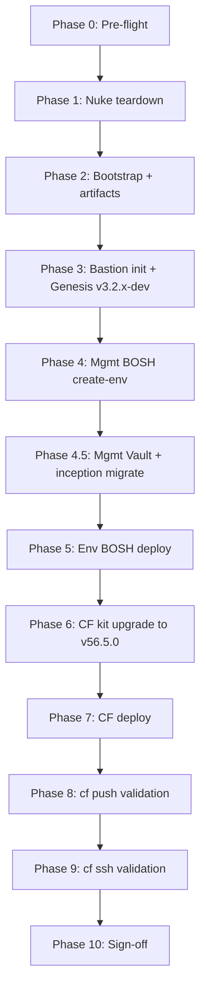

# PVE E2E Lab Testing Plan — `ocfp-lab-wayne`

End-to-end validation of the OCFP stack on the Proxmox VE lab: full nuke, bootstrap (with RustFS artifacts), management BOSH, environment BOSH, Cloud Foundry v56.5.0 (noble stemcell, compiled releases), then `cf push` and `cf ssh` validation. Local dev sources throughout; nothing pushed to origin.

- **Status**: Draft — awaiting execution approval (plan document only)
- **Target bloc**: `ocfp-lab-wayne`
- **Date**: 2026-05-31
- **Authority**: This file is the single source of truth for the run. Update progress and decisions here.

---

## 1. Objectives & Success Criteria

| # | Objective | Pass Condition |
|---|-----------|----------------|
| 1 | Clean slate | Nuke removes all PVE resources for the lab; teardown probe reports nothing left |
| 2 | Bootstrap | Network, security, bastion, keypairs, buckets provisioned and tagged `managed-by=ocfp,bloc=ocfp-lab-wayne` |
| 3 | Artifacts (RustFS) | `ocfp-lab-wayne-artifacts` VM up; buckets created; S3 endpoint + creds in Vault |
| 4 | Bastion init | OCFP CLI, Genesis (v3.2.x-dev), kits, and deployment configs present on bastion |
| 5 | Management BOSH | `bosh create-env` succeeds with latest PVE CPI dev build; mgmt director reachable |
| 6 | Environment BOSH | Mgmt director deploys env BOSH (`ocfp-lab-wayne-ocf`); env director reachable |
| 7 | Cloud Foundry | CF v56.5.0 noble + compiled releases deploys green on env BOSH via RustFS blobstore |
| 8 | App push | `cf push` of a test app succeeds; route reachable; app responds |
| 9 | App SSH | `cf ssh` into the app container works; interactive debug confirmed |

**Definition of done**: objectives 1–9 all pass, with evidence (command output) captured in the run log section at the end of this document.

---

## 2. Constraints & Ground Rules

- **Local dev sources only.** CF kit, BOSH kit, and Genesis use working-tree changes. **Never push to origin** for any of them (genesis, cf kit, bosh kit, CPI release).
- **Genesis branch**: `v3.2.x-dev` (canonical remote `RubidiumStudios/genesis`). Set `config.Genesis.Branch` accordingly. Never push to genesis.
- **CF kit** (`~/w/fivetwenty/studios/ocfp/src/kits/cf`): fix in place, including local source changes, do not push.
- **BOSH kit** (`~/w/fivetwenty/studios/ocfp/src/kits/bosh`): fix in place, do not push.
- **PVE CPI**: use the latest dev build in `~/w/proxmox/bosh-pve-cpi-release/`.
- **Deployments repo**: local `src/deployments/fivetwenty-ocfp/`. Sync to the bastion; **do not push**.
- **Genesis invocation**: use the `g` symlink (`/usr/local/bin/g` → `genesis`) with v3 environment addressing `g @<env>:<deployment-type> <verb>` (e.g. `g @ocfp-lab-wayne-mgmt:bosh deploy -F -y`). The `@<env>:<type>` notation, the `b` BOSH passthrough (`b deps`), and `do <addon>` are genesis v3 features — verified in the v3 lineage this project tracks (`RubidiumStudios/genesis v3.2.x-dev`). There is **no** `genesis list` command; discover env names with `ls ocfp/deployments/<type>/` (each env file's `genesis.env:` key is the canonical name, and matches the filename stem here).
- **Teardown mode**: `--nuke --force` (operator confirmed the PVE project is exclusively `ocfp-lab-wayne`).
- **No reverts** of unexpected working-tree edits; fix forward or ask.
- **Commits**: atomic, 48/72, imperative, no process references. Only when explicitly requested.

---

## 2.1 PVE Provider Specifics

The deploy/validation flow — bastion → mgmt BOSH → mgmt Vault → inception migrate → env BOSH → CF, all via the Genesis `g @env:type` pattern — is provider-agnostic. The provider plumbing and local-source restrictions unique to this run:

| Concern | PVE lab setting |
|---------|-----------------|
| Provider auth | PVE API token in Vault under the deployment's ocfp config base — `secret/config/ocfp-lab-wayne/<scope>/cpi/pve:*` (kit verified `…/ocf/cpi/pve`; verify the mgmt scope); host 10.64.64.1 |
| Object storage | Self-hosted **RustFS** artifacts VM; creds in Vault `secret/config/ocfp-lab-wayne/rustfs` |
| Deployments repo | local `src/deployments/fivetwenty-ocfp/` (sync to bastion, **do not push**) |
| FQDNs | `*.ocf.wayne.lab.fivetwenty.io` |
| CLI install | local build from `src/clis/ocfp` |
| CPI | local PVE CPI dev tarball, sha1-pinned (see §3) |
| Operator access | Tailscale (100.119.134.76) |
| Stemcell / CF | noble + CF v56.5.0 compiled (see §6) |

---

## 3. Current vs Desired State (the deltas to close)

| Component | Current | Desired | Action |
|-----------|---------|---------|--------|
| PVE CPI tarball (mgmt manifest) | `bosh-pve-cpi-dev-20260527172937.tgz`, ver `0+dev.1779589220`, sha1 `8209093f…` | latest build `bosh-pve-cpi-dev-20260531113237.tgz`, sha1 `3c6f9fa569ddacd7b025f755f745e71be83365f8`, size `70368515` | Ship tarball to bastion; update manifest path/version/sha1 |
| cf-deployment | v52.0.0 bundled (jammy-compiled ops) | **v56.5.0** noble-compiled | Enable feature `cf-deployment-version-56.5.0` (designed opt-in; not a manual submodule bump) — see §6 |
| CF stemcell | pve overlay forces `ubuntu-noble` | noble (native in v56.5.0) | Remove pve noble overlay once v56.5.0 provides it |
| CF compiled releases | conditional `kit_bug` bail at `blueprint.pm:366-384` (soft, fires only on pre-noble bundles via the `use-noble-stemcell.yml` gate) | compiled releases enabled on noble | Enable v56.5.0 feature so noble is default and the bail no longer fires; edit the hook only if it still trips |
| CF blobstore | `pve-blobstore` → RustFS via Vault | unchanged (keep RustFS) | Verify `secret/config/ocfp-lab-wayne/ocf/cf/blobstores/main` |
| Genesis branch | (unset / default) | `v3.2.x-dev` | Set in config; re-init bastion genesis |

> The CF kit upgrade (§6) is the highest-risk phase. v56.5.0 is expected to ship noble-compiled releases natively, collapsing the PVE-specific noble + source-compile hacks. Validate that assumption early via `genesis manifest` before deploying.

---

## 4. Reference Data (verified during research)

### Deployment environment files (`src/deployments/fivetwenty-ocfp/`)

| Role | File | Key facts |
|------|------|-----------|
| Shared bloc params | `bosh/ops/ocfp-lab-wayne.yml` | net `lvnet001` 10.64.64.0/18, gw .1, PVE host 10.64.64.1 (director) / 100.119.134.76 (operator), node `pve`, storage vm=`data` disk=`zfs-1` stemcell=`local` iso=`local`, `verify_ssl=false`; CF domains `apps.ocf.wayne.lab.fivetwenty.io`, `system.ocf.wayne.lab.fivetwenty.io` |
| Mgmt BOSH | `bosh/ocfp-lab-wayne-mgmt.yml` | kit dev/latest, iaas pve, features `ocfp,internal-db,pve-external-blobstore`, director 8cpu/16G/128G @ 10.64.64.10, stemcell openstack-kvm noble v1.364 |
| Env BOSH | `bosh/ocfp-lab-wayne-ocf.yml` | kit dev/latest, scale `dev`, `bosh_env: ocfp-lab-wayne-mgmt@/secret/exodus/`, @ 10.64.64.12 |
| CF | `cf/ocfp-lab-wayne-ocf.yml` | kit dev/latest, scale dev, features `ocfp,haproxy,self-signed,pve-blobstore`, `bosh_env: ocfp-lab-wayne-ocf@http://127.0.0.1:8234/secret/exodus/` |
| CF cloud-config | _kit-generated_ (`hooks/cloud-config.pm` → named config `ocfp-lab-wayne-ocf.cf`, uploaded by `genesis deploy`) | network `ocfp-lab-wayne-ocf.cf.net-ocf`, workload band .20–.50 from vault `net/subnets/*/reserved-ips`, 18 vm_types, 2 disk_types |

### Kits

- **CF kit** `kit.yml` v3.1.0; PVE is among its supported IaaS providers. PVE overlays in `ocfp/pve/` (`azs`, `external-blobstore`, `ocf`, `ssh-proxy`, `stemcell`). RustFS via `ocfp/pve/external-blobstore.yml` → `secret/config/<bloc>/ocf/cf/blobstores/main:*`. Bucket naming `<bloc>-ocf-cf[-packages|-buildpacks|-droplets|-resource-pool]`.
- **BOSH kit** `kit.yml` v4.1.0; supports pve (currently dirty — uncommitted PVE work). CPI release **not hard-pinned**: sourced via `pve_cpi_release_path` / `_version` / `_sha1` params (`overlay/cpis/pve-proto.yml`, `pve-base.yml`) as `file://((pve_cpi_release_path))`. PVE auth read via `meta.ocfp.vault.config "/cpi/pve"` → `secret/config/<bloc>/<scope>/cpi/pve:*` (keys host, user, api_token, node, vm_storage, disk_storage, stemcell_storage, iso_storage, network_bridge; `port`/`verify_ssl`/`vmid_range_start` are literals, not vault-sourced; api_token default).

### PVE CPI release (`~/w/proxmox/bosh-pve-cpi-release/`)

- Latest dev: `dev_releases/bosh-pve-cpi/bosh-pve-cpi-dev-20260531113237.tgz`, sha1 `3c6f9fa569ddacd7b025f755f745e71be83365f8`, size `70368515`.
- Branch `main`, clean, version `v0.0.1-94-g5ab6420`. Rebuild via `scripts/create-release dev` or `make dev-release` (emits `RELEASE_TGZ=…`).

### OCFP CLI command surface

- `ocfp bootstrap [--bloc] [--all|--artifacts|--bastion|--network|…] [--dry-run --output json] [--yes|--force]`
- `ocfp init <bastion|pg|bosh|cf|all> [--bloc] [--genesis|--ocfp|--config] [--resume] [--dry-run]`
- `ocfp teardown [--bloc] [--all|--nuke] [--force] [--empty] [--dry-run --output json]`
- `ocfp test <smoke|c2c|acceptance|…> [--bloc] [--timeout]`
- Bloc resolution: `--bloc` → `OCFP_BLOC` → state `~/.ocfp/<bloc>/.state/current.json` → single-bloc config.

---

## 5. Phase Flow



Each phase has: entry criteria, steps, verification, and a rollback/debug note. Stop and debug at the first failed verification before proceeding (systematic-debugging discipline).

---

## Phase 0 — Pre-flight

**Entry**: operator has Proxmox + Vault + Cloudflare access; on the operator host (Tailscale to 100.119.134.76).

**Steps**

1. Confirm tooling: `ocfp version`, `bosh --version`, `genesis --version`, `safe --version`, `cf version`, `yq --version`.
2. Confirm Genesis source on `v3.2.x-dev`: in the genesis checkout, `git branch --show-current` → `v3.2.x-dev` (do not push).
3. Confirm config: `~/.ocfp/config.yml` has bloc `ocfp-lab-wayne` with PVE provider, region/datacenter, `artifacts.enabled: true`, and `genesis.branch: v3.2.x-dev`.
4. Confirm Vault reachable and unsealed: `safe target` + `safe get secret/handshake` (or equivalent probe).
5. Confirm the latest CPI tarball exists locally: `ls -la ~/w/proxmox/bosh-pve-cpi-release/dev_releases/bosh-pve-cpi/bosh-pve-cpi-dev-20260531113237.tgz` and verify sha1 = `3c6f9fa569ddacd7b025f755f745e71be83365f8`.
   - If absent or stale, rebuild: `cd ~/w/proxmox/bosh-pve-cpi-release && make dev-release` and capture the new `RELEASE_TGZ`, version, and sha1 (then update §3/§4 and the mgmt manifest in Phase 4).
6. Snapshot current state of dirty kits for reference: `git -C ~/w/fivetwenty/studios/ocfp/src/kits/bosh status`, same for cf kit. Record what is already modified (do not revert).

**Verify**: all tools report versions; genesis on `v3.2.x-dev`; CPI tarball sha1 matches; Vault reachable.

**Debug note**: if config bloc missing fields, fix `~/.ocfp/config.yml` before continuing — bootstrap and init read it directly.

---

## Phase 1 — Nuke Teardown

**Entry**: Phase 0 green. Operator has explicitly confirmed nuke scope (PVE project is exclusively `ocfp-lab-wayne`).

**Steps**

1. Dry-run first to see the deletion plan:

   ```bash
   ocfp teardown --bloc ocfp-lab-wayne --nuke --dry-run --output json
   ```

2. Review the resource list. Confirm only lab resources appear.
3. Execute nuke (empties non-empty buckets so RustFS/blobstore buckets delete):

   ```bash
   ocfp teardown --bloc ocfp-lab-wayne --nuke --force --empty
   ```

4. Clean any BOSH/Genesis state that survives infra teardown:
   - On bastion (if it still exists at this point): remove `~/deployments/ocfp-lab-wayne/*.state` / create-env state files for mgmt BOSH.
   - Genesis exodus/secrets for the bloc, if a fresh secret tree is desired (confirm with operator before wiping Vault paths).
5. Clear local OCFP state if a truly fresh bootstrap is wanted: inspect `~/.ocfp/ocfp-lab-wayne/.state/` (teardown should clear cloud state; verify).

**Verify**

- Re-run `ocfp teardown --bloc ocfp-lab-wayne --dry-run` → reports nothing to delete.
- PVE UI / `qm list` on `pve` node shows no `ocfp-lab-wayne-*` VMs (bastion, artifacts, BOSH directors, CF VMs all gone).
- Cloudflare tunnel + DNS cleanup logged (soft-warn is acceptable; verify no stale `*.wayne.lab.fivetwenty.io` records for the lab if they block re-create).

**Debug note**: teardown retries 409 conflicts (3× backoff). If a resource is wedged, identify the dependency (volume attached to a VM, NIC on a subnet) and delete top-down per the priority order (LB → instances → NICs → buckets → snapshots → volumes → keypairs → IPs → sec groups → subnets → networks). The PVE idempotent probe means re-running teardown is safe.

---

## Phase 2 — Bootstrap + Artifacts (RustFS)

**Entry**: Phase 1 verified empty.

**Steps**

1. Bootstrap core infra (network, security groups, keypairs, bastion, buckets):

   ```bash
   ocfp bootstrap --bloc ocfp-lab-wayne --dry-run --output json   # preview
   ocfp bootstrap --bloc ocfp-lab-wayne --yes
   ```

2. Provision the artifacts (RustFS) VM and buckets:

   ```bash
   ocfp bootstrap --bloc ocfp-lab-wayne --artifacts --yes
   ```

   - Runs `/scripts/provision/artifacts` on `ocfp-lab-wayne-artifacts` over SSH (ProxyJump through bastion).
   - Creates buckets `ocfp-lab-wayne-{mgmt-bosh,ocf-bosh,artifacts-blobstore,shield}` plus CF buckets used later.
   - Writes S3 endpoint + creds to Vault `secret/config/ocfp-lab-wayne/rustfs` (best-effort).

3. **Known risk (PVE artifacts bootstrap gap)**: on PVE, RustFS user-data can be silently dropped — the artifacts VM may come up non-functional because there is no snippets storage configured for cloud-init user-data. Verify explicitly (next).

**Verify**

- `qm list` shows `ocfp-lab-wayne-bastion` and `ocfp-lab-wayne-artifacts` running.
- SSH to artifacts via bastion; confirm RustFS service is up and listening; `mc`/S3 probe lists the expected buckets.
- Vault has `secret/config/ocfp-lab-wayne/rustfs` populated. If not, run the documented fallback (`ocfp vault populate`) or write creds manually.
- Resources tagged `managed-by=ocfp,bloc=ocfp-lab-wayne`.

**Debug note**: if RustFS is dead due to dropped user-data, configure PVE snippets storage (e.g., enable `snippets` content on a storage pool) and re-provision the artifacts VM, or push the provision script manually over SSH. This is the documented PVE bootstrap gap — budget time here.

---

## Phase 3 — Bastion Init + Genesis v3.2.x-dev

**Entry**: bastion reachable; artifacts/RustFS healthy.

**Steps**

1. Full bastion init (OCFP CLI, Genesis, yq, kits, deployment configs):

   ```bash
   ocfp init bastion --bloc ocfp-lab-wayne
   ```

2. Ensure Genesis is on `v3.2.x-dev` (genesis-only fast path if re-running):

   ```bash
   ocfp init bastion --bloc ocfp-lab-wayne --genesis
   ```

3. Sync local deployment configs and **local kit sources** to the bastion. The CF and BOSH kits must reflect local working-tree changes (and the CF kit upgrade from Phase 6 once done):

   ```bash
   ocfp init bastion --bloc ocfp-lab-wayne --config
   ```

   - Confirm `~/deployments/ocfp-lab-wayne/` on the bastion contains the mgmt, ocf, and cf manifests plus ops/configs.
   - Confirm the local cf and bosh kit sources are present on the bastion (Genesis dev/latest pulls from the synced local path, not origin).

4. (Conditional) Initialize PostgreSQL. **Caveat**: `pg` is accepted as an `ocfp init` component argument, but no `pg` implementation was found in `executeInitialization` — treat it as possibly a no-op/unimplemented and verify before relying on it. The mgmt and env BOSH directors here use the `internal-db` feature, so a separate external PG may not be required for this run. Confirm what DBs the deployments actually expect before running:

   ```bash
   ocfp init pg --bloc ocfp-lab-wayne   # verify it actually provisions; may be unimplemented
   ```

5. Enter the bastion and establish the working session (validated bastion checkpoints):

   ```bash
   ocfp --bloc ocfp-lab-wayne ssh            # SSH into the bastion
   ocfp -h                                   # OCFP CLI present
   g -v                                      # Genesis alias active (v3.2.x-dev)
   ls ocfp/deployments/                      # bosh cf vault [shield doomsday concourse ...]
   safe targets                              # inception: ocfp-lab-wayne-inception @ http://127.0.0.1:8234
   ```

6. (Optional) Start the per-deployment tmux session to track deploys in parallel windows:

   ```bash
   ocfp tmux
   tmux attach -t ocfp
   ```

**Verify**

- On bastion: `genesis --version` reports a `v3.2.x-dev` build; `ocfp version` matches local.
- `ls ocfp/deployments/` shows deployment-type dirs (`bosh`, `cf`, `vault`, optional `shield`/`doomsday`/`concourse`); the create-env mgmt/ocf/cf manifests are also synced under `~/deployments/ocfp-lab-wayne/`.
- `safe targets` lists `ocfp-lab-wayne-inception` (current `*` target) at `http://127.0.0.1:8234` — confirms the inception Vault before migration (Phase 4.5).
- Local kit changes present on bastion (spot-check a known-modified file in the bosh kit `ocfp/pve/`).
- PG reachable with expected databases.

**Debug note**: Genesis writes trace logs after every command (`~/.genesis/mylogs/last-trace`). Use it for hook failures during the BOSH/CF phases.

---

## Phase 4 — Management BOSH (`create-env`)

**Entry**: bastion + Genesis ready; PG up.

**Steps**

1. **Ship the latest CPI tarball to the bastion** and place where the manifest expects it:

   ```bash
   scp ~/w/proxmox/bosh-pve-cpi-release/dev_releases/bosh-pve-cpi/bosh-pve-cpi-dev-20260531113237.tgz \
       <bastion>:/home/ubuntu/
   ```

2. **Update the mgmt manifest** `bosh/ocfp-lab-wayne-mgmt.yml` CPI reference to the latest build:
   - `pve_cpi_release_path: /home/ubuntu/bosh-pve-cpi-dev-20260531113237.tgz`
   - `pve_cpi_release_version: 0+dev.<matching>` (use the version embedded in the new tarball's `release.MF`)
   - `pve_cpi_release_sha1: 3c6f9fa569ddacd7b025f755f745e71be83365f8`
   - Re-sync config to bastion (`ocfp init bastion --config`) if edited locally.
3. Confirm PVE CPI creds in Vault under the mgmt deployment's ocfp config base — `secret/config/ocfp-lab-wayne/<scope>/cpi/pve:*` (host, api_token, node, storage pools, network_bridge). Resolve the exact `<scope>` with `safe tree secret/config/ocfp-lab-wayne` (kit reads via `meta.ocfp.vault.config`; `port`/`verify_ssl`/`vmid_range_start` are literal defaults, not vault-sourced).
4. Render and inspect the manifest before deploying:

   ```bash
   g @ocfp-lab-wayne-mgmt:bosh manifest      # sanity-check CPI release + stemcell refs
   ```

5. Deploy the mgmt director (proto-BOSH via create-env; the validated path drives Genesis directly):

   ```bash
   g @ocfp-lab-wayne-mgmt:bosh deploy -F -y  # primary, validated path
   # Alternative CLI wrapper:
   #   ocfp init bosh --bloc ocfp-lab-wayne   (runs bosh create-env for the mgmt manifest)
   ```

6. Capture deployment info and confirm BOSH responds:

   ```bash
   g @ocfp-lab-wayne-mgmt:bosh info          # director URL, creds location
   g @ocfp-lab-wayne-mgmt:bosh b deps        # bosh deployments passthrough
   ```

**Verify**

- `bosh create-env` completes; state file written; director VM `ocfp-lab-wayne-mgmt` @ 10.64.64.10 running on PVE.
- `g @ocfp-lab-wayne-mgmt:bosh b env` (the `b` BOSH passthrough) returns director info.
- Director creds in Vault/exodus.

**Debug note**: CPI release version mismatch between `pve_cpi_release_version` and the tarball's `release.MF` is the most likely failure — extract and read the MF (`tar -xzOf <tgz> release.MF`) to get the exact version string. Watch for QEMU guest agent / stemcell template dedup behavior (recent CPI commits touch these).

---

## Phase 4.5 — Management Vault + Inception Migration

**Entry**: mgmt director healthy. Required before env BOSH and CF, which resolve secrets from `/secret/exodus/` on the real Vault. Until this runs, secrets live in the in-memory inception Vault at `http://127.0.0.1:8234` (the address the CF env file references).

**Steps**

1. Deploy the management Vault on the mgmt director:

   ```bash
   g @ocfp-lab-wayne-mgmt:vault deploy -F -y
   ```

2. Initialize and unseal it:

   ```bash
   g @ocfp-lab-wayne-mgmt:vault do i         # init/unseal addon (requires input)
   g @ocfp-lab-wayne-mgmt:vault info
   ```

3. Migrate secrets from the inception (in-memory) Vault into the mgmt Vault:

   ```bash
   ocfp vault migrate                        # requires user input
   ```

4. Confirm the active Vault target switched off inception:

   ```bash
   safe targets                              # current (*) is now the mgmt vault, not -inception
   ```

**Verify**

- `g @ocfp-lab-wayne-mgmt:vault info` shows the deployment up and unsealed.
- `safe targets` current target is the mgmt Vault (no longer `ocfp-lab-wayne-inception` @ 127.0.0.1:8234).
- Config secrets readable from the migrated Vault: `safe get secret/config/ocfp-lab-wayne/rustfs`, `…/cpi/pve`, `…/ocf/cf/blobstores/main`.

**Debug note**: if env BOSH or CF later fail resolving `((...))` Vault refs, the migration did not complete or the target reverted to inception — re-check `safe targets` and re-run `ocfp vault migrate`.

> **Optional mgmt platform services** (out of scope for this CF-focused e2e; same validated pattern): SHIELD `g @ocfp-lab-wayne-mgmt:shield deploy -F -y` then `do rc`; Doomsday `g @ocfp-lab-wayne-mgmt:doomsday do setup-approle` then `deploy -F -y`; Concourse likewise. Deploy these only if extending to a full mgmt buildout.

---

## Phase 5 — Environment BOSH

**Entry**: mgmt director and mgmt Vault healthy (Phase 4.5 complete; secrets resolve from `/secret/exodus/`).

**Steps**

1. Confirm env manifest `bosh/ocfp-lab-wayne-ocf.yml` is `scale: dev` and `bosh_env: ocfp-lab-wayne-mgmt@/secret/exodus/` (prevents the recursion hook issue).
2. Upload the noble stemcell to the mgmt director if not already present. Pin **openstack-kvm ubuntu-noble `1.364`** (sha1 `d6cc58bda0120fe47787a46775ff5bafc5718257`) — this version is **not arbitrary**: the bosh kit's compiled releases (`bosh-deployment/{bosh,uaa,credhub}.yml`) are compiled against noble-`1.364`, so the director VM stemcell must match it or BOSH rejects the compiled packages (they ship no source to recompile). **Download from the stable GCS bucket, not bosh.io.** `bosh.io/d/stemcells/...?v=1.364` returns 404 because bosh.io delists old point-releases; the artifact lives permanently at GCS:

   ```bash
   # NOTE: name has NO -go_agent suffix; pull from GCS (bosh.io delists old versions)
   bosh -n upload-stemcell \
     https://storage.googleapis.com/bosh-core-stemcells/1.364/bosh-stemcell-1.364-openstack-kvm-ubuntu-noble.tgz \
     --sha1 d6cc58bda0120fe47787a46775ff5bafc5718257
   # If/when bumping noble: bump the kit's compiled-release URLs to the SAME new version in lockstep.
   ```
3. Deploy env BOSH via the mgmt director (now reading mgmt creds from the migrated Vault `@/secret/exodus/`):

   ```bash
   g @ocfp-lab-wayne-ocf:bosh deploy -F -y   # mgmt director deploys env BOSH
   g @ocfp-lab-wayne-ocf:bosh info
   g @ocfp-lab-wayne-ocf:bosh b deps
   ```

4. No manual cloud-config upload. Under Genesis 3.2 kit-populated cloud-config
   (OCFP-only), the CF kit's `hooks/cloud-config.pm` **generates** the named
   config `ocfp-lab-wayne-ocf.cf` and `genesis deploy` uploads it automatically
   (`bosh update-config --type cloud --name ocfp-lab-wayne-ocf.cf`), diffing
   against the director's current config and prompting on change. Operators do
   **not** hand-author a `bosh/configs/cloud/*.yml`; tune only via the env file's
   `bosh-configs.cloud.*` keys (e.g. `networks.ocf.allocation.size`). The network
   name and IPAM come from vault topology written by the ocfp CLI
   (`net/subnets/*`, including the `available_0/available_1` workload band).

**Verify**

- Env director VM `ocfp-lab-wayne-ocf` @ 10.64.64.12 running.
- `bosh -e ocf env` returns director info. The CF cloud-config appears only after the first `genesis deploy` of CF (`bosh -e ocf configs --type cloud` lists `ocfp-lab-wayne-ocf.cf`).
- noble stemcell present on the env director (`bosh -e ocf stemcells`).

**Debug note**: the generated network name is `ocfp-lab-wayne-ocf.cf.net-ocf` (`<env.name>.<env.type>.net-ocf`) and the manifest's `cf_*_network` must match it — never hardcode `cf_*_network` in the env file. CF VMs land in the vault-defined available band (.20–.50); if they collide with infra, fix the band via the bloc config `network.available_ip_start/end` and re-run vault populate, not by editing a cloud-config file.

---

## Phase 6 — CF Kit Upgrade to v56.5.0 (noble + compiled)

**Entry**: env BOSH ready. This is the highest-risk phase — do it as a focused, validated change. **Local source only, do not push.**

**Goal**: get the local CF kit to **cf-deployment v56.5.0 with noble-compiled releases**. Memory note: v56.5.0 ships noble as default plus noble-compiled releases (including bpm 1.4.31), which collapses the PVE cf-kit hacks.

**Verified starting state** (do not assume otherwise):

- The kit bundles cf-deployment **v52.0.0** (`cf-deployment/cf-deployment.yml` `manifest_version: v52.0.0`).
- The bundled `cf-deployment/operations/use-compiled-releases.yml` is **jammy** (`os: ubuntu-jammy` throughout) — it cannot satisfy the noble stemcell PVE requires.
- The kit exposes the feature **`cf-deployment-version-56.5.0`** (referenced in `hooks/blueprint.pm:377`) — this is the designed mechanism to opt into the noble-default v56.5.0 upstream, **not** a manual submodule bump.
- The pve/compiled conflict is a conditional `kit_bug` at `hooks/blueprint.pm:366-384`, gated on the presence of `cf-deployment/operations/use-noble-stemcell.yml` (a pre-noble-default artifact). It is a soft bail, **not** a hard reject, and it does **not** fire once cf-deployment defaults to noble.

**Steps**

1. Enable the **`cf-deployment-version-56.5.0`** feature in the CF env file `cf/ocfp-lab-wayne-ocf.yml` (the designed opt-in to the noble-default v56.5.0 upstream). Incorporate local kit source changes as needed; **do not push**. Do NOT hand-bump the bundled v52.0.0 submodule as the primary path.
2. Verify v56.5.0's compiled-releases ops file targets **noble**. The bundled v52 `use-compiled-releases.yml` is jammy; confirm the feature-selected v56.5.0 path wires the noble-compiled ops/blobs. If the kit still references the jammy ops file, fix the kit (locally) to use v56.5.0's noble-compiled releases.
3. With v56.5.0 noble-default, the PVE noble-forcing hacks become redundant — neutralize only what is now unnecessary, and confirm (don't assume) the conflict bail no longer fires:
   - `ocfp/pve/stemcell.yml` (`params.stemcell_os: ubuntu-noble`) is redundant once v56.5.0 defaults noble — neutralize.
   - The `kit_bug` at `blueprint.pm:366-384` should not trip (its `use-noble-stemcell.yml` gate is a pre-noble artifact). Only edit the hook if it still fires.
   - **Keep** these PVE overlays: `external-blobstore.yml` (RustFS), `azs.yml`, `ocf.yml`, and `ssh-proxy.yml`. Note: `ssh-proxy.yml` is **not** a `cf ssh` enabler — it strips the `diego-ssh-proxy-network-properties` vm_extension so PVE's flat layer-2 network keeps a single `ssh_proxy` link provider (avoids BOSH "multiple link providers" errors). It is required for a clean PVE deploy, independent of `cf ssh`.
4. Set features in `cf/ocfp-lab-wayne-ocf.yml`: add `cf-deployment-version-56.5.0` and `compiled-releases`; keep `pve-blobstore`, `haproxy`, `self-signed`, `ocfp`. Drop any source-compile-only flag (e.g. `source-releases`).
5. **`cf ssh` dependency**: `cf ssh` is served by the standard `ssh_proxy` instance group from cf-deployment (not the PVE overlay). Confirm the `ssh_proxy` IG survives in the v56.5.0 manifest (Phase 9 depends on it).
6. Re-sync kit to bastion: `ocfp init bastion --bloc ocfp-lab-wayne --config`.
7. Render before deploy:

   ```bash
   g @ocfp-lab-wayne-ocf:cf manifest         # verify v56.5.0, noble, compiled blobs, RustFS blobstore
   ```

**Verify**

- Manifest shows: cf-deployment v56.5.0 lineage, `stemcell: ubuntu-noble`, compiled releases with **noble** blobs (NOT `ubuntu-jammy`), bpm ≈ 1.4.31, blobstore pointing at the RustFS endpoint from Vault.
- The `blueprint.pm:366-384` conflict bail does not fire.
- The `ssh_proxy` instance group is present in the rendered manifest.
- Manifest diff reviewed and sane (no jammy blobs, no leftover source-compile artifacts).

**Debug note**: if the rendered compiled-releases ops still references `ubuntu-jammy` blobs, the feature did not switch the upstream version or the kit still wires the v52 jammy ops file — fix the kit locally to use v56.5.0's noble-compiled releases. If the `kit_bug` bail fires, `use-noble-stemcell.yml` is still present or the version feature did not take effect. Confirm bpm ≥ 1.4.31 (the Noble cgroup v2 fix). Capture the manifest diff here before deploying.

---

## Phase 7 — Cloud Foundry Deploy

**Entry**: Phase 6 manifest validated; env BOSH cloud config uploaded; RustFS healthy.

**Steps**

1. Confirm CF blobstore creds in Vault `secret/config/ocfp-lab-wayne/ocf/cf/blobstores/main:*` and CF buckets exist (`ocfp-lab-wayne-ocf-cf[-packages|-buildpacks|-droplets|-resource-pool]`).
2. Deploy CF via env BOSH:

   ```bash
   g @ocfp-lab-wayne-ocf:cf deploy -F -y     # env-BOSH deploys CF
   g @ocfp-lab-wayne-ocf:cf info             # API endpoint, admin creds location
   ```

   (Alternative CLI wrapper: `ocfp init cf --bloc ocfp-lab-wayne`, if wired to the same manifest.)
3. Watch the deploy; expect compiled releases to skip the compilation VMs (faster than source-compile).

**Verify**

- `bosh -e ocf -d <cf-deployment> instances` all running/healthy; no failing processes (bpm starts cleanly on noble — the cgroup v2 / bpm 1.4.31 check).
- haproxy reachable at static IP .20.
- `cf api https://api.system.ocf.wayne.lab.fivetwenty.io --skip-ssl-validation` then `cf auth` succeeds.
- `cf orgs` / `cf create-org` works (cloud_controller + DB healthy).

**Debug note**: bpm-on-noble cgroup v2 was the prior blocker — v56.5.0/bpm 1.4.31 resolves it; if any job won't start with a bpm/cgroup error, the compiled bpm version is wrong. Check blobstore reachability if droplets/packages fail to upload (RustFS endpoint + creds). Genesis trace log for hook/exodus issues.

---

## Phase 8 — App Push Validation

**Entry**: CF API reachable and authenticated.

**Steps**

1. Target an org/space:

   ```bash
   cf create-org e2e && cf target -o e2e
   cf create-space test && cf target -s test
   ```

2. Push a minimal test app (staticfile or a tiny Go/Ruby app):

   ```bash
   cf push e2e-test --random-route -m 64M    # buildpack staging via compiled buildpacks
   ```

3. Hit the route:

   ```bash
   cf app e2e-test                            # note the route
   curl -k https://<route>                    # expect 200 + app body
   ```

**Verify**

- Staging succeeds (buildpack pulled from RustFS buildpacks bucket; droplet stored in droplets bucket).
- App reaches `running` 1/1.
- Route responds 200.

**Debug note**: staging failures usually mean blobstore (RustFS) write/read problems or missing buildpacks — `cf buildpacks` should list defaults. Diego cell scheduling failures point back to the env-BOSH cloud config (vm_types/networks).

---

## Phase 9 — App SSH Validation (debug path)

**Entry**: app running from Phase 8.

**Steps**

1. Confirm ssh is enabled platform-wide and for the space/app:

   ```bash
   cf ssh-enabled e2e-test
   cf enable-ssh e2e-test     # if needed; then cf restart e2e-test
   ```

2. SSH into the container and run interactive debug:

   ```bash
   cf ssh e2e-test
   # inside: ps aux ; env ; cat /proc/self/cgroup ; exit
   cf ssh e2e-test -c "echo ok && hostname"     # non-interactive form
   ```

**Verify**

- `cf ssh` opens an interactive shell into the app container.
- Commands run; output returns; clean exit.
- Confirms the diego ssh proxy (PVE `ssh-proxy.yml` overlay) survived the v56.5.0 kit upgrade.

**Debug note**: `cf ssh` failures are almost always the ssh proxy / scheduler routing — verify the `ssh_proxy` instance group is deployed and the ssh proxy route/port is reachable through haproxy. Confirm `ssh-proxy.yml` was retained in Phase 6.

---

## Phase 10 — Sign-off

**Steps**

1. Re-confirm objectives 1–9 in §1 with captured evidence.
2. Record final versions actually deployed: CPI build, cf-deployment, bpm, stemcell, Genesis branch/commit.
3. Note every issue hit and the fix applied (feed back into kit/CPI/CLI as warranted — local only).
4. Decide teardown vs leave-running for further testing.
5. If kit/CLI fixes are worth keeping: stage atomic commits (local only; no origin push per rules), suggest `/commit plan`.

---

## 6.1 Risk Register

| Risk | Likelihood | Impact | Mitigation |
|------|-----------|--------|------------|
| RustFS user-data dropped on PVE (artifacts non-functional) | High | Blocks blobstore | Configure PVE snippets storage; re-provision; manual provision over SSH (Phase 2) |
| CPI version string mismatch (manifest vs tarball MF) | High | create-env fails | Read `release.MF` from tarball; set exact version (Phase 4) |
| v56.5.0 compiled ops file still references jammy blobs | Medium | Compiled goal fails on noble | Verify/point at noble-compiled blobs; check bpm ≥ 1.4.31 (Phase 6) |
| `kit_bug` bail at `blueprint.pm:366-384` still fires | Medium | Manifest render bails | Confirm the `cf-deployment-version-56.5.0` feature took effect (noble now default); the bail is gated on `use-noble-stemcell.yml` — re-render (Phase 6) |
| Bootstrap-written vault paths don't match kit-read paths | Medium | Deploy can't resolve creds | Bootstrap writes `secret/config/<bloc>/rustfs`; kits read under the deployment's ocfp config base (e.g. `…/ocf/cpi/pve`, `…/ocf/cf/blobstores/main`). Verify alignment with `safe tree secret/config/ocfp-lab-wayne`; bridge via `ocfp vault populate` (Phases 2, 4) |
| CF network-name / IPAM mismatch (manifest vs kit-generated cloud-config) | Medium | CF placement fails ("unknown network") | Never hardcode `cf_*_network`; let ocfp.yml derive `ocfp-lab-wayne-ocf.cf.net-ocf`; set available band via bloc config `network.available_ip_start/end` → vault `available_*` (Phases 5, 7) |
| `cf ssh` proxy lost in kit upgrade | Medium | Objective 9 fails | Retain `ssh-proxy.yml`; verify ssh proxy IG (Phases 6, 9) |
| Vault unreachable during bootstrap | Low | Creds missing | `ocfp vault populate` fallback; manual writes (Phases 2, 4, 7) |
| Accidental push to origin (genesis/kits/CPI) | Low | Rule violation | Never push; local-only throughout |

## 6.2 Rollback / Recovery

- Any phase failure: stop, debug at the failure point (do not push past a red verification).
- Infra wedged: re-run `ocfp teardown --bloc ocfp-lab-wayne --nuke --force --empty` (idempotent on PVE) and restart from Phase 2.
- Kit change regression: fix forward in the local kit; never `git checkout` to revert (user edits in parallel).
- Genesis hook failures: read `~/.genesis/mylogs/last-trace` on the bastion.

---

## 7. Command Quick-Reference

```bash
# Teardown (nuke)
ocfp teardown --bloc ocfp-lab-wayne --nuke --dry-run --output json
ocfp teardown --bloc ocfp-lab-wayne --nuke --force --empty

# Bootstrap
ocfp bootstrap --bloc ocfp-lab-wayne --yes
ocfp bootstrap --bloc ocfp-lab-wayne --artifacts --yes

# Bastion / components
ocfp init bastion --bloc ocfp-lab-wayne
ocfp init bastion --bloc ocfp-lab-wayne --genesis
ocfp init bastion --bloc ocfp-lab-wayne --config
ocfp init pg --bloc ocfp-lab-wayne            # conditional; may be unimplemented (verify)

# Bastion access
ocfp --bloc ocfp-lab-wayne ssh                # enter bastion
ocfp tmux ; tmux attach -t ocfp               # per-deployment windows
ls ocfp/deployments/ ; safe targets ; g -v    # validate layout + vault + genesis

# Mgmt BOSH (proto / create-env)
g @ocfp-lab-wayne-mgmt:bosh manifest
g @ocfp-lab-wayne-mgmt:bosh deploy -F -y      # (or: ocfp init bosh --bloc ocfp-lab-wayne)
g @ocfp-lab-wayne-mgmt:bosh info ; g @ocfp-lab-wayne-mgmt:bosh b deps

# Mgmt Vault + inception migration
g @ocfp-lab-wayne-mgmt:vault deploy -F -y
g @ocfp-lab-wayne-mgmt:vault do i ; g @ocfp-lab-wayne-mgmt:vault info
ocfp vault migrate ; safe targets

# Env BOSH (deployed by mgmt)
g @ocfp-lab-wayne-ocf:bosh deploy -F -y
g @ocfp-lab-wayne-ocf:bosh info ; g @ocfp-lab-wayne-ocf:bosh b deps
# CF cloud-config is kit-generated + auto-uploaded by `genesis deploy` (Phase 7);
# no manual `bosh update-config` step.

# CF (deployed by env BOSH)
g @ocfp-lab-wayne-ocf:cf manifest
g @ocfp-lab-wayne-ocf:cf deploy -F -y ; g @ocfp-lab-wayne-ocf:cf info

# App validation
cf api https://api.system.ocf.wayne.lab.fivetwenty.io --skip-ssl-validation
cf push e2e-test --random-route -m 64M
cf ssh e2e-test
```

---

## 8. Run Log (fill during execution)

| Phase | Started | Result | Notes / issues / fixes |
|-------|---------|--------|------------------------|
| 0 Pre-flight | 2026-05-31 | ✅ PASS | Tools OK (`ocfp --version` not `version`; bastion tailscale IP is 100.96.150.97 not doc's 100.119.134.76). Config map-form, genesis-community/genesis@v3.2.x-dev. CPI sha1 ✓. `bootstrap --artifacts` & `init pg` both exist. Vault `:8201` reachable. |
| 1 Nuke | 2026-05-31 | ✅ PASS (scoped, NOT --nuke) | Nuke dry-run exposed shared project: would also delete `lvnet002-007` (other users), `vmbr0/1/9` (host bridges), templates, 18 `cpi-*` VMs. Per user decision: scoped destroy of 19 `ocfp-lab-wayne-*` VMs by verified VMID via PVE API (stop→purge). lvnet001 kept. Protected set intact. |
| 2 Bootstrap + artifacts | 2026-05-31 | ✅ PASS | Core infra OK (lvnet001 reused, subnets, 7 SGs, keypair, public-IPs). Stale May-28 state made first bootstrap skip bastion/artifacts as "exists"; `state sync --full` is NOT bloc-scoped (pulled every user's resources) so restored backup + surgically deleted stale keys. **Bastion**: original block was missing tailscale auth key → SMBIOS skipped (`compute.go:654`); user fixed the vault path (`secret/ocfp-lab-wayne/tailscale:auth_key`); recreated VM → firstboot joined tailnet as **100.109.226.53** (SSH OK); config `bastion_ip` updated. **Artifacts FIXED via code**: added SSH-provision (ProxyJump bastion→artifacts) since PVE 9.x blocks the snippet path — `RenderArtifactsProvisionScript` + `provisionArtifactsViaSSH` in the cf-cli (TDD, 36 pkgs green). Dropped `awscli` (no Noble apt candidate). RustFS now `active (running)`, rpool ONLINE on /dev/sdb, dataset at /data, S3 :9000 returns 403 (healthy). 6 BOSH/CF buckets created via bastion+mc. **Follow-ups (non-blocking)**: bastion template doesn't enable `ip_forward` (patched live; needs firstboot fix); stale OFFLINE tailnet node `ocfp-wayne-bastion` holds the `10.64.64.0/18` primary route → operator→SDN blackholes (needs tailnet admin cleanup; BOSH/CF are intra-SDN so unaffected). |
| 3 Bastion + Genesis | 2026-05-31 | ✅ PASS | `ocfp init bastion` sources Genesis (genesis-community@v3.2.x-dev — v3.2.0 `a5fc359`), kits, and deployments from REMOTE git, NOT local trees. **Brew enablement (per directive "Linux Brew must be installed and most tools installed via it")**: lifted the PVE `brewSkipped` skip (was gated on kvm64 lacking SSSE3); cloned bastion VMs now get `cpu=host` (`buildPVEDirectCloudInitConfig`) so SSSE3 bottles run; brew shellenv injected into the script preamble. Result: 99 brew packages incl. `vault`/`bao`/`yq`/`jq` from `/home/linuxbrew`, rest (`genesis`/`safe`/`spruce`/`bosh`/`cf`/`credhub`/`uaa`) from upstream releases in `/usr/local/bin`. **uaa fix**: release tag carries leading `v` (path `download/v0.20.0/`) but the asset filename drops it (`uaa-linux-amd64-0.20.0`); `VERSION` is `v`-stripped so the URLTemplate path segment now hard-codes the `v` (`tools.go`/`config.go`). Init now **27/27 phases green, verification 10/10** (incl. `uaa 0.20.0`). Removed `known_hosts:225` malformed entry blocking the Go-SSH `--config` path. **Phase 4 prep**: deployment dirs on bastion still empty — pending `rsync` of local `src/kits/{bosh,cf}` + `src/deployments/fivetwenty-ocfp/{bosh,cf}`; bumped mgmt manifest CPI refs to newest dev build `20260531113237` (`0+dev.1779589233`, sha1 `3c6f9fa…`); CPI tarball not yet on bastion; PG inactive but mgmt uses `internal-db` so likely N/A. |
| 4 Mgmt BOSH | | | |
| 4.5 Mgmt Vault + migrate | | | |
| 5 Env BOSH | | | |
| 6 CF kit v56.5.0 | | | |
| 7 CF deploy | | | |
| 8 cf push | | | |
| 9 cf ssh | | | |
| 10 Sign-off | | | |
