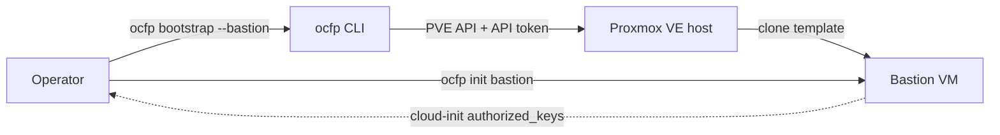

# Bootstrapping a Bastion on Proxmox VE

This guide walks through provisioning an OCFP bastion VM on a Proxmox VE (PVE) host using `ocfp bootstrap --bastion`.

## Overview

The OCFP CLI provisions a bastion VM directly against the PVE API using the `pve` provider in `src/clis/ocfp/internal/cpi/pve/`. The bastion is a long-lived Ubuntu VM that hosts the Genesis toolchain, BOSH/CF/Vault clients, and OCFP CLI itself — the operator SSHes into it to drive subsequent deployments.



## Prerequisites

### 1. Proxmox VE host

- PVE 8.x or 9.x cluster (single-node is fine).
- Reachable on its API port (default 8006) from the operator workstation.
- A working Linux bridge (e.g. `vmbr0`) attached to the network the bastion should live on.
- Datacenter firewall enabled: **Datacenter → Firewall → Options → Firewall: Yes**. Required for OCFP's security-group bootstrap step. Skip only if you disable the `--security-groups` phase explicitly.

### 2. PVE API token

API token auth is preferred over username/password. Create one in the PVE UI:

**Datacenter → Permissions → API Tokens → Add**

- User: `root@pam` (or a dedicated user with `PVEVMAdmin` + `PVEDatastoreAdmin` + `PVESDNAdmin`)
- Token ID: e.g. `ocfp-bootstrap`
- Privilege Separation: unchecked (simpler) or scoped via ACL if separated
- Copy the resulting **token ID** (`user@realm!token-name`) and **secret UUID** — the secret is shown once.

Smoke-test the token from your workstation:

```bash
curl -k \
  -H 'Authorization: PVEAPIToken=USER@REALM!TOKEN-ID=SECRET-UUID' \
  https://pve.example.internal:8006/api2/json/version
```

A `{"data":{"version":"...","release":"..."}}` payload confirms the token works.

### 3. Cloud-init Ubuntu template

OCFP's bastion provisioner clones a template VM. When the configured template
is missing on the cluster, OCFP **auto-provisions** it from the catalog at
[`internal/cpi/pve/templates.go`](../src/clis/ocfp/internal/cpi/pve/templates.go):
the PVE node downloads the cloud image directly from
`cloud-images.ubuntu.com` into ISO storage, creates a VM with
`import-from=<volid>` disk syntax, and converts it to a template. VMIDs are
allocated from the 9000+ range via `/cluster/nextid`. No `qm` invocations on
the PVE host required.

Supported catalog names (case-sensitive — set `bastion.image` to one of
these to opt into auto-provisioning):

- `ubuntu-noble-template` — Ubuntu 24.04 LTS
- `ubuntu-jammy-template` — Ubuntu 22.04 LTS

The provider config needs `iso_storage` set (it always does for cloud-init
snippets — see §4) and `default_storage` pointing at a pool that accepts
VM disks (e.g. `local-lvm`, `local-zfs`). When both are set, auto-provision
runs on first use and is idempotent on subsequent runs.

**Manual fallback.** For images not in the catalog, or to disable
auto-provision, create the template by hand. SSH to the PVE host as root:

```bash
cd /var/lib/vz/template/iso
wget -O noble-amd64.img https://cloud-images.ubuntu.com/noble/current/noble-server-cloudimg-amd64.img

TEMPLATE_VMID=9000
TEMPLATE_NAME=ubuntu-noble-template
TARGET_STORAGE=data    # adjust to match your storage pool

qm create "$TEMPLATE_VMID" \
  --name "$TEMPLATE_NAME" \
  --memory 2048 --cores 2 \
  --net0 virtio,bridge=vmbr0 \
  --serial0 socket --vga serial0 \
  --agent enabled=1

qm importdisk "$TEMPLATE_VMID" noble-amd64.img "$TARGET_STORAGE"
qm set "$TEMPLATE_VMID" --scsihw virtio-scsi-pci --scsi0 "$TARGET_STORAGE":vm-"$TEMPLATE_VMID"-disk-0
qm set "$TEMPLATE_VMID" --ide2 "$TARGET_STORAGE":cloudinit
qm set "$TEMPLATE_VMID" --boot c --bootdisk scsi0
qm template "$TEMPLATE_VMID"
```

Reference: the `bosh-pve-cpi-release` project at `~/w/proxmox/bosh-pve-cpi-release/` is a working Go BOSH CPI for Proxmox; its test manifest `manifests/vars.yml` is the source of truth for known-good PVE settings.

### 4. `pve-apiclient-go` v3.1.1 or newer

OCFP depends on `github.com/fivetwenty-io/pve-apiclient-go/v3 v3.1.1`. **v3.1.0 has a known iota bug** in `pkg/client/options.go` that silently shifts `SSLVerifyNone` to value 2 (which maps to internal `SSLVerifyHost`), leaving `InsecureSkipVerify=false` even when callers ask for it — TLS verification cannot be disabled on v3.1.0. v3.1.1 fixes it by splitting the SSL constants into a dedicated `const` block. Local upstream is at `~/w/proxmox/pve-apiclient-go`.

Pin or replace:

```bash
cd ~/w/fivetwenty/studios/ocfp/src/clis/ocfp

# Standard pin (recommended)
go get github.com/fivetwenty-io/pve-apiclient-go/v3@v3.1.1
go mod tidy

# OR local replace (use unreleased fixes from HEAD)
go mod edit -replace github.com/fivetwenty-io/pve-apiclient-go/v3=$HOME/w/proxmox/pve-apiclient-go
go mod tidy
```

### 5. Build the ocfp CLI

```bash
cd ~/w/fivetwenty/studios/ocfp/src/clis/ocfp
make build
# Produces build/ocfp-darwin-arm64 and build/ocfp-linux-amd64
```

## Bloc configuration

OCFP reads a bloc config from `~/.ocfp/<file>.yml` (or `--config <path>`). A minimal bloc that targets PVE with API-token auth and bridge networking:

```yaml
--- # OCFP Config — Proxmox VE example
debug: true
verbose: false

blocs:
  EXAMPLE-pve-bloc:
    provider: pve
    region: pve                        # PVE node name
    nodes: [pve]                       # cluster nodes for multi-AZ (single-node: one entry)

    # --- Connection -----------------------------------------------------
    api_endpoint: https://pve.example.internal:8006
    # PVE token format in the header is PVEAPIToken=USER@REALM!TOKEN-ID=SECRET-UUID
    # Split the two halves into these two fields:
    auth_token:   "REDACTED@REALM!REDACTED-TOKEN-ID"     # token ID only (no =UUID)
    token_secret: "REDACTED-TOKEN-SECRET-UUID"           # secret UUID only
    verify_ssl:   false                                  # skip TLS verification for self-signed PVE certs

    # --- Networking (bridge mode) --------------------------------------
    network:
      name: vmbr0                      # Linux bridge already present on the PVE host
      network_cidr: 192.168.1.0/24     # informational; bridge mode is flat

    # --- Bastion VM ----------------------------------------------------
    bastion:
      flavor: bastion                  # preset: 2 vCPU / 4 GB / 50 GB disk
      image: ubuntu-noble-template     # PVE template name OR VMID (e.g. 9000)
      ssh_user: ubuntu                 # default cloud-image user
      genesis:
        enabled: true                  # install Genesis toolchain during init bastion
      keys:                            # extra SSH public keys appended to authorized_keys
        operator-a: "github.com/operator-a"
        operator-b: "github.com/operator-b"

    # --- Genesis deployments source -----------------------------------
    deployments:
      url: git@github.com:example-org/example-ocfp-deployments

    # --- DNS / FQDNs ---------------------------------------------------
    fqdns:
      base: example.pve.ocfp.example.io
      mgmt:
        shield: shield.util.example.pve.ocfp.example.io
      ocf:
        apps:    apps.example.pve.ocfp.example.io
        stratos: console.example.pve.ocfp.example.io
        system:  system.example.pve.ocfp.example.io

    # --- Jumpbox user keys (stored in Vault) --------------------------
    jumpbox:
      users:
        operator-a: "github.com/operator-a"
        operator-b: "github.com/operator-b"

    # --- Network ACLs --------------------------------------------------
    allowed_ingress_ips:
      - 192.168.1.0/24                 # PVE internal subnet (intra-cluster)
      - 203.0.113.10                   # office static
      - 198.51.100.0/24                # remote lab range
```

> **Do not commit real credentials.** Use redacted placeholders in the repo and inject the live values via Vault, environment variables, or local-only files outside version control. The `auth_token` and `token_secret` fields above are PVE-specific and never apply to other providers.

### Field reference

| Field | Required | Notes |
|-------|----------|-------|
| `provider` | yes | Must be `pve`. |
| `region` | yes | PVE node name (matches `pvesh get /nodes`). |
| `nodes` | optional | List of cluster nodes for multi-AZ; defaults to `[region]`. |
| `api_endpoint` | yes | Full URL including scheme and port (`https://host:8006`). |
| `auth_token` + `token_secret` | one of two auth modes | Token ID is `user@realm!token-name`; secret is the UUID. |
| `username` + `password` | alternative auth mode | Mutually exclusive with API token. Token preferred. |
| `verify_ssl` | optional | Defaults to `false` (skip TLS verification — safe for self-signed PVE certs). Set `true` only when the PVE host presents a certificate that chains to a trusted CA and the hostname in `api_endpoint` matches the cert SAN. Requires `pve-apiclient-go >= v3.1.1`. |
| `network.name` | yes | Existing Linux bridge (bridge mode) or VNet (SDN mode). |
| `network.network_cidr` | optional | CIDR of the bridge subnet. Informational in bridge mode. |
| `bastion.flavor` | yes | One of `small`, `medium`, `large`, `xlarge`, `bastion`, `bosh`. |
| `bastion.image` | yes | PVE template name or VMID. Must exist before bootstrap runs. |
| `bastion.ssh_user` | optional | Defaults to `ubuntu`. |
| `bastion.keys` | optional | Extra public keys merged into authorized_keys via cloud-init. |

## Global PVE credential defaults

When you manage several PVE blocs that share the same API token, repeating the credentials in every bloc is error-prone and hard to rotate. The top-level `pve:` section in `~/.ocfp/config.yml` lets you set shared credentials once; each bloc inherits them automatically.

### How it works

The config file supports a `pve:` key at the top level, alongside `blocs:`. Any credential field set there becomes the default for every PVE bloc in the file. A bloc can override any individual field — the merge is field-by-field, not all-or-nothing.

```yaml
pve:
  auth_token:   "root@pam!ocfp-shared-token"
  token_secret: "xxxxxxxx-xxxx-xxxx-xxxx-xxxxxxxxxxxx"

blocs:
  prod:
    provider: pve
    api_endpoint: https://pve.prod.example.internal:8006
    # auth_token and token_secret inherited from global pve: section

  staging:
    provider: pve
    api_endpoint: https://pve.staging.example.internal:8006
    auth_token:   "root@pam!staging-token"   # overrides global auth_token
    token_secret: "yyyyyyyy-yyyy-yyyy-yyyy-yyyyyyyyyyyy"  # overrides global token_secret
```

In this example, `prod` inherits both credential fields from the global section. `staging` supplies its own values for both fields, so the global values are not used for that bloc.

### Precedence rule

If a bloc sets any of `auth_token`, `token_secret`, `username`, or `password`, that field's value wins for that bloc. Otherwise the value falls back to the global `pve:` section. The merge is field-by-field — a bloc may inherit `username` and `password` while overriding `auth_token` and `token_secret`.

### Credential field reference

| Field | YAML key | Purpose | Security note |
|-------|----------|---------|---------------|
| Token ID | `auth_token` | PVE API token in the form `user@realm!token-name` | Do not include the `=<uuid>` part here |
| Token secret | `token_secret` | The UUID secret printed once when the token was created | Treat as a password; never commit to version control |
| Username | `username` | PVE username (alternative to token auth) | Use only when API tokens are unavailable |
| Password | `password` | PVE password for the above username | Token auth is strongly preferred |

Only these four fields are supported in the global `pve:` section. Non-credential fields (`api_endpoint`, `verify_ssl`, `iso_storage`, `nodes`) are always bloc-specific; they cannot be set globally.

### Backward compatibility

Configs without a top-level `pve:` section behave exactly as before — no changes to existing bloc configs are required.

> **Do not commit real credentials.** The global `pve:` section is subject to the same rule as bloc-level credentials: use redacted placeholders in shared config files and inject live values via Vault, environment variables, or local-only files outside version control.

## Run bootstrap

Dry-run first:

```bash
cd ~/w/fivetwenty/studios/ocfp/src/clis/ocfp
./build/ocfp-darwin-arm64 \
  --config ~/.ocfp/config.pve.yml \
  --bloc EXAMPLE-pve-bloc \
  bootstrap --bastion --dry-run --output yaml
```

A successful dry-run prints a plan with the keypair name (`<bloc>-keypair`) and the bastion VM name (`<bloc>-bastion`). No API calls are made.

Then run for real:

```bash
./build/ocfp-darwin-arm64 \
  --config ~/.ocfp/config.pve.yml \
  --bloc EXAMPLE-pve-bloc \
  bootstrap --bastion -y --trace
```

What it does:

1. Generates an ed25519 keypair under `~/.ocfp/<bloc>/ssh/id_ed25519`.
2. Creates the PVE firewall security group `<bloc>-bastion` with rules sourced from `allowed_ingress_ips`.
3. Clones `bastion.image` to a new VM `<bloc>-bastion`, applies cloud-init (hostname, SSH keys, network), starts it.
4. Stores VM ID, IP, and state under `~/.ocfp/<bloc>/state.yml`.

## After bootstrap

Provision tools on the bastion via SSH (Genesis, BOSH, CF, Vault, Safe, etc.):

```bash
./build/ocfp-darwin-arm64 \
  --config ~/.ocfp/config.pve.yml \
  --bloc EXAMPLE-pve-bloc \
  init bastion
```

`init bastion` is idempotent — it writes a `~/.ocfp/provisioned` marker on the bastion and re-runs complete in under a second.

## PVE-specific limitations

The `pve` provider intentionally does not implement these resource types (PVE has no native equivalent):

| Feature | Status |
|---------|--------|
| Public / floating IPs | Not supported — bastion is reachable only on its bridge network. |
| Routers | Not supported — use PVE host routing or upstream gateway. |
| Load balancers | Not supported — deploy HAProxy or similar externally. |

Do **not** pass `--public-ips` or `--routers` to `ocfp bootstrap` against a PVE bloc.

## Troubleshooting

| Symptom | Cause | Fix |
|---------|-------|-----|
| `failed to create provider pve: pve: host URL is required` | `api_endpoint` missing or generic-map field aliases not wired. | Confirm `api_endpoint` is set; ensure ocfp is built from a tree where `internal/cpi/pve/register.go` reads `base_url`/`region`/`auth_token` aliases. |
| `pve: API token or username/password required` | Auth fields didn't propagate from bloc to provider. | Confirm `auth_token` AND `token_secret` are both set (or `username` + `password`). Verify `internal/commands/bootstrap.go::addPVEProviderConfig` adds them to the provider config map. |
| TLS verification errors with `verify_ssl: false` set | Using `pve-apiclient-go v3.1.0` — iota bug leaves `InsecureSkipVerify=false`. | Upgrade to `v3.1.1` or newer (`go get github.com/fivetwenty-io/pve-apiclient-go/v3@v3.1.1`). |
| TLS verification errors with verification intentionally enabled | PVE cert is self-signed or hostname in `api_endpoint` doesn't match cert SAN. | Set `verify_ssl: false`, or replace the PVE cert with one whose SAN matches `api_endpoint`. |
| `authentication failed: ... 401 Unauthorized` | `auth_token` and `token_secret` not split correctly — both halves passed as one string. | `auth_token` is the token ID (`user@realm!name`); `token_secret` is the UUID **only**. The `=` separator is constructed by the client. |
| `failed to resolve image ID for <name>` | Template VM doesn't exist or isn't marked as a template, AND the name is not in the auto-provision catalog. | Either rename the bloc's `bastion.image` to a catalog entry (e.g. `ubuntu-noble-template`), or create the template manually per §3 fallback. |
| `pve: template ... auto-provision failed` | Auto-provision dispatched but the download/create/template flow errored. | Read the PVE task log linked in the error; common causes: `iso_storage` doesn't advertise `iso` content, `default_storage` pool full, network egress blocked from PVE node to `cloud-images.ubuntu.com`. |
| `failed to list security groups` / firewall errors | PVE datacenter firewall disabled. | Datacenter → Firewall → Options → Firewall: Yes. |
| Bastion VM created but unreachable | Bridge has no upstream route, or `allowed_ingress_ips` omits the operator IP. | Verify bridge connectivity from the PVE host; add the operator's egress IP to `allowed_ingress_ips`. |

## Reference layout

```
~/w/fivetwenty/studios/ocfp/
├── docs/pve.md                                      # this document
└── src/clis/ocfp/
    ├── cmd/ocfp/main.go
    ├── internal/
    │   ├── commands/bootstrap.go                    # bootstrap CLI command
    │   ├── cpi/pve/                                 # PVE provider
    │   │   ├── client.go
    │   │   ├── compute.go                           # CreateInstance, template clone
    │   │   ├── network.go                           # bridge + SDN
    │   │   ├── register.go                          # NewProvider, field aliases
    │   │   └── storage.go
    │   └── bastion/providers/pve.go                 # bastion init logic
    └── go.mod                                       # github.com/fivetwenty-io/pve-apiclient-go/v3 v3.1.0

~/w/proxmox/
├── bosh-pve-cpi-release/                            # reference BOSH CPI implementation
│   ├── manifests/vars.yml                           # canonical PVE test settings
│   └── src/pve_cpi/                                 # uses pve-apiclient-go v3.1.0
└── pve-apiclient-go/                                # upstream Go client (v3.1.0 + HEAD)
```

## See also

- [Proxmox networking modes](src/clis/ocfp/docs/networking/providers/pve.md) — bridge vs SDN, security groups
- [Bastion initialization](src/clis/ocfp/docs/init/bastion.md) — what `init bastion` installs
- [`bosh-pve-cpi-release`](../proxmox/bosh-pve-cpi-release/) — working reference Go CPI for Proxmox
