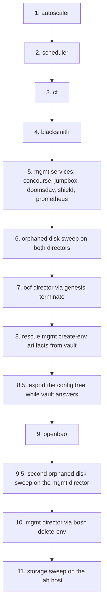

# 13. Teardown: Unwinding the Stack Without Losing the Lab

We built this stack in twelve chapters. Taking it down is one chapter, but it is not the twelve read backwards, and that is the whole reason this chapter exists.

This platform has two teardowns, and choosing the wrong one is expensive.

**Nuking the bloc** is what `ocfp teardown --nuke` does. It deletes the infrastructure the CLI created, bastion and artifacts store included, and it neither knows nor cares what BOSH deployed on top. Reach for it when the bloc itself is going away.

**Unwinding the deployments** is this chapter. We delete what BOSH and Genesis built, in an order that keeps every step able to run, and we finish with the lab host holding exactly the guests and volumes it held before we started. The bastion, the artifacts store, the SDN, and the vault records survive. This is what we want when we are proving a build is reproducible, freeing capacity, or handing the lab to the next piece of work.

This chapter was validated end to end against the `ocfp-lab-thunderdome` bloc on 2026-08-24, immediately after a full twelve-chapter bring-up on the same lab. Afterwards the lab held its original four guests and nine volumes, and nothing else.

## The order



Two of those arrows are not the reverse of anything we did on the way up.

**CF goes before blacksmith (steps 3 and 4).** We built blacksmith after CF, because CF needs to exist before a broker can register against it. Unwinding in strict reverse puts blacksmith first, and that fails, because blacksmith's `terminate` deletes its broker CA. CF cannot merge its own manifest without `secret/.../blacksmith/broker/ca:certificate`, so CF becomes undeletable by its own kit. The dependency is asymmetric. Deploy blacksmith last, and delete it second-to-last among the ocf deployments.

**The mgmt director's own artifacts have to be rescued before the vault dies (step 8).** It is the one step that gives no warning when we skip it, and step 8 below explains what it saves us from.

That raises a question worth answering now rather than at step 8. Nothing forces the rescue to wait that long. It only has to happen while the vault is still answering, so anywhere before step 9 will do. If we are working through this by hand, the safer habit is to do it first, before step 1, because then a surprise in the middle of the sequence cannot strand us without the director's delete instructions. It sits at 8 below because that is where it falls in the dependency order, not because it has to run there.

## Step 1-2: The ocf platform services

Nothing depends on these, so they go first and they go quietly.

```bash
g @<bloc>-ocf:autoscaler terminate -y
g @<bloc>-ocf:scheduler terminate -y
```

**Verify** on the ocf director, not on the exit code (see "Exit codes lie" below):

```bash
g @<bloc>-ocf:bosh b --self deployments --json | jq -r '.Tables[0].Rows[].name'
```

Both names should be gone from the list. The `--self` is load-bearing. Without it, `b` asks the director that *deployed* the ocf director, which is the mgmt director, and we would be reading the wrong list while believing the teardown had worked.

## Step 3-4: CF, then blacksmith

```bash
g @<bloc>-ocf:cf terminate -y
g @<bloc>-ocf:blacksmith terminate -y
```

CF goes first because its manifest references blacksmith's broker CA, and a CF terminate has to render that manifest before it can delete anything.

There is no `remove-secrets` here, and that is deliberate. A `terminate` already removes the environment's generated secrets, its user-provided secrets, and its CredHub entries unless we tell it not to with `--no-cleanup` or one of the `--no-secrets` style flags. Running `remove-secrets` afterwards does no harm, but it finds nothing left to remove, so it only adds a step that can fail for its own reasons.

If we have already run blacksmith's terminate out of order and CF now refuses to merge, the way back is to put the CA where CF expects it and try again:

```bash
g @<bloc>-ocf:blacksmith add-secrets     # regenerates the broker CA
g @<bloc>-ocf:cf terminate -y
g @<bloc>-ocf:blacksmith remove-secrets -y
```

That last line is the one case where `remove-secrets` earns its place. The `add-secrets` above it wrote a CA back into the vault after blacksmith's own terminate had cleaned up, so something has to take it out again. `add-secrets` is safe here because nothing is running against the regenerated CA; we are only satisfying a manifest reference long enough to render it.

**Verify** that `g @<bloc>-ocf:bosh b --self deployments` lists neither of them.

## Step 5: The mgmt services

```bash
g @<bloc>-mgmt:concourse terminate -y
g @<bloc>-mgmt:jumpbox terminate -y
g @<bloc>-mgmt:doomsday terminate -y
g @<bloc>-mgmt:shield terminate -y
g @<bloc>-mgmt:prometheus terminate -y
```

That is all five services chapter 11 put on this director, and all five have to go. Order among them does not matter, because none reads another's secrets. Leave `openbao` alone for now, since it is the vault every remaining command reads from.

Missing one is expensive in a way that shows up late. Genesis refuses to terminate a director while a deployment still runs on it, so a survivor blocks step 9. Worse, step 10 drives `bosh delete-env` by hand and checks nothing, so a survivor there loses its director while its VMs keep running, and no director can ever delete them again.

**Verify** that `g @<bloc>-mgmt:bosh b deployments` lists only `openbao`.

## Step 6: Sweep orphaned disks while the directors still exist

BOSH orphans a persistent disk when it deletes the instance that held it. The disk stays in PVE, still consuming the lab's storage quota, and the only thing that knows it exists is the director we are about to delete. **Run this now, on both directors, before either one goes away.**

```bash
g @<bloc>-ocf:bosh b disks --orphaned
g @<bloc>-ocf:bosh b -n clean-up --all

g @<bloc>-mgmt:bosh b disks --orphaned
g @<bloc>-mgmt:bosh b -n clean-up --all
```

Skipping this is recoverable but tedious, because the disks become nameless volumes in PVE that we have to identify by LVM creation time and delete by hand at step 11. On the validation run we skipped it and stranded 424 GiB across six volumes.

Sweeping once is not enough, though, and this is the part that catches people. Every terminate after this point manufactures fresh orphans on the mgmt director. Step 7 deletes the ocf director's own deployment and orphans its persistent disk here. Step 9 terminates OpenBao, which carries persistent disks of its own. The ocf sweep above is safe to leave as it is, because the BOSH kit's terminate hook re-runs the cleanup for a director-deployed BOSH. The mgmt director is create-env, and that same hook skips the cleanup entirely for create-env, so we come back and sweep it again in step 9.5.

## Step 7: The ocf director

The mgmt director deployed this one, so Genesis can delete it.

```bash
g @<bloc>-ocf:bosh terminate -y
```

**Verify** that `g @<bloc>-mgmt:bosh b deployments` no longer lists the ocf director. The mgmt director is created by `create-env` and has no parent, so here the bare form is already the right one. The ocf director's VM should also be gone from `pmx -c <ctx> pve qemu list --cluster`.

## Step 8: Rescue the mgmt director's create-env artifacts

This is the step with no safety net.

The mgmt director was born by `bosh create-env`, which means deleting it needs `bosh delete-env` and three local files: the rendered manifest, its `.vars`, and the `-state.json` that names the VM CID and the persistent disk CID. Genesis does not keep those on disk. It stores them in the vault deployment record and clears `.genesis/deploy-cache/<env>/` after every successful deploy.

So the dependency runs in a circle. Genesis will not terminate a director while a deployment still runs on it, which means OpenBAO must go before the director. But OpenBAO *is* the vault, and it takes the director's own delete instructions with it.

Extract them first. The records live under `secret/exodus/<env>/bosh/deployments/`, one per timestamp, and the key we want is `artifacts[0]`, holding a base64-encoded gzipped tar.

The newest timestamp is not automatically the right one. Genesis writes a record for actions other than a deploy, and it writes one for a deploy that failed, and neither carries artifacts we can restore from. So we pick the newest record that says `action: deploy`, says `result: success`, and actually has an `artifacts[0]` to read:

```bash
BASE=secret/exodus/<bloc>-mgmt/bosh/deployments

for t in $(safe ls "$BASE" | tr -s ' ' '\n' | grep -E '^[0-9]+$' | sort -r); do
  rec=$(safe get "$BASE/$t") || continue
  case "$rec" in *"action: deploy"*) ;; *) continue ;; esac
  case "$rec" in *"result: success"*) ;; *) continue ;; esac
  safe get "$BASE/$t:artifacts[0]" >/dev/null 2>&1 || continue
  REC="$BASE/$t"
  echo "using $REC"
  break
done
```

With `REC` chosen, reassemble the tar. The artifact is split across as many `artifacts[n]` keys as it needed, so we read them in order until one is missing:

```bash
OUT=~/rescue
mkdir -p "$OUT"
n=0
: > "$OUT/artifacts.b64"
while safe get "$REC:artifacts[$n]" >> "$OUT/artifacts.b64" 2>/dev/null; do
  n=$((n+1))
done
tr -d '\n ' < "$OUT/artifacts.b64" | base64 -d > "$OUT/artifacts.gz"
cd "$OUT" && gunzip -c artifacts.gz > artifacts.tar && tar xf artifacts.tar && ls
```

**Verify** we hold all three before going further:

```
<bloc>-mgmt.yml           # the rendered manifest
<bloc>-mgmt.vars          # the vars file
<bloc>-mgmt-state.json    # VM CID, disk CID, stemcell CID
```

The tar also contains a plaintext `secrets.json`. Treat the whole rescue directory as live credential material. Keep it on the bastion, never print it, and `shred -u` every file in it once the director is gone.

Skip this and no supported command can delete the director afterwards. The recovery from that point is deleting the VM and its disk by hand in PVE, with nothing to tell us which disk held the director's database.

## Step 8.5: Take a copy of the config tree

The vault is about to stop, and with it goes read access to everything the CLI wrote about this bloc. We are not deleting that tree, so this is insurance rather than a migration, but it costs one command and it is the difference between rebuilding from the config and rebuilding from memory:

```bash
safe export secret/config/<bloc> > ~/rescue/<bloc>-config.json
safe export secret/exodus       > ~/rescue/<bloc>-exodus.json
```

`ocfp vault export --path secret/config/<bloc> --output <file>` is the CLI's own wrapper around the same thing, and it needs an `~/.ocfp/config.yml` on the machine we run it from.

Both files hold credentials. They belong in the same rescue directory as the director's artifacts, under the same handling rule, and they get shredded along with it.

## Step 9: OpenBAO

```bash
g @<bloc>-mgmt:openbao terminate -y
```

This one exits 1 even though it succeeds, on `No valid availability zones found for OpenBAO instances`. Its VMs are deleted regardless.

**Verify** against the director, which is now the only source of truth we have left. `g @<bloc>-mgmt:bosh b deployments` reports no deployments.

## Step 9.5: Sweep the mgmt director one last time (not optional)

Steps 7 and 9 both orphaned disks on this director since our sweep at step 6, and the create-env terminate hook does not clean up after itself. This is the last moment anything knows those disks exist, so we sweep again:

```bash
g @<bloc>-mgmt:bosh b disks --orphaned
g @<bloc>-mgmt:bosh b -n clean-up --all
```

**Verify** that `disks --orphaned` comes back empty. Whatever it still lists after a clean-up is a disk we will be hunting by hand at step 11, so it is worth reading the list rather than trusting the exit code.

## Step 10: The mgmt director

Genesis is out of the picture now that its vault is gone, so we drive `bosh delete-env` directly from the rescued artifacts:

```bash
cd ~/rescue
bosh delete-env \
  --state=<bloc>-mgmt-state.json \
  --vars-file=<bloc>-mgmt.vars \
  <bloc>-mgmt.yml
```

If it fails on a stemcell whose template PVE no longer has, the state file is describing a template someone already deleted. Clear that one array and re-run, because the deletion is idempotent and picks up where it stopped:

```bash
jq '.stemcells = []' <bloc>-mgmt-state.json > tmp && mv tmp <bloc>-mgmt-state.json
```

The same is true of `current_vm_cid`, `current_disk_id`, and `disks`. After a partially successful run they are already empty, and that is the run succeeding rather than failing.

**Verify** that the command exits 0 and that the director's VM is absent from the lab host.

Then shred the rescue directory:

```bash
find ~/rescue -type f -exec shred -u {} \; && rmdir ~/rescue
```

## Step 11: The lab host storage sweep

Whatever the sweeps missed is sitting in PVE storage right now with no owner. List both stores and compare what they hold against the guests that legitimately remain:

```bash
pmx -c <ctx> --insecure --node <node> pve storage content local-lvm-data
pmx -c <ctx> --insecure --node <node> pve storage content local
```

`pve storage content` has no `--cluster`. It reports what one node sees, so on a multi-node cluster we run it once per node and the sweep is not finished until we have. `pmx -c <ctx> pve storage node-list --node <node>` tells us which stores each node actually carries, which saves asking a node about a store it does not have.

A BOSH persistent disk appears as `local-lvm-data:vm-<id>-disk-0` whose `<id>` matches no guest. Proving that no guest owns it takes more care than we might expect.

The guest list has to be cluster-wide, because a plain `qemu list` covers one node and every guest on the others then reads as missing, which turns a live disk into an apparent orphan. It also has to include the containers. `pve qemu list` drops every non-QEMU guest, and an LXC container's rootfs on LVM storage is named `vm-<id>-disk-0` exactly like a BOSH disk, so a container-only sweep condemns container rootfs volumes.

The name is not proof on its own either. Proxmox renames a volume when it is reassigned, so the `<id>` in the name records who owns the volume now rather than who allocated it, and a disk can sit at a slot the guest listing never shows. Before deleting anything, ask every surviving guest whether it claims the volume. Run this under bash. It uses process substitution, which bash and zsh both have and a POSIX `sh` does not, so it fails outright if the bastion's `sh` is dash:

```bash
vol='vm-<id>-disk-0'
claimed=0

check() {          # $1 = qemu|lxc, $2 = guest id
  cfg=$(pmx -c <ctx> --insecure pve "$1" config get "$2" -o json) || {
    echo "LOOKUP FAILED for $1 $2; delete nothing" >&2
    exit 1
  }
  case "$cfg" in *"$vol"*) echo "claimed by $1 $2"; claimed=1 ;; esac
}

while read -r id; do check qemu "$id"; done \
  < <(pmx -c <ctx> --insecure pve qemu list --cluster -o plain | awk 'NR>1 {print $1}')

while read -r id; do check lxc "$id"; done \
  < <(pmx -c <ctx> --insecure pve lxc list --cluster -o plain | awk 'NR>1 {print $1}')

[ "$claimed" -eq 0 ] && echo "no guest claims $vol"
```

Two details in that loop are load-bearing, and we got both wrong on the first attempt.

Read the ids with `while read` rather than `for id in $(...)`. Under zsh an unquoted expansion is not word-split, so the `for` form runs once with the entire list as a single argument and every lookup fails for a reason that has nothing to do with the cluster.

Then feed it with `< <(...)` rather than a pipe. A `while` loop on the right of a pipe runs in a subshell, so `claimed=1` is set in a process that exits a moment later, and the `exit 1` on a failed lookup kills only that subshell while the sweep carries on. Process substitution keeps the loop in our own shell, where both still mean something.

The `|| { ...; exit 1; }` on each lookup is the important part. Without it an expired token or a node that blinks produces no output, `grep` finds nothing, and the loop's silence reads as proof of orphanhood for a disk that is very much in use. We want a failed lookup to stop the sweep, not to pass it.

Silence from a loop that completed is what proves the volume is an orphan, and even then it is proof about the live configuration only. A volume referenced solely by a VM snapshot reads as unclaimed here, so check the snapshots before deleting anything on a guest that has them. Then delete each orphan explicitly:

```bash
pmx -c <ctx> --insecure --node <node> \
  pve storage volume delete local-lvm-data:vm-<id>-disk-0 --yes
```

`--yes` is mandatory on destructive pmx verbs, and nothing prompts for confirmation behind it, so name one volume per invocation and read it back before pressing return.

Stemcell uploads also leave a qcow2 behind under `local:import/`. It is safe to delete, and it will be re-fetched on the next upload.

## Exit codes lie

Three commands in this teardown exit nonzero while doing exactly what we asked. If we hit a nonzero exit mid-sequence, this table is the place to look before assuming damage:

| Command | Exits | On this message | What it actually means | How to check |
|---|---|---|---|---|
| any `genesis terminate` | 1 | `No artifacts to archive -- all artifact files were missing or empty` | Genesis noticed that a deployment it just destroyed has no artifacts left to archive. The deletion succeeded. | ask the director for its deployments |
| `g @<bloc>-mgmt:openbao terminate` | 1 | `No valid availability zones found for OpenBAO instances` | The VMs were deleted regardless. The AZ lookup runs after the deletion. | ask the director for its deployments |
| `bosh delete-env` at step 10 | 1 | a stemcell the state file names but PVE no longer has | Someone deleted that template already. The run is resumable, not broken. | clear `.stemcells` in the state file and re-run |

The pattern behind all three is the same. The destructive part of the command succeeded and something afterwards failed on the wreckage it left. That is why the verification in this chapter is never the exit code.

Never take a terminate's exit code as the verification. Ask the director:

```bash
g @<bloc>-ocf:bosh b --self deployments --json | jq -r '.Tables[0].Rows[].name'
g @<bloc>-mgmt:bosh b deployments --json | jq -r '.Tables[0].Rows[].name'
```

The two forms differ on purpose. The ocf director was deployed by the mgmt director, so its environment needs `--self` to be asked about itself. The mgmt director has no parent and answers for itself already. A director's own answer is the only one worth acting on, and that is why every step above pairs its command with a director-side check.

## Sign-off

The teardown is complete when all of the following hold together:

- Both directors report no deployments, and then both directors themselves are gone from `pmx -c <ctx> pve qemu list --cluster`.

- The lab host's guest list matches what it held before the build. On the validation run that meant the bastion, the artifacts VM, and the two templates.

- Every volume in the storage content listings belongs to a guest that is still there.

- Vault still holds the bloc's config tree. We deleted deployments, not the bloc, and `secret/config/<bloc>/...` is what makes the next build reproduce this one.

At that point the lab is back to the state chapter 5 left it in, and chapter 6 will run again from there.
