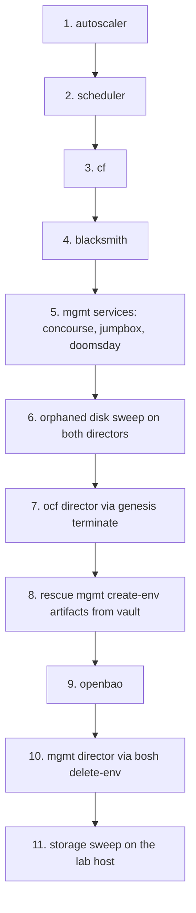

# 13. Teardown: Unwinding the Stack Without Losing the Lab

We built this stack in twelve chapters. Taking it down is one chapter, but it
is not the twelve read backwards, and that is the whole reason this chapter
exists.

This platform has two teardowns, and choosing the wrong one is expensive.

**Nuking the bloc** is what `ocfp teardown --nuke` does: it deletes the
infrastructure the CLI created, bastion and artifacts store included, and it
neither knows nor cares what BOSH deployed on top. Reach for it when the bloc
itself is going away.

**Unwinding the deployments** is this chapter. We delete what BOSH and Genesis
built, in an order that keeps every step able to run, and we finish with the
lab host holding exactly the guests and volumes it held before we started. The
bastion, the artifacts store, the SDN, and the vault records survive. This is
what we want when we are proving a build is reproducible, freeing capacity, or
handing the lab to the next piece of work.

This chapter was validated end to end against the `ocfp-lab-thunderdome` bloc
on 2026-08-24, immediately after a full twelve-chapter bring-up on the same
lab. Afterwards the lab held its original four guests and nine volumes, and
nothing else.

## The order



Two of those arrows are not the reverse of anything we did on the way up.

**CF goes before blacksmith (steps 3 and 4).** We built blacksmith after CF,
because CF needs to exist before a broker can register against it. Unwinding
in strict reverse puts blacksmith first, and that fails: blacksmith's
`terminate` deletes its broker CA, and CF cannot merge its own manifest
without `secret/.../blacksmith/broker/ca:certificate`, so CF becomes
undeletable by its own kit. The dependency is asymmetric. Deploy blacksmith
last, delete it second-to-last among the ocf deployments.

**The mgmt director's own artifacts have to be rescued before the vault dies
(step 8).** More on that below. It is the one step that gives no warning when
we skip it.

## Step 1-2: The ocf platform services

Nothing depends on these, so they go first and they go quietly.

```bash
g @<bloc>-ocf:autoscaler terminate -y
g @<bloc>-ocf:scheduler terminate -y
```

**Verify** on the ocf director, not on the exit code (see "Exit codes lie"
below):

```bash
g @<bloc>-ocf:bosh b deployments --json | jq -r '.Tables[0].Rows[].name'
```

Both names should be gone from the list.

## Step 3-4: CF, then blacksmith

```bash
g @<bloc>-ocf:cf terminate -y
g @<bloc>-ocf:blacksmith terminate -y
g @<bloc>-ocf:blacksmith remove-secrets -y
```

If we have already run blacksmith's terminate out of order and CF now refuses
to merge, the way back is to put the CA where CF expects it and try again:

```bash
g @<bloc>-ocf:blacksmith add-secrets     # regenerates the broker CA
g @<bloc>-ocf:cf terminate -y
g @<bloc>-ocf:blacksmith remove-secrets -y
```

`add-secrets` is safe here because nothing is running against the regenerated
CA; we are only satisfying a manifest reference long enough to render it.

**Verify**: `bosh deployments` on the ocf director lists nothing.

## Step 5: The mgmt services

```bash
g @<bloc>-mgmt:concourse terminate -y
g @<bloc>-mgmt:jumpbox terminate -y
g @<bloc>-mgmt:doomsday terminate -y
```

Order among these three does not matter; none references another's secrets.
Leave OpenBAO alone for now: it is the vault every remaining command reads
from.

**Verify**: the mgmt director lists only its own OpenBAO deployment.

## Step 6: Sweep orphaned disks while the directors still exist

BOSH orphans a persistent disk when it deletes the instance that held it. The
disk stays in PVE, still consuming the lab's storage quota, and the only thing
that knows it exists is the director we are about to delete. **Run this now, on
both directors, before either one goes away.**

```bash
g @<bloc>-ocf:bosh b disks --orphaned
g @<bloc>-ocf:bosh b -n clean-up --all

g @<bloc>-mgmt:bosh b disks --orphaned
g @<bloc>-mgmt:bosh b -n clean-up --all
```

Skipping this is recoverable but tedious: the disks become nameless volumes in
PVE that we have to identify by LVM creation time and delete by hand (step 11).
On the validation run we skipped it and stranded 424 GiB across six volumes.

## Step 7: The ocf director

The mgmt director deployed this one, so Genesis can delete it.

```bash
g @<bloc>-ocf:bosh terminate -y
```

**Verify**: `g @<bloc>-mgmt:bosh b deployments` no longer lists the ocf
director, and the ocf director's VM is gone from `pmx -c <ctx> pve qemu list`.

## Step 8: Rescue the mgmt director's create-env artifacts

This is the step with no safety net, so here is what it protects us from.

The mgmt director was born by `bosh create-env`, which means deleting it needs
`bosh delete-env` and three local files: the rendered manifest, its `.vars`,
and the `-state.json` that names the VM CID and the persistent disk CID.
Genesis does not keep those on disk. It stores them in the vault deployment
record and clears `.genesis/deploy-cache/<env>/` after every successful deploy.

So the dependency runs in a circle. Genesis will not terminate a director while
a deployment still runs on it, which means OpenBAO must go before the director.
But OpenBAO *is* the vault, and it takes the director's own delete instructions
with it.

Extract them first. The record lives at
`secret/exodus/<env>/bosh/deployments/<timestamp>`, key `artifacts[0]`, holding
a base64-encoded gzipped tar. Find the newest timestamp, then:

```bash
REC=secret/exodus/<bloc>-mgmt/bosh/deployments/<timestamp>
OUT=~/rescue
mkdir -p "$OUT"
n=0
: > "$OUT/artifacts.b64"
while safe get "$REC:artifacts[$n]" >/dev/null 2>&1; do
  safe get "$REC:artifacts[$n]" >> "$OUT/artifacts.b64"
  n=$((n+1))
done
tr -d '\n ' < "$OUT/artifacts.b64" | base64 -d > "$OUT/artifacts.gz"
cd "$OUT" && gunzip -c artifacts.gz > artifacts.tar && tar xf artifacts.tar && ls
```

**Verify** we hold all three before going further:

```
<bloc>-mgmt.yml           # the rendered manifest
<bloc>-mgmt.vars          # the vars file
<bloc>-mgmt-state.json    # VM CID, disk CID, stemcell CID
```

The tar also contains a plaintext `secrets.json`. Treat the whole rescue
directory as live credential material: keep it on the bastion, never print it,
and `shred -u` every file in it once the director is gone.

Skip this and no supported command can delete the director afterwards. The
recovery from that point is deleting the VM and its disk by hand in PVE, with
nothing to tell us which disk held the director's database.

## Step 9: OpenBAO

```bash
g @<bloc>-mgmt:openbao terminate -y
```

This one exits 1 while succeeding, on `No valid availability zones found for
OpenBAO instances`. Its VMs are deleted regardless.

**Verify** against the director, which is now the only source of truth we have
left: `g @<bloc>-mgmt:bosh b deployments` reports no deployments.

## Step 10: The mgmt director

Genesis is out of the picture now that its vault is gone, so we drive
`bosh delete-env` directly from the rescued artifacts:

```bash
cd ~/rescue
bosh delete-env \
  --state=<bloc>-mgmt-state.json \
  --vars-file=<bloc>-mgmt.vars \
  <bloc>-mgmt.yml
```

If it fails on a stemcell whose template PVE no longer has, the state file is
describing a template someone already deleted. Clear that one array and re-run;
the deletion is idempotent and picks up where it stopped:

```bash
jq '.stemcells = []' <bloc>-mgmt-state.json > tmp && mv tmp <bloc>-mgmt-state.json
```

The same is true of `current_vm_cid`, `current_disk_id`, and `disks`: after a
partially successful run they are already empty, and that is the run
succeeding, not failing.

**Verify**: exit code 0, and the director's VM is absent from the lab host.

Then shred the rescue directory:

```bash
find ~/rescue -type f -exec shred -u {} \; && rmdir ~/rescue
```

## Step 11: The lab host storage sweep

Whatever step 6 missed is sitting in PVE storage right now with no owner. List
both stores and compare against the guests that legitimately remain:

```bash
pmx -c <ctx> --insecure --node <node> pve storage content local-lvm-data
pmx -c <ctx> --insecure --node <node> pve storage content local
```

A BOSH persistent disk appears as `local-lvm-data:vm-<id>-disk-0` whose `<id>`
matches no VM in `pmx -c <ctx> --insecure pve qemu list`. When two candidates
are ambiguous, LVM creation time settles it. Delete each one explicitly:

```bash
pmx -c <ctx> --insecure --node <node> \
  pve storage volume delete local-lvm-data:vm-<id>-disk-0 --yes
```

`--yes` is mandatory on destructive pmx verbs and nothing prompts for
confirmation behind it, so name one volume per invocation and read it back
before pressing return.

Stemcell uploads also leave a qcow2 behind under `local:import/`. It is safe to
delete, and it will be re-fetched on the next upload.

## Exit codes lie

Every `genesis terminate` in this chapter exits 1 on

```
No artifacts to archive -- all artifact files were missing or empty
```

while having deleted the deployment correctly. The message is Genesis noticing
that a deployment it just destroyed has no artifacts left to archive.

Never take a terminate's exit code as the verification. Ask the director:

```bash
g @<bloc>-<zone>:bosh b deployments --json | jq -r '.Tables[0].Rows[].name'
```

That is the only answer worth acting on, and it is why every step above pairs
its command with a director-side check.

## Sign-off

The teardown is complete when all of the following hold together:

- Both directors report no deployments, and then both directors themselves are
  gone from `pmx pve qemu list`.

- The lab host's guest list matches what it held before the build. On the
  validation run: the bastion, the artifacts VM, and the two templates.

- The storage content listings hold no volume that no surviving guest claims.

- Vault still holds the bloc's config tree. We deleted deployments, not the
  bloc, and `secret/config/<bloc>/...` is what makes the next build reproduce
  this one.

At that point the lab is back to the state chapter 5 left it in, and chapter 6
will run again from there.
