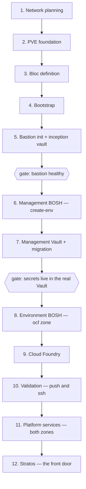

# OCFP on Proxmox VE — The Full Bring-Up

This is the story of how we take a bare Proxmox VE host and end up, some hours
later, logged into a branded console riding on a complete OCFP stack: two BOSH
directors, a real Vault, Cloud Foundry, and the platform services that make it
all operable. Every chapter was validated end-to-end against the
`ocfp-lab-wayne` bloc, and that bloc remains our worked example throughout.

We wrote these runbooks to be read in order the first time through. Each
chapter opens with why the step exists, walks through the commands we run
together, and closes with how we prove it worked before moving on. Once we
have been through the whole arc, any chapter stands on its own as a reference.

## The arc

We begin with nothing but address space and a plan. We end with an app
running, a route answering, and a console we can hand to a teammate.



The two gates matter. We do not deploy the management director until the
bastion is provably healthy. And we do not deploy anything beyond the
management zone until our secrets have migrated off the temporary inception
vault and into the real one. When a verification fails, we stop and debug at
that point — the chapters are ordered so that every failure is cheapest to fix
where it first appears.

## The cast

A few concepts carry the whole story, so let us introduce them once.

**The bloc** is our unit of deployment — one entry under `blocs:` in
`~/.ocfp/config.yml`, holding the provider connection, the network plan, the
domains, and the artifacts store for everything we deploy. Every resource we
create is named `<bloc>-<role>`.

**Zones** are the two tiers inside a bloc. The `mgmt` zone holds the
proto-BOSH director, the management Vault, and the operator services: SHIELD,
Doomsday, Prometheus, Concourse, and the jumpbox. The `ocf` zone holds the
environment BOSH director, Cloud Foundry, and the services that live beside
it — Blacksmith, Autoscaler, and Scheduler.

Genesis environment names encode the pairing: `ocfp-lab-wayne-mgmt` and
`ocfp-lab-wayne-ocf`.

**The two vaults** are a deliberate two-act structure. During bootstrap we
have no infrastructure to host a real secrets store, so the CLI runs a small
local **inception vault** on the bastion. Once the management director exists,
we deploy the real Vault (the OpenBao lineage — the `openbao` kit provides the
same `vault` service) and migrate everything into it. Chapter 7 tells that
story in full.

**Genesis and the kits** do the deploying. We address environments with the
`g` alias: `g @<env>:<type> <verb>`, as in
`g @ocfp-lab-wayne-mgmt:bosh deploy -F -y`. Each deployment type (bosh, vault,
cf, shield, and the rest) is a Genesis kit. The PVE ports live in each kit's
`ocfp/pve/` overlays and hooks.

## Conventions

Every step in these runbooks follows the same shape: a sentence or two of
intent, the command, and a **Verify** that proves it landed. Steps that change
something hard to undo also carry a **Rollback**. We never move past a red
verification.

The variables below appear throughout, standing in for our own values. The
third column shows the worked example we validated against.

| Variable | Meaning | `ocfp-lab-wayne` example |
|----------|---------|--------------------------|
| `<bloc>` | The OCFP bloc name | `ocfp-lab-wayne` |
| `<node>` | The PVE node name | `lab-wayne` |
| `<vnet>` | The SDN vnet (bridge) | `ocfp` |
| `<supernet>` | The bloc's address block | `10.108.16.0/20` |
| `<gateway>` | The SDN gateway and DNS | `10.108.16.1` |
| `<base-domain>` | The bloc's DNS base | `ocf.wayne.lab.fivetwenty.io` |
| `<system-domain>` | The CF system domain | `system.ocf.wayne.lab.fivetwenty.io` |
| `<apps-domain>` | The CF apps domain | `apps.ocf.wayne.lab.fivetwenty.io` |

## The chapters

| Chapter | What we accomplish |
|---------|--------------------|
| [1. Network planning](01-network-planning.md) | Carve the address space and design the SDN before anything exists |
| [2. PVE foundation](02-pve-foundation.md) | Prepare the host: CPI service account, API token, storage, templates |
| [3. Bloc definition](03-bloc-definition.md) | Author the bloc in `~/.ocfp/config.yml` |
| [4. Bootstrap](04-bootstrap.md) | `ocfp bootstrap` — network, security groups, bastion, and the RustFS artifacts store |
| [5. Bastion init](05-bastion-init.md) | Tool the bastion, seed the inception vault, wire the deployment repos |
| [6. Management BOSH](06-mgmt-bosh.md) | The proto-director, born by `bosh create-env` through the PVE CPI |
| [7. Management Vault](07-mgmt-vault.md) | Deploy the real Vault, migrate the secrets, retire inception |
| [8. Environment BOSH](08-env-bosh.md) | The mgmt director deploys the ocf zone's director |
| [9. Cloud Foundry](09-cloud-foundry.md) | CF v56.5.0 on noble, blobstore on RustFS |
| [10. Validation](10-validation.md) | `cf push`, `cf ssh`, and the proof the platform is real |
| [11. Platform services](11-platform-services.md) | SHIELD, Doomsday, Prometheus, Concourse, Blacksmith, Autoscaler, Scheduler |
| [12. Stratos](12-stratos.md) | Ingress, DNS, and the branded console at the canonical URL |

## Where the facts live

These runbooks tell us *how*. When we need *what* or *why*, we reach for the
layer that owns it:

- [`docs/pve.md`](../../pve.md) — the PVE provider primer: auth modes, the
  template catalog, bloc config field reference, and artifacts TLS.

- [`docs/pve-e2e-lab-testing.md`](../../pve-e2e-lab-testing.md) — the
  validation plan and run log these chapters are distilled from, including the
  full findings history.

- [`docs/config.pve.example.yml`](../../config.pve.example.yml) — the
  authoritative bloc config shape.

- `src/deployments/fivetwenty-ocfp/` — the live environment files for the
  worked example; each carries its own commentary.

Teardown, when we need it, is a single idempotent command — we preview it
first, always:

```bash
ocfp teardown --bloc <bloc> --nuke --dry-run --output json
ocfp teardown --bloc <bloc> --nuke --force --empty
```

With the map in hand, let us go plan a network.
